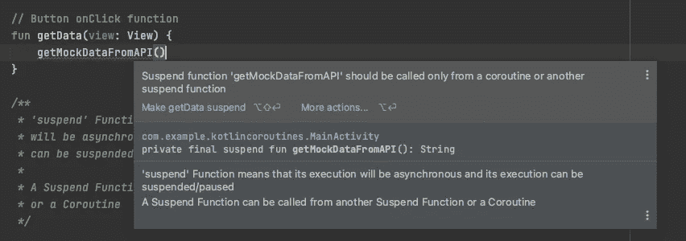
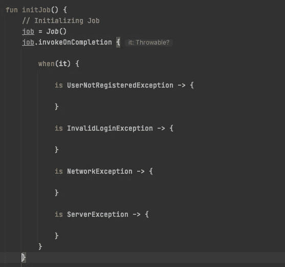

# 初学者理解 Kotlin 协程

> 原文：<https://betterprogramming.pub/understanding-kotlin-coroutines-for-beginners-a55813f8241c>

## 这太简单了，以至于感觉像是在作弊


[阿德里安](https://unsplash.com/@adrien?utm_source=medium&utm_medium=referral)拍摄于 [Unsplash](https://unsplash.com?utm_source=medium&utm_medium=referral)

您可能已经使用了异步回调，尤其是在 Kotlin 中编写异步代码。这里有一个场景，在网络请求完成后，您应该执行一些数据库查询。

您将这样编写异步回调:

```
// Async callbacks
networkRequest { result ->// Successful network request
   databaseSave(result) { rows ->// Result saved// If there are more dependent operations
     // This nested code will only increase }
}
```

如果我们可以编写实际上异步执行的顺序代码会怎么样？

此外，在 Android 中，我们必须管理不同的线程，事情会变得更加复杂，因为我们必须担心线程间的通信，以从一些后台线程更新我们的主线程。

RxJava 确实有帮助，但还是有点复杂。协程在更大程度上简化了事情，使得管理不同的后台任务变得超级简单！

# 协同程序

协程不是线程。如果协程就像一个作业，那么您可以在同一个线程上独立运行多个作业。

如果在协程内部调用`Thread.sleep()`,它将停止整个线程和所有并行执行的协程。

使用协程程序，上面的代码块将如下所示:

```
val result = networkRequest()
// Successful network requestdatabaseSave(result)
// Result saved
```

这看起来可读性更好，更干净，也更容易管理。协同程序将帮助你用 Kotlin 简化很多异步代码。

# 向您的 Android 项目添加协程

你可以按照这里提到的[的步骤](https://github.com/Kotlin/kotlinx.coroutines)。

对我来说，我只需添加以下依赖项:

```
implementation 'org.jetbrains.kotlinx:kotlinx-coroutines-android:1.5.1'
```

# “暂停”关键字

当你在函数声明中添加`suspend`关键字时。您声明了这个函数将被异步执行，并且它的执行也可以被暂时暂停。

让我们来看看这段代码:

需要注意的重要一点是，一个挂起函数可以从另一个挂起函数或协程中调用。

如果你试图在按钮的`onClick`监听器中调用这些模拟函数，你会得到一个错误。



因此，让我们看看如何启动我们的协程。

# 协程作用域

使用协程，您可以创建一批您想做的作业。你的工作可能有一定的背景/标准/范围。

*   如果一个作业失败，您可能希望取消其他作业。
*   您可能希望将一组作业组合在一起。

有三种类型的协程:

*   **Main —** 这个范围内的作业将在主线程上工作。
*   **IO** —这是一个后台线程，用于执行 IO 操作，如网络调用/从数据库读取。
*   **默认** —这是为您可能希望在后台执行的繁重操作(如下载文件等)而设计的。

让我们在`onClick`函数中调用我们的协程。

当我们运行它时，我们得到以下日志:

```
D/DEEJAY: getMockDataFromAPI called
D/DEEJAY: getMockDataFromAPI returning data
D/DEEJAY: writeMockDataToDatabase called
D/DEEJAY: Data saved in database Some cool data
```

## **体会到花冠的美？**

我们只是以同步的方式写了一些更易读的异步代码。

它变得更加美丽…

现在，假设在异步代码执行之后，您想要更新 UI。

## 你如何从你的协程中更新主线程？

如果您的协程没有在主线程上执行，我们有两个选项可以通过执行以下操作在主线程上执行某些东西:

```
// #1 You can update the main thread by doing from inside // of Coroutine or a Suspend Function:withContext(Main) {
    textView.text = apiResponseData
}

// #2 Or this too
CoroutineScope(Main).launch {
    textView.text = apiResponseData
}
```

*   `withContext(Main)` —暂时将当前协程的上下文/范围切换到`Main`来完成您的工作，然后只有父协程将继续执行(父协程等待这个块被执行)。
*   `CoroutineScope(Main).launch` —在父协程内创建并启动一个新的独立协程。父协程不会等待这个块被执行，而是继续独立执行。

就这么简单！真的！

我强烈建议我的开发伙伴们继续前进，到处添加日志语句，用延迟值来了解更多关于我们的协程行为的信息。

# 深入探究协程

## 1.作业超时

比方说，当你试图下载一个文件，但服务器没有任何反应。你的应用程序应该在尝试十秒钟后让请求超时。

创建协同作业时，可以使用`launch{}`或`withTimeoutOrNull`。还有更多选择，但首先我们来看看`withTimeoutOrNull`。

让我们尝试在代码中模拟下载作业:

## 2.取消工作

您可以为您的作业创建一个`Job`实例。有一个`CompletableJob`界面，您可以利用它来更好地控制您的工作执行。

它看起来会像这样:

```
private lateinit var job: CompletableJob
```

要初始化作业，您只需执行以下操作:

```
job = Job()
```

这是事情变得更有趣的地方！

假设您创建了一个身份验证作业，该作业进行网络调用以对用户进行身份验证，该作业有多种可能失败的情况，您必须针对这些情况更新用户，例如:

*   用户未注册
*   无效的登录凭据
*   网络错误
*   服务器错误

如果我们按照传统的方式来做，代码会变得混乱，但是…

有一个`.invokeOnCompletion`方法，您可以在其中定义逻辑来处理您的作业完成所遵循的逻辑。

您可以在作业上调用方法，如下所示。它为您提供了`it`的实例，这是一个可抛出的实例，您可以在作业执行失败时从作业内部抛出。

因此，当我们的作业遇到任何可能的异常时，将执行`invokeOnCompletion`,并且可以从这里处理错误场景，如下所示:



## 3.在范围内传递作业

要在后台线程中启动我们的作业，我们可以这样做:

```
CoroutineScope(IO).launch **{** // Async Logic
**}**
```

假设你要清除整个范围，你会这样做

```
CoroutineScope(IO).cancel()
```

这将取消在协程的 IO 范围内运行的所有可能的作业。

更好的方法是将您的作业传递给协程上下文，如下所示:

```
// To create a scope just for your job
CoroutineScope(IO + job).launch {}// To cancel the scope just for your job, now you can do:
CoroutineScope(IO + job).cancel()
```

## 4.执行并行作业

让我们创建两个作业:

```
CoroutineScope(IO).launch **{** val job1 = CoroutineScope(IO).launch **{** // Job 1
    **}** val job2 = CoroutineScope(IO).launch **{** // Job 2
    **}
}**
```

使用上面的代码，我们的代码将启动`job1`，而不是等待它完成，它将开始执行，然后`job2`也将启动。

如果您想让您的作业按顺序执行，在这种情况下，`job2`取决于`job1`结果。你可以像这样使用`.join()`:

并行作业的另一种工作方式是使用`Deferred`类型。让我用下面的代码快速演示一下:

使用`Deferred`类型的好处是结果值实际上存储在`job3`和`job4`变量中。

而`job1`和`job2`保存对协程的引用，其中值被卡住。因此，哪一种是最干净的解决方案取决于您的编码风格。

因此，如果您需要协程之外的结果，那么应该选择`Deferred async and await`模式。

## 5.阻塞线程中的其他作业协同作业

如果您想独占运行一个作业，并想确保没有其他作业被执行，您可以使用`runBlocking {}`。让我们看看下面的代码是如何做到的:

```
CoroutineScope(Main).launch **{** runBlocking **{** // Until this block gets executed
        // No other jobs would be executed
        // On this scope of current coroutine
    **}
}**
```

## 6.全球范围

有一个定义全局范围的选项。对于只有一份独立工作的简单情况来说，这很好。

但是在这种情况下，你在处理依赖的作业，你会将它们嵌套在不同的作用域中，并且会应用你编写代码的方式来维护它们之间的同步。

假设你正常启动两个工作。

现在，如果您使用全局范围创建作业，它将如下所示:

## 7.异常处理

如何处理子作业中的异常？只需执行以下操作:

```
// 1\. Create an exception Handler
val coroutineExceptionHandler = CoroutineExceptionHandler { coroutineContext, throwable -> 
    // This will just throw the exception here if not handled
}// 2\. In parent job's launch(), pass the handler
val parentJob = CoroutineScope(IO).launch(coroutineExceptionHandler) { 
    // Child jobs here
}
```

如果您有多个正在运行的作业，并且其中一个作业引发了异常，那么如果您不处理该异常，该作业以及其他正在运行的作业将被取消。

如果您处理异常，那么其他作业和父作业将成功完成。

协程还有更多的内容，但是我将在后面提供更多的信息和更实际的例子。

感谢您的阅读和时间。

编码快乐！