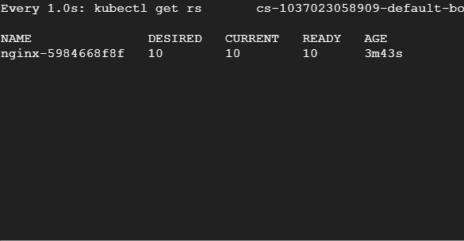
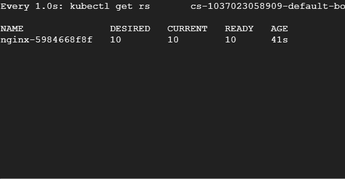
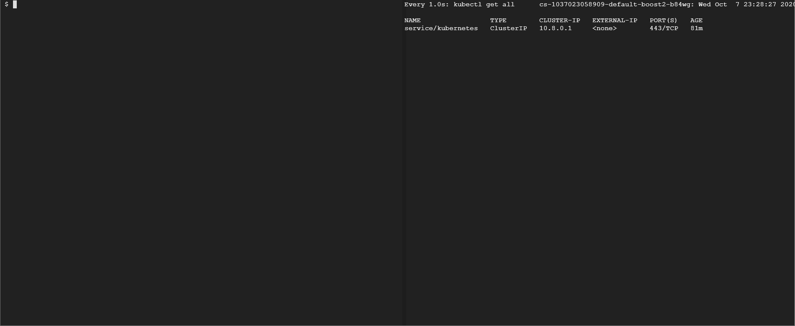

# 了解 Kubernetes 部署策略

> 原文：<https://betterprogramming.pub/understanding-kubernetes-deployment-strategies-12535c3cb379>

## 滚动更新、重新创建、倾斜部署、金丝雀部署等等


[比尔·杰伦](https://unsplash.com/@billjelen?utm_source=medium&utm_medium=referral)在 [Unsplash](https://unsplash.com?utm_source=medium&utm_medium=referral) 上的照片。

[Kubernetes](https://kubernetes.io/) 中的部署资源简化了容器部署，它们是使用最多的 Kubernetes 资源之一。部署管理副本集，并且通过适当地操作它们来产生期望的效果，它们有助于创建多个部署策略。

令人惊讶的是，部署只有两种策略类型:`RollingUpdate`和`Recreate`。

虽然`RollingUpdate`是默认策略，Kubernetes 创建一个新的副本集，并开始缩放新的副本集，同时缩小旧的副本集，但`Recreate`策略将旧的副本集缩放到零，并立即创建一个包含所需副本的新副本集。

不过，这并没有限制 Kubernetes 进行更高级部署的能力。部署规范中有更多的细粒度控制，可以帮助我们实现多种部署模式和策略。让我们看看可能的场景，何时使用它们，以及它们看起来如何与实际操作的例子。

# 再创造

现在，有人可能会问为什么有人会使用它，但是相信我，这是有用例的，这也是 Kubernetes 仍然允许它存在于他们的 API 中的原因。

在以下情况下使用`Recreate`策略:

*   您的应用程序不支持多个版本。
*   您的 Pod 上装载了一个 ReadWriteOnce 卷，您不能与复制副本共享该卷。
*   您希望停止处理旧数据，并需要在启动新应用程序之前运行一些先决条件。

为了进一步理解，让我们用`Recreate`策略创建一个 NGINX 部署:

让我们更新映像，看看副本集会发生什么变化:

```
kubectl set image deployment/nginx nginx=bharamicrosystems/nginx:v2
```



您可以注意到，旧的副本集立即被设置为 0，并且立即创建了一个包含十个副本的新副本集。

# 滚动更新

滚动更新是 Kubernetes 部署的默认部署策略。但是，不受控制的滚动更新可能不是您想要的。

让我们用默认的`RollingUpdate`策略创建一个 NGINX 部署:

更新映像并观察副本集发生了什么变化:

```
kubectl set image deployment/nginx nginx=bharamicrosystems/nginx:v2
```



你注意到什么了吗？当新容器准备好时，旧副本集的所需副本减少，而新副本集增加。还值得注意的是，Kubernetes 尽最大努力进行滚动更新，而不用担心对现有应用程序的任何破坏。

我们可能不希望如此突然的更新，而希望缓慢地推出一个版本，以便我们可以在应用程序推出时遇到问题时回滚它。为此，让我们来看看我们可以使用滚动更新实现的一些策略。

# 斜坡缓慢滚动

当我们想要在淘汰旧副本的同时缓慢推出新副本时，就需要进行倾斜式部署。我们可以选择一次要推出多少个副本，我们还需要确保在操作过程中没有不可用的单元。

下面是一个使用渐变缓慢部署策略完成的上述部署的示例:

如果你已经注意到了，我们已经在`RollingUpdate`中添加了`maxSurge=1`和`maxUnvailable=0`属性。这意味着我们将一次滚动一个单元，没有不可用的单元。因此，在任何给定时间，部署将保持至少 10 个吊舱。

让我们更新一下图片，自己看看:

```
kubectl set image deployment/nginx nginx=bharamicrosystems/nginx:v2
```


# 尽最大努力控制首次展示

我们已经研究了渐变的缓慢推出策略，尽管它确保了您的应用程序是稳定的，但它在推出版本时是缓慢的。如果您的部署包含数百个容器，可能需要很长时间来部署整个版本。此外，您可能已经注意到，在上面的场景中，副本的数量有时会超过 10 个。

解决这两个问题的一个方法是使用尽最大努力控制展示策略。在这种情况下，我们将只把最大不可用参数指定为我们允许不可用的特定百分比，Kubernetes 将尽可能快地处理新容器。我们还将在这种情况下将最大浪涌设置为 0，以确保 Kubernetes 不会旋转超过 10 个 pod 副本的任何内容。这是你不能用一种缓慢的推广策略做到的。

让我们定义一个最大不可用机架数为 20%且无最大激增的部署:

然后将映像更新到 v2:

```
kubectl set image deployment/nginx nginx=bharamicrosystems/nginx:v2
```


您可能已经注意到，在任何给定的时间点，只有 20%的 pod 从旧的副本集中删除，同时在新的副本集中创建。此外，在任何给定的时间点，当前副本都不会超过 10 个。这还可以确保在给定时间运行适量的 pod，以提供最佳的资源利用率。

# 蓝绿色部署

蓝绿色部署或金丝雀部署确保给定应用程序的两个版本在给定时间运行。您可能希望这样做是为了测试一个新特性，或者您希望在推出整个版本之前保持谨慎。

这个策略帮助你做金丝雀发布和 A/B 测试。这导致了最近生产范式测试的激增，成熟的组织正在使用这些特性来了解他们的客户行为。

Kubernetes 部署不提供这个特性，因此，我们需要使用 Kubernetes 服务。

首先，让我们创建一个运行 nginx:v1 的部署。我们不会太担心这里的部署策略，而是尽最大努力控制部署策略:

现在让我们将部署暴露给一个名为`nginx`的`LoadBalancer`服务:

等待 Kubernetes 给`LoadBalancer`分配一个外部 IP，一旦我们有了外部 IP 就卷曲它:

```
kubectl get svc nginx
EXTERNAL_IP=$(kubectl get svc nginx|grep nginx|awk {'print $4'})
for i in {1..10}
do
curl $EXTERNAL_IP
done
```

我们会看到十次中有十次我们得到“这是版本 1”。

让我们假设你正在开发一个新版本的 nginx:v2，但是只允许 20%的流量进入。在这种情况下，我们必须使用以下步骤来准备部署:

1.  使用相同的标签和两个副本创建另一个部署 nginx-v2:

2.将 nginx-v1 部署缩减到八个副本:

```
kubectl scale deployment nginx-v1 --replicas=8
```

3.现在重新运行 curl 命令并观察:

```
for i in {1..10}
do
curl $EXTERNAL_IP
done
```

您将看到大约十分之二的请求来自 v2。



为了进一步将流量迁移到 v2，我们可以继续缩小 v1 部署，扩大 v2 部署。

默认情况下，Kubernetes 只允许您通过创建多个副本来管理蓝绿色部署和 Canary 发布。尽管如此，如果您希望有细粒度的控制，您可能希望考虑像 Istio 这样的服务网格。

它允许您缓慢迁移流量，并基于百分比进行流量分割，而不管您可能有多少个副本。更多详情请参考[我的 Istio 系列](https://medium.com/better-programming/how-to-manage-traffic-using-istio-on-kubernetes-cd4b96e00b57)。

# 结论

这些是组织通常采用的一些部署策略的子集。您可以有自己的部署方法和策略，而且一如既往，没有唯一正确的方法。

感谢阅读！我希望你喜欢这篇文章。