# 了解 Kubernetes

> 原文：<https://betterprogramming.pub/understanding-kubernetes-fe2999fa54f1>

## 深入了解 Kubernetes 的基本知识和工作原理

在 [Unsplash](https://unsplash.com?utm_source=medium&utm_medium=referral) 上由 [Verne Ho](https://unsplash.com/@verneho?utm_source=medium&utm_medium=referral) 拍摄的照片

这是三篇文章中的第一篇，将包括 Kubernetes 架构基础知识、监控基础知识(关注指标和资源使用)以及开源监控解决方案与生产环境需求的比较。

它们都是我硕士论文的一部分(*在生产环境中对 Kubernetes 集群的开源监控解决方案进行比较*)。我将尝试用超链接更新对特定章节的引用，以使导航更容易，并为清晰起见将参考书目放在一篇单独的文章中。

“了解 Kubernetes”让您对 Kubernetes 是什么以及它是如何工作的有一个基本的概念。除了这一章的理论背景之外，它的目的是为将要与容器和 Kubernetes 交互并希望在日常工作中学习使用它的开发人员提供一个基本的理论背景。

# 库伯内特的起源

2014 年年中，谷歌首次宣布开发 Kubernetes [2]。它深受 Google 的 Borg 系统(集群管理系统，它“接纳、调度、启动、重启和监控 Google 运行的所有应用程序”[3])的影响。最初，它的目标是编排容器并与 Docker 一起工作。

2015 年 7 月 10 日，它首次发布了 1.0 版本，并与 Linux 基金会建立了合作伙伴关系，成立了著名的今日云原生计算基金会(CNCF) [4]。从那时起，Kubernetes 已经发展并获得了许多新的特性和扩展。截至 2021 年 3 月 15 日的当前版本是 v1.20，其中一个主要的变化是 Docker 不再作为容器运行时，而是支持使用为 Kubernetes [5]创建的适当 CRI 的普通容器。但是在解释 Kubernetes 生态系统本身之前，应该先解释像容器、容器引擎和容器编排器这样的基础知识。

# 容器

简而言之，我们今天看到的容器是一个构建目标应用程序及其依赖项的包并在开箱即用的地方运行它的概念。所说的“包”实际上是一个操作系统的映像(除了 *scratch* 容器)，而“某处”是一个容器引擎。因此，如果有人说“容器”,我们需要考虑在容器引擎上运行的图像实例。

## 容器图像

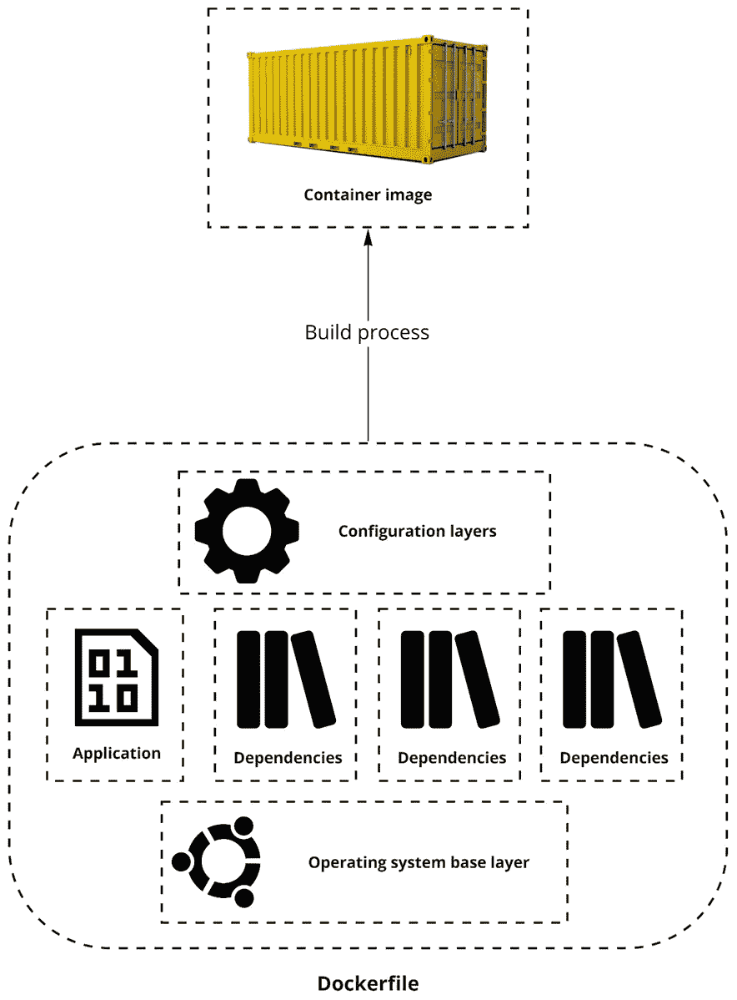

图二。1 容器映像构建流程

2015 年 6 月 22 日，由 Docker、CoreOS 和集装箱行业的其他领导者发起了开放集装箱倡议(OCI)[6]。OCI 是一个轻量级、开放的治理结构(项目)，它的形成得益于 Linux 基金会，旨在围绕容器格式和运行时创建开放的行业标准。该规范定义了如何创建 OCI 图像。容器格式和运行时的核心贡献者之一是 Docker。构建过程将根据 Docker 的构建引擎机制和功能进行解释。

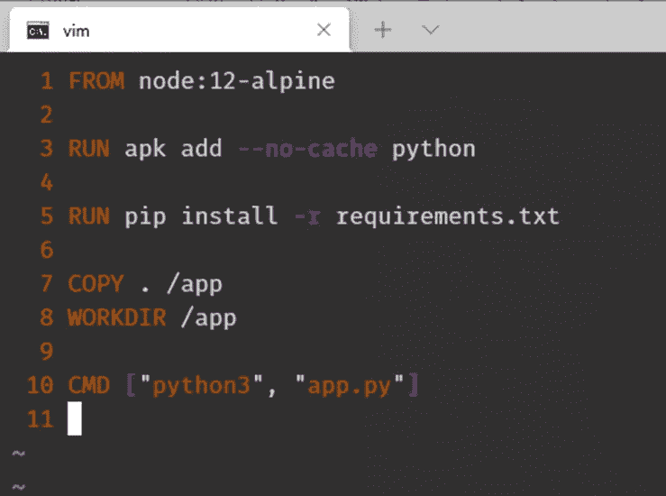

图二。2 示例 Dockerfile 文件

容器图像由层层叠加而成。图 2.1 和 2.2 显示了用于创建图像的示例图层。映像构建指令存储为 Dockerfile，每个指令代表一个层。构建过程中会缓存图层，并对每个图层计算 SHA 总和。由于缓存，重建时间大大减少，因为只有改变层重建，每一层，直到结束 docker 文件。

构建指令包括设置基本映像、添加数据(本地和远程)、运行数据配置命令和设置容器特定元数据(例如，开放端口、入口点等)。).考虑到这一点，构建指令的幂等性问题就出现了。问题是，如果来自网络的远程包作为图层下载，是在重建期间重新下载还是使用缓存图层？答案是——如果不使用 Docker build 命令的适当标志显式强制这样做，它将不会被重新构建。这迫使开发人员尽可能固定第三方软件包的版本，以在需要完全重建映像的情况下保持幂等性。

## 容器

在构建了容器映像并准备运行之后。它被部署到一个容器引擎，并在现有的主机操作系统上运行，无需硬件虚拟化。事实上，它调用主机操作系统内核来模拟容器中的底层操作系统。需要注意的是，容器不是虚拟机。两者的比较可以在第 2.6 章中找到。

容器引擎使用某些 Linux 内核功能来实现容器运行时，包括使用 cgroups(控制组)和名称空间(见图 2.4)。控制组允许指定一组进程使用的总资源的限制和度量。这些可以是 f. ex。CPU、内存、网络或 IO 配额。另一方面，名称空间用于缩小一组进程通过某些进程树、网络接口、用户 id 或文件系统挂载的可见性[7]。

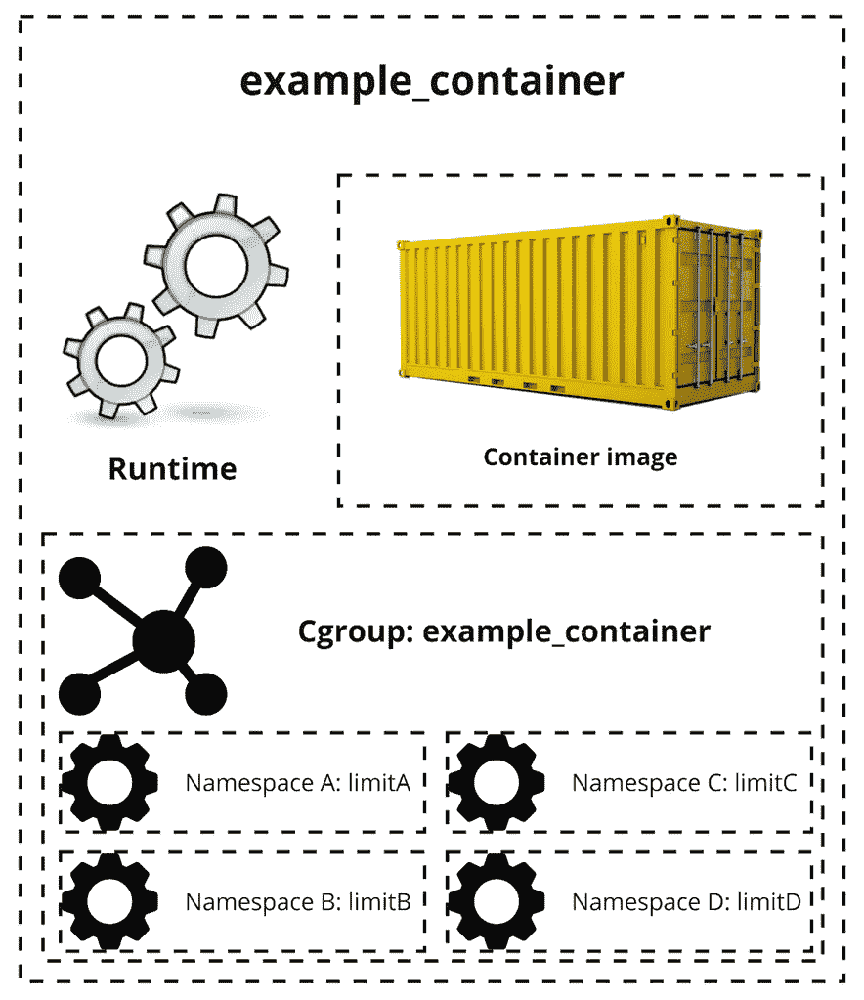

图二。4 个容器组件

某个容器的 cgroups 和 namespaces 的集合产生了一个在宿主 Linux 系统中运行的完全隔离的环境。这些内核功能的存在和使用是容器同时在可伸缩性和安全性方面如此优秀的纯粹解释。它们可以访问与系统上运行的其他容器相同的资源池，但是已经以编程方式设置了它们不能跨越的资源配额和可见性限制。

容器的生命周期由容器引擎(容器运行时)控制，这将在下一节中解释。

# 容器运行时

容器运行时(也称为容器引擎)是部署容器运行的地方(见图 2.5)。以下是几种常见的容器运行时:

*   集装箱[8]，
*   CRI-O [9]
*   Docker [10]。

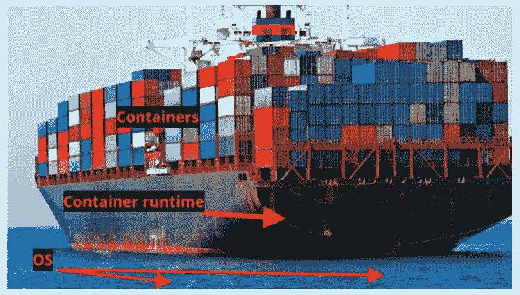

图二。5 如何看待容器、容器引擎和操作系统

它们的工作是按照用户的意愿控制容器的生命周期，以便它们可以运行、停止、恢复或销毁。它们还提供了一个以多种方式与容器交互的接口:

*   执行容器中的命令，
*   检查容器的标准输出，
*   获取指标(例如 CPU 使用率、内存使用率和限制)，
*   检查容器配置细节(例如分配的 IP 地址)。

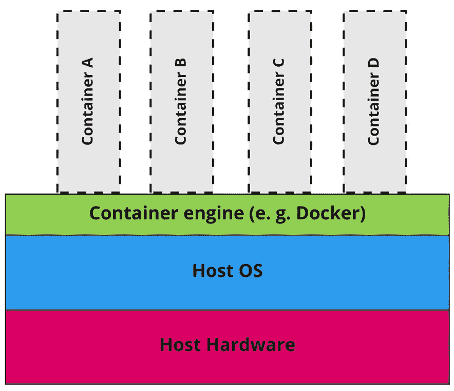

图二。6 Linux 容器体系结构分解

如图 2.6 所示，除了容器生命周期控制之外，容器运行时还充当容器内操作系统和主机操作系统之间的代理。

关于容器和容器引擎的更多阅读可以在 RedHat 博客[11]中找到。

# 容器编排器

容器编排器在管理资源和生命周期方面比容器引擎高一层(见图 2.7)。容器引擎允许在单个节点上运行容器，而 orchestrator 允许在多个节点上同步调度容器，而不管本地化和节点主机操作系统配置如何。

图二。Linux 容器体系结构中的编排层

当前可用的容器编排器支持完全的多云、多区域设置，甚至多架构设置(例如，Raspberry Pi 上的 arm64 架构上的一些本地节点和 AWS 云中的 amd64 虚拟化 EC2 节点，这形成了多区域、混合、多拱设置)。简而言之，orchestrators 管理容器运行时，并提供许多领域的扩展，如使用 CNI(容器网络接口)的网络增强。

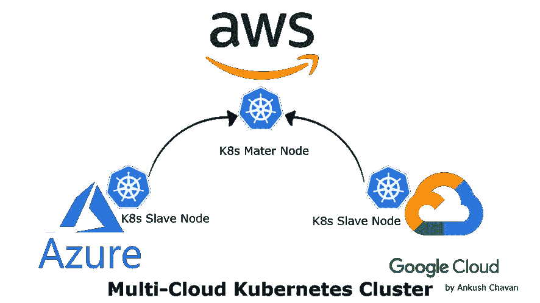

图二。8 示例多云 Kubernetes 集群[12]

多云设计(参见图 2.8 中的示例)是一种涉及多个云提供商的架构，例如。一个混合了亚马逊网络服务(AWS) EC2 实例和谷歌云平台(GCP)谷歌计算引擎(GCE)实例的集群。这可能是因为各种原因而使用的，比如价格/价值差异，或者在一个云上部署旧系统，而在新的云上部署新产品。

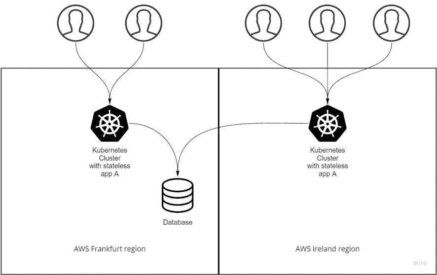

图二。9 多区域 Kubernetes 设置示例

多区域设置是指多个 k8s 集群在多个区域共同努力实现一个目标，例如。(参见图 2.9)一个集群部署在法兰克福，另一个部署在爱尔兰，两个集群都运行相同的应用程序，连接到法兰克福的相同数据库(DB)，这样两个地区的客户端都可以有合理的延迟，从而获得更好的用户体验。

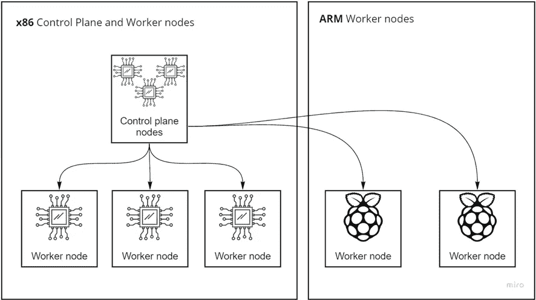

图二。10 多架构 Kubernetes 设置示例

多架构设置是指在一个 Kubernetes 集群中，使用几个硬件架构来组装一个集群。其中一个用例是硬件效率，同时部署架构相关软件，例如部署由标准 x86 amd64 节点构成的集群，其中仅运行 amd64 兼容应用，并将其余应用部署在高能效 ARM 节点上。

## 资源分解

containers orchestrators 在行业中取得成功的最具革命性的因素之一是管理资源的能力。当将被编排的节点集群被组装时，其资源被虚拟分解(参见图 2.11)，这意味着它们不再被视为可以部署工作负载的独立空间，而是可以使用的单个资源池。

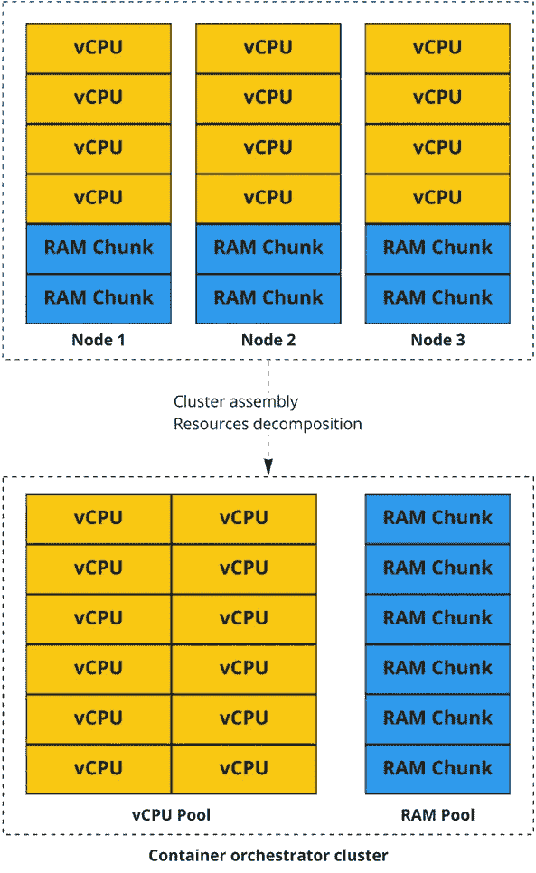

图二。11 容器编制器节点资源分解

因此，如果我们从 3 台机器组装一个集群，每台机器有 4 个 vcpu 和 16GB RAM，我们将看到一个包含 12 个 vcpu 和 48GB RAM 的资源池。然而，仍然有物理边界需要考虑。创建容器编排器是为了支持微服务的架构，因此单个微服务相对小于整体系统。但是，如果在上面的示例中，我们要部署一个需要分配 6 个 vCPUs 和 8GB 内存的工作负载，container orchestrator 将无法安排此类工作负载的部署。也就是说，由于物理资源边界不可跨越，多节点 CPU 计算对于不是为这样做而设计的系统来说是低效的，并且由于所使用的容器化，它应该是通用的。因此，协调器不再需要集群管理员负责高效的工作负载分配过程，但是在设计集群配置时，仍然应该考虑工作负载的规模。

# 库伯内特斯

如今最受关注的容器编排器是 Kubernetes(参与 CNCF 调查的 78%的公司都使用它)[13]。它是一个复杂但仍在不断发展的工具和引擎，用于编排由容器和第三方自定义操作符组成的同构和异构环境。Kubernetes 集群由一个控制平面和一个数据平面组成(见图 2.12)。核心功能由控制平面的组件(主节点)提供:

*   etcd 数据库，
*   调度程序，
*   API 服务器，
*   控制器管理器。

每个节点也有一个:

*   库伯莱，
*   kube-proxy，
*   容器-运行时。

只有这些节点构成了一个数据平面，称为工作节点(见图 2.12)。上述所有组件将在接下来的章节中解释。

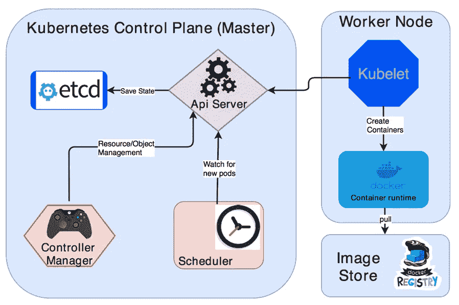

图二。12 Kubernetes 建筑简而言之[14]

Kubernetes 状态作为对象存储在数据库中。对象可以很容易地写成 YAML 的清单。它们也可以以各种其他格式查看，例如使用 k8s CLI 的 JSON，名为 *kubectl* 。在 Kubernetes 中需要解释的最重要的物体是一个*豆荚*。一个 *pod* 是一个对象，它配置一个容器(或几个容器)在集群中运行，并具有适当的标签、安全性和网络配置。

Kubernetes 目前用于两种模式:自管理(称为标准)和提供者管理(称为托管)。它们的不同之处在于如何为最终用户提供控制平面，我们将在以下部分进行解释。

## 控制平面

控制面板的职责是使用内部组件管理整个集群。

Etcd 数据库是存储集群状态的地方。它可以以高可用性(HA)和单节点方式部署。对集群的每个更改都在`etcd`数据库中有一个引用，以便在任何节点出现故障的情况下，可以直接从存储的状态数据中进行协调。

调度程序的职责是调度集群中的 pod。它会观察新创建的 pod，并根据许多因素来决定应该调度哪个节点。这些因素包括:“个人和集体的资源需求、硬件/软件/策略约束、相似性和反相似性规范、数据局部性、工作负载间干扰和截止日期”[15]。

控制器管理器实际上是监视 k8s 对象和维护集群状态的多个控制器的集合。这些控制器的一些类型是节点控制器(管理节点连接)、作业控制器(一次性类型的 pod)和端点控制器(连接 pod 和服务对象)。

API 服务器充当控制平面组件之间的代理，但也为集群的用户提供接口。部署到集群的所有清单都要经过 API 服务器，在将它们插入 etcd 数据库之前，会在 API 服务器中对其进行解析和错误检查。在集群中运行的对象的可观察性也由 API 服务器提供。

上述组件构成了控制平面，但这些组件并不是运行在这些节点上的唯一组件。还有一个 kubelet、kube-proxy 和 container-runtime，它们运行在集群中的每个节点上，将在下一节中解释。

## 数据平面

数据平面的职责是维护与主平面的连接，为当前运行的工作负载提供低级容器管理功能和可观察性。

Kubelet 是在集群中的每个节点上运行的代理。“它确保容器在容器中运行”[15]。但是，它不管理不是由 Kubernetes 创建的容器。

Kube-proxy 是一个网络组件，它维护节点上的网络规则，并允许集群内外的网络会话。

容器运行时也是每个节点上可用的数据平面的核心组件。

## 托管 Kubernetes

“三大”云提供商——AWS(亚马逊网络服务)、GCP(谷歌云平台)和 Azure(微软)提供一种叫做托管 Kubernetes 的服务。每个都有自己的命名 AWS 上的 EKS、GCP 上的 GKE 和 Azure 上的 AKS:

*   亚马逊的弹性 Kubernetes 服务(EKS)
*   微软的 Azure Kubernetes 服务(AKS)
*   谷歌的 Kubernetes 引擎(GKE)。

与标准部署和使用方式的不同之处在于，在这种情况下，控制平面由云提供商管理。用户仍然能够使用清单中的配置来配置群集，但是控制平面运行状况和 HA 的所有责任都依赖于服务提供商。

同时，工作节点管理仍然是集群用户的责任。一些云提供商还提供自动化控制平面更新，只需几个手动配置步骤(EKS)，其他提供商甚至提供全自动集群升级流程以及工作节点(GKE) [16]。

# 监控 Kubernetes

考虑到 container orchestrator 的特性和流经 Kubernetes 集群的海量数据，可以监控的字段数量非常大，包括:

*   节点资源利用率，
*   网络策略(例如拒绝点击)，
*   网络流量利用率，
*   网络流量类型，
*   应用程序指标，
*   还有更多…

出于本文的考虑，我们将只深入考虑节点资源利用率(CPU 和 RAM)。市场上有各种监控解决方案。其中许多为 Kubernetes 集群监控提供了完整的解决方案，不仅包括指标收集和分析，还包括日志记录、解析和警报。弹性公司[17] [18]的 ELK Stack 和 Metricbeat 就是一个完整解决方案的例子。

# 容器与虚拟机

注意 Linux 容器和虚拟机(VM)之间的区别是很重要的。两者都是打包的计算环境，将各种应用程序及其依赖项与系统的其余部分隔离开来。核心区别在于规模和便携性。

虚拟机被设计得很大，并在里面存储整个单片系统。它的资源是预先指定的，很难移动，主要是因为硬件虚拟化涉及 f. ex。系统引导过程。

容器设计得很小，包含一个应用程序及其依赖项。由于其轻量级的设计和共享的操作系统，在多个环境之间移动它们也很容易。

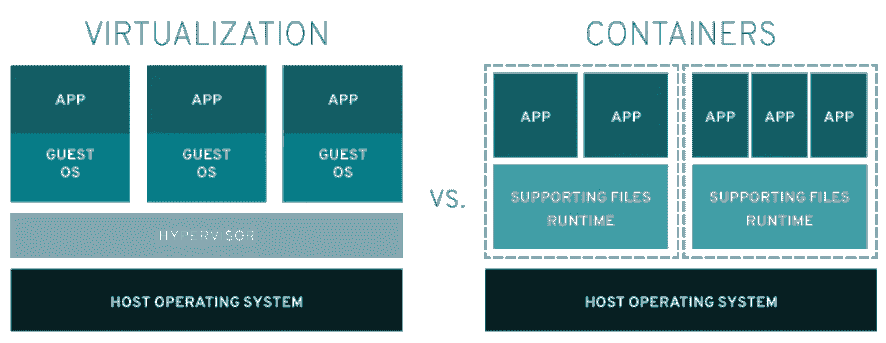

图二。13 架构比较:虚拟化与容器[19]

与容器组和名称空间分离设计相反，虚拟机使用一种称为管理程序的软件来将资源从物理机中分离出来，并将其分配给特定的虚拟机(参见图 2.13)。这是主要的难点，因为它强制执行硬资源固定，并支持紧密耦合。而容器更多地支持松散耦合和高内聚的架构，如图 2.14 中的例子所示。

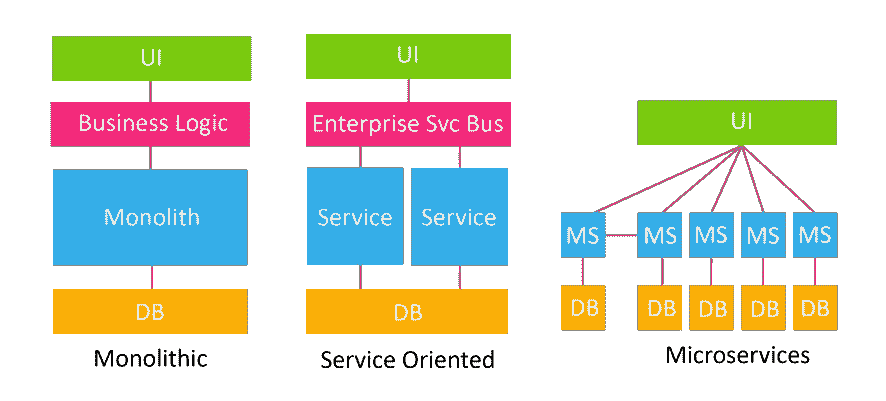

图二。14 微服务、SOA 和单片架构中的通信示例[20]

因此，虚拟化更多的是针对旧的整体式或面向服务的方法，而容器更多的是针对微服务架构。

# 文献学

[文章中的所有链接和来源](https://medium.com/@patryk.kobielak/thesis-knowledge-cycle-bibliography-a50ccbaab9ad)