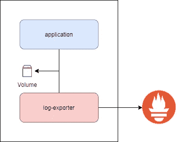
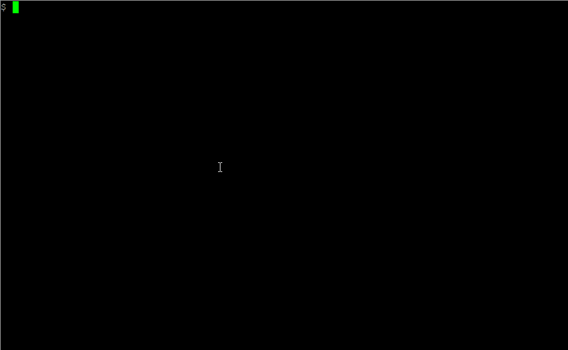
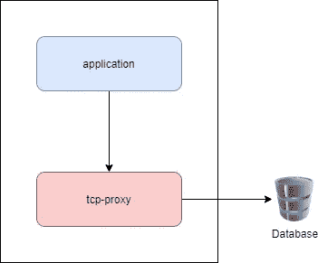
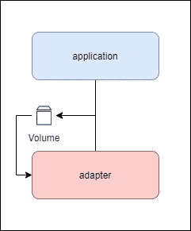

# 了解 Kubernetes 多容器 Pod 模式

> 原文：<https://betterprogramming.pub/understanding-kubernetes-multi-container-pod-patterns-577f74690aee>

## Sidecar、Ambassador 和 Adapter 模式指南，并附有实践示例

照片由 [Tevin Trinh](https://unsplash.com/@tevintrinh?utm_source=medium&utm_medium=referral) 在 [Unsplash](https://unsplash.com?utm_source=medium&utm_medium=referral) 上拍摄

Kubernetes 豆荚是 Kubernetes 的基本组成部分。由一个或多个容器组成，它是您可以将 Kubernetes 架构分解成的最小实体。

当我第一次接触 Kubernetes 时，我经常想知道他们为什么要这样设计。我的意思是为什么容器没有成为基本的构建模块。嗯，在真实环境中做一些事情，现在更有意义了。

因此，pod 可以包含多个容器，这有一些很好的原因——主要是，pod 中的容器在多节点集群中的同一个节点上被调度。这使得它们之间的通信更快、更安全，并且它们可以彼此共享卷安装和文件系统。

这有助于我们构建可以实现的模式来解决一些特定的问题。有三种被广泛认可的多容器 pod 模式:

*   边车
*   大使
*   适配器

让我们用一些实际操作的例子来看一下每一项。

# 先决条件

出于动手练习的目的，您需要一个正在运行的 Kubernetes 集群，并且您需要克隆[这个 repo](https://github.com/bharatmicrosystems/multi-container-patterns) ，并将 cd 放入其中。

# 边车

边车的名字来源于摩托车边车。虽然你的摩托车没有边车也可以工作得很好，但是有一个边车可以通过给它一个额外的座位来增强或扩展你的自行车的功能。类似地，在 Kubernetes 中，sidecar 模式用于增强或扩展容器的现有功能。

你的集装箱在没有边车的情况下工作得非常好，但是有了边车，它可以执行一些额外的功能。一些很好的例子是使用 sidecar 进行监控和日志记录，并为这些目的添加代理。

边车

对于演示，让我们看一个 sidecar 模式，其中一个应用程序在一个特定的文件路径生成日志，sidecar 将记录推送到`nginx` HTML 目录供用户查看。

所以，如果你看看货单，你会看到我们有两个集装箱:`app-container`和`log-exporter-sidecar`。`app-container`不断地将日志流式传输到`/var/log/app.log`，sidecar 容器将日志装载到`nginx` HTML 目录。这使得任何人都可以使用网络浏览器查看日志。

当您应用清单并在端口 80 上运行端口转发时，您应该能够使用浏览器访问日志。对于这个演示，我们将使用`curl`来实现。

如您所见，可以通过`curl`查看日志，尽管这是一种非常基本的做事方式，但它解释了这个概念。

# 大使

大使模式的名字来源于大使，他是一个特使，是一个国家选择来代表他们的国家并与世界其他地区联系的人。类似地，在 Kubernetes 的观点中，大使模式实现了外部世界的代理。让我给你举个例子——如果你构建一个需要连接数据库服务器的应用程序，服务器配置等会随着环境的变化而变化。

现在，处理这些问题的官方建议是使用配置映射，但是如果您的遗留代码已经在使用另一种连接数据库的方式呢？可能是一个属性文件，或者更糟，一组硬编码的值。如果您想与 localhost 通信，并且可以将其余的工作交给管理员，那该怎么办呢？对于这种情况，您可以使用大使模式。

因此，我们可以做的是创建另一个容器，它可以充当数据库的 TCP 代理，您可以通过 localhost 连接到该代理。然后，sysadmin 可以使用代理容器的配置映射和秘密来注入正确的连接和身份验证信息。

大使

对于演示，我们将使用一个简单的 NGINX 配置，作为 example.com 的 TCP 代理。这应该也适用于数据库和其他后端。

如果你仔细看 YAML 的舱单，你会发现有三个集装箱。app-container-poller 不断调用`[http://localhost:81](http://localhost:81)`并将内容发送给`/usr/share/nginx/html/index.html`。

app-container-server 运行`nginx`并监听端口 80 来处理外部请求。这两个容器共用一个`mountPath`。这类似于边车方法。

有一个在 pod 中运行的`ambassador-container`监听`localhost:81`并代理到`example.com`的连接，所以当我们在端口 80 上卷曲`app-container-server`端点时，我们从`example.com`得到一个响应。

让我们来看看:

# 适配器

适配器是可以用多个容器实现的另一种模式。适配器模式有助于标准化本质上不同的东西。例如，您在不同的容器中运行多个应用程序，但是每个应用程序都有不同的输出日志文件的方式。

现在，您有了一个集中的日志记录系统，只接受特定格式的日志。在这种情况下你能做什么？你可以改变每个应用程序的源代码来输出一个标准的日志格式，或者在把日志发送到你的中央服务器之前使用一个适配器来标准化日志。这就是适配器模式的由来。

适配器

对于我们的动手练习，让我们考虑一个以特定格式输出日志的应用程序，我们希望将其转换为标准格式。

在清单中，我们有一个`app-container`将一串日期输出到一个日志文件中。`log-adapter`容器在前面加了一个`Date`前缀。是的，这是一个非常基本的例子，但足以了解适配器是如何工作的。

让我们应用清单，自己看看。

因此，当我们为`log-adapter`创建日志文件`/var/log/out.log`时，我们会看到一个`Date`前缀出现在原来的日志`/var/log/app.log`中。然后，您可以使用 sidecar 将这些日志导出到您的监控和警报引擎。

# 结论

多容器豆荚在 Kubernetes 有很好的存在理由。上面的模式只是最广泛使用的模式之一——还有其他您可能想要使用它们的场景。Pod 中的容器使用相同的 IPC 名称空间和网络，因此您可能需要根据它们的效用紧密耦合两个容器。

感谢阅读！我希望你喜欢这篇文章。