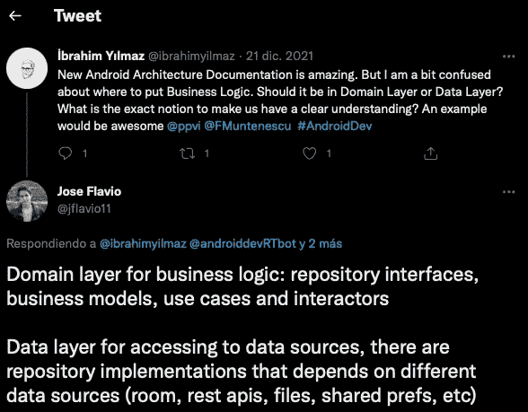

# Kotlin 多平台项目中的分层架构介绍

> 原文：<https://betterprogramming.pub/understanding-layered-architecture-in-a-kotlin-multiplatform-project-part-1-a7488f478978>

## 第 1 部分—入门

大约 11 个月前，我在 Kotlin 多平台中创建了一个演示项目。老实说，我很难让它在 iOS 上运行。编译器中有很多错误，我不得不写一些*变通方法*。从那以后，我再也没有碰过那个项目，也没有使用 Kotlin 跨平台开发任何(公共)应用程序。

随着最近对 [Android 架构指南](https://developer.android.com/jetpack/guide)的更新，我注意到关于如何尊重已经众所周知的“干净架构”出现了几个疑问。或者组织项目的最佳方式是什么。答案很简单:**看情况**。

因此，我们将回顾一些概念和建议，以便更清楚地了解您应该选择哪种设计方案。

具体来说，这篇文章将通过一个 Kotlin 多平台项目来解释层的架构，在这个项目中，显然需要一个专门用于业务或领域逻辑的“部分”。

# 了解项目的规模

如上所述，架构设计决策总是取决于各种因素:项目复杂性、功能性、参与开发的人员、可用技术、规模预测等。

一个由 3 个人开发的简单应用程序与一个作为*销售点*工作的应用程序是不同的，在这个销售点中，50 个开发人员每天都在修改代码。

在第一个选项中，一个将数据访问部分和图形用户界面部分分开的整体项目可能就足够了。

在第二种情况下，可能有必要为每个团队将采用的每个功能创建一个模块，并在每个模块中实现一个结构(当然，这个结构在所有模块中应该是相似的，以保持一致性)。

在为您的应用程序设计架构时，建议总是要尊重软件开发的一个基本原则，即避开任何技术或*框架*:责任分离或 [*关注点分离*](https://en.wikipedia.org/wiki/Separation_of_concerns) 。

对于这一点，你可以加上对坚实原理的清晰理解。

因此，即使在最小的项目中，你也需要在代码中分离职责。如果该应用程序唯一要做的事情是显示来自单一数据源的电影列表，那就没有必要进行复杂的设计。

但是，您至少应该区分负责显示数据(UI)的代码和负责获取电影的代码。因此，我猜，Google 团队决定让领域层(负责业务逻辑)可选。

你可以看看我在推特上的一段对话:

*你可以跟帖* [*这里*](https://twitter.com/jflavio11/status/1473367164598038539?s=20&t=cxvq7SWSuy_DnotNa2IOkw) *。*

# 分层架构还是干净架构？

几年来，多亏了 Android 开发者社区，设计我们的应用架构的知识和良好实践一直在改进。了解 SOLID、设计模式和应用“干净的架构”成为了“时尚”。

很多时候，当我采访候选人时，他们告诉我他们了解 SOLID 或者他们“使用”了 Clean Architecture，但他们没有清楚地说明或解释他们是如何应用它的，或者他们为什么做出某些设计决策。

甚至经常有人说“干净的建筑”就是建筑本身。我不同意这种说法。快速回顾一下 2012 年的书或文章 [The Clean Architecture](https://blog.cleancoder.com/uncle-bob/2012/08/13/the-clean-architecture.html) ，我们可以看到鲍勃大叔所说的“Clean Architecture”是一个混合了各种建筑设计的想法。

最后，如果我们很好地理解了*干净架构*想要达到的目标，那就是通过代码的分层来尊重职责的分离。换句话说，在我看来，*干净架构*是理解层架构的另一种更具体的方式。

顺便说一句，我很乐意让你评论一下你对此的观点。建筑题材很棒！

注意:我正在 Github 中开发一个开源的 Kotlin 多平台项目，看看吧！

 [## GitHub-jflavio 11/LayeredKotlinMultiplatform:展示分层的示例 KMM 应用程序…

### 这个项目是由一系列的职位，你可以在我的博客 https://jflavio.com 领域和数据层…

github.com](https://github.com/jflavio11/LayeredKotlinMultiplatform) 

# 下一步是什么

这是我第一次简要介绍这个目标。在下文中，我们将通过创建一个 Kotlin 多平台项目来设计和实现该解决方案。本指南将分为以下几个帖子:

1.  [简介(本帖)](https://jflavio11.medium.com/understanding-layered-architecture-in-a-kotlin-multiplatform-project-part-1-a7488f478978)
2.  [设计解决方案](https://jflavio11.medium.com/understanding-layered-architecture-in-kmm-part-2-designing-the-solution-957e2b1fb536)
3.  [创建域层](https://jflavio11.medium.com/understanding-the-layered-architecture-with-kmm-part-3-the-domain-layer-3df5e1fa3e6a)
4.  [创建图层数据](https://jflavio11.medium.com/understanding-layered-architecture-in-kmm-part-4-the-data-layer-6fc0e153fffb)
5.  实现表示层