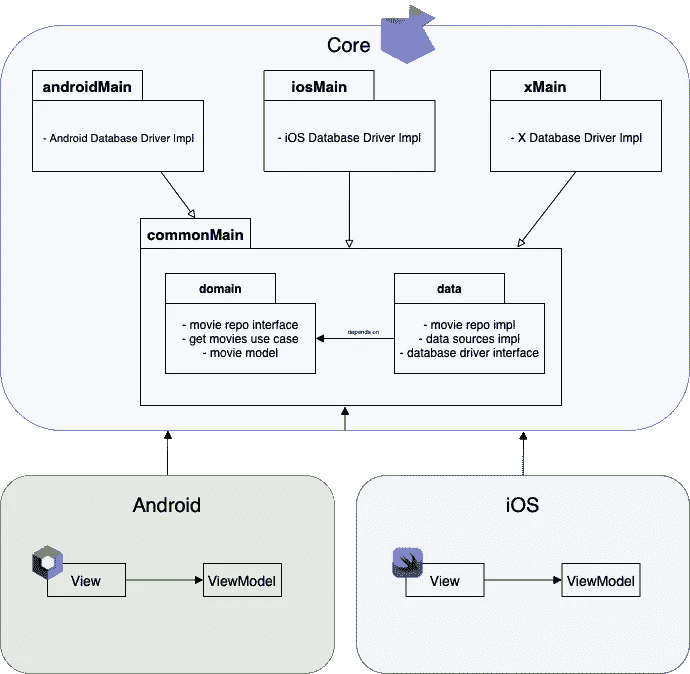
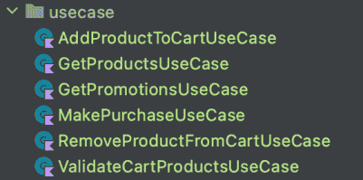
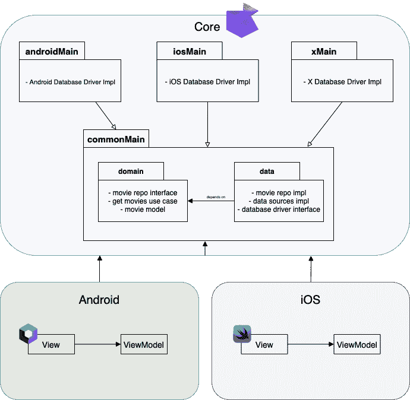
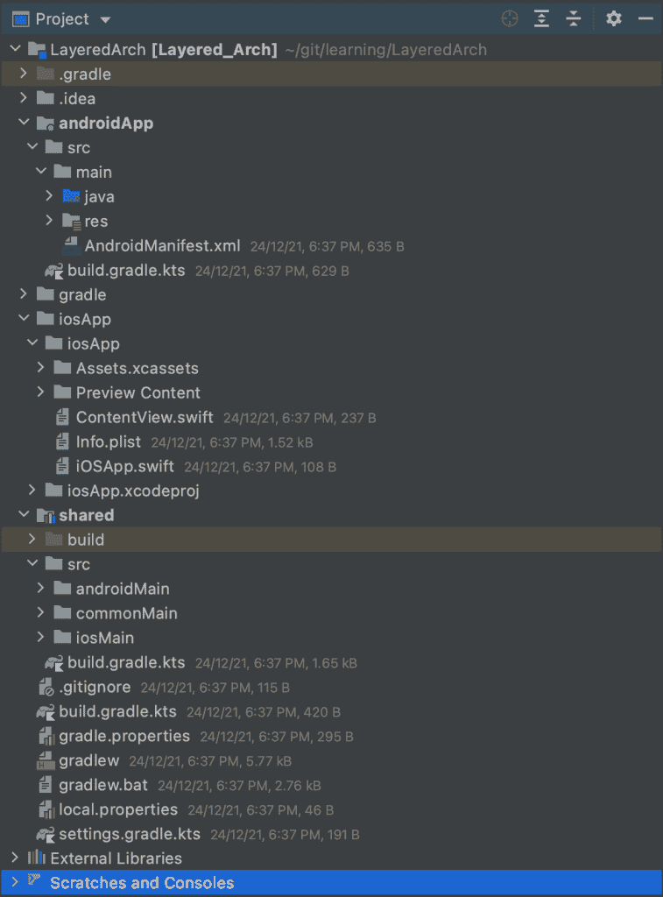

# 了解 KMM 的分层架构，第 2 部分—设计解决方案

> 原文：<https://betterprogramming.pub/understanding-layered-architecture-in-kmm-part-2-designing-the-solution-957e2b1fb536>

## 第 2 部分，共 5 部分

最终建筑设计

# 设计解决方案

我们将要开发的应用程序非常简单，但是为了理解将项目分层的所有特性，我们将使它变得复杂，也许是不必要的。

我们的应用程序将显示电影列表。就是这样。就这样。因此，我们将创建层，并赋予每一个责任。我将按照我们开发它的顺序列出它们:

# 领域

在这里，我们将创建我们的主要“电影”模型。此外，储存库和数据源的契约或定义。

存储库将是一个`domain`包中的接口，数据源的类将在另一个`data`包中，我们将在本系列的下一章中看到(包括帮助我们将数据保存到本地数据库的库和帮助我们从 REST 服务获取数据的库)。

在我们的领域层内将是我们希望我们的应用程序拥有的所有逻辑**，而不管它将在什么平台上实现**。

例如，我们是否希望我们的应用程序显示电影列表？然后我们必须创建一个负责给我们带来电影的类。这个类就是我们所说的“用例”，*用例*或者*交互器*。不管你是在编写 Android 还是 iOS 应用程序，它都会显示一个电影列表，逻辑在两者中都是一样的。

这意味着我们的领域模块必须能够从 Android 应用的源代码中“提取”自身，并且能够在另一个*框架*中使用，同时保持核心功能。

也许创建一个只有一个功能的类似乎不是很有用，这个类唯一的功能是返回存储库提供给它的电影列表。就好像这个*用例*是一个扶手，一座桥。

但是我们这样来看:阅读下面的结构，你觉得这个例子 app 是做什么的？

最有可能是一个有购物车的应用，对吧？其中您可以看到产品，促销，将它们添加到购物车，并在购物车中的所有数据都经过验证的情况下进行购买。

当你进入一个项目，发现像这样的东西，你就节省了大量的时间去尝试理解应用程序是如何工作的。当然，可能还有执行更复杂动作的*用例* / *交互器*。

我们的应用程序将只有一个*用例*实现:`GetMoviesInteractor`。顺便说一下，在创建用例类时，我更喜欢使用术语“交互器”，因为交互器是实现系统用例的对象。

# 数据

对于每个框架或平台，数据层也应该是相同的。无论应用程序是在安卓、iOS、网络还是桌面上运行都没关系。存储库和数据源实现的逻辑应该完全相同。

然而，我们在这里发现了一个障碍。每个平台都有不同的方式连接到 REST APIs 或将数据保存到本地数据库中。安卓多采用翻新，iOS 应用采用 Alamofire。那么，我们如何处理一种独特的方式来访问数据，即使是外部或内部的呢？

您可以考虑改型，因为它适用于任何 JVM 项目，并且 KMM 的核心是一个纯 Kotlin 模块。然而，[正如你在 Github](https://github.com/square/retrofit/issues/3181) 上看到的，Jake Wharton 解释说这将需要一些时间，因为翻新依赖于其他库，比如 OkHttp。

到目前为止(2022 年 3 月)，我们能找到的最佳选择是使用 [Ktor](https://ktor.io/docs/http-client-multiplatform.html) 来消费 REST APIs。

以及我们应该使用什么作为本地数据源库？为此，有 [SqlDelight](https://cashapp.github.io/sqldelight/multiplatform_sqlite/) ，KMM 项目的实现非常简单！我们需要为每个平台创建数据库驱动程序，并将数据源实现放在`commonMain`(`shared`模块中的核心包)中。它们(数据源)将依赖于数据库驱动程序接口。轻松点。

# 介绍会；展示会

这是最简单的一个(也可能不是)。这里我们只需要写每个平台的 UI！即使用 Android 的 Jetpack Compose，iOS 的 SwiftUI 等。

如果您想尝试更复杂的东西，您可以尝试在`shared`模块中添加一个`presentation`包，并为视图、演示者和视图模型定义契约(如果您想实现 MVP 或 MVVM 模式的话)。老实说，这是我还没有尝试过的东西，但可能会非常有趣。

# 最后…

这是我们项目的最终架构设计:

正如你所看到的，我们正在最大限度地实现一个独特的跨业务层，可以被任何平台使用。

我们的项目树应该是这样的:

您可能已经注意到，我们开始从核心，从业务逻辑或领域层构建软件。业务的规则和需求将指导软件的开发:领域驱动的开发。

**注意:我正在 Github 中开发一个开源的 Kotlin 多平台项目，看看吧！**

 [## GitHub-jflavio 11/LayeredKotlinMultiplatform:展示分层的示例 KMM 应用程序…

### 这个项目是由一系列的职位，你可以在我的博客 https://jflavio.com 领域和数据层…

github.com](https://github.com/jflavio11/LayeredKotlinMultiplatform) 

# 此帖子系列的拆分

这是我们为项目设计解决方案的第二篇文章。下面，我们将讨论域层的实现。本指南将分为以下几个帖子:

1.  [简介](https://medium.com/@jflavio11/understanding-layered-architecture-in-a-kotlin-multiplatform-project-part-1-a7488f478978)
2.  [设计解决方案(本帖)](https://jflavio11.medium.com/understanding-layered-architecture-in-kmm-part-2-designing-the-solution-957e2b1fb536)
3.  [创建领域层](https://jflavio11.medium.com/understanding-the-layered-architecture-with-kmm-part-3-the-domain-layer-3df5e1fa3e6a)
4.  [创建图层数据](https://jflavio11.medium.com/understanding-layered-architecture-in-kmm-part-4-the-data-layer-6fc0e153fffb)
5.  实现表示层