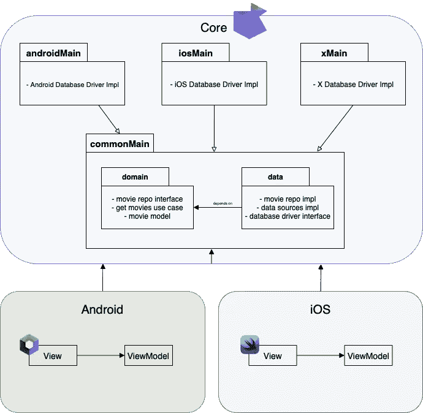
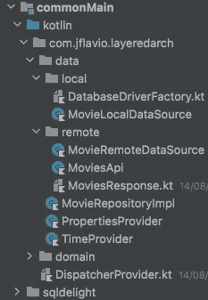
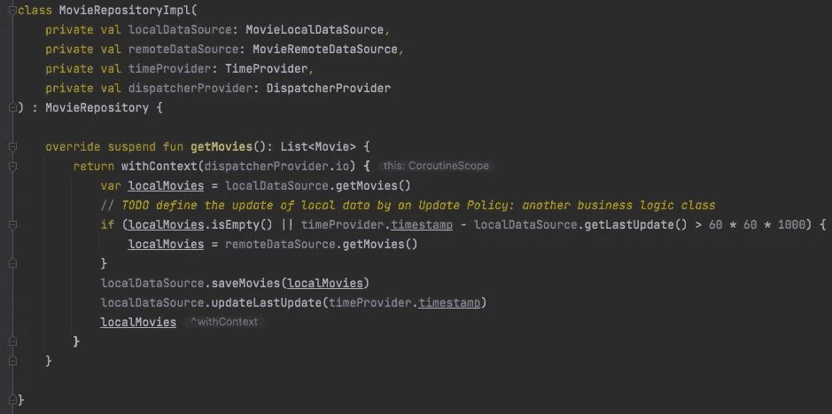

# 了解 KMM 的分层架构，第 4 部分—数据层

> 原文：<https://betterprogramming.pub/understanding-layered-architecture-in-kmm-part-4-the-data-layer-6fc0e153fffb>

## 第 4 部分，共 5 部分



我们项目的架构。

现在我们来看看数据层。为此，有必要记住我们在本系列第二部分所做的架构设计，[你可以在这里阅读](https://medium.com/@jflavio11/understanding-layered-architecture-in-kmm-part-2-designing-the-solution-957e2b1fb536)。

如你所见，我们有三个主要模块:`android`、`iOS`和`core`(在 Gradle 中称为`shared`)。

我们的`shared`模块中的`xMain`包，是为你能想到的任何平台准备的，那就是 web、终端、Mac 等等。

但是现在让我们来看看对这第四部分最重要的:

*   这是我们项目的数据层实现。所有与数据访问相关的代码都将在这里定义，除了平台实现，如*数据库引擎*。即:存储库接口实现、本地和远程数据源、平台数据提供者(这些是将要在平台模块中实现的 *expect 类*)等。
*   `androidMain`:包含与 android 平台相关的代码，它在`*shared*`里面，因为可以被项目中的任何 *android 应用模块*重用。这里，我们将在`*commonMain*`模块中定义 *expect 类*的实现。
*   `iosMain`:与`*androidMain*`类似，但用于 iOS。

**重要提示** 共享模块中的`androidMain`和`iosMain`模块不实现数据访问层(存储库或数据源，因为它们必须可被任何其他模块重用)，它们实现 expect 类。例如:

*   Android 和 iOS 获取当前*时间戳*的方式是不同的。我们必须创建一个 expect 类来定义获取时间戳的契约，并且每个平台模块都实现它。行为类似于接口。

```
// inside the shared/commonMain module
expect class TimeProvider {
    var timestamp: Long
}// implementation in shared/androidMain module
actual class TimeProvider {
    actual var timestamp: Long = System.currentTimeMillis()
}// implementation in shared/iosMain module
actual class TimeProvider {
    actual var timestamp = NSDate().*timeIntervalSince1970*.toLong()
}
```

这同样适用于每个平台创建数据库引擎实例的方式。我们只定义了获取数据库驱动程序的“契约”:

```
expect class DatabaseDriverFactory {
    fun createDriver(): SqlDriver
}
```

而且每个平台都实现了 *expect 类*，比如 Android 需要一个`context` *:*

```
// implementation inside shared/androidMain module
actual class DatabaseDriverFactory(private val context: Context) {
    actual fun createDriver(): SqlDriver {
        return AndroidSqliteDriver(
            schema = MoviesDb.Schema,
            context = context,
            name = "movies.db"
        )
    }
}
```

这就是我们项目中数据层的样子(正如您所见，`data`包在`shared/commonMain`模块中):



commonMain 模块中的数据层。

我们有域层的域包，正如我在上一篇文章中解释的[，还有外部的`sqldelight`包(就在 Kotlin 包下面)，以及实现所有数据层的数据包。](https://medium.com/@jflavio11/understanding-the-layered-architecture-with-kmm-part-3-the-domain-layer-3df5e1fa3e6a)

在我们的数据层中，我们有:

*   `local` package: local data access，这里我们可以定义一个 *expect 类*用于平台数据访问的实现(就像 Android 中的`SharedPreferences`，或者作为我们的项目，定义 *expect 类*用于创建数据库驱动(`DatabaseDriverFactory.kt`)。
    `MovieLocalDataSource`负责与本地数据源(内部数据库、系统偏好等)相关的 CRUD 操作。它将在存储库实现中使用(`MovieRepositoryImpl`)。
*   `remote`包:顾名思义，这里我们有所有与远程数据访问相关的代码，即:REST APIs、GraphQL、Firebase 等。我们只使用了 MovieDB 服务中的 REST API。此外，我们可以定义响应和请求，这些对于任何平台都必须是相同的，这就是这里定义的原因。
*   `TimeProvider`和`PropertiesProvider` : *expect 类*返回平台特定数据，`TimeProvider`返回当前时间戳，`PropertiesProvider`**`API KEY`*用于消费 REST API。***
*   ***`MovieRepositoryImpl`:域层内部`MovieRepository`接口的实现。很容易注意到，这是任何平台都共享的:我们请求电影列表，我们在本地数据源中询问数据是否过时，如果是，那么我们请求 REST API，我们在本地数据源中保存结果(也就是说，我们更新它)并返回更新的数据。这将由我们的域层内部的`GetMoviesInteractor`调用，并且`GetMoviesInteractor`应该被注入到`ViewModel`、`Presenter`等中。***

******

***数据层内部的 MovieRepository 实现。***

> ***注意:我推荐你阅读 [SQDelight 库文档](https://cashapp.github.io/sqldelight/multiplatform_sqlite/)来理解它是如何工作的，它很容易实现，但是需要知道一些细节，比如为定义数据库模式设置相同的包结构。***

# ***概括起来***

***我们已经在这个 Kotlin 多平台项目中介绍了我们的数据层的实现，最重要的细节是:***

*   ***我们在`*shared*`模块内的`*commonMain*` *模块*中实现了数据层，因为它将被任何平台重用。***
*   **更具体地说，数据层中的类被注入到领域层类中(就像在用例/交互器内部)。然而，在我们需要注入它们的每个平台上。**
*   **如果我们在数据层的类需要特定的平台数据，比如`timestamp`值或 API 键，我们将需要定义*期望类*并在`shared`模块内的每个平台模块中实现它们。**
*   **尽量将所有数据层逻辑放在*数据包中。*存储库内部的工作方式(比如调用哪些数据源或如何执行 CRUD 操作)可能因平台而异。**

**您可以在 Github 上关注项目的进展:**

**[](https://github.com/jflavio11/LayeredKMM) [## GitHub—jflavio 11/LayeredKotlinMultiplatform:展示分层的示例 KMM 应用程序…

### 这个项目是由一系列的职位，你可以在我的博客 https://jflavio.com 领域和数据层…

github.com](https://github.com/jflavio11/LayeredKMM) 

# 此帖子系列的拆分

这是我们讨论领域层的第二篇文章。下面，我们将讨论数据层。本指南分为以下帖子:

1.  [简介](https://medium.com/better-programming/understanding-layered-architecture-in-a-kotlin-multiplatform-project-part-1-a7488f478978)
2.  [设计解决方案](https://jflavio11.medium.com/understanding-layered-architecture-in-kmm-part-2-designing-the-solution-957e2b1fb536)
3.  [创建域层](https://jflavio11.medium.com/understanding-the-layered-architecture-with-kmm-part-3-the-domain-layer-3df5e1fa3e6a)
4.  [创建图层数据](https://jflavio11.medium.com/understanding-layered-architecture-in-kmm-part-4-the-data-layer-6fc0e153fffb)(本帖)
5.  实现表示层**