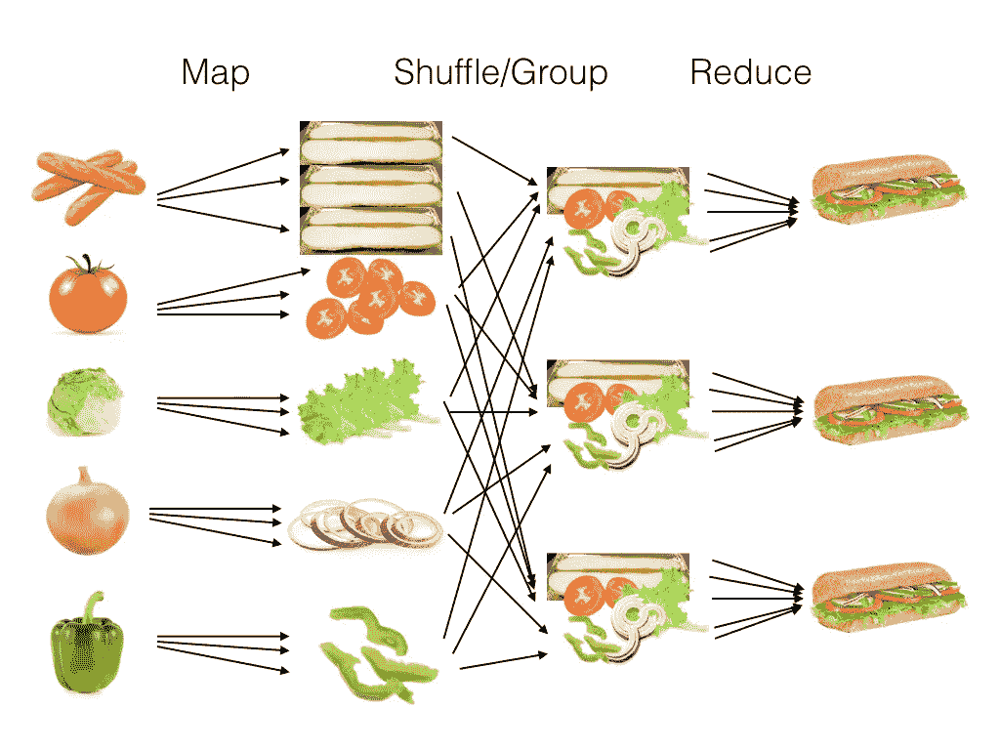
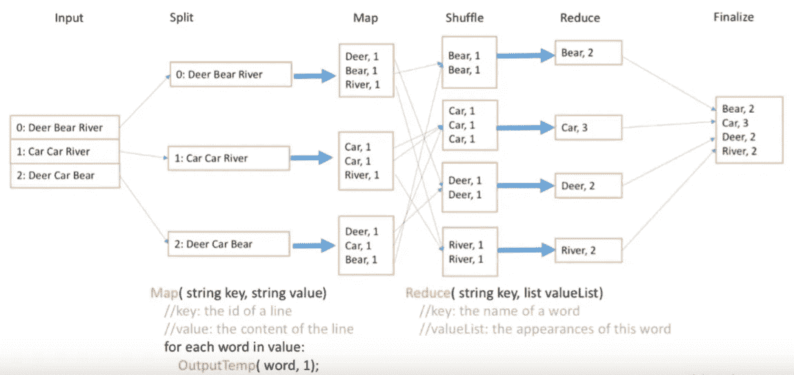
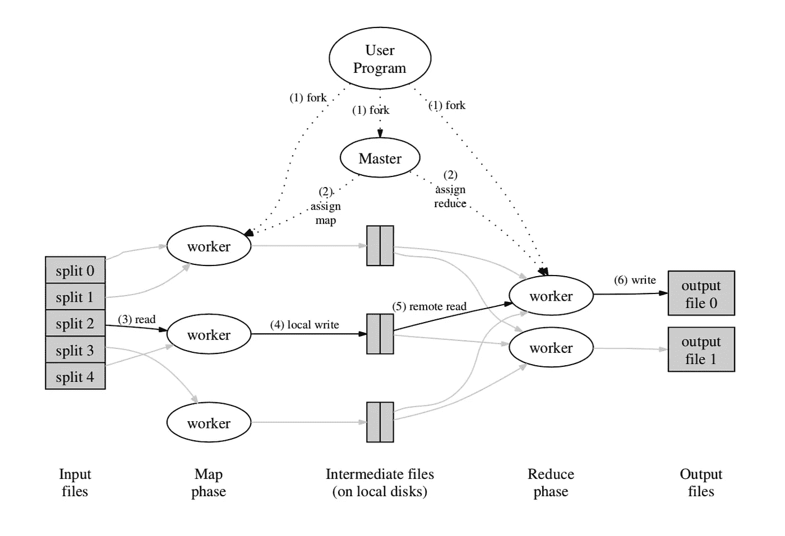

# 了解 MapReduce

> 原文：<https://betterprogramming.pub/understanding-mapreduce-303c02fcbd9>

## 了解这个编程模型和框架的所有信息


安德鲁·舒尔茨在 [Unsplash](https://unsplash.com/) 上拍摄的照片。

`MapReduce`是一种在集群上使用并行分布式算法处理大数据的计算模型。

它是由谷歌发明的，自 2004 年以来已在行业中大量使用。很多应用都是基于`MapReduce`的，比如分布式基于模式的搜索、分布式排序、web 索引系统等。

`MapReduce`的灵感来自于函数式编程中常用的`map`和`reduce`函数。`Map`和`Reduce`不是新的编程术语。它们是来自 1956 年发明的 Lisp 的操作符。

让我们从编程语言中的这些操作符开始，然后继续讨论分布式计算中的`MapReduce`。

# 在 Python 中映射和减少

这里有一条有趣的推文，展示了这些术语的含义:


## 地图

在函数式编程中，`Map`将另一个函数应用于一个列表，将每个元素转换为另一个值，然后最终返回一个新的列表。我们可以对任何序列类型的数据结构使用`map`，比如一个数组。

假设我们想将列表中的每个元素乘以 2。这可以用 Python 来完成:

在使用输入运行它之后，我们将得到另一个列表:

```
lst = [1,2,3,4,5,6,7,8]
print num2(lst)=> [2, 4, 6, 8, 10, 12, 14, 16]
```

Python 有针对这类任务的内置函数`map`:

```
def num2(x):
  return x * 2print map(num2, lst)
=> [2, 4, 6, 8, 10, 12, 14, 16]
```

## 减少

类似地，`reduce`对列表中的每两个元素应用一个函数，但是它返回一个聚合结果。在某些编程语言中被称为`fold`。

```
lst = [1,2,3,4,5,6,7,8]
def sum2(x, y):
    return x + yprint reduce(sum2, lst, 0)
=> 36
```

我们可以像这样从头实现它:

```
def reduce(function, sequence, initial=None):
    result = initial
    for x in sequence:
        result = function(result,x)
    return result
```

# 编程模型:MapReduce

当然，`MapReduce`比上面两个函数要复杂得多，尽管它们有一些相同的核心思想。

`MapReduce`是一个编程模型和框架，用于在分布式服务器中处理大数据集，并行运行各种任务。

这是一项为解决大数据问题而发明的技术。如今，数据量如此之大，我们无法在一台服务器上解决它。

`MapReduce`的整体思想是一种分割-应用-组合策略。我们将大数据集分成多个部分，在多个服务器上并行处理，然后将结果与服务器的所有输出相结合。

我们打个比方。我们有很多配料。经过切碎和重组的程序后，我们做了很多三明治:



图 2 来自 [Ryan Eberhardt](https://reberhardt.com/cs110) 。

通常，`MapReduce`的用户会实现`map`和`reduce`功能，框架会在大型机器集群上调用它们。

在实际操作中，除了`map`和`reduce`之外，整个程序中还有其他一些加工阶段，包括`split`、`combine`、`shuffle`、`sort`等。

假设我们想从一大段内容中统计每个单词的数量。我们将文件拆分成三个子文件，在每个服务器中完成字数统计任务，将单词作为混排的键，最后将来自同一个键的结果组合起来。



图 3 来自[梦幻快门](https://dreamshutter.tistory.com/24)。

该框架还将支持冗余和容错，因为错误可能发生在任何服务器上。在 Google 最初的实现中，他们使用主-工人模式的架构。主节点将作业分配给工人并维护他们的状态。

主服务器会定期 pings 每个工人。如果在一定时间内没有收到来自工作器的响应，则主设备将该工作器标记为失败。然后，它会为另一个健康的工人重新安排工作。



图 4 来自 [MapReduce 2004 论文:大型集群上的简化数据处理](https://pdos.csail.mit.edu/6.824/papers/mapreduce.pdf)。

# 最后的想法

近年来，谷歌已经转向其他一些提供流数据操作而不是批处理的技术，但仍有 Hadoop 等现有软件使用`MapReduce`计算模型。

`MapReduce`的主要贡献是一个简单而强大的接口，支持自动并行化和大规模计算的分布。

拆分-应用-组合是分布式计算世界中的一个通用策略，而`MapReduce`是一个很好的例子，它证实了以下概念:技术来来去去，但原则往往保持不变。

# 参考

*   [纸张:MapReduce](https://pdos.csail.mit.edu/6.824/papers/mapreduce.pdf)
*   [MapReduce 的维基百科](https://en.wikipedia.org/wiki/MapReduce)
*   [MapReduce:构建搜索引擎索引](https://reberhardt.com/cs110/summer-2018/lecture-notes/lecture-14/)