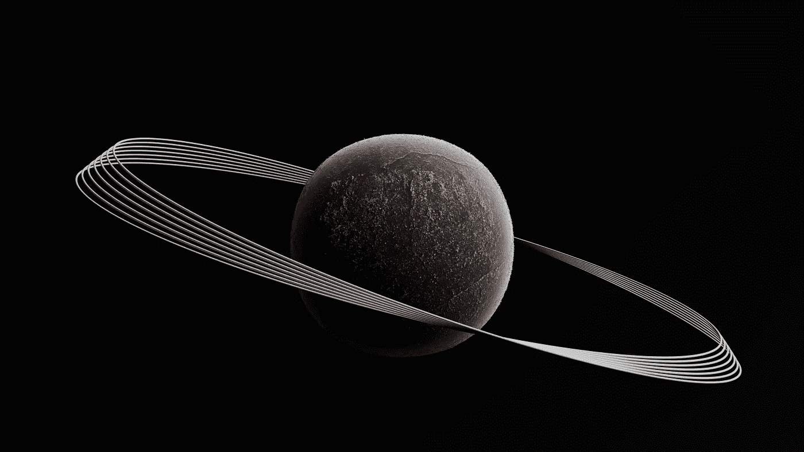
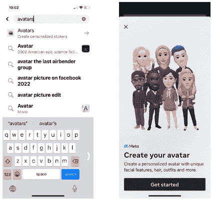
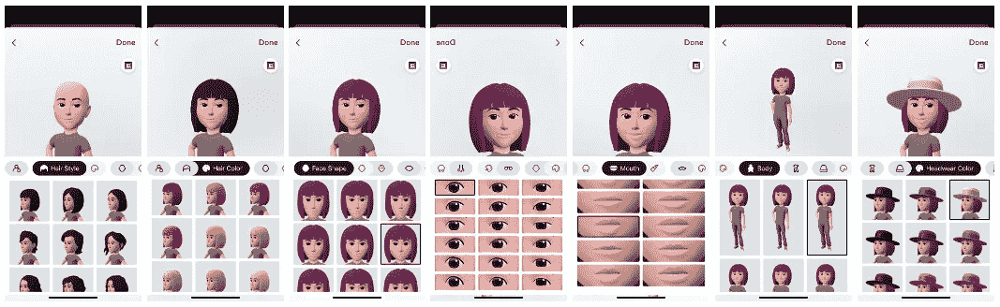
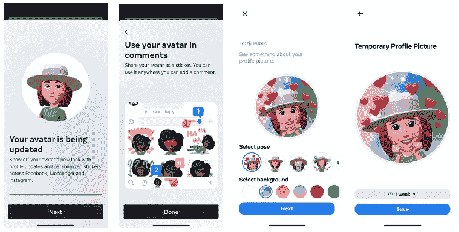

# 从开发者的角度理解元宇宙

> 原文：<https://betterprogramming.pub/understanding-metaverse-from-a-developers-perspective-be55d8235345>

## 元宇宙的三个基本要素:扩展现实、虚拟形象和数字所有权

图为[舒巴姆·达吉](https://unsplash.com/@theshubhamdhage?utm_source=unsplash&utm_medium=referral&utm_content=creditCopyText)在 [Unsplash](https://unsplash.com/@theshubhamdhage?utm_source=unsplash&utm_medium=referral&utm_content=creditCopyText)

Meta 的意思是“超越”，verse 指的是“宇宙”。元宇宙这个词是尼尔·斯蒂芬森在 1992 年的科幻小说《冰雪奇缘》中创造的。这本书编织了虚拟现实，苏美尔神话，以及介于两者之间的一切，带来了一个信息时代的超级惊悚片。

脸书公司于 2021 年 10 月 28 日更名为 Meta 平台公司。脸书、WhatsApp 和 Instagram 保留了它们的名字，但生产和维护它们的公司后来被称为 Meta。

# 什么是元宇宙？

Meta 公司将元宇宙定义为 3D 空间，让每个人都能以超乎想象的方式社交、学习、合作和玩耍。事实上，元宇宙是一个超越单个公司的集体项目。它是由全世界的人创造和分享的，对所有人开放。

由于元宇宙仍处于早期阶段，许多定义仍在发展中。然而，元宇宙有三个基本要素:

*   扩展现实
*   神使
*   数字所有权

让我们来看看这些元素。

# 扩展现实

扩展现实(XR)是一个总括术语，涵盖了增强现实(AR)、虚拟现实(VR)、混合现实(MR)以及二者之间的一切。以下是 AR、VR 和 MR 的定义:

*   AR:它覆盖了真实环境中的数字内容。
*   虚拟现实:它用计算机化的空间代替了真实的环境。
*   MR:它融合了 AR 和 VR 的元素。

[WebXR 设备 API](https://www.w3.org/TR/webxr/) 是在 Web 上访问 VR 和 AR 设备的规范，包括传感器和头戴显示器。它涵盖了以下示例，但不限于:

*   头戴式显示器，无论它们是不透明的、透明的还是利用视频穿透
*   具有位置跟踪功能的移动设备
*   具有头部跟踪功能的固定显示器

一个`3DoF`装置，是“三自由度”的缩写，是一个可以跟踪旋转运动的装置。一个`6DoF`设备，是“六自由度”的缩写，是一个可以跟踪旋转和平移的设备，可以在空间中实现精确的 1:1 跟踪。

一个`Navigator`代表用户代理(UA)的身份和状态。它还充当具有各种属性和 API 的通用全局。

属性的 get 方法(上面代码中的第 2 行)必须返回一个与之关联的对象。

查询`navigator.xr.isSessionSupported()`(上面代码中的第 3 行)以确定硬件和 UA 是否支持所需类型的 XR 内容。如果支持，说明 XR 内容准备好了。当用户单击页面上的按钮时，窗口被激活。在用户激活事件中，调用`navigator.xr.requestSession()`(第 4 行)来检索一个`XRSession`，它可以用来轮询用户的姿势和查询用户环境的信息。活动会话在 XR 设备上向用户呈现影像。会话继续运行，直到被 UA 关闭或用户退出 XR 内容。

下面是`XRSession`的定义:

# 神使

Meta 的创始人兼首席执行官马克·扎克伯格(Mark Zuckerberg)说，“元宇宙的定义品质是在场，这是一种你真的和另一个人在一起或在另一个地方的感觉。”

为了这种感觉，元宇宙需要化身。*化身*一词，来源于印度教的梵语，意为“血统”。它象征着一个神在地球上的物质外观或化身。头像是用户的在线表示。它作为一个人的数字身份。它可以是 2D 或三维，静态或动画。

脸书手机应用程序是创建头像的方法之一。打开应用，搜索“头像”这个词。单击菜单项创建一个头像。

作者图片

在`Get started`之后，创建一个具有特定`skin tone`、`hairstyle`、`hair color`、`face shape`、`face markings`、`face lines`、`eye shape`、`eye color`、`eye makeup`、`eyebrows`、`eyebrow color`、`bindi`、`eyewear`、`eyewear color`、`nose`、`nose piercings`、`mouth`、`lip color`、`facial hair`、`facial hair color`、`body`、`outfit`、`headwear`、`headwear color`、`ear piercings`的头像

作者图片

我们创造一个虚拟形象，它可以作为一种身份、表达和体验。在《元宇宙》中,《阿凡达》看起来很真实，动作也很动画，并且在整个宇宙中呈现。

作者图片

有许多头像提供商提供更高级的头像。

*   就绪玩家我(Ready Player Me)——这是一个元宇宙的跨游戏头像平台。一个化身，多个世界去探索。
*   [VR oid Hub](https://hub.vroid.com/en/)——是一个上传人形 VRM 头像的平台，其中 VRM 是为现代 VR 景观中的 3D 角色和头像设计的文件格式。
*   [mix amo](https://www.mixamo.com/)—是 Adobe 提供的一个工具，用于装配角色并制作动画。
*   [Cryptoavatars](https://cryptoavatars.io/)——这是一个允许头像创作者铸造单版头像的平台。在以太坊区块链上，每个头像都被标记为一个独特的不可替换的标记(NFT)。

# 数字所有权

元宇宙是一个虚拟空间，我们在这里社交、玩耍、工作、学习和购物，就像在现实生活中一样。在元宇宙，我们也拥有虚拟资产的所有权。Web3 是基于区块链技术的万维网的新版本，它融合了诸如去中心化和基于令牌的经济学等概念。加密货币和 NFT 使得在我们可以买卖任何虚拟资产的虚拟空间内建立一个完全运作的经济成为可能。

区块链技术可以在没有任何中介的情况下实现数字资产的点对点转移，元宇宙也从自治的金融系统中受益。分散自治组织(Dao)是管理决策和事务的各方。截至今天，近 200 个 Dao 监管加密货币市场，这消除了与操纵个人数字资产有关的担忧。算法或智能契约定义了与 DAO 相关联的不同方之间的参与和合作规则。

区块链是元宇宙的关键技术，在这个去中心化的世界里有信任、安全和互操作性。

# 结论

元宇宙是互联网的革命。尽管许多定义仍在发展，但元宇宙有三个基本要素:扩展现实、虚拟形象和数字所有权。

元宇宙可能看起来很乌托邦，很天真。信不信由你，元宇宙的一部分将在明天成为现实。

感谢阅读。我希望这有所帮助。如果你有兴趣，可以看看[我的其他媒体文章](https://jenniferfubook.medium.com/jennifer-fus-web-development-publications-1a887e4454af)。