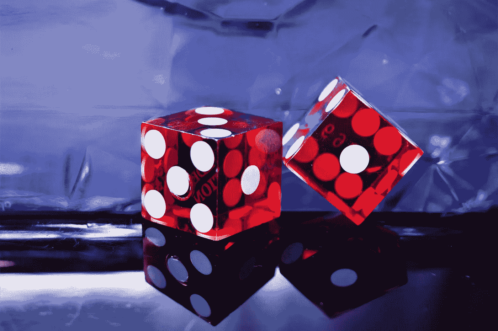
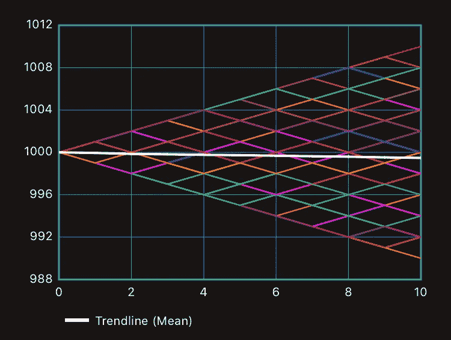
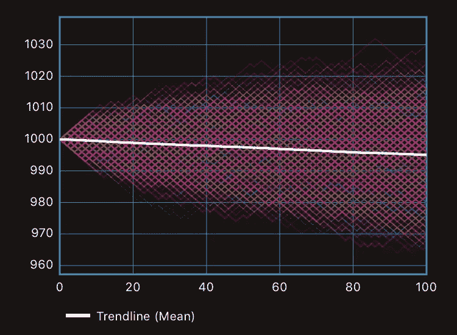
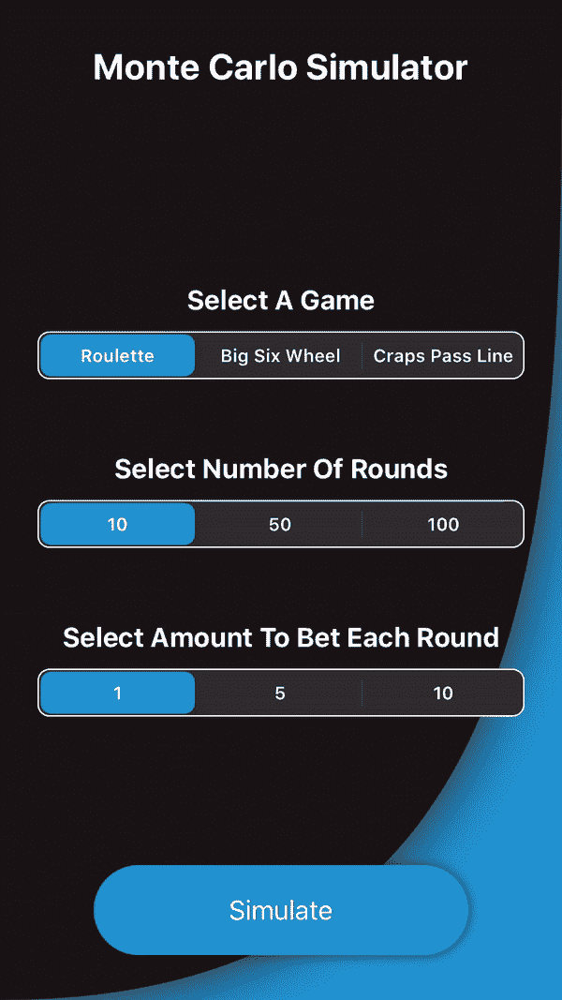

# 使用 Swift 了解蒙特卡罗方法

> 原文：<https://betterprogramming.pub/understanding-monte-carlo-methods-using-swift-82e0734b6e89>

## 我们如何使用蒙特卡罗模拟来评估风险和回报？

乔纳森·彼得森在 [Unsplash](https://unsplash.com/s/photos/casino?utm_source=unsplash&utm_medium=referral&utm_content=creditCopyText) 上拍摄的照片

有些问题是不可能知道确切答案的。它们涉及随机变量，不能保证每次都有相同的值，这破坏了我们确定地得出结论的机会。当我们发现自己处于这种情况时，我们求助于概率理论。这篇文章介绍了蒙特卡罗方法，它可以让我们了解一个特定结果的可能性有多大。

**用于执行模拟的代码是 Github** **上可用的** [**。**](https://github.com/JimmyMAndersson/MonteCarloAnalysis)

# 什么是蒙特卡罗方法？

> 蒙特卡罗方法或蒙特卡罗实验是一种广泛的计算算法，它依靠重复随机采样来获得数值结果。

上面摘自维基百科的摘录[目前可能无法澄清任何事情。然而，当我们浏览这个过程并查看一些示例时，您会发现它开始变得有意义了。](https://en.wikipedia.org/wiki/Monte_Carlo_method)

赌场是一个完美的候选人，通过设置一些实验来探索这些方法。赌场都是关于机会的游戏，所以让我们看看是否有任何方法来预测我们赢的机会。

# 设置实验

让我们假设你在轮盘赌游戏中押 1 美元在黑色、红色、奇数或偶数上。这些条件给我们 1:1 的支付，这意味着你要么赢，要么每轮输 1 美元。他们也给了我们 38 分之 18 的获胜机会，因为 18 个口袋要么是黑色，红色，奇数或偶数。让我们也将研究的范围限制在十个赌注的序列上。

在这种情况下，一个赌徒可能会幸运地赢得 10 美元。如果所有回合都输了，他们也可能输掉 10 美元。因此，如果我们只研究一个赌徒，我们可能会得出这样的结论:有 100%的机会赢。常识告诉我们，情况并非如此，因为我们可能会同时遭遇胜利和失败。让我们看看能否通过观察两个赌徒获得更多信息:

十次轮盘赌上的两次单独现金滚动的开发。

这个图表显示了两个个体赌徒的现金余额和他们在十轮轮盘赌中的发展。他们每个人的口袋里都有 1000 美元，我们用 X 轴上的 0 表示。在十次下注后，我们可以看到它们彼此偏离，它们的价值分别是 996 美元和 1002 美元。

计算每个人在游戏结束时的平均金额，我们可以得到平均金额为 999 美元。

这种方法看起来很有前途。如果我们看十个赌徒呢？还是 1000？我们做 5000 个玩家吧。让我们也画一条白线代表他们的平均资金，这样我们就可以发现任何趋势。

10 次轮盘赌赌注的 5，000 现金滚动的发展，以及趋势线。

由于组合空间限于 1024 条路径，上图中的一些线条会重叠。我们感兴趣的是趋势线，它代表了赌徒目前拥有的所有钱的平均值。斜率为负，意味着如果有足够多的人选择下十注，赌场肯定会赚钱。

到目前为止，我们只研究了每个赌徒十次下注。让我们看看 2000 名玩家，下注 100 次:

10 次轮盘赌赌注的 2，000 现金滚动的发展，以及趋势线。

这个模拟中的趋势线与上一个相似。我们可以得出结论，轮盘赌不是赌场的机会游戏！[大数法则](https://en.wikipedia.org/wiki/Law_of_large_numbers)保证了他们从长远来看总能赚钱。

# 模拟其他游戏

我们已经确定，蒙特卡罗方法是在非确定性环境中发现趋势的一种不错的方式。现在，让我们看看你如何在上面 [Github repo](https://github.com/JimmyMAndersson/MonteCarloAnalysis) 中的模拟器的帮助下模拟其他游戏。

模拟器中使用的游戏协议声明。

模拟器中使用的 GameRoundOutcome 枚举。

看一下上面的代码。是什么让模拟器发挥它的魔力。通过实现这些属性和方法，您可以将任何您喜欢的游戏插入模拟器并进行测试。

属性用于向用户显示游戏的名称。`playRound(bet:)`方法是你游戏的所有逻辑所在。需要一个`Double`类型的参数来知道玩家下注的金额。用这个来计算每一轮的奖金。

`GameRoundOutcome`枚举指定玩家是赢了、输了还是平了。`.win`和`.loss`获取一个关联的`Double`类型的值，模拟器使用该值计算出玩家的资金余额应该增加或减少多少。我们来看看轮盘游戏是如何实现的，仅供参考:

一个轮盘游戏的实现。

`gameName`属性非常简单，它只返回一个名称字符串。`playRound(bet:)`方法生成一个在[1，38]范围内的随机整数。这意味着我们有 38 分之 18 的机会找到一个小于或等于 18 的数字。如果我们这样做了，我们返回一个`.win`结果，并把金额加到玩家的余额中。如果随机数大于 18，我们返回一个`.loss`结果，并传递要从余额中扣除的金额。

一旦你实现了游戏，你把它添加到`Simulator.swift`文件的`_games`集合中，你就可以开始了。玩得开心！

快速浏览模拟器用户界面。