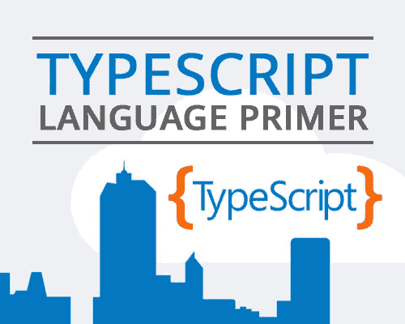
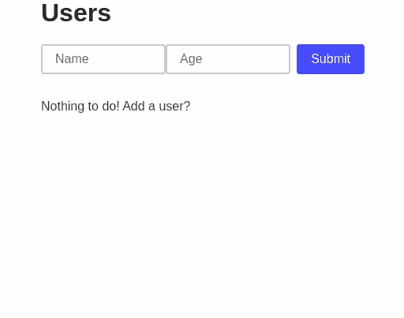
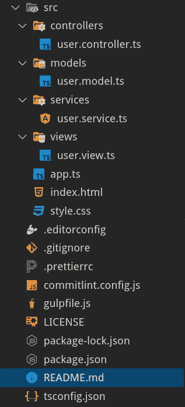

# 了解 MVC 前端服务:TypeScript

> 原文：<https://betterprogramming.pub/understanding-mvc-services-for-front-end-typescript-5606f9f1ad92>

## 一步一步的打字教程

# 介绍

这篇文章是理解 MVC 架构如何创建前端应用程序的三篇文章中的第二篇。

目标是通过将 JavaScript 用作脚本语言的网页发展成 JavaScript/TypeScript 用作面向对象语言的应用程序来理解构建前端应用程序的方法。

在第二篇文章中，将使用第一个版本中的 TypeScript 构建应用程序。因此，本文是应用程序将从 VanillaJS 迁移到 TypeScript 的地方。然而，理解应用程序的所有部分是如何关联的以及它是如何构造的是非常重要的。

最后，在最后一篇文章中，我们将转换我们的代码，使其与 Angular 框架相集成。

*   [第一部分。了解前端的 MVC 服务:VanillaJS](https://medium.com/better-programming/understanding-mvc-services-for-the-front-end-vanillajs-2268255b36e6)
*   [第二部分。了解前端 MVC 服务:TypeScript](https://medium.com/@ccaballero/understanding-mvc-services-for-frontend-typescript-5606f9f1ad92)
*   第三部分。了解前端的 MVC 服务:Angular

# 项目架构

没有什么比图像更有价值来理解我们将要建造的东西了。下面有一个 GIF 图，其中展示了我们正在构建的应用程序。

用户应用程序

这个应用程序可以使用单个 TypeScript 文件来构建，该文件修改文档的 DOM 并执行所有操作，但是这是一个强耦合的代码，不是我们在本文中打算应用的。

什么是 MVC 架构？MVC 是一个具有三层/三部分的架构:

*   **模型** —管理应用程序的数据。模型将会缺乏活力(它们将缺乏功能)，因为它们将会被提交给服务。
*   **视图** —模型的可视化表示
*   **控制器** —服务和视图之间的链接

下面，我们展示了问题域中的文件结构:

`index.html`文件将充当画布，整个应用程序将使用`root`元素在其上动态构建。此外，这个文件将作为所有文件的加载器，因为它们将在 HTML 文件本身中链接。

最后，我们的文件体系结构由以下类型脚本文件组成:

*   **user.model.ts** —用户的属性(模型)
*   **user.controller.ts** —负责加入服务和视图的人
*   **user.service.ts** —管理用户的所有操作
*   **user.views.ts** —负责刷新和改变显示屏

HTML 文件如下所示:

可以看到只链接了一个名为`bundle.js`的文件，这个文件将在 TypeScript transpilation 到 JavaScript 并应用最小化任务后生成。

我们不会关注构建我们的应用程序的工具，因为我们将展示负责执行我们项目的所有转换任务的`gulpfile`文件。

在这种情况下，我们决定使用 Gulp 工具，因为它有多年的经验，可以给出非常好的结果。如果你想深入了解 Gulp，我建议你在它的网站上寻找信息，因为你可以找到一长串插件。

在任何情况下，如果你懂 JavaScript，你将能够阅读代码，并且你将几乎完全理解我们执行的任务。在我们的例子中，我们使用了`browserify`插件来打包、创建模块系统，并执行从类型脚本到 JavaScript 的转换。

# 模型(贫血)

本例中第一个构建的类是应用程序模型`user.model.ts`，它由类属性和一个生成随机 id(这些 id 可能来自服务器中的数据库)的私有方法组成。

这些模型将具有以下字段:

*   `id`:独特价值
*   `name`:用户的姓名
*   `age`:用户的年龄
*   `complete` : Boolean，让你知道我们是否可以把用户从列表中划掉

已经使用 TypeScript 对`User`类进行了类型化。然而，`User`构造函数接收一个普通对象，该对象将由`LocalStorage`或通过表单输入的用户数据提供。该普通对象必须符合`UserDto`接口，这样任何普通对象都不能被实例化，但满足已定义接口的对象除外。

`user.model.ts`如下图所示:

# 服务

对用户执行的操作在服务中执行。服务允许模型贫血，因为所有的逻辑负载都在其中。

在这个特定的例子中，我们将使用一个数组来存储所有用户，并构建与读取、修改、创建和删除(CRUD)用户相关的四个方法。

您应该注意到服务利用了模型，实例化了从`LocalStorage`提取到`User`类的对象。这是因为`LocalStorage`只存储数据而不是存储数据的原型。从后端传输到前端的数据也是如此——它们没有实例化它们的类。

我们类的构造函数如下:

**注意:**我们已经定义了一个名为`users`的类变量，一旦用户从一个普通对象(`UserDto`)转换为一个`User`类的原型对象，这个变量就会存储所有用户。

我们必须在服务中定义的下一件事将是我们想要开发的每个操作。下面使用 TypeScript 显示了这些操作:

仍然需要定义负责存储在我们的数据存储中执行的操作的`commit`方法(在我们的例子中是`LocalStorage`)。

这个方法调用一个在创建 zervice 时绑定的`callback`函数，正如在`bindUserListChanged`方法的定义中可以看到的。我可以告诉你这个回调函数来自视图，负责刷新屏幕上的用户列表。

文件`user.service.ts`如下:

# 视图

视图是模型的可视化表示。我们决定动态地创建整个视图，而不是创建 HTML 内容并注入它(正如许多框架中所做的那样)。

首先要做的是通过 DOM 方法缓存视图的所有变量，如视图构造函数所示:

视图的下一个最相关的点是视图与服务方法的联合(将通过控制器发送)。例如，`bindAddUser`方法接收一个驱动函数作为参数，这个函数将执行服务中描述的`addUser`操作。

在`bindXXX`方法中，每个视图控件的`EventListener`被定义。请注意，从视图中，我们可以访问用户从屏幕上提供的所有数据，这些数据通过`handler`功能连接。

视图的其余代码处理文档的 DOM。文件`user.view.ts`如下:

# 控制器

这个架构的最后一个文件是控制器。控制器通过依赖注入(DI)接收它拥有的两个依赖项(服务和视图)。

这些依赖关系存储在控制器的私有变量中。此外，构造函数在视图和服务之间建立显式连接，因为控制器是唯一可以访问双方的元素。

文件`user.controller.ts`如下所示:

# 应用程序

我们应用程序的最后一点是应用程序启动器。在我们的例子中，我们称之为`app.ts`。

通过创建不同的元素来执行应用程序:`UserService`、`UserView`和`UserController`，如文件`app.ts`所示。

# 结论

在第二篇文章中，我们开发了一个 web 应用程序，在这个应用程序中，项目是按照 MVC 架构构建的，在这个架构中使用了贫血模型，逻辑的责任在于服务。

理解项目在不同责任的不同文件中的结构以及视图如何完全独立于模型/服务和控制器是非常重要的。

同样重要的是要注意，在这篇文章中，我们已经将应用程序从 JavaScript 迁移到 TypeScript，使我们能够获得一个类型化的代码，帮助开发人员最大限度地减少错误，并了解它的每个部分是做什么的。

在本系列的下一篇文章中，我们将把 TypeScript 代码迁移到 Angular。这种向框架的迁移将意味着我们不必处理使用 DOM 的复杂性和重复性。

本帖的 GitHub 分支位于[这里](https://github.com/Caballerog/TypeScript-MVC-Users)。