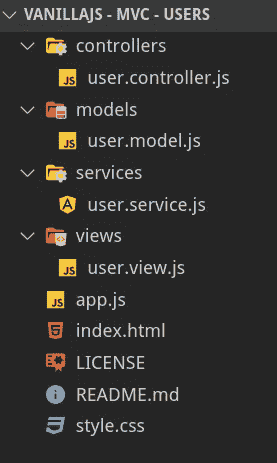

# 理解前端的 MVC 服务:VanillaJS

> 原文：<https://betterprogramming.pub/understanding-mvc-services-for-the-front-end-vanillajs-2268255b36e6>

## 一步一步的 JavaScript 教程

图片由 JComp / [Freepik](http://www.freepik.com) 设计

# 介绍

本文是了解 MVC 架构如何创建前端应用程序的三篇文章中的第一篇。本系列的目标是了解如何通过将 JavaScript 用作脚本语言的 web 页面发展成 JavaScript 用作面向对象语言的应用程序来构建前端应用程序。

在第一篇文章中，将使用 VanillaJS 构建应用程序。因此，本文是开发与 DOM 相关的最大量代码的地方。然而，理解应用程序的所有部分是如何关联的以及它是如何构造的是非常重要的。

在第二部分中，我们将通过将 JavaScript 代码转换成其 TypeScript 版本来强化它。

最后，在最后一部分，我们将转换我们的代码，使其与 Angular 框架相集成。

# 项目架构

没有什么比一个图像更有价值来理解我们将要建立什么。下面有一个 GIF，在这个 GIF 中，我们将要构建的应用程序被举例说明。

这个应用程序可以使用单个 JavaScript 文件来构建，该文件修改文档的 DOM 并执行所有操作，但是这是一个强耦合的代码，不是我们打算在本文中应用的。

什么是 MVC 架构？MVC 是一个具有三层/三部分的架构:

*   **模型** —管理应用程序的数据。模型将会缺乏活力(它们将缺乏功能)，因为它们将会被提交给服务。
*   **视图** —模型的可视化表示
*   **控制器** —服务和视图之间的链接

下面，我们展示了问题域中的文件结构:

`index.html`文件将充当画布，整个应用程序将使用`root`元素在其上动态构建。此外，这个文件将作为所有文件的加载器，因为它们将在 html 文件本身中链接。

最后，我们的文件架构由以下 JavaScript 文件组成:

*   **user.model.js** —用户的属性(模型)
*   **user.controller.js** —负责加入服务和视图的人
*   **user.service.js** —管理用户的所有操作
*   **user.views.js** —负责刷新和改变显示屏

HTML 文件如下所示:

# 模型(贫血)

本例中构建的第一个类是应用程序模型`user.model.js`，它由类属性和一个生成随机 id(这些 id 可能来自服务器上的数据库)的私有方法组成。

这些模型将具有以下字段:

*   **id** —唯一值
*   **姓名** —用户的姓名
*   **年龄** —用户的年龄
*   **完成** —布尔值，让您知道我们是否可以将用户从列表中划掉

`user.model.js`如下图所示:

对用户执行的操作在服务中执行。因为所有的逻辑负载都在模型中，所以服务允许模型贫血。在这个特定的例子中，我们将使用一个数组来存储所有用户，并构建与读取、修改、创建和删除(CRUD)用户相关的四个方法。您应该注意到服务利用了模型，实例化了从`LocalStorage`提取到`User class`的对象。这是因为`LocalStorage`只存储数据而不是存储数据的原型。从后端传输到前端的数据也会发生同样的情况:它们没有实例化它们的类。

我们类的构造函数如下:

请注意，我们已经定义了一个名为`users`的类变量，一旦用户从平面对象转换为`User`类的原型对象，该变量就会存储所有用户。

我们必须在服务中定义的下一件事将是我们想要开发的每个操作。下面使用 ECMAScript 显示了这些操作，没有使用 TypeScript 中的任何一行:

仍然需要定义负责存储在我们的数据存储中执行的操作的`commit`方法(在我们的例子中是`LocalStorage`)。

这个方法调用一个在创建服务时已经绑定的`callback`函数，这可以在`bindUserListChanged`方法的定义中看到。我已经可以告诉你，这个回调是来自视图的函数，负责刷新屏幕上的用户列表。

文件`user.service.js`如下:

视图是模型的可视化表示。我们决定动态地创建整个视图，而不是创建 HTML 内容并注入它(许多框架都是这样做的)。首先要做的是通过 DOM 方法缓存视图的所有变量，如视图构造函数所示:

视图的下一个最相关的点是视图与服务方法的联合(将通过控制器发送)。例如，`bindAddUser`方法接收一个驱动函数作为参数，它将执行服务中描述的`addUser`操作。在`bindXXX`方法中，每个视图控件的`EventListener`被定义。注意，从视图中我们可以访问用户从屏幕上提供的所有数据，屏幕通过`handler`功能连接。

视图的其余代码处理文档的 DOM。文件`user.view.js`如下:

这个架构的最后一个文件是控制器。控制器通过依赖注入(DI)接收它拥有的两个依赖项(服务和视图)。这些依赖关系存储在控制器的私有变量中。此外，构造函数在视图和服务之间建立显式连接，因为控制器是唯一可以访问双方的元素。

文件`user.controller.js`如下所示:

我们应用程序的最后一点是应用程序启动器。在我们的例子中，我们称之为`app.js`。通过创建不同的元素来执行应用程序:`UserService`、`UserView`和`UserController`，如文件`app.js`所示。

# 结论

在第一篇文章中，我们开发了一个 web 应用程序，其中的项目是按照 MVC 架构构建的，使用了贫血的模型，逻辑的责任在于服务。

非常重要的是要强调，这一部分的学习目标是理解项目在不同责任的不同文件中的结构，以及视图如何完全独立于模型/服务和控制器。

在接下来的文章中，我们将使用 TypeScript 来增强 JavaScript，这将为我们提供一种更强大的语言来开发 web 应用程序。我们使用 JavaScript 的事实导致我们为 DOM 的管理编写了大量冗长且重复的代码(使用 Angular 框架可以最大限度地减少这种情况)。

这个岗位的 GitHub 分支是[https://github.com/Caballerog/VanillaJS-MVC-Users](https://github.com/Caballerog/VanillaJS-MVC-Users)。