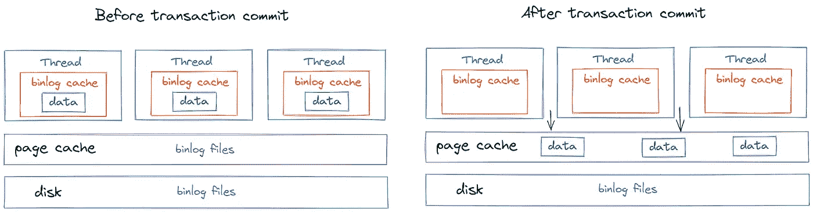
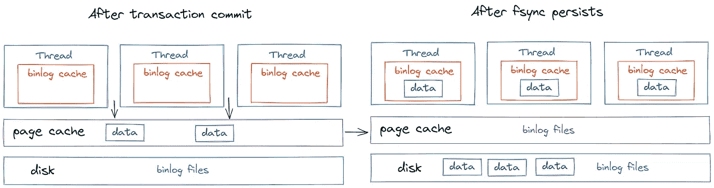

# 理解 MySQL 的“Binlog”

> 原文：<https://betterprogramming.pub/understanding-mysqls-binlog-4ac8de4d20ee>

## Binlog 的机制


萨曼塔·加迪斯在 [Unsplash](https://unsplash.com?utm_source=medium&utm_medium=referral) 上拍摄的照片

本文深入讲解了 MySQL 中重要日志`binlog`的写入机制和影响 IO 性能的关键配置，并介绍了如何使用`binlog`恢复数据。

# 如何写 Binlog？

`binlog`的写作逻辑并不复杂。在事务执行期间，日志首先被写入`binlog`缓存，当事务被提交时，`binlog`缓存被写入`binlog`文件。


图片来源:作者

## ***Binlog 缓存***

`binlog cache`在事务执行期间临时存储`binlog`数据，而`binlog cache`在每个线程内是空间独立的。

如果启用了`binlog`日志记录，MySQL 会为每个客户端分配一个二进制日志缓存。

如果您经常使用大型事务，可以增加缓存大小以获得更好的性能。其大小可以通过`binlog_cache_size`配置，默认为`32768 bytes`。

该参数的主要作用是控制单线程中`binlog`缓存占用的内存大小。

如果`binlog cache`空间足够，当提交事务时，缓存中的内容将被清空，数据将被写入`binlog`文件。

因为`binlog`内容需要在事务提交的时候一次性写入，所以不管有多大，当 bin 日志缓存放不下的时候，需要临时存储在磁盘上，然后提交写入`binlog`文件。



图片来源:作者

上述文字`binlog`实际上分为两部分:

*   写入:首先，它将被写入页面缓存中的`binlog`文件，页面缓存是一块不占用磁盘 IOPS 的内存。
*   Fsync:那么 bin 日志实际上是在操作系统执行`fsync`的时候从页面缓存持久化到磁盘；它占据了 IOPS 磁盘。



图片来源:作者

## ***什么时候到***`***write***`*`***fsync***`***？****

*`write`和`fsync`的定时由参数`sync_binlog`控制:*

*`sync_binlog=0`:表示每个提交事务只写不执行`fsync`，即`binlog`不持久(不推荐)。*

*`sync_binlog=1`:表示每次提交事务时都会发生`fsync`。*

*`sync_binlog=N`:表示每个事务都将写入，但`N`事务提交将执行`fsync`以获得持久性。*

*一般来说，为了增加 IOPS，该参数设置为 100–1000。缺点是如果机器在执行`fsync`之前崩溃，最多会丢失最近`N`事务的`binlog`日志。为了数据安全，设置为`1`。*

*官方文档对其描述如下:*

> **"默认情况下，二进制日志在每次写入时同步到磁盘(* `[*sync_binlog=1*](https://dev.mysql.com/doc/refman/8.0/en/replication-options-binary-log.html#sysvar_sync_binlog)` *)。如果* `[*sync_binlog*](https://dev.mysql.com/doc/refman/8.0/en/replication-options-binary-log.html#sysvar_sync_binlog)` *未启用，并且操作系统或机器(不仅仅是 MySQL 服务器)崩溃，二进制日志的最后语句有可能丢失。**
> 
> **为了防止这种情况，在每次* `*N*` *提交组后，启用* `[*sync_binlog*](https://dev.mysql.com/doc/refman/8.0/en/replication-options-binary-log.html#sysvar_sync_binlog)` *系统变量将二进制日志同步到磁盘。参见* [*章节 5.1.8，“服务器系统变量”*](https://dev.mysql.com/doc/refman/8.0/en/server-system-variables.html) *。* `[*sync_binlog*](https://dev.mysql.com/doc/refman/8.0/en/replication-options-binary-log.html#sysvar_sync_binlog)` *最安全的值是 1(默认值)，但这也是最慢的。”**

## **`***binlog***`***内容缺失怎么办？*****

**我们已经知道可以通过`redo log`恢复数据，但是如果`binlog`内容丢失了怎么办？**

**根据`sync_binlog`参数的描述，如果设置为大于 1，则意味着`N`事务将持久保存在磁盘的日志中。**

**同时，`redo log`的`innodb_flush_log_at_trx_commit`参数被设置为`1`，这意味着对于每一个提交的事务都将执行`fsync`。**

**这就造成了一种可能，如果 MySQL 服务器崩溃了，此时`redo log`已经持久化，但是`binlog`和事务仍然存储在页面缓存中，没有时间执行`fsync`。**

**停机后重启服务，依靠`redo log`恢复数据，`binlog`长度会比实际需要的数据要短。**

**面对数据完整却缺失的`binlog`，这种情况下会发生什么？起初，我很困惑。终于在 MySQL 5.7 的官方文档中找到了答案。**

**官方文档对其描述如下:**

> ***“如果 MySQL 服务器在崩溃恢复时发现二进制日志比预期的要短，那么它至少缺少一个成功提交的* `*InnoDB*` *事务。如果* `*sync_binlog=1*` *和磁盘/文件系统在被请求时进行了实际的同步(有些没有)，这种情况就不会发生，所以服务器会打印一条错误消息* `*The binary log **` *文件名* `** is shorter than its expected size*` *。***
> 
> ***在这种情况下，此二进制日志不正确，应该从源数据的新快照重新开始复制。”***

**根据官方描述，如果`sync_binlog`设置为`1`，就不会出现这种情况。如果`binlog`比预期的少，服务器上会打印出`binlog`日志的异常日志:**

```
**The binary log xxx is shorter than its expected size.**
```

**因此，这种情况需要人工干预，并从最新的快照数据源进行重新复制。**

## *****如何使用 Bin Log 恢复历史数据？*****

**`binlog`会记录所有的逻辑操作，以“追加写入”的形式，不会像`redo log`一样覆盖日志文件。**

**`binlog`中的数据是可靠的，必须是事务提交后的数据，这是由重做日志两阶段提交保证的。**

**众所周知，我们可以通过`bin log`恢复任意时间点的数据，如何做到呢？**

**其实这是前提条件。我们必须有一个定期备份全部数据的机制，比如半个月，每周，或者每天。**

**假设场景:比如今天中午误删了表数据，需要检索数据。我该怎么办？**

*   **首先，找到最近的完整备份，比如昨天凌晨 1:00，然后将该备份恢复到临时数据库。**
*   **然后，从昨天上午`1:00`的备份时间开始，依次取出备份`binlog`并重放，直到今天中午`12:00`的数据。**

**这样，临时数据库就达到了数据被意外删除之前的状态，然后就可以根据需要将表数据从临时数据库中取出，恢复到联机正式数据库中。**

***感谢您阅读这篇文章。***