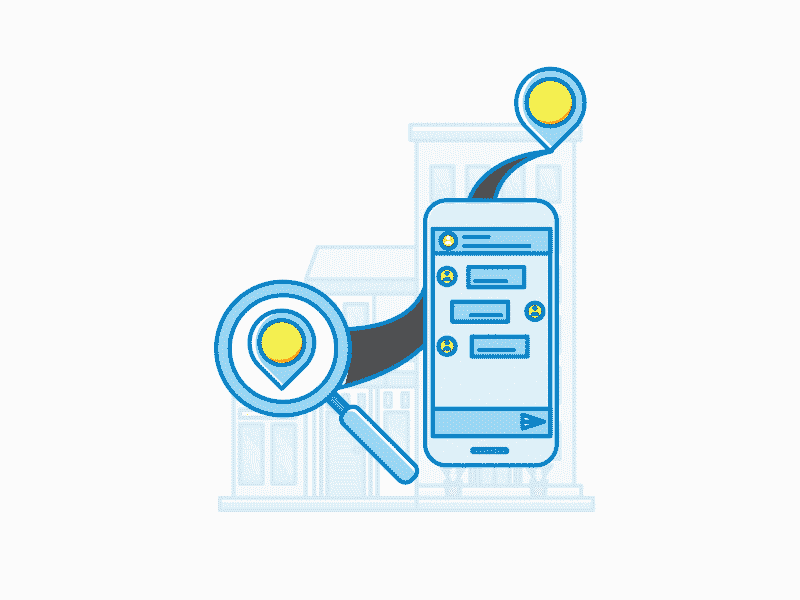
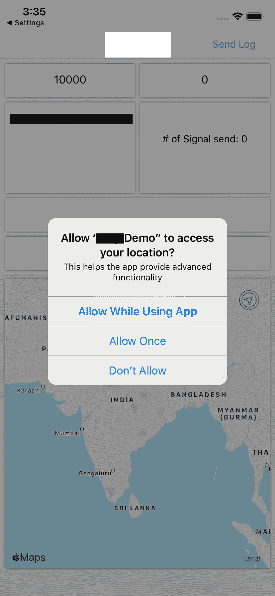
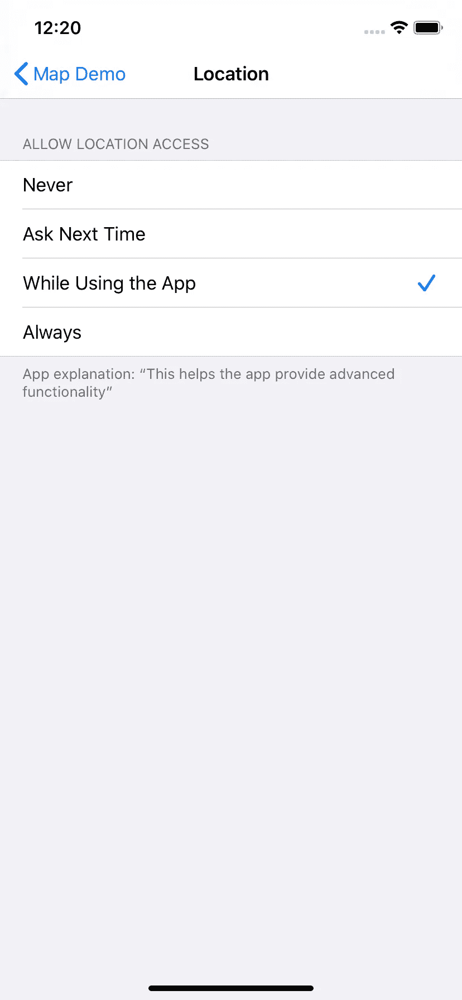
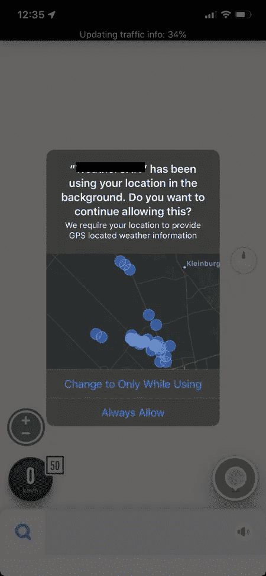
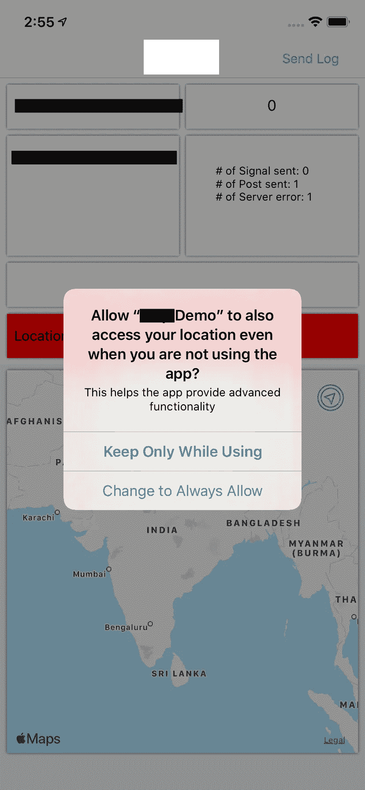

# 了解 iOS 13 中新的位置权限更改

> 原文：<https://betterprogramming.pub/understanding-new-location-permission-changes-in-ios-13-6c34dc5f54da>

## 这些变化为最终用户提供了更多的透明度和控制力

iOS 13 在开发者如何使用用户位置方面引入了许多变化。它引入了四个主要变化:1 .“允许一次”选项，2。更改后台权限提示，3。改善了背景位置的透明度；4 .一个改变的“总是允许”选项。

你可以在这个 WWDC 视频中了解更多关于这些变化的信息。

# 1."允许一次"

iOS 13 之前有两个位置权限:`When In Use`(前台)和`Always`(后台)。iOS 13 引入了第三个选项:`Allow Once`。“允许一次”选项被视为临时授权，应用程序下次打开时会再次提示。该选项允许用户为单个会话授予`When In Use`:

会话结束后，您必须再次请求`When In Use`。如果之前授权了`When In Use`或`Always`的用户升级到 iOS 13，他们在升级后将被授予该授权状态。当您通过`CLLocationManager`请求位置许可时，用户将看到这个弹出窗口，有三个选项:

1.  与应用程序共享位置一次，然后再次询问
2.  当应用程序正在使用时，与应用程序共享位置
3.  根本不要与应用程序共享位置

如果用户点击选项 1:“允许一次”，你的应用程序将被通知`CLAuthorizationStatus`更改为`authorizedWhenInUse`。就像你习惯在旧的 iOS 版本中获得永久许可一样。现在允许您的应用程序开始请求位置，无需更改代码。

用户可以跳出并回到他们的应用程序，而你仍然有定位权限。只有在一段(更长的)不活动时间后，iOS 才会撤销许可，并将`CLAuthorizationStatus`变回`notDetermined`。当应用程序回到前台时，您的`CLLocationManagerDelegate`将收到位置权限更改的通知，因此用户界面可以相应地更新。

这使得新的“允许一次”功能对用户来说是一个很好的隐私改善。它还降低了用户尝试应用程序中的位置功能并在稍后决定是否授予其更永久权限的门槛。

# 2.对后台权限提示的更改

随着`Allow Once`的引入，用户必须授权`When In Use`之后才能提示`Always`。

如果您在用户授予`When In Use`之前请求`Always`，用户将只有机会授予`When In Use`或`Allow Once`。如果用户授予`When In Use`，iOS 将授予临时`Always`，然后稍后自动提示用户非临时`Always`:

获得在后台扫描位置的许可变得有点困难，但作为交换，你的用户将享受到更多关于你在 iOS 13 中收到的位置的透明度。第一个值得注意的变化是，即使当你调用`requestAlwaysAuthorization`时，用户也只能在权限对话框中获得‘刚才’和‘正在使用’选项。如果用户授予您“使用时”权限，并且您尝试在后台扫描位置，只有在这时才会向用户显示授予后台权限的对话框。

这不同于我们在旧的 iOS 版本中所习惯的，在旧的版本中，用户被允许在请求时直接给予“ **always** ”权限。在代码层面上，唯一的区别在于您获得许可的时间。如果您确保不将`allowsBackgroundLocationUpdates`的值基于您是否拥有后台权限，则第二个权限对话框将永远不会改变。

# 3.改进的背景位置透明度

如果用户授予`Always`授权，iOS 会在几天后显示提醒，让用户有机会更改设置。iOS 13 在这个提醒中增加了一个地图来提高透明度:

当你的应用程序在后台跟踪用户的位置一段时间后，iOS 会确保它仍然得到用户的同意。在新的 iOS 中，这个同意更新对话框将包括一个小报告，其中包含你的应用程序一直在跟踪的位置，如上图所示。这使得后台发生的事情对用户来说更加透明

# 4."总是允许"

用户不需要*手动干预来明确授予“总是允许”特权。按照设计，稍后会再次询问他们。因此，要求用户打开设置应用程序并强制授予“始终允许”权限是违反准则的。*

*   作为一名开发人员，在您的代码中，您应该像平常一样请求“总是允许”。
*   用户将看到没有“始终允许”选项的新提示。
*   如果他们授予“使用时允许”权限，你的应用将*实际上*被授予“总是允许”权限的*临时授权*。
*   开发人员现在应该简单地继续做他们需要许可的事情:例如，设置一些地理围栏，开始监控通知，等等。
*   如果开发者已经根据指南编写了他们的应用程序，当基于位置的事件被触发时，*用户将再次被提示。*这一次，他们可以选择授予“始终允许”权限，此时临时授权将变为永久授权。

# 结论

这些变化对最终用户来说是巨大的，给了他们更多的透明度和控制力。

但是，如果您想要访问位置数据，您必须向最终用户提供价值，并且您必须是透明的。

最佳位置权限提示是:

*   **透明**:该提示解释了将从最终用户处收集哪些数据以及如何使用这些数据，并提供了一个指向您的隐私政策的链接。
*   **有价值的**:提示解释了为什么用户应该授予位置权限，比如启用一个有价值的基于位置的特性。
*   **及时**:当用户参与时，如在入职时，当访问基于位置的功能时，或在交易后，显示提示。后台权限提示显示在前台权限提示之后，并且是前台权限提示的增量。

务必阅读并分享！！

感谢雷达研究人员的[细节洞察](https://radar.io/blog/understanding-new-location-permissions-in-android-q-and-ios-13)！