# 如何理解我们的设计师，在 iOS 上创建一个漂亮的 Hello World App

> 原文：<https://betterprogramming.pub/understanding-our-designers-and-creating-a-beautiful-helloworld-programmatically-on-ios-3e43dbb696e3>

## 设计团队给我们的实施指南

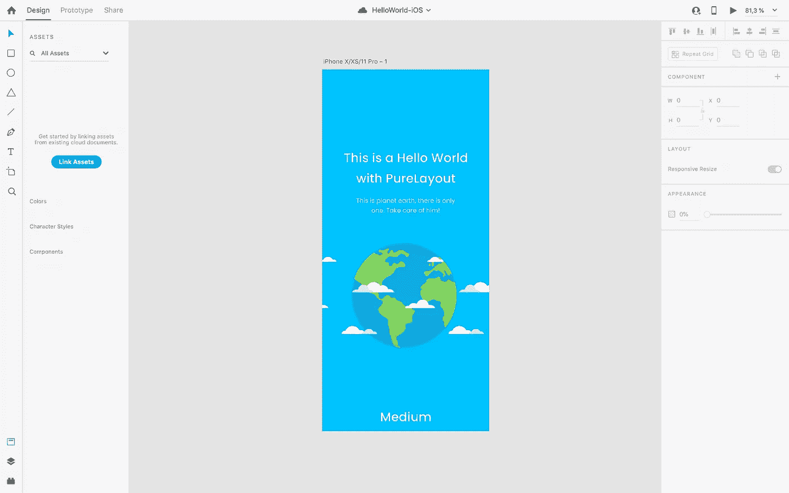

# 在没有故事板的情况下启动项目

你可以在[这篇文章](https://medium.com/@nievesjesus/creating-a-project-without-storyboard-in-2020-and-without-swifui-82080eb6d13b)中看到我们开始一个没有故事板的项目所需的初始配置。

# 安装约束管理器

首先，我们安装一个约束管理器，它翻译所有那些帮助对象在视图中定位的象形文字(如果你想知道约束是什么，你可以在这个网站上看到)。在这种情况下，让我们使用 [PureLayout](https://github.com/PureLayout/PureLayout) 。

你可以在这里看到如何安装库: [PureLayout](https://github.com/PureLayout/PureLayout) 。

安装完成后，我们进入下一步。

# 了解我们美丽的 Hello World 设计

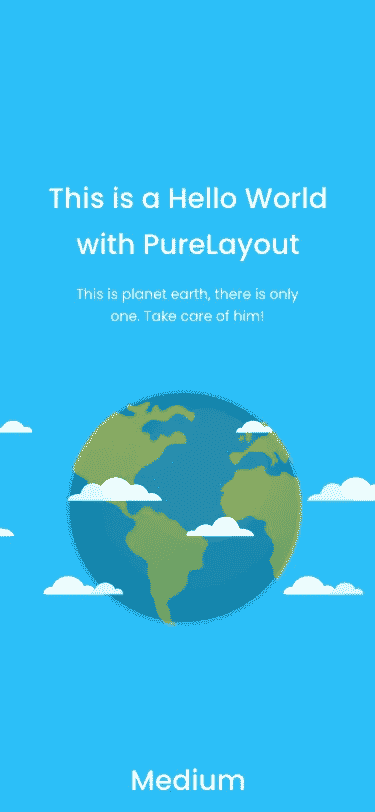

在对任何视图进行编程之前，第一步是理解它，吸收它的行为和元素，以便不必重写不必要的代码。

所以，首先，我们要理解我们的设计，然后创造出符合设计师(在我的例子中，就是我)要求的漂亮屏幕。

# 首先，哪些元素在我们的视野中？

*   标题:“这是一个纯布局的 Hello World。”
*   描述:“这是地球，只有一个。好好照顾他！”
*   图像:我们世界的美丽图像。
*   品牌名称:“中号”。

那么我们已经知道我们必须在视图中创建四个元素…但是这就足够了吗？

让我们假设设计师给了我们这些指导方针。

标题、描述和图像必须在我们的视图中垂直居中，品牌名称必须始终在视图下方。

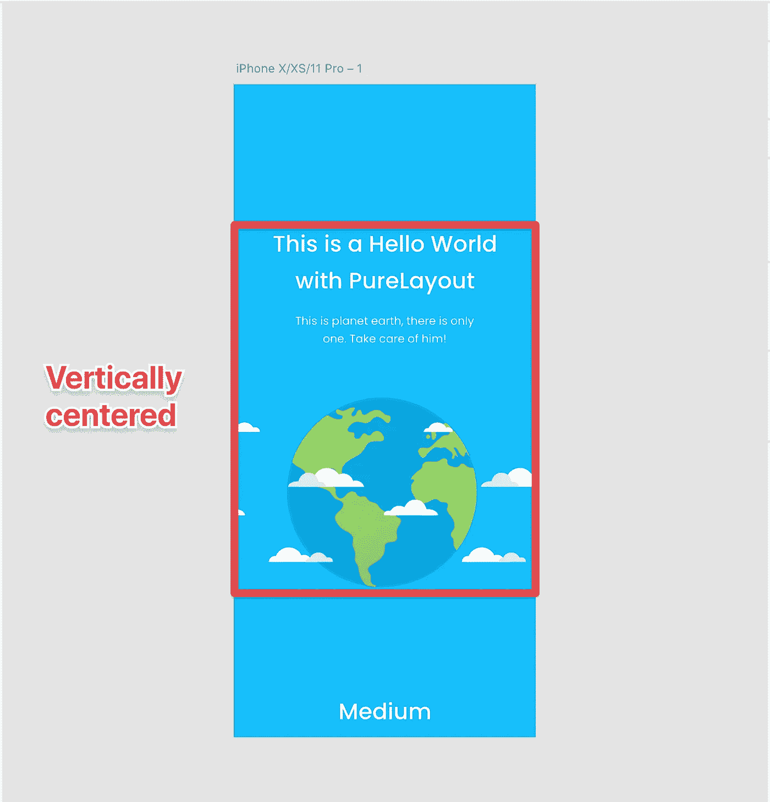

因此，为了使标题居中，我们需要一个额外的第五元素，这将是一个包含我们的元素的视图，并且垂直居中。姑且称之为`centeredView`。

# 创造我们美丽的 Hello 世界的元素

现在，我们将以编程方式生成该视图所需的每个元素。(记住包括我们的`centeredView`在内有五个元素，就从那个开始吧。)

## 居中视图

大多数元素的容器视图是一个简单的`UIView`，没有额外的配置。

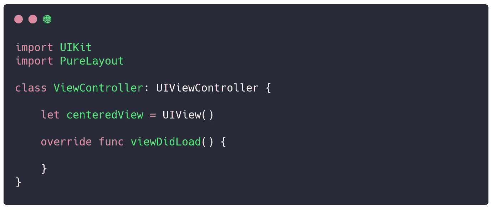

## 标题

现在，对于标题，我们有来自我们亲爱的设计师的特定规范:标题是一个 28 磅大小的粗体文本，文本“这是一个具有 PureLayout 的 Hello World ”,在单词“World”之后有一个换行符，并且居中对齐。

设计师是这样看的:

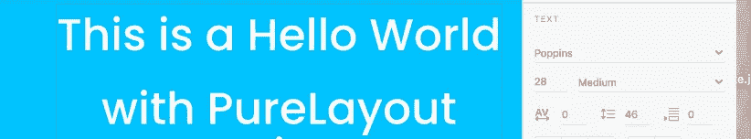

我们是这样看的:

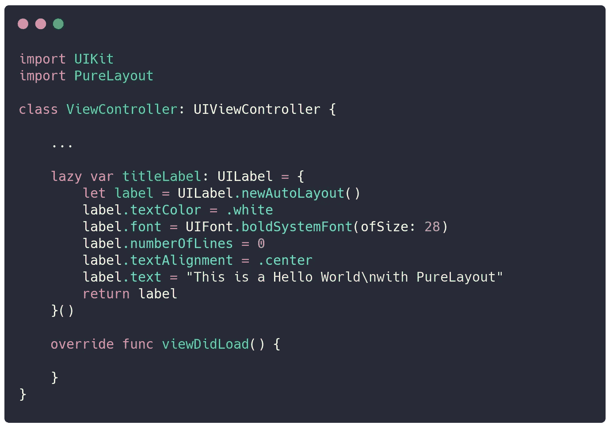

> “为什么是`lazy var`？
> 
> 只有当您读取属性时，才会执行与属性`lazy`相关联的闭包。因此，如果由于某种原因该属性没有被使用(可能是因为用户的决定)，您可以避免不必要的分配和计算。
> 
> 您可以用存储属性的值填充一个`lazy`属性。你可以在一个`lazy`属性的闭包里面使用`self`。”——感谢卢卡斯·安杰莱蒂的解释。

## 描述

和标题一样，它也有它的规格:14pts 大小的常规字体，配以文字:“这是行星地球，只有一个。好好照顾他！”在“只有..”之后换行段落和居中对齐。

设计师是这样看的:

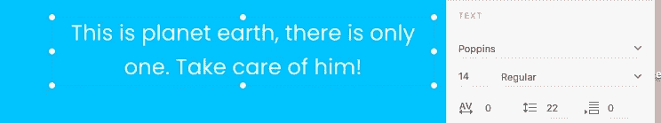

我们是这样看的:

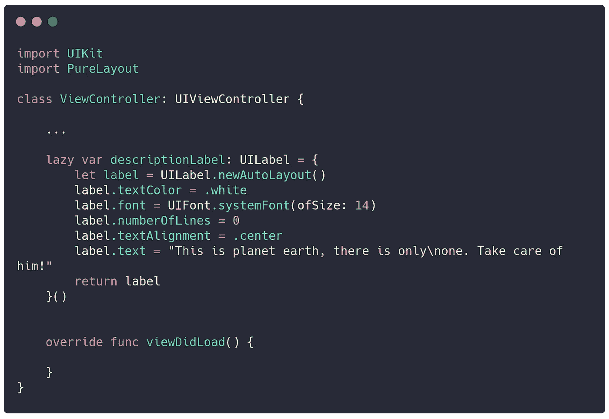

## 图像

图像很简单，设计者为我们提供了图像的高度，但是现在，我们不打算使用它，我们将在配置它的约束时建立高度。

设计师是这样看的:

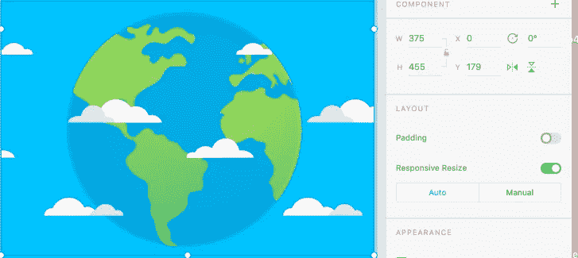

我们是这样看的:

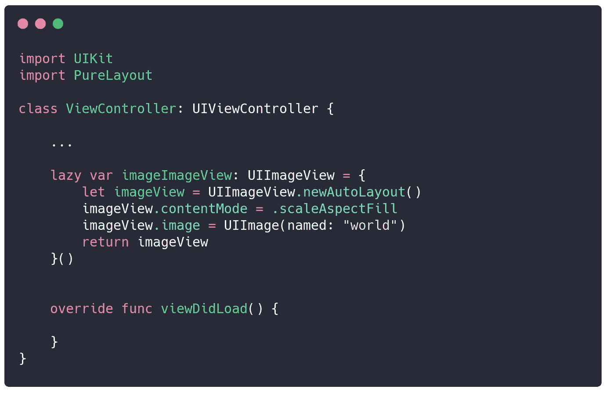

## 品牌名称

品牌名称规格与标题规格非常相似，粗体字大小为 28 磅，文本“Medium”居中对齐。

设计师是这样看的:

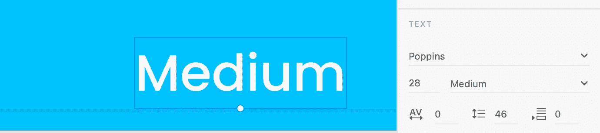

我们是这样看的:

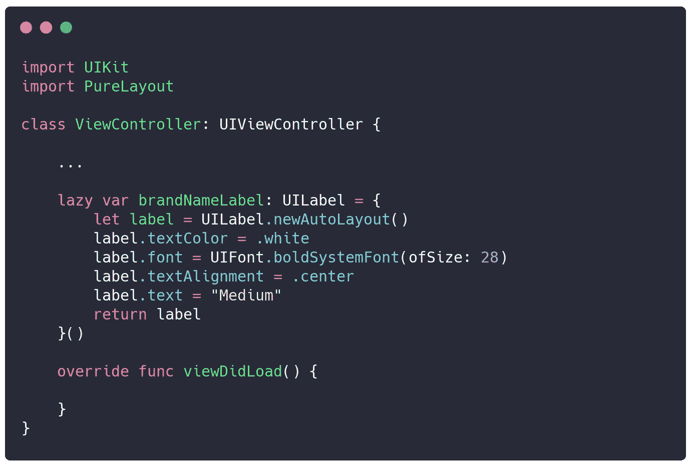

# 将元素添加到主视图

首先，我们将适当地向每个视图添加我们的元素:

*   `Main`视图包含`centeredView`和品牌名称。
*   `CenteredView`包含标题、描述和图像。

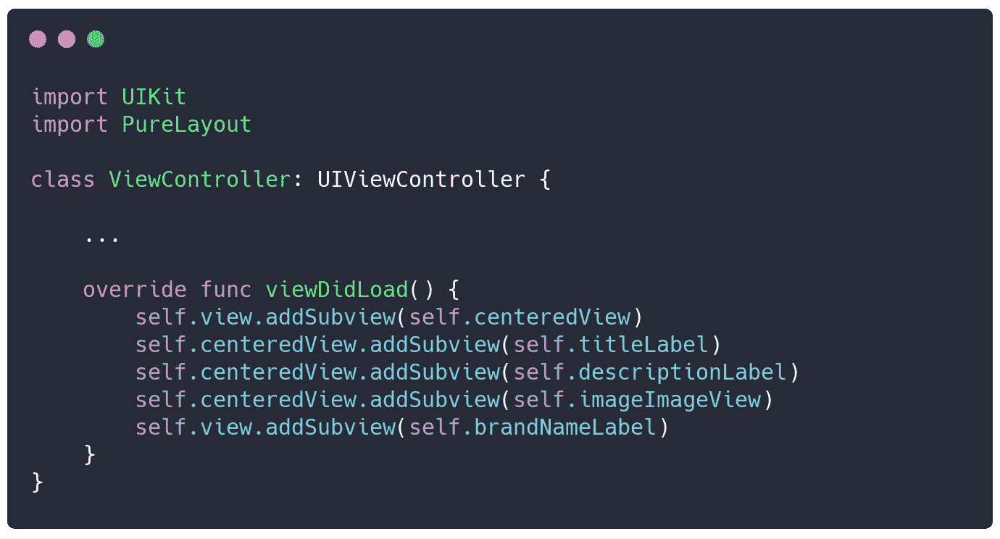

糟糕，我们差点忘了设置视图的背景颜色，现在就开始吧。

设计师是这样看的:

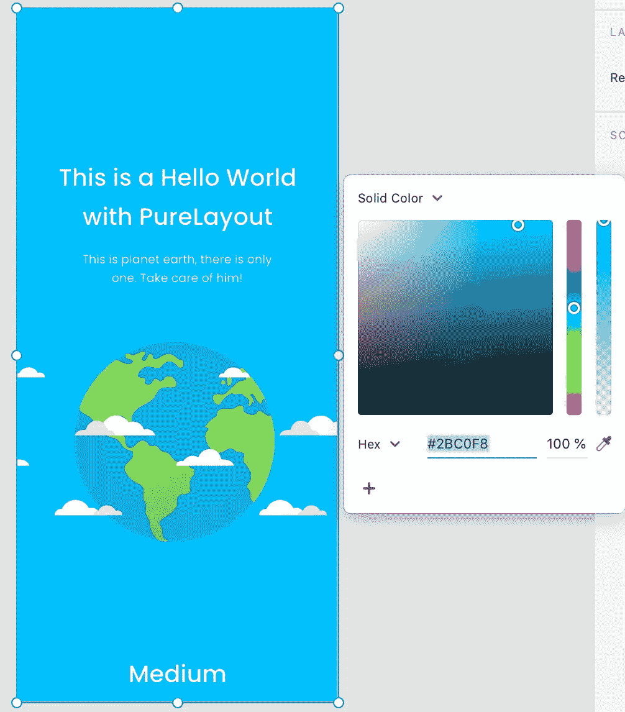

我们是这样看的:

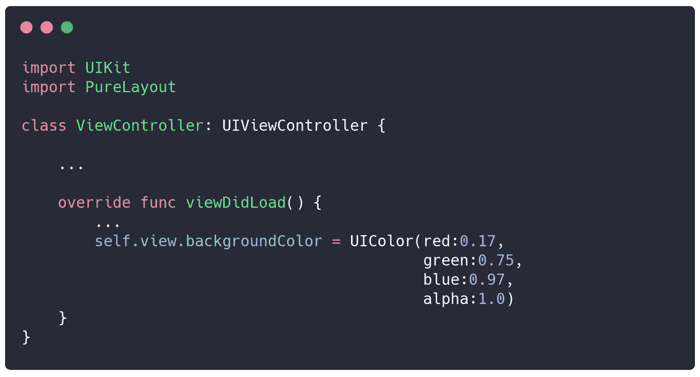

要将十六进制代码转换成`UIColor`，你可以使用这个工具: [UIColor.xyz](https://www.uicolor.xyz/#/hex-to-ui) 。

# 最后一步，设置约束

## 居中视图

我们需要将这个视图放在其主容器的中心(正如我们前面看到的，这个`centeredView`在主`ViewController`视图中)。

## 标题

我们的设计师告诉我们，它的横向边距(左右)为 16px，我们还将它钉在了`centeredView`的上边缘，这样居中的视图就知道它从哪里开始包含对象。

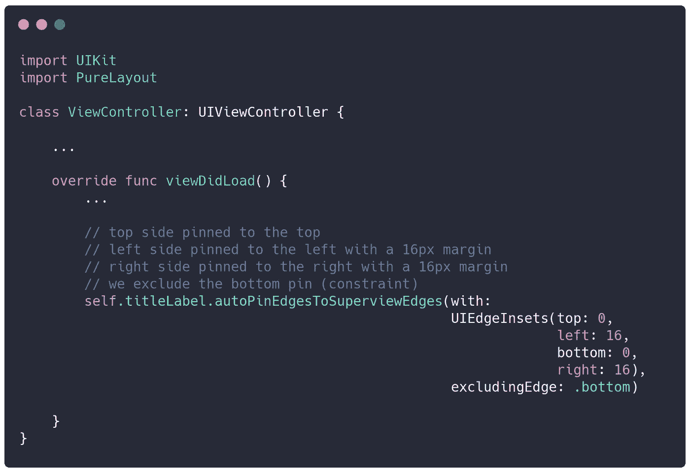

## 描述

我们的设计师告诉我们，标题下的间距为 28px，横向边距(左右)为 16px。

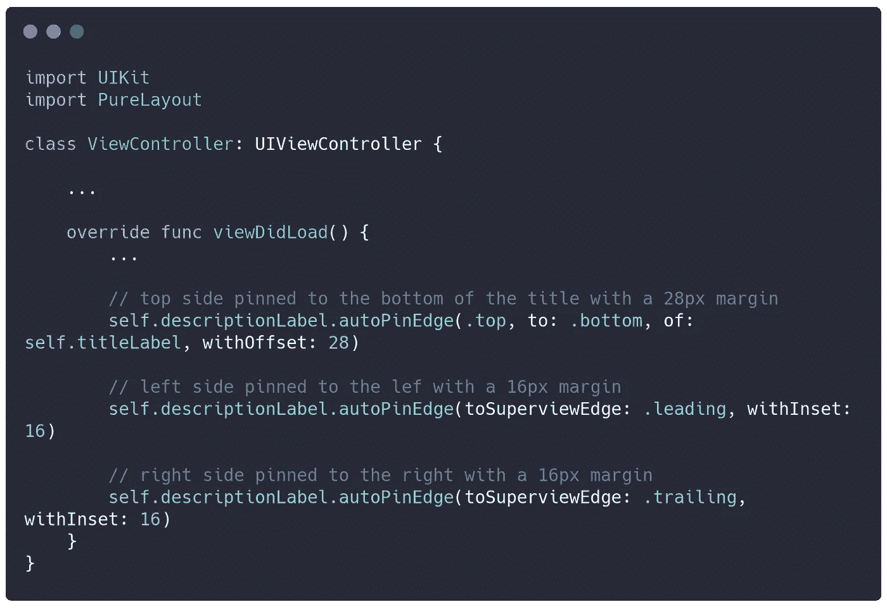

## 图像

据设计师介绍，该图像的高度为 255px。它被固定在横向边缘，并以 43px 的间距位于描述的下方。

我们还知道它被连接到我们中心视图的底部边缘，所以视图知道它包含对象的最终位置。

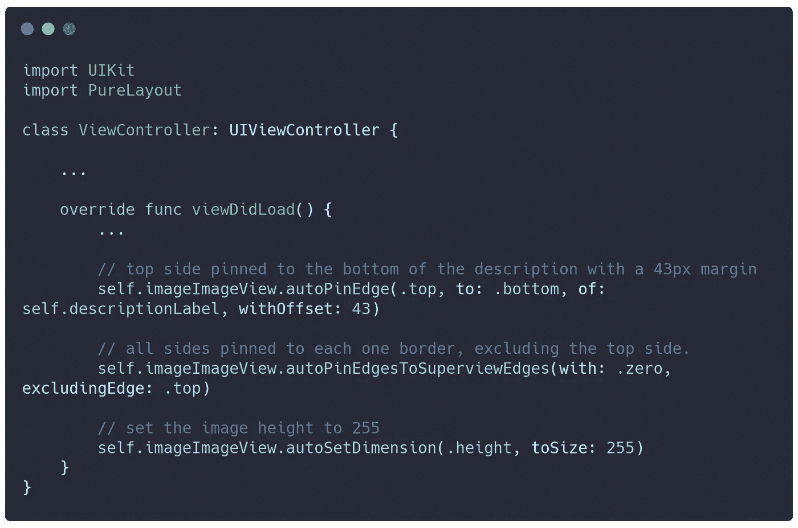

## 品牌名称

根据设计师的说法，品牌名称被钉在我们视图的底部，横向边距为 16px。

# 结束了

点击 Xcode 中的[运行按钮](https://developer.apple.com/library/archive/documentation/ToolsLanguages/Conceptual/Xcode_Overview/BuildingYourApp.html)。

现在我们看到我们美丽的 Hello World view 在我们的设备或模拟器上运行。

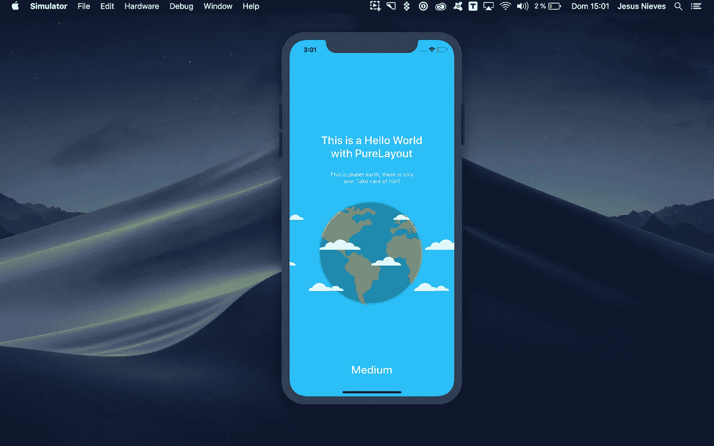

我知道这是一个很长的阅读，但主要的想法是根据我们的设计者给我们的东西来阐明约束的使用，并且当我们打算以编程方式创建一个视图时，对我们需要什么有一个清楚的了解。

[你可以在这里下载源代码。](https://github.com/nievesjesus/Beautiful-iOS-HelloWorld-PureLayout)