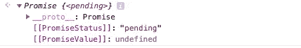
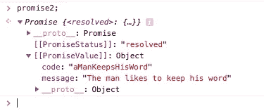
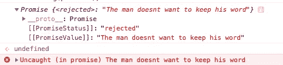
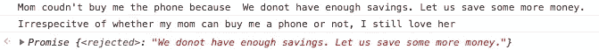
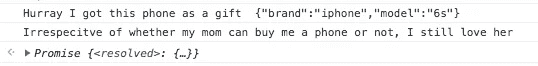
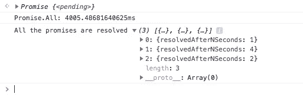
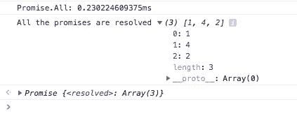
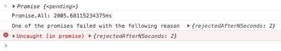
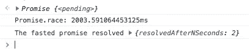
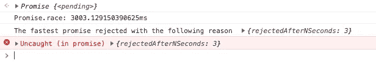

# 理解 JavaScript 中的承诺

> 原文：<https://betterprogramming.pub/understanding-promises-in-javascript-13d99df067c1>

## 深入了解如何创造和处理承诺


我给你一个小小的承诺，在这篇文章结束时，你会更好地了解 JavaScript 的承诺。

我对 JavaScript 有点又爱又恨。尽管如此，它一直吸引着我。在过去的十年里，我一直在研究 Java 和 PHP，JavaScript 看起来与众不同，但却很有趣。我没有在这上面花足够的时间，最近一直在努力弥补。

承诺是我遇到的第一个有趣的话题。我一次又一次地听到人们说，承诺“将你从回调地狱中拯救出来”。嗯，这可能是一个令人愉快的副作用，但承诺远不止于此。这是我到目前为止所能理解的。

# **背景**

一开始使用 JavaScript 可能会有点令人沮丧。你会听到人们说 JavaScript 是一种同步编程语言，然后其他人会声称它是异步的。你会听到阻塞代码、非阻塞代码、事件驱动的设计模式、事件生命周期、函数堆栈、事件队列、冒泡、polyfill、babel、angular、reactJS、vue JS 和许多其他工具和库。别担心——你不是第一个。有一个术语可以形容它: *JavaScript 疲劳。*这条推文很好地抓住了这一点:

Javascript 疲劳

JavaScript 是一种*同步*编程语言。但是多亏了回调函数，我们可以让它像异步编程语言一样工作。

## **承诺，通俗地说**

JavaScript 中的承诺类似于你在现实生活中做出的承诺，所以让我们看看现实生活中的承诺。

这是诺言的字典定义:

承诺:名词:保证某人会做某事或某件特定的事情会发生。

**那么当有人向你许下承诺时会发生什么？**

1.  承诺给你保证某事会被做。他们(做出承诺的人)是自己做还是让别人做并不重要。他们给你一个保证，在此基础上你可以计划一些事情。
2.  诺言可以遵守，也可以违背。
3.  当一个承诺被遵守的时候，你期望从那个承诺中得到一些东西。你可以将承诺的结果用于你进一步的行动或计划。
4.  当一个承诺被打破时，你想知道为什么做出承诺的人不能遵守他的承诺。一旦你知道了原因，并确认承诺已经被打破，你就可以计划下一步该做什么。
5.  当一个承诺被许给我们时，我们所拥有的只是一个保证。我们不能立即采取行动。当*承诺被遵守*(因此我们有一个预期的结果)或*被破坏*(我们知道原因，因此我们可以计划一个应急方案)时，我们可以决定并制定需要做的事情。
6.  做出承诺的人有可能不会反悔。在这种情况下，设定一个期限是明智的。例如，如果那个人在十天内没有回到我身边，我会认为他们没有遵守诺言。即使他们 15 天后回到你身边，也没关系——你已经做了备用计划。

# JavaScript 中的承诺

根据经验，我总是阅读来自 *MDN Web Docs* 的 JavaScript 文档。在所有可用的资源中，我认为它们提供了最简洁的细节。我阅读了 MDSN 网站文档中的承诺页面，并摆弄了一下代码，以便找到窍门。

理解承诺有两个部分。*创建承诺*和*处理承诺*。尽管我们的大部分代码将迎合其他库创建的处理承诺，但获得完整的理解是重要的。随着你从初级阶段进步，理解承诺的创造将变得越来越重要。

# 创造承诺

让我们来看看创建新承诺的签名:

```
new Promise( /* executor */ function(resolve, reject) { ... } );
```

构造函数接受一个名为`executor`的函数。这个`executor`函数接受两个参数:`resolve`和`reject`，它们依次是函数。

承诺通常用于更容易地处理异步操作或阻塞代码，例如，文件操作、API 调用、DB 调用、IO 调用等。这些异步操作在`executor`函数内部启动。如果异步操作成功，调用`resolve`函数返回预期结果。类似地，如果有一些意外的错误，原因会通过调用`reject`函数来传递。

现在我们知道如何创造一个承诺。让我们创造一个简单的承诺来帮助我们理解。

```
var keepsHisWord;
keepsHisWord = true;
promise1 = new Promise(function(resolve, reject) {
  if (keepsHisWord) {
    resolve("The man likes to keep his word");
  } else {
    reject("The man doesnt want to keep his word");
  }
});
console.log(promise1);
```


每个承诺都有一个状态和价值

因为这个承诺马上得到解决，我们将无法检查承诺的初始状态。因此，让我们创造一个新的承诺，这需要一些时间来解决。最简单的方法是使用`setTimeOut`函数。

```
promise2 = new Promise(function(resolve, reject) {
  setTimeout(function() {
    resolve({
      message: "The man likes to keep his word",
      code: "aManKeepsHisWord"
    });
  }, 10 * 1000);
});
console.log(promise2);
```

这段代码创建了一个承诺，它将在十秒钟后无条件地解决。我们可以检查承诺的状态，直到它被解决。



承诺状态，直到它被解决或拒绝

一旦十秒钟过后，承诺就完成了。`PromiseStatus`和`PromiseValue`都相应更新。如您所见，我们更新了 resolve 函数，这样我们可以传递一个 JSON 对象，而不是一个简单的字符串。这是为了说明我们也可以在`resolve`函数中传递其他值。



十秒钟后以 JSON 对象作为返回值的承诺

现在我们来看一个会被拒绝的承诺。我们只是稍微修改了承诺一。

```
keepsHisWord = false;
promise3 = new Promise(function(resolve, reject) {
  if (keepsHisWord) {
    resolve("The man likes to keep his word");
  } else {
    reject("The man doesn't want to keep his word");
  }
});
console.log(promise3);
```

由于这将创建一个未处理的拒绝，Chrome 浏览器将显示一个错误。你可以暂时忽略它——我们以后再讨论它。



拒绝承诺

如您所见，`PromiseStatus`可以有三个不同的值:`pending`、`resolved`或`rejected`。当一个承诺被创建时，`PromiseStatus`处于`pending`状态—它将拥有`PromiseValue` `undefined`直到该承诺处于`resolved`或`rejected.`状态。当一个承诺处于`resolved`或`rejected`状态时，该承诺被称为`settled`。所以一个承诺通常会从待定状态转换到确定状态。

现在我们知道了承诺是如何产生的，我们可以看看我们如何使用或处理承诺。这将有助于理解`Promise`对象。

# 理解承诺对象

根据 MDN 文档:

> `*Promise*`对象表示异步操作的最终完成(或失败)及其结果值。

`Promise`对象有静态方法和`prototype methods`。

`Promise`对象中的静态方法可以独立应用，而`prototype methods`需要应用于`Promise`对象的实例。

记住普通方法和原型都返回一个`Promise`会使理解事情变得容易得多。

# 原型方法

我们将从`prototype methods`开始。他们有三个人。

只是重申一下:所有这些方法都可以应用在`Promise`对象的实例上，并且所有这些方法都依次返回一个承诺。所有这些方法都为承诺的不同状态转换分配处理程序。

正如我们前面看到的，当`Promise`被创建时，它处于`pending`状态。承诺结算时，根据是`fulfilled`还是`rejected`运行以下三种方法中的一种或几种:

`Promise.prototype.catch(onRejected)`

`Promise.prototype.then(onFulfilled, onRejected)`

`Promise.prototype.finally(onFinally)`

下图显示了`.then`和`.catch`方法的流程。因为它们返回一个`Promise`，所以它们可以再次被链接，这也显示在图中。如果`.finally`被声明为承诺，则无论承诺是被履行还是被拒绝，只要承诺是`settled`就会被执行。正如 Konstantin Rouda 所指出的，对`.finally`的支持是有限的，所以在使用这个之前请检查一下。


来自:[https://mdn.mozillademos.org/files/15911/promises.png](https://mdn.mozillademos.org/files/15911/promises.png)

这里有一个小故事。你是一个小学生，你向你妈妈要一部电话。她说“我保证在月底买一部手机。”

如果这个承诺在月底得到执行，让我们看看这个承诺在 JavaScript 中是什么样子的:

```
var momsPromise = new Promise(function(resolve, reject) {
  momsSavings = 20000;
  priceOfPhone = 60000;
  if (momsSavings > priceOfPhone) {
    resolve({
      brand: "iphone",
      model: "6s"
    });
  } else {
    reject("We donot have enough savings. Let us save some more money.");
  }
});momsPromise.then(function(value) {
  console.log("Hurray I got this phone as a gift ", JSON.stringify(value));
});momsPromise.catch(function(reason) {
  console.log("Mom coudn't buy me the phone because ", reason);
});momsPromise.finally(function() {
  console.log(
    "Irrespecitve of whether my mom can buy me a phone or not, I still love her"
  );
});
```

这样的输出是:



妈妈们没有兑现承诺。

如果我们将`momsSavings`的值改为 200000，那么妈妈就可以给儿子礼物了。在这种情况下，输出是:



妈妈信守承诺。

让我们戴上消耗这个库的人的帽子。我们模仿输出和自然，这样我们可以看看如何有效地使用`.then`和`.catch`。

由于`.then`可以分配两个`onFulfilled, onRejected handlers`，而不是分别写`.then`和`.catch`，我们可以用`.then`做同样的事情。它应该是这样的:

```
momsPromise.then(
  function(value) {
    console.log("Hurray I got this phone as a gift ", JSON.stringify(value));
  },
  function(reason) {
    console.log("Mom coudn't buy me the phone because ", reason);
  }
);
```

为了代码的可读性，我觉得还是把它们分开比较好。

为了确保我们可以在一般的浏览器或特定的 Chrome 中运行所有这些样本，我确保我们的代码样本中没有外部依赖。

为了更好地理解后面的主题，让我们创建一个返回承诺的函数，然后随机地解决或拒绝该承诺，以便我们可以测试各种场景。

为了理解异步函数的概念，让我们在函数中引入一个随机延迟。

因为我们需要随机数，所以让我们首先创建一个随机函数，返回 x 和 y 之间的随机数:

```
function getRandomNumber(start = 1, end = 10) {
  //works when both start,end are >=1 and end > start
  return parseInt(Math.random() * end) % (end-start+1) + start;
}
```

接下来，我们创建一个为我们返回承诺的函数。让我们调用我们的函数`promiseTRRARNOSG`，它是`promiseThatResolvesRandomlyAfterRandomNumnberOfSecondsGenerator`的别名。该函数将创建一个承诺，该承诺在 2 到 10 秒之间的任意秒数后解决或拒绝。

为了随机化拒绝和解决，我们将创建一个介于 1 和 10 之间的随机数。如果生成的随机数大于 5，我们解决承诺，否则我们拒绝它。

```
function getRandomNumber(start = 1, end = 10) {
  //works when both start and end are >=1
  return (parseInt(Math.random() * end) % (end - start + 1)) + start;
}var promiseTRRARNOSG = (promiseThatResolvesRandomlyAfterRandomNumnberOfSecondsGenerator = function() {
  return new Promise(function(resolve, reject) {
    let randomNumberOfSeconds = getRandomNumber(2, 10);
    setTimeout(function() {
      let randomiseResolving = getRandomNumber(1, 10);
      if (randomiseResolving > 5) {
        resolve({
          randomNumberOfSeconds: randomNumberOfSeconds,
          randomiseResolving: randomiseResolving
        });
      } else {
        reject({
          randomNumberOfSeconds: randomNumberOfSeconds,
          randomiseResolving: randomiseResolving
        });
      }
    }, randomNumberOfSeconds * 1000);
  });
});var testProimse = promiseTRRARNOSG();
testProimse.then(function(value) {
  console.log("Value when promise is resolved : ", value);
});
testProimse.catch(function(reason) {
  console.log("Reason when promise is rejected : ", reason);
});// Let us loop through and create ten different promises using the function to see some variation. Some will be resolved and some will be rejected. for (i=1; i<=10; i++) {
  let promise = promiseTRRARNOSG();
  promise.then(function(value) {
    console.log("Value when promise is resolved : ", value);
  });
  promise.catch(function(reason) {
    console.log("Reason when promise is rejected : ", reason);
  });
}
```

刷新浏览器页面并在控制台中运行代码，查看`resolve`和`reject`场景的不同输出。稍后我们将看看如何创建多个承诺并检查它们的输出，而不必这样做。

# 静态方法

在`Promise`对象中有四个静态方法。

前两个是助手方法或快捷方式。他们帮助你做出决定或拒绝的承诺。

`Promise.reject(reason)`帮助你创造一个被拒绝的承诺。

```
var promise3 = Promise.reject("Not interested");
promise3.then(function(value){
  console.log("This will not run as it is a resolved promise. The resolved value is ", value);
});
promise3.catch(function(reason){
  console.log("This run as it is a rejected promise. The reason is ", reason);
});
```

`Promise.resolve(value)`帮助你创造一个明确的承诺:

```
var promise4 = Promise.resolve(1);
promise4.then(function(value){
  console.log("This will run as it is a resovled promise. The resolved value is ", value);
});
promise4.catch(function(reason){
  console.log("This will not run as it is a resolved promise", reason);
});
```

旁注:一个承诺可以有多个处理程序，所以您可以将上面的代码更新为:

```
var promise4 = Promise.resolve(1);
promise4.then(function(value){
  console.log("This will run as it is a resovled promise. The resolved value is ", value);
});
promise4.then(function(value){
  console.log("This will also run as multiple handlers can be added. Printing twice the resolved value which is ", value * 2);
});
promise4.catch(function(reason){
  console.log("This will not run as it is a resolved promise", reason);
});
```

输出如下所示:


接下来的两种方法帮助你处理一系列承诺。

当你处理多重承诺时，最好先创建一系列承诺，然后对所有承诺采取必要的行动。

为了理解这些方法，我们将无法使用我们方便的`promiseTRRARNOSG`——它太随机了。最好有一些确定性的承诺，这样我们才能理解行为。让我们创建两个函数。一个将在 n 秒后解析，一个将在 n 秒后拒绝。

```
var promiseTRSANSG = (promiseThatResolvesAfterNSecondsGenerator = function(
  n = 0
) {
  return new Promise(function(resolve, reject) {
    setTimeout(function() {
      resolve({
        resolvedAfterNSeconds: n
      });
    }, n * 1000);
  });
});
var promiseTRJANSG = (promiseThatRejectsAfterNSecondsGenerator = function(
  n = 0
) {
  return new Promise(function(resolve, reject) {
    setTimeout(function() {
      reject({
        rejectedAfterNSeconds: n
      });
    }, n * 1000);
  });
});
```

现在让我们用这些辅助函数来理解`Promise.All`

# 保证。全部

根据 MDN 文档:

> `***Promise.all(iterable)***`方法返回单个`[*Promise*](https://developer.mozilla.org/en-US/docs/Web/JavaScript/Reference/Global_Objects/Promise)`，当`*iterable*`参数中的所有承诺都已解析或者当 iterable 参数不包含承诺时，该方法将解析。它用拒绝的第一个承诺的理由拒绝。

## 案例一

当所有的承诺都解决了。这是最常用的场景:

```
console.time("Promise.All");
var promisesArray = [];
promisesArray.push(promiseTRSANSG(1));
promisesArray.push(promiseTRSANSG(4));
promisesArray.push(promiseTRSANSG(2));
var handleAllPromises = Promise.all(promisesArray);
handleAllPromises.then(function(values) {
  console.timeEnd("Promise.All");
  console.log("All the promises are resolved", values);
});
handleAllPromises.catch(function(reason) {
  console.log("One of the promises failed with the following reason", reason);
});
```



所有承诺都解决了。

关于这个输出，我们需要做两个重要的观察。

1: 耗时 2 秒的第三个承诺在耗时 4 秒的第二个承诺之前完成。但是正如您在输出中看到的，承诺的顺序在值中保持不变。

2: 我加了一个控制台定时器，看看`Promise.All`需要多长时间。如果这些承诺按顺序执行，总共需要 1+4+2=7 秒。但是从我们的计时器中我们看到它只需要 4 秒钟。这证明了所有的承诺都是并行执行的。

## 案例 2

当没有承诺的时候。我觉得这是最不常用的。

```
console.time("Promise.All");
var promisesArray = [];
promisesArray.push(1);
promisesArray.push(4);
promisesArray.push(2);
var handleAllPromises = Promise.all(promisesArray);
handleAllPromises.then(function(values) {
  console.timeEnd("Promise.All");
  console.log("All the promises are resolved", values);
});
handleAllPromises.catch(function(reason) {
  console.log("One of the promises failed with the following reason", reason);
});
```



因为数组中没有承诺，所以返回的承诺被解析。

## 案例 3

它以拒绝的第一个承诺的理由拒绝:

```
console.time("Promise.All");
var promisesArray = [];
promisesArray.push(promiseTRSANSG(1));
promisesArray.push(promiseTRSANSG(5));
promisesArray.push(promiseTRSANSG(3));
**promisesArray.push(promiseTRJANSG(2));**
promisesArray.push(promiseTRSANSG(4));
var handleAllPromises = Promise.all(promisesArray);
handleAllPromises.then(function(values) {
  console.timeEnd("Promise.All");
  console.log("All the promises are resolved", values);
});
handleAllPromises.catch(function(reason) {
  console.timeEnd("Promise.All");
  console.log("One of the promises failed with the following reason ", reason);
});
```



执行在第一次拒绝后停止

# 承诺.比赛

根据 MDN 文档

> `**Promise.race(iterable)**`方法返回一个承诺，该承诺在 iterable 中的一个承诺解析或拒绝后立即解析或拒绝，并返回该承诺的值或原因。

## 案例 1

其中一个承诺首先解决:

```
console.time("Promise.race");
var promisesArray = [];
promisesArray.push(promiseTRSANSG(4));
promisesArray.push(promiseTRSANSG(3));
**promisesArray.push(promiseTRSANSG(2));**
promisesArray.push(promiseTRJANSG(3));
promisesArray.push(promiseTRSANSG(4));
var promisesRace = Promise.race(promisesArray);
promisesRace.then(function(values) {
  console.timeEnd("Promise.race");
  console.log("The fasted promise resolved", values);
});
promisesRace.catch(function(reason) {
  console.timeEnd("Promise.race");
  console.log("The fastest promise rejected with the following reason ", reason);
});
```



最快的分辨率

所有的承诺都是并行的。第三个承诺在两秒内解决。一旦这样做了，由`Promise.race`返回的承诺就解决了。

## 案例 2

其中一个承诺首先拒绝。

```
console.time("Promise.race");
var promisesArray = [];
promisesArray.push(promiseTRSANSG(4));
promisesArray.push(promiseTRSANSG(6));
promisesArray.push(promiseTRSANSG(5));
**promisesArray.push(promiseTRJANSG(3));**
promisesArray.push(promiseTRSANSG(4));
var promisesRace = Promise.race(promisesArray);
promisesRace.then(function(values) {
  console.timeEnd("Promise.race");
  console.log("The fasted promise resolved", values);
});
promisesRace.catch(function(reason) {
  console.timeEnd("Promise.race");
  console.log("The fastest promise rejected with the following reason ", reason);
});
```



最快的拒绝

所有的承诺都是并行的。第四个承诺在三秒钟内被拒绝。一旦完成，由`Promise.race`返回的承诺被拒绝。

我已经编写了所有的示例方法，所以我可以测试各种场景，测试可以在浏览器中运行。这就是为什么在示例中看不到任何 API 调用、文件操作或数据库调用。虽然所有这些都是真实的例子，但是您需要额外的工作来设置和测试它们。

另一方面，使用延迟功能可以提供类似的场景，而无需额外的设置。您可以轻松地使用这些值来查看和检查不同的场景。您可以使用`promiseTRJANSG`、`promiseTRSANSG`和`promiseTRRARNOSG`方法的组合来模拟足够多的场景，以便彻底理解承诺。

此外，在相关块之前和之后使用`console.time`方法将帮助我们容易地识别承诺是并行运行还是顺序运行。如果你有其他有趣的场景或者我错过了什么，请告诉我。如果你想把所有的代码样本放在一个地方，看看这个要点。

承诺样品

在结束之前，我想列出我遵守的所有经验法则，以保持我对承诺的理智。

# 使用承诺的经验法则

1.  每当你使用异步或阻塞代码时，使用承诺。
2.  `resolve`映射到`then`,`reject`映射到`catch`用于所有实际用途。
3.  确保写下所有承诺的`.catch`和`.then`方法。
4.  如果在这两种情况下都需要做些什么，使用`.finally`。
5.  我们只有一次机会改变每个承诺。
6.  我们可以为一个承诺添加多个处理程序。
7.  `Promise`对象中所有方法的返回类型，不管它们是静态方法还是原型方法，都是一个`Promise`
8.  在`Promise.all`中，承诺的顺序保持在值变量中，不管哪个承诺首先被解决。

如果你喜欢这篇关于承诺的深度分析，并且想了解更多关于 Javascript 的知识，请加入我们的讨论[https://discord.gg/ENbQbbZy25](https://discord.gg/ENbQbbZy25)或者在 twitter 上关注我[https://twitter.com/gokulnk](https://twitter.com/gokulnk)

你可以订阅我的简讯[https://understandingx.substack.com/](https://understandingx.substack.com/)

# 何时使用异步等待，何时使用承诺

通过这篇文章，我希望你对承诺有足够的了解，并在现实生活中使用它们。你可以阅读关于 [async-await](https://medium.com/better-programming/understanding-async-await-in-javascript-1d81bb079b2c) 的内容，然后阅读[我应该使用 promises 还是 async-await](https://medium.com/better-programming/should-i-use-promises-or-async-await-126ab5c98789) 。有了这三个地方，我认为你应该在一个伟大的地方开始进一步探索。如果我在这些文章中遗漏了什么，一定要让我知道。我总是愿意学习。