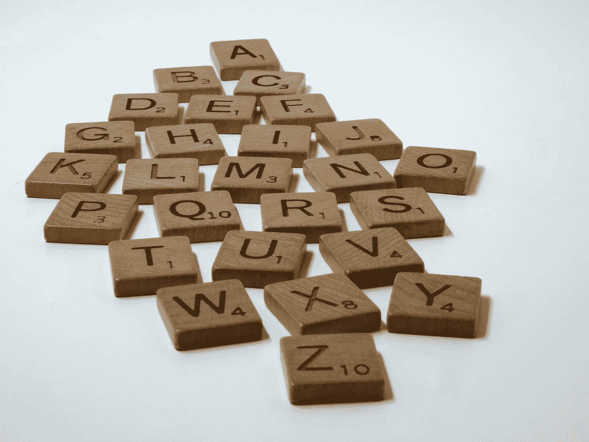
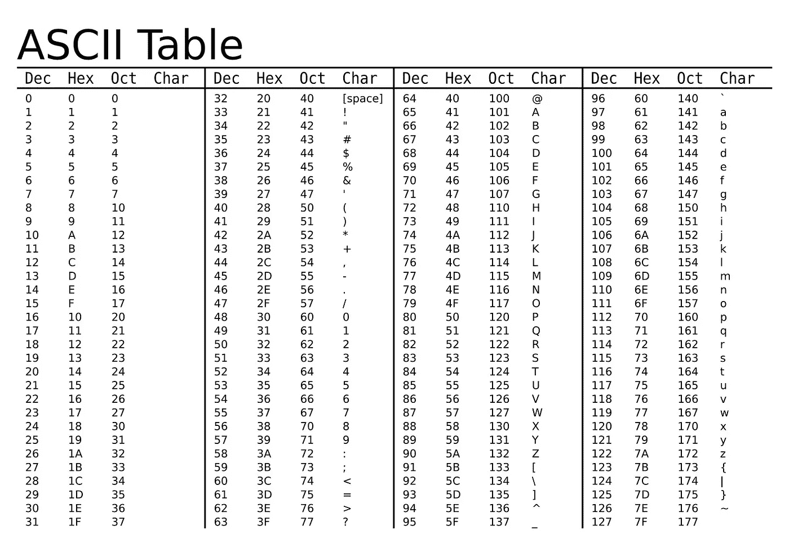

# 理解 Python 的 Ord()函数

> 原文：<https://betterprogramming.pub/understanding-pythons-ord-function-7fd9518ed457>

## 关于 Python 的 order()函数的快速教程，并附有示例



由[布雷特·乔丹](https://unsplash.com/@brett_jordan?utm_source=unsplash&utm_medium=referral&utm_content=creditCopyText)在 [Unsplash](https://unsplash.com/s/photos/scrabble?utm_source=unsplash&utm_medium=referral&utm_content=creditCopyText) 上拍摄的照片

在 Python 中，`ord(c)`函数返回一个表示指定字符`c`的 Unicode 的整数。

下面的函数示例:

`ord('a')`如何返回整数 97？

字符“a”的 Unicode 表示是 97。我提供了如下所示的 ASCII 表作为快速参考，因为 ASCII 表是 Unicode 的子集。



在我准备技术面试的时候，我无意中发现了这样的代码，于是对 Python 的`ord()`功能产生了兴趣:

根据 ASCII 表，`ord('c')`和`ord('a')`分别等于 99 和 97。接下来，`99-97 = 2`。这个结果很重要，因为 2 是英文字母表中字母`c`的索引(从第 0 个索引开始)。

```
0, 1, 2
a, b, c
```

再比如，`ord('k') — ord('a')`相当于`107-97 = 10`。结果 10 也是字母表中字母`k`的索引。

```
0, 1, 2, 3, 4, 5, 6, 7, 8, 9, 10
a, b, c, d, e, f, g, h, i, j, k
```

用`ord('a')`减去一个字符返回该字符在字母表中的索引。

现在，让我们关注小写字母，我们有从“a”到“z”的整个字母表，对应的值是 97 到 122。包括 97 一直到 122 是 26 个字母，这也是英语字母表中相同数量的字母。

这有什么用？

我构建了一个长度为 26 的数组，其中填充了整数，这些整数最初都被赋值为 **0** 。新形成的数组代表整个字母表。接下来，我们遍历给定的字符串，并在适当的索引处更新数组。让我们看看给定字符串`hello`的数组是什么样子。

得到的数组显示了每个字母在给定字符串中出现的次数。有`h`的`one`发生、`e`的`one`发生、`l`的`two` 发生、`o`的`one`发生。

这种技术可以用来解决一些问题，比如获取给定字符串中的字符数，或者检查两个字符串是否是彼此的排列。

## ***例 1:获取给定字符串中的字符数。***

上面代码的输出显示了哪些字母出现在我们的输入字符串中，以及它们出现的次数。有`c`的`one`发生、`e`的两次发生、`i`的`one`发生、`k`的`one`发生、`o`的`two`发生。

既然我们已经了解了`ord()`函数和“字符减法”是如何工作的，我们也可以使用这个函数来检查两个字符串是否是彼此的排列。排列是单词或短语的重新排列，保持与原单词相同的字符。

## ***例 2:检查两个单词是否是彼此的排列。***

给定两个字符串`chocolate`和`ocohtlaec`，检查给定的字符串是否是彼此的排列。

我们为每个给定的长度为 26 的字符串构造了一个数组，最初用 **0** 填充。然后，我们遍历每个给定的字符串，并更新每个字母出现的次数。

上述代码产生的数组被认为是彼此相等的。这意味着两个字符串包含相同的字母及其出现次数，表明这两个单词是彼此的排列。

# **结论**

Python `ord()`函数对于将字符表示为整数非常有用。因此，`ord()`函数使得检索哪些字母以及它们在给定字符串中出现的次数变得简单。该函数还引入了与另一个给定字符串进行比较的方法，如示例 2 所示。现在我该回去学习了，但与此同时，我想听听你使用`ord()`功能解决了哪些问题。

感谢您阅读我的文章。

```
**Want to Connect?**Connect on [LinkedIn](https://www.linkedin.com/in/brian-huynhcs/)
```