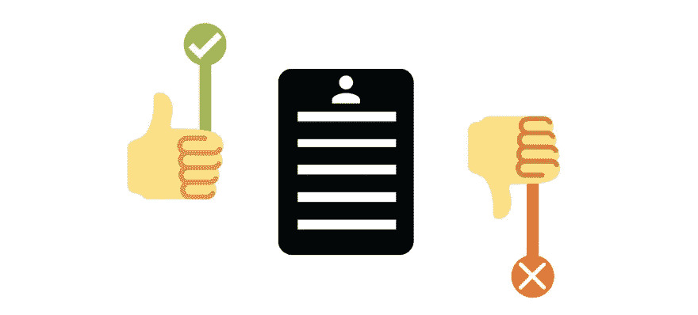
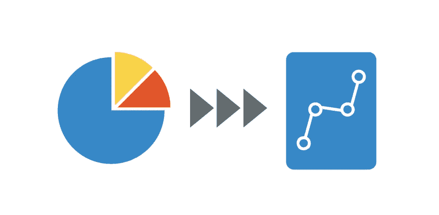
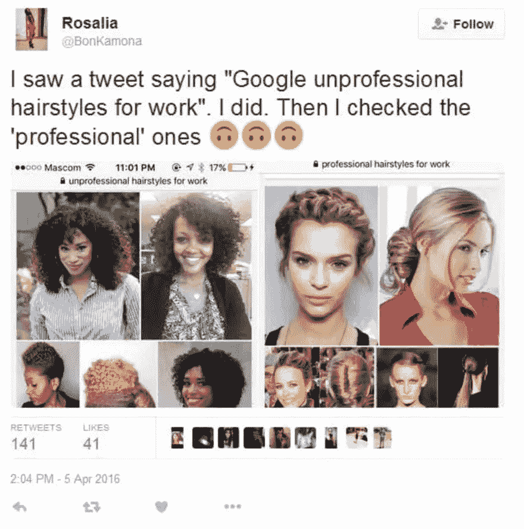

# 理解机器学习算法中的种族偏见

> 原文：<https://betterprogramming.pub/understanding-racial-bias-in-machine-learning-algorithms-1c5afe76f8b>

## 探索偏见以及为什么代码和算法不像你想象的那样中立

娜塔莎·康奈尔在 Unsplash 上拍摄的照片

尽管我们尽了最大努力去避免偏见，但偏见在我们的世界中随处可见。隐性偏见指的是我们对一群人所持有的态度、信念和刻板印象。偏见会影响我们对待和回应他人的方式，甚至是不由自主的。

隐性偏见普遍存在于科技行业——在招聘实践中，也存在于善意开发者创造的产品和技术中。特别是，[研究人员](https://www.gsb.stanford.edu/insights/big-data-racial-bias-can-ghost-be-removed-machine)将机器学习和人工智能识别为遭受隐性种族偏见的技术。如果软件开发真的是“吞噬世界”，我们这些业内人士必须关注这些发现，并努力创造一个更好的世界。

那么，机器学习和 AI 在哪些方面遭受了种族偏见？更重要的是，我们能做些什么来对抗它？今天我们将复习以下内容:

*   机器学习和人工智能中的种族偏见。
*   对抗机器学习技术中的种族偏见。
*   包装和资源。

# 机器学习和人工智能中的种族偏见

机器学习使用算法来接收输入，组织数据，并在预定的范围和模式内预测输出。算法似乎是客观的数学过程，但事实远非如此。事实上，种族偏见以几种微妙和不那么微妙的方式渗透到算法中，导致歧视性的结果和结果。让我们深入了解一下。

## 自动化的危险

算法会因为错误的原因给你想要的结果。通过使算法自动化，它经常发现你无法预测的模式。神经网络实验的[传奇很好地证明了算法的这种局限性。](https://www.gwern.net/Tanks)

当数据不完美、混乱或有偏差时，自动化会带来危险。一种算法可能会锁定不重要的数据，而**会强化无意的隐含偏差**。例如，数据科学家达芙妮·柯勒解释说，一种旨在从 X 射线中识别骨折的算法最终识别出了哪家医院生成了图像。这种算法现在包含了不相关的数据并扭曲了结果。如果一个算法暴露在有种族偏见的数据集下，它会继续纳入这些偏见——即使是在完全不同的背景下。

由于自动化，招聘算法特别容易受到种族偏见的影响。人力资源经理无法涉猎大量的申请人，所以简历扫描算法会在人力资源员工阅读简历之前剔除大约 72%的简历。简历扫描仪通常是根据过去公司的成功来训练的，这意味着他们继承了公司的偏见。

在一个众所周知的[实验](https://www.nber.org/papers/w9873)中，招聘人员选择名字听起来像白人的简历。通过在数据集上训练一种算法，它学会了自动*过滤掉任何听起来不好听的名字。该算法根据纯粹的主观标准选择候选人，从而延续了种族歧视。同样形式的自动歧视阻止有色人种获得就业、住房，甚至学生贷款。自动化意味着我们在本应客观的算法中制造盲点和种族偏见。*

## *不当培训和代理*

*用数据集和代理来训练算法。输入会有偏差，所以算法也会有偏差。训练和测试算法的开发人员经常使用少数群体代表性差的数据集。事实上，一个[常用的数据集](https://www.computer.org/csdl/journal/tp/2015/06/06920084/13rRUy3xY3R?mod=article_inline)的特征是 74%的男性面孔和 83%的白人面孔。如果源材料主要是白色，结果也会如此。*

*这对自动人口预测器和面部识别软件中使用的算法提出了一个重大问题。由于面部识别软件没有在大范围的少数民族脸上进行训练，因此它会根据狭窄范围的特征错误地识别少数民族。在 2015 年的一个[丑闻](https://twitter.com/search?q=@jackyalcine%20gorilla&src=typd&mod=article_inline)中，由于有偏见的输入和不完整的训练，谷歌的面部识别技术将两名美国黑人用户标记为大猩猩。*

*在另一个来自 2018 年的[例子中，执法部门使用的面部识别工具将 35%的深色皮肤女性误认为男性。浅肤色男性的错误率仅为 0.8%。在美国警察暴行达到顶峰的时候，我们可以看到这种有偏见的数据如何导致灾难性的，甚至暴力的结果。](https://www.wsj.com/articles/a-crucial-step-for-avoiding-ai-disasters-11550069865)*

**

*代理人也会产生偏见。代理是对我们用来获得特定结果的变量的一种假设。例如，身体质量指数(身体质量指数)是一个标记一个人健康与否的代理。我们假设身体质量指数等同于健康，所以我们根据这个系统对身体进行分类，尽管身体质量指数的概念事实上已经被广泛揭穿。如果我们假设代理是准确的，我们假设结果也是准确的。这发生在机器学习中。*

*一项 [2019 年的研究](https://science.sciencemag.org/content/366/6464/447)显示，医疗保健 ML 算法将被确定需要额外护理的黑人患者数量减少了一半。事实上，在任何给定的健康水平下，白人患者的风险得分都更高。由于该算法是在*医疗费用*的代理上训练的，它假设医疗费用作为健康需求的指标。然而，由于各种种族化的系统和社会原因，黑人患者在医疗保健上花费较少。*

*如果没有更深入的调查，结果可能会导致额外的资源分配给白人患者。但是，当算法被修改以包括更准确的健康风险标记时，数字发生了变化:在所有情况下，被转介到护理项目的黑人患者从 18%增加到 47%。*

*一个又一个例子证明，机器学习训练和代理，即使是由善意的开发者创造的，也可能导致意想不到的有害结果，这些结果经常歧视少数群体。*

## *人工智能偏见是人类的偏见*

*算法并不是真正中立的。*

*数学和科学是纯粹客观的概念*是错误的*。*

*事实上，纵观历史，科学一直被用来证明种族主义的结论——从被揭穿的颅相学甚至到进化论。*

**算法是我们用代码写出来的观点。*由于算法是由数据科学家——像你我这样的人——设计、创建和训练的，机器学习技术无意中带有人类固有的偏见。这意味着我们的机器有继承我们带来的任何偏见的危险。*

**

**来源:* [*时代杂志上的谷歌搜索算法*](https://time.com/5209144/google-search-engine-algorithm-bias-racism/)*

*如果你不相信，可以读读微软的 Tay，这是一个人工智能聊天机器人，在几个小时内被用户教会后，就会传播令人不安的种族主义信息。*

*我们是老师——人工智能偏见就是人类偏见。*

*你不应该感到惊讶，代表性是这个问题的一个促成因素。大多数人工智能研究人员都是白人男性，社会经济地位相似，来自相似的大学。*

*【2019 年的研究发现 80%的人工智能教授是男性。有色人种在大型科技公司的代表性仍然不足。在 [2016 年人工智能大会](https://www.technologyreview.com/2018/02/14/145462/were-in-a-diversity-crisis-black-in-ais-founder-on-whats-poisoning-the-algorithms-in-our/)上，谷歌人工智能研究员 Timnit Gebru 报告称，8500 名与会者中只有 6 名黑人。这种多样性危机意味着很少有色人种参与机器学习决策或设计。如果创新者是同质的，结果和创新也会是同质的，我们将继续忽视更广泛的人类经验。*

# *对抗机器学习技术中的种族偏见*

*机器学习中的种族偏见是真实而明显的。那么，我们该如何应对呢？我们能积极做些什么来防止隐性偏见感染我们的技术？让我们来看看几个建议和做法。我还建议查看参考资料列表，了解其他实用的解决方案和研究。*

## *关于准确数据和学习模型的培训*

*简单来说，我们必须在更好的数据上训练算法。更好的数据可能意味着很多不同的事情。训练数据应该类似于算法日常使用的数据。含有大量垃圾信息的数据会增加算法产生偏差的可能性。避免对不同的人群使用不同的培训模型，尤其是在少数群体的数据更加有限的情况下。*

*从预先存在的数据集中去除所有的偏差是不可能的，尤其是因为我们无法知道一个算法本身会产生什么样的偏差。相反，我们必须不断地对来自真实世界分布的数据重新训练算法。我们还需要选择正确的[学习模式](https://www.educative.io/edpresso/machine-learning-techniques-supervised-vs-unsupervised)。有监督的和无监督的学习都有好处，并且必须根据所讨论的程序来考虑这些好处。*

*人为生成的数据是偏见的巨大来源。这可能不是出于恶意，但人工智能程序会将这些偏见反映给我们。我们在训练算法的时候需要谨慎和谦逊。简单地向算法提供更多不同的数据可能无法解决这些数据中隐含的偏见。我们必须批判性地思考潜在的数据偏差，并向在这方面受过更多教育的人寻求反馈和指导。这为我们提供了解决偏见的机会，不仅是在我们的技术中，也在我们自己身上。*

**

## *在设计阶段要有意识*

*防止种族偏见的关键发生在设计阶段。许多公司认为降低成本是算法设计的最终目标，但是这个结果有很多盲点。*

***当像信用评分这样的东西被用作代理时，数据本身无法解释种族压迫的历史和复杂的社会因素。在你设计一个算法之前，对这些历史进行自我教育，在进行一个特定的设计之前，向专家寻求意见。***

*我们还必须编写对偏差更敏感的算法。我们也许无法治愈偏见，但我们可以利用制衡机制采取预防性行动。提倡控制系统和观察，比如对机器学习软件进行随机抽查，对结果进行广泛的人工审查，以及人工相关性审查。我们知道算法可以创建无意的相关性，例如假设一个人的名字是潜在就业的指标，所以我们需要保持警惕，并调查*为什么*我们的算法正在做出决定。*

## *倡导该领域的公平*

*很简单:数据科学领域的多样性可以防止技术延续偏见。*

*2020 年 StackOverflow 调查显示 68.3%的开发人员是白人。这是一个问题。我们需要从雇佣更多的有色人种进入 ML 领域和领导岗位开始，而不要夸大他们的经验。白人商业领袖不应该期望候选人像他们一样行动、说话或思考。多元化的关键在于人们带来的各种观点，包括不同的教育背景。*

*然而，如果根深蒂固的科技文化保持不变，招聘实践不会改变一切。用于教育或招聘的规范、价值观和语言也很重要。科技行业的许多规范都是排斥少数族裔的。例如,“技术人员”或“编码忍者”这两个词会阻止女性和其他少数族裔申请技术工作。我们需要启动改变文化的战略，并鼓励代表性不足的少数群体认同自己是开发者。即使只是大声说出你的同事有偏见的语言也是一个好的开始。*

*我们还需要**增加对资源**的访问。关于机器学习有许多神话——例如，你需要名牌大学的博士学位，或者人工智能专家很少。我们需要改变这种说法，不要认为人工智能技术是有声望的，主要是白人科学家的专利。这些神话阻碍了有才华的人感到被包容，找工作，甚至开始工作。以公平和开放的态度对待这些工具是一个良好的开端。*

**

## *改变我们教授科学和数学的方式*

*我之前说过，科学和数学不一定是客观的。如果我们给数据贴上客观或事实的标签，我们就不太倾向于批判性地思考限制和伤害我们的主观因素和偏见。科学就像是凭空出现的一样被教授——就像没有个人偏见一样。但是科学和数学**也不能免受社会、历史、政治或经济因素的影响。**科学发生在人类生活的混乱和复杂之中。让我们不要为了追求客观的假象而忽视这个世界。*

*这部分归结于重新想象科技教育。我们不会仅仅通过招募已经达到传统教育管道后期阶段的员工或学生来改变文化。相反，我们需要重新思考我们如何接近、教授和隔离 STEM+M 与其他领域。一个至关重要的变化可能是鼓励跨学科教育，让 STEM 学生在学习艺术、历史、文学等的同时学习技术技能。*

*我们还必须重新讲述技术的历史，以提升被忽视的少数民族的贡献。这些创新和经验不是科技史的一个子部分——它们*是*科技史。*

# *包扎*

*算法可能是可怕的工具，也可能是美妙的工具。重要的是我们如何创造它们，我们在这个过程中包括谁，以及我们有多愿意改变我们的文化视角。*

*在世界各地分裂的时候，我们经常听到我们必须努力成为反种族主义者。让我们都考虑一下，机器学习和算法必须如何也被设计成反种族主义的工具。正如我们的个人偏见在我们手中，改变它们的力量也在我们手中。*

*继续自我教育，倡导工作场所的变革。查看下面的参考资料，了解关于这个主题的更多信息。*

# *资料来源和进一步阅读*

*   *[关于种族偏见和大数据的斯坦福商学院](https://www.gsb.stanford.edu/insights/big-data-racial-bias-can-ghost-be-removed-machine)*
*   *[神经网坦克都市传说](https://www.gwern.net/Tanks)*
*   *[纽约时报关于人工智能和种族偏见](https://www.nytimes.com/2019/11/19/technology/artificial-intelligence-bias.html)*
*   *[劳动力市场歧视和 ML 算法](https://www.nber.org/papers/w9873)*
*   *[从面部图像进行人口统计估计](https://www.computer.org/csdl/journal/tp/2015/06/06920084/13rRUy3xY3R?mod=article_inline)*
*   *[AI 多样性和面部识别](https://www.theverge.com/2019/4/16/18410501/artificial-intelligence-ai-diversity-report-facial-recognition)*
*   *[改变 STEM 中代表不足群体的文化](https://www.insightintodiversity.com/changing-the-culture-for-women-and-underrepresented-groups-in-stemm/)*
*   *[警务和面部识别上的守护者](https://www.theguardian.com/technology/2017/dec/04/racist-facial-recognition-white-coders-black-people-police)*