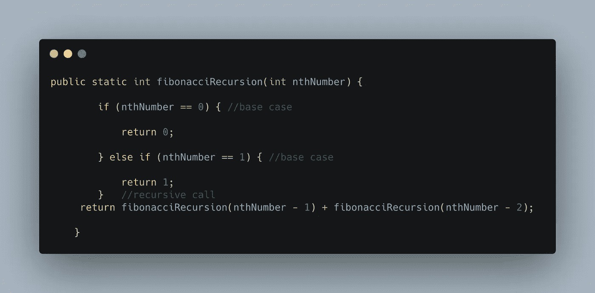
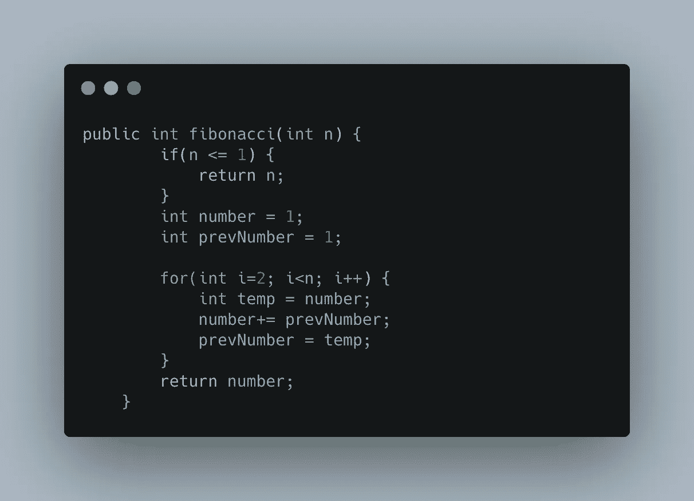
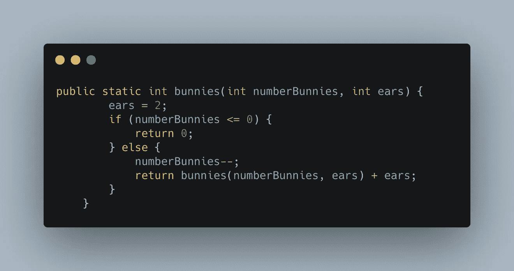

# 用例子理解递归

> 原文：<https://betterprogramming.pub/understanding-recursion-with-examples-f74606fd6be0>

## 再读一遍，再读一遍，再读一遍…

在 [Unsplash](https://unsplash.com?utm_source=medium&utm_medium=referral) 上由 [Josip I.](https://unsplash.com/@piak?utm_source=medium&utm_medium=referral) 拍摄的照片。

什么是递归？

打开浏览器，在谷歌上输入“递归”。你注意到“你是说:*递归*”的信息了吗？

作者照片。谷歌截图。

点击该消息。它会再次出现。再次点击。又来了。点一下…好了，够了。

你现在开始理解什么是递归了。如果你向下滚动到同一个谷歌页面，你会看到这个:

> **“递归:** *递归过程或定义的重复应用。”*

甚至递归本身的定义也是递归的。

# 程序设计中的递归

用编程术语来说，递归发生在函数调用自身的时候。

如果你有一个太复杂的问题，你可以用递归把它分解成更简单的块。你在现实生活中总是这样。想象一下，你有一整箱 100 美元的钞票，你需要数一数你有多少钱。因为它很多，你可能会向你的朋友寻求帮助，然后你把这叠东西分成两份。当你们都数完了，你们把结果加起来，得到最后的数字。

如果只有你们中的一个人去数，总数会完全一样——只是你们走了一条不同的路。在编程中，这条路叫递归，替代的路叫迭代。

那么什么时候应该使用其中的一种呢？

# 为什么要用递归？

当问题可以分解成更小的、重复的任务时，递归是首选。使用递归的优势如下:

1.  复杂的任务可以分解成简单的问题。
2.  使用递归的代码通常更短更优雅。
3.  使用递归生成序列比使用迭代更简洁。

但是你不应该每次都使用递归，仅仅因为有可能这样做。

# 为什么不使用递归

尽管有时递归是最佳解决方案，但它并不常用，因为:

1.  递归逻辑通常更难理解和调试。
2.  它增加了内存的使用，并且它的大 O 符号通常高于相应的迭代解。这意味着递归对于较小的程序来说是很好的，但是在较大的项目中可能会导致内存问题。

# 如何使用递归

现在我们已经确定了什么时候使用递归，什么时候不使用，让我们看看如何实现它。

递归函数需要两部分:递归调用和基本用例。

递归调用是函数中不断调用自身的部分。

基本情况是返回值，而不进行任何后续调用。该函数可能有多个基本用例，但必须至少有一个。否则，您的函数将进入无限循环，您的程序将崩溃。

# 例子

最后，让我们把理论付诸实践。让我们举一个递归是最佳解决方案的经典例子:斐波那契数列。如果我们想使用递归生成第*个*斐波那契数，我们可以这样做:

与迭代解决方案相比，要干净得多:

我们再举一个例子。在这种情况下，我们有许多兔子，每只兔子都有两只松软的大耳朵。我们想递归地计算所有兔子耳朵的总数。我们可以这样做:

# 外卖食品

我希望这有助于你理解递归。如果没有，试着再读一遍，一遍又一遍…直到你达到你的基本情况！

[**这篇文章有帮助吗？Medium 上有成千上万的科技文章，你一定不想错过。平台报名怎么样？**](https://dianabernardo.medium.com/membership)