# 通过直观的视觉效果解释 C++智能指针

> 原文：<https://betterprogramming.pub/understanding-smart-pointer-iii-909512a5eb05>

## 有效的 C++

## 我的 C++指针系列的第 3 部分

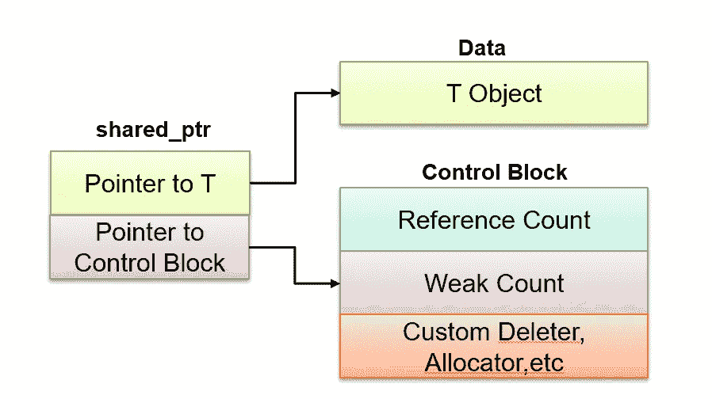

一个指向 T 的指针，另一个指向控制块，其中后者是指向内存的指针，后者对 std::shared_ptr 进行引用计数。

```
· [Overview](#3da7)
· [Item 18:](#0925) Unique_ptr for exclusive-ownership resource management.
  ∘ [An Exclusive Relationship](#901d)
  ∘ [Raw Pointers](#19f7)
  ∘ [The smart pointer](#d8a0)
  ∘ [Custom deleters](#6821)
  ∘ [Custom interface](#df8a)
  ∘ [Tips for Smart Pointers](#78f9)
· [Item 19:](#8f63) Shared_ptr for shared-ownership resource management.
  ∘ [Analogy: Simple reference counting](#cf8e)
  ∘ [Detour: Physical class layout](#f4b0)
· [Item 21:](#5716) Prefer unique_ptr and shared_ptr to direct use of new.
  ∘ [Goal: No raw new or delete](#0242)
  ∘ [Preferred Usage](#9426)
· [Conclusion](#61de)
· [References](#705d)
```

# 概观

让我们继续讨论智能指针:C++中的一个对象，它获得了原始指针的优点，同时克服了它们的缺点。这是该系列的第三部分(参见[第一部分](/smart-pointers-in-cpp-708486276526)【1】和[第二部分](/understanding-smart-pointers-in-cpp-6c3854593503)【2】)。

我们直观地探索 C++中智能指针的概念。我们将参考一本所有 C++开发者都应该熟悉的书，即 Scott Meyers 著的*有效的现代 c++*[3]。

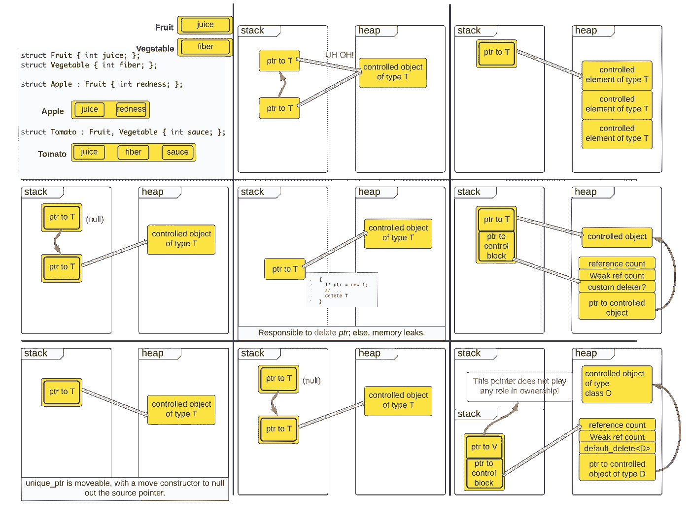

博客中使用的所有可视化效果都是作者使用 [LucidChart](https://lucid.app/) 创建的。

# **第 18 项:**

使用`std::unique_ptr`进行独占资源管理。[3]

## 排他性的关系

动态内存(即动态分配的内存*)可通过[堆](https://www.educba.com/what-is-heap-memory/#:~:text=Heap%20memory%20is%20a%20part,can%20be%20static%20or%20dynamic.)访问。*

## *原始指针*

*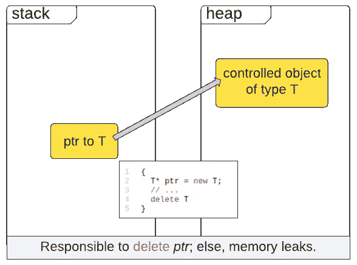*

*任何通过“new”分配给堆内存的指针都必须通过“delete”释放，否则，内存会泄漏。来源— [约瑟夫·罗宾逊博士](https://medium.com/u/8049fa781539?source=post_page-----909512a5eb05--------------------------------)(即作者)。*

## *智能指针*

*回头看看原始指针。*

*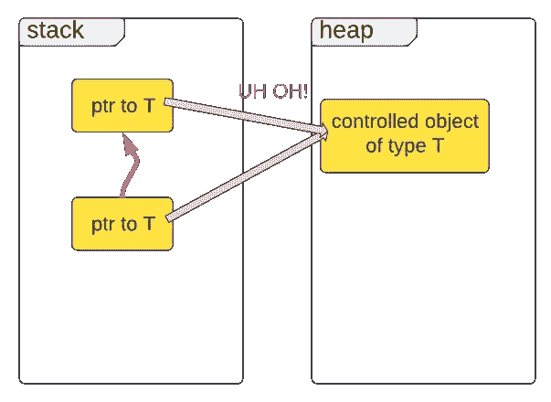*

*原始指针(T*)是可复制的。如果复制了一份，那么这两个人中谁拥有所有权？*

*`**std::unique_ptr<T>**`*

*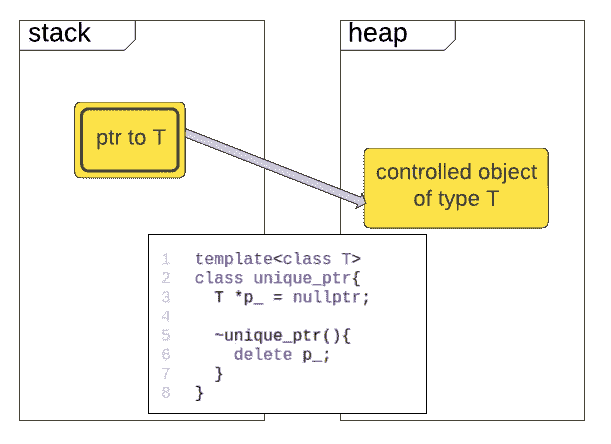**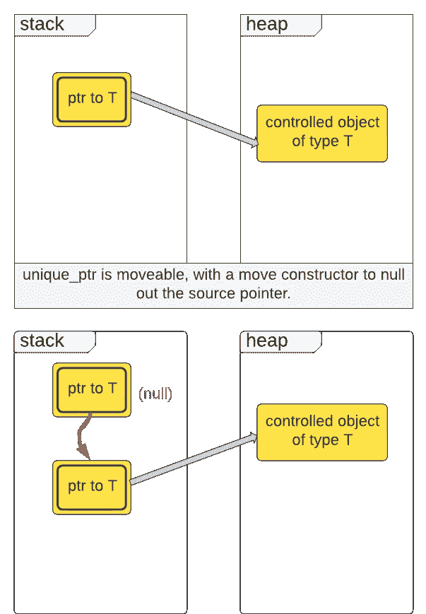*

*`unique_ptr`是可移动的(即只移动)。*

*`**std::unique_ptr<T[]>**`*

*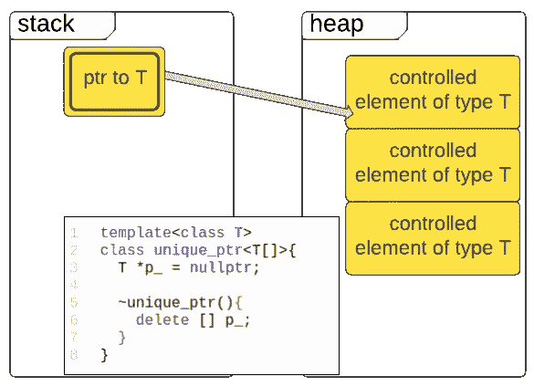*

*数组类型有一个专门化。*

*`**std::unique_ptr<T, Deleter>**`*

*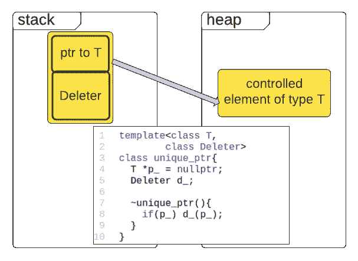**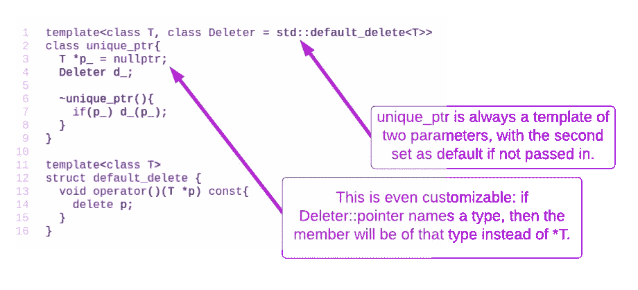*

## *自定义删除程序*

*启用整洁的事物。*

## *自定义界面*

*与 C 语言编程 OpenSSL 接口。*

*让我们看看我们的构造函数:*

*   *按值接受`unique_ptr`。*
*   *通常，通过值获取指针所有权的函数被称为接收器。*
*   *`unique_ptr` *汇*按所有权传递转移。*
*   *调用构造函数需要一个`unique_ptr`。因此，一个人必须拥有`X509_REQ`结构的*所有权*。通过按值获取`unique_ptr`(即通过`move`)，构造函数表明它*获得了那个`X509_REQ`的所有权*。*
*   *请注意，`unique_ptr`是低级、非 RAII、原始资源(`X509_REQ`)和高级 RAII 对象(`MyCSR`)之间的粘合剂。*

## *智能指针提示*

*—将智能指针类型视为原始指针类型。*

*   *按值传递。*
*   *按值返回(当然)。*
*   *通过引用传递指针通常是一种代码味道。*

*—智能指针也是如此。*

*   *以`unique_ptr`为值的函数显示 ***所有权转移*** 。*
*   *甚至显示出 ***什么*** 责任被转移，因为责任被编码在`deleter`类型中。*
*   *通常，职责是简单地调用`delete`。*

*—智能指针是经常实现的细节和粘合剂。*

*   *将`unique_ptr`或`shared_ptr`烘焙成 ***接口*** 可能会有代码味。使用类似于`MyCSR`的类来代替。*

# ***第 19 项***

***使用** `**shared_ptr**` **进行共有资源管理。[3]***

*`shared_ptr`和`unique_ptr`表面相似。*

*然而，它比这复杂得多。*

*`shared_ptr`表示共有*所有权*。具体来说， ***引用计数*** 。*

## *类比:简单的引用计数*

> *最后一个离开房间的人请关灯好吗？*

*假设是一个很大的房间，你怎么知道你是不是最后一个？*

*在进入时，所有的受试者都要在罐子里放一个代币。然后，在离开时，每人拿回一个代币。所以**最后**令牌表示你是最后一个人。*

*请注意，在我们的计划中，所有人都必须合作。任何没有留下令牌就进入的人都有被留在黑暗中的危险！*

*让我们看看它的成员:*

*那`shared_ptr<int>`呢？我们可以在哪里存储 int 对象的引用计数？*

*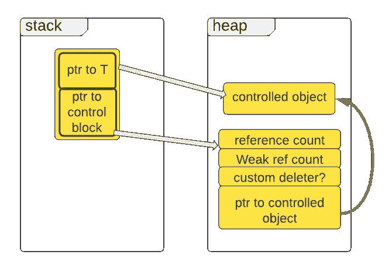*

*`'shared_ptr'`将参考计数存储在单独的“控制块”中*

***复制一个***

*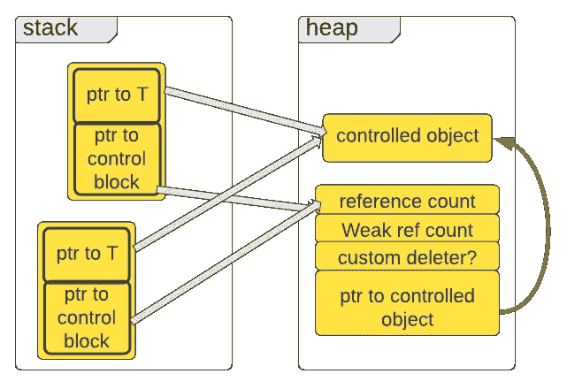*

*当`shared_ptr`已经持有一个指针时，为什么控制块还需要一个指向被控对象的指针？*

## *迂回:物理类布局*

***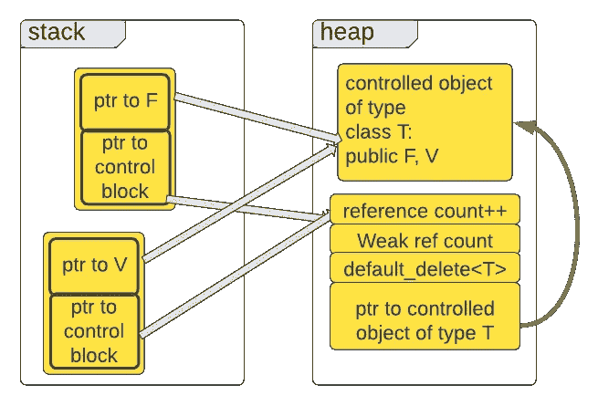*

*`**shared_ptr**`**--**-`**deleter."**`*

*与`unique_ptr`不同的是，`shared_ptr`在物理堆分配的对象和所有权的概念之间放置了一个间接层。*

*`shared_ptr`实例实质上参与了**控制块**的引用计数*所有权*。控制块本身是“删除受控对象”的唯一仲裁者*

*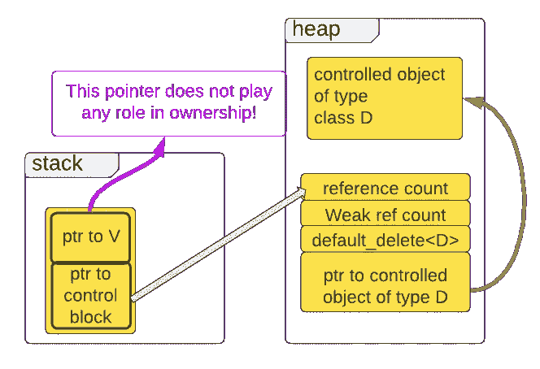*

# ***第 21 项:***

***更喜欢**`**unique_ptr**`**`**shared_ptr**`**直接用** `**new**` **。[3]*****

## ***目标:无 raw `new`或`delete`***

***C++内存管理第一法则:(1)每一个`new`都必须有一个匹配的`delete`，反之亦然。***

***C++内存管理的第二条规则:(2)停止使用手动调用`delete`！使用智能指针，其析构函数会在适当的时候自动调用`delete`。***

***但是如果我们停止写作`delete`...根据第一条规则，我们不能停止写作吗？***

***请注意，正在调用“new ”:我们希望避免这种情况。***

***运筹学***

***“new”作为输入传递给“shared_ptr”构造函数。下一节是首选用法，在这里任何时候都不调用“new”。***

***是啊！如果我们不打算写`delete`，那么就停止写`new`。***

***每当我们堆分配一些东西时，我们将使用一个工厂函数返回已经包装在智能指针中的东西 ***。******

***我们不应该用手去触摸原始指针。***

## ***首选用法***

***不需要开发人员称之为“新”太棒了。！***

***`**make_shared**` **甚至可以优化。*****

***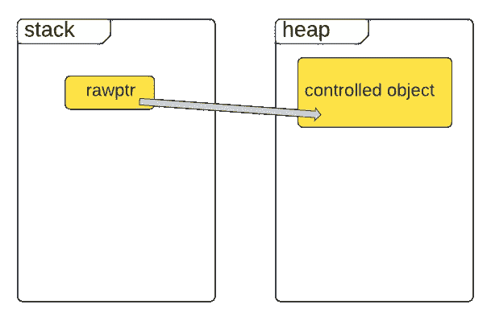***

```
***💡 `unique_ptr<T>` is implicitly convertible to `shared_ptr<T>`...*** 
```

***从 unique_ptr 强制转换共享指针，而不是相反。***

***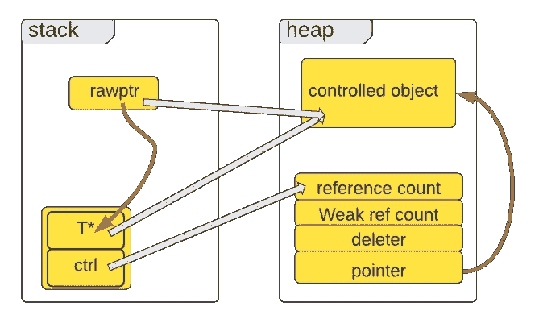***

# ***结论***

## ***使用`make_shared and make_unique`***

*   ***`make_shared`和`make_unique`包生`new`，正如`~shared_ptr`和`~unique_ptr`包生`delete`。***
*   ***永远不要用手触摸原始指针，然后永远不需要担心它们会泄漏。***
*   ***`make_shared`可以进行性能优化。***

# ***参考***

***[1] [**理解 C++中的智能指针**](/smart-pointers-in-cpp-708486276526)***

***[2] [**现代 C++:仔细看看智能指针**](/understanding-smart-pointers-in-cpp-6c3854593503)***

***[**【3】有效的现代 C++**](https://www.oreilly.com/library/view/effective-modern-c/9781491908419/)***

## ***额外资源***

***可视化效果和一些例子的灵感来自于 Arthur O'Dwyer 的伟大演讲，YouTube 上的*回到基础:智能指针*:***

***Yusuf Aksoy 关于 STL 函子的博客:***

***[](https://medium.com/@yusufaksoyeng/function-objects-functors-in-c-62e6b9cb8876) [## C++中的函数对象(函子)

### 在这篇博文中，我想解释什么是函数对象，以及它们如何被用来解决不同的…

medium.com](https://medium.com/@yusufaksoyeng/function-objects-functors-in-c-62e6b9cb8876) 

C++20 中引入的新特性，例如由 [Gajendra Gulgulia](https://medium.com/u/74161854f6a1?source=post_page-----909512a5eb05--------------------------------) 撰写的关于*概念*的博客系列

[](https://ggulgulia.medium.com/c-20-concepts-part-1-the-basics-40f051c72776) [## C++ 20 概念:第 1 部分(基础)

### 用本文中的简单例子编写您的第一个概念

ggulgulia.medium.com](https://ggulgulia.medium.com/c-20-concepts-part-1-the-basics-40f051c72776) 

更完整的 C++指南，如 Syed Khizaruddin 的系列文章，

[](https://khizaruddins.medium.com/c-complete-developer-guide-part-1-124d2298c98b) [## C++:完整的开发人员指南—第 1 部分

### C++所有编程语言之母

khizaruddins.medium.com](https://khizaruddins.medium.com/c-complete-developer-guide-part-1-124d2298c98b) 

还有更多+更多即将到来！

```
**Want to Connect?**Follow Dr. Robinson on [LinkedIn](https://www.linkedin.com/company/superannotate/), [Twitter](https://twitter.com/jrobvision), [Facebook](https://www.facebook.com/superannotate), and [Instagram](https://www.instagram.com/doctor__jjj/).Visit my homepage for papers, blogs, email signups, and more!
```

[](https://www.jrobs-vision.com/) [## 人工智能工程师|约瑟夫·p·罗宾逊

### 问候！我是 Vicarious Surgical 的人工智能工程师，致力于推进下一代外科机器人技术。我的…

www.jrobs-vision.com](https://www.jrobs-vision.com/)***