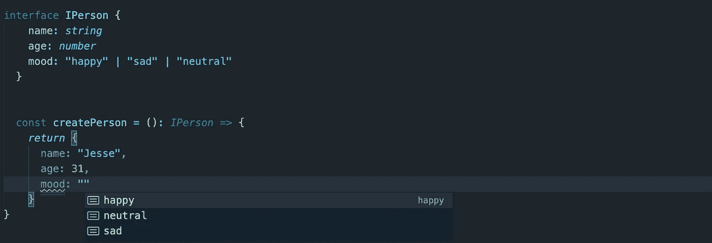
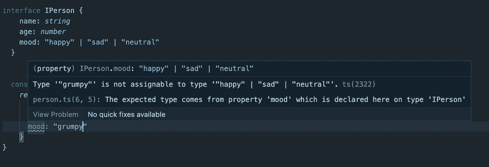

# 了解 TypeScript 中的字符串文字

> 原文：<https://betterprogramming.pub/understanding-string-literals-in-typescript-72862ecfca3e>

## 它们用法的简要指南

由[新非洲](https://stock.adobe.com/contributor/293582/new-africa?load_type=author&prev_url=detail)

我想回顾一下我一直在使用的 TypeScript 中的一个特性；它被称为字符串类型。如果您需要向接口添加一个简单的类型，它们是枚举的一个很好的替代品。在这篇文章中，我将介绍什么是字符串文字，如何使用它们，以及为什么我有时选择它们而不是枚举。

# 什么是字符串文字？

字符串文字类型属于文字类型类别。文字类型允许您在类型位置引用特定的字符串或数字。在这篇文章中，我将集中讨论字符串文字，但是同样的原理也可以用于数值文字。

实际上，字符串文字允许您将特定的字符串设置为一种类型。

在上面的例子中，我有一个带有`name`、`age`和`mood`的个人界面。`Name`和`age`使用原型，但是`mood`使用字符串。创建字符串文字的语法类似于联合类型。

现在，当与`person`对象交互时，您只能将`mood`的值设置为接口中定义的一个字符串。

如果我试图添加一个不包含在接口中的值，我的 IDE 将显示一个错误。

# 什么是字符串文字？

当我使用响应类型与字符串格式匹配的外部 API 时，我发现字符串很有用。我最近构建了一个与 Mailchimp Webhooks 的集成。webhook 响应有效载荷有一个名为`type`的字段，可以是`profile`、`subscribe`或`unsubscribe`。

在设置响应接口时，字符串是响应类型的一个很好的选择。

字符串文字对于计划使用选择控制机制(如 switch 语句或 if 块)的类型也是理想的。

# 为什么不使用枚举？

你可能想知道为什么我会在上面的例子中选择字符串而不是枚举。我选择不使用枚举的主要原因是它的易用性。如果我要使用一个枚举，它将需要一个额外的接口导入和选择检查。

枚举定义:

界面:

选择逻辑:

# 何时使用枚举？

当我考虑在字符串文字上使用枚举时，我想到了两个因素。

第一个是，我的类型将有多少字段？在切换到枚举之前，我通常将字符串限制在五个值左右。对我来说，这是一个可读性的问题。

上面的例子显示了十个。我过去曾用大约 50 个值处理 enums。

另一个因素是该类型是否作为枚举存在于其他地方。如果我正在做的项目有一个已经定义了枚举的 API，我会尽力模仿 API 结构来提高一致性。如果另一个开发人员需要在前端做一些工作，并将类似的定义类型视为后端，他们应该更容易理解数据结构和类型。

如果我有一个带有 person 类的后端 API 被发送到前端，我会尽力复制这个结构。

## 包扎

字符串文字是 TypeScript 中的一个很好的特性。我希望这篇文章能给你提供一些信息，并启发你如何使用它们。