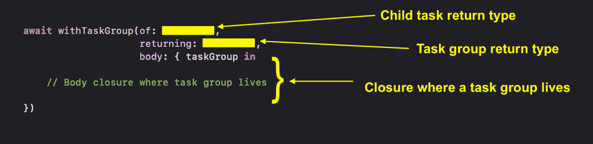
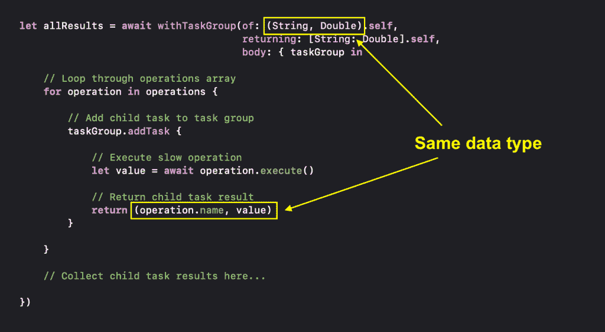
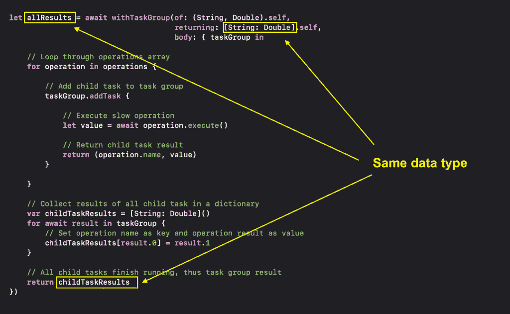

# 了解 Swift 5.5 任务组

> 原文：<https://betterprogramming.pub/understanding-swift-5-5-task-groups-f49fe7c5f873>

## 在您的 iOS 模块中创建子任务并有效收集结果


由 [Element5 数码](https://unsplash.com/@element5digital?utm_source=medium&utm_medium=referral)在 [Unsplash](https://unsplash.com?utm_source=medium&utm_medium=referral) 上拍摄

苹果在 Swift 5.5 中引入了任务组，作为 Swift 并发框架的重要组成部分之一。顾名思义，任务组是并发运行的子任务的集合，只有当它的所有子任务完成执行时，它才会返回。

在本文中，我将向您展示如何创建一个任务组，向任务组添加子任务，并从所有子任务中收集结果。涉及的话题太多了，让我们开始吧。

# 做好准备

像往常一样，我将使用一些样本代码来解释并帮助您理解任务组在 Swift 中是如何工作的。在深入研究任务组之前，让我们首先定义一个贯穿本文的操作结构。

`SlowDivideOperation`是一个简单的结构，它包含一个基于给定数字执行除法运算的`execute()`函数。请注意，我故意让它在除数之前休眠一段时间来降低执行速度。

这使我们能够很好地控制除法运算应该执行多长时间。因此，允许我们容易地观察当多个`SlowDivideOperation`在一个任务组中同时运行时会发生什么。

说完这些，让我们直接进入任务组。

# 任务组行为

为了让我们能够正确使用任务组，我们需要了解一些任务组行为:

1.  任务组由一组相互独立的异步任务(子任务)组成。
2.  添加到任务组的所有子任务开始自动并发运行。
3.  我们无法控制子任务何时完成执行。因此，**如果我们希望子任务以特定的顺序完成**，我们就不应该使用任务组。
4.  任务组仅在其所有子任务完成执行时返回。换句话说，一个任务组的所有子任务只能存在于其任务组的范围内。
5.  任务组可以通过返回值、返回 void(非返回值)或抛出错误来退出。

既然您已经了解了任务组的行为，是时候编写一些 Swift 代码了。

# 创建任务组

要创建任务组，我们可以使用 Swift 5.5 中引入的`withTaskGroup(of:returning:body:)`或`withThrowingTaskGroup(of:returning:body:)`功能。因为我们想要创建的任务组不会抛出任何错误，所以我们将在示例代码中使用`withTaskGroup(of:returning:body:)`变体。当被调用时，它采用以下形式:



使用 TaskGroup 调用(的:返回:正文:)

在我们的例子中，我们将创建一个任务组，它产生多个子任务，这些子任务执行一个`SlowDivideOperation`并返回它的名称和结果。当所有的`SlowDivideOperation`完成后，任务组将收集其所有的子任务结果，并返回一个包含所有`SlowDivideOperation`名称和结果的字典。

考虑到这一点，我们可以使用如下函数创建一个任务组:

注意，任务组的一个实例作为`body`闭包的一个参数给了我们。在下一节中，我们将看看如何利用这个任务组实例来生成多个并发运行的子任务。

# 行动中的任务组

假设我们有一个如下所示的`SlowDivideOperation`数组:

然后，我们可以通过遍历`operations`数组向任务组添加子任务:

值得一提的是，我们在子任务操作闭包中返回了一个由`String`和`Double`组成的元组，它与我们之前设置的子任务结果数据类型相匹配。



匹配子任务返回类型

如前所述，所有子任务将并发运行，我们无法控制它们何时结束运行。为了收集每个子任务的结果，我们必须像这样遍历任务组:

注意，我们在循环时使用了关键字`await`来表示`for`循环可能会在等待子任务完成时挂起。每次子任务返回时，`for`循环都会迭代更新`childTaskResults`字典。

一旦所有子任务执行完毕，`for`循环将退出并返回任务组结果。您可能已经注意到，`childTaskResults`的数据类型必须与我们之前设置的任务组结果类型相匹配。



匹配任务组结果类型

> **亲提示:**
> 
> 如果有不返回值的任务组或子任务，使用`Void.self`作为结果类型。

在使用我们的示例代码之前，让我们在触发任务组之前和之后添加一些打印语句，以检查最终结果和执行所有子任务所需的时间。下面是完整的示例代码:

如果我们尝试执行上面的代码，我们得到的输出将是这样的:

```
Task start   : 2021-10-23 05:53:15 +0000
Task end     : 2021-10-23 05:53:20 +0000
allResults   : ["operation-1": 2.0, "operation-2": 4.0, "operation-0": 5.0]
```

如您所见，整个任务组花了 5s 才完成。事实上，5s 也等于所有`SlowDivideOperation`中最长的睡眠持续时间，这表明所有子任务实际上是并发运行的。

如果您看一下`allResults`，您会注意到它包含了所有子任务的结果。这进一步证明了一个任务组只有在它的所有子任务完成运行时才返回。这也表明子任务只能存在于任务组的上下文中。

如果您想试用本文中的示例代码，您可以在这里获得它[。](https://github.com/LeeKahSeng/SwiftSenpai-Swift-Concurrency)

# 包扎

在本文中，我向您展示了如何创建任务组，如何向任务组添加子任务，以及如何从任务组的子任务中收集结果。在我的下一篇文章中，我将讨论任务组中的错误处理。敬请期待！

欢迎在 [Twitter](https://twitter.com/Lee_Kah_Seng) 上关注我，这样你就不会错过我即将发布的任何与 iOS 开发相关的文章。

感谢阅读。