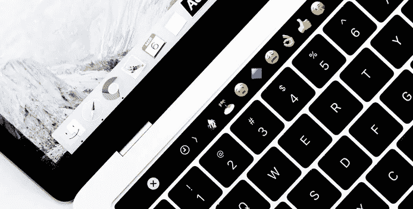
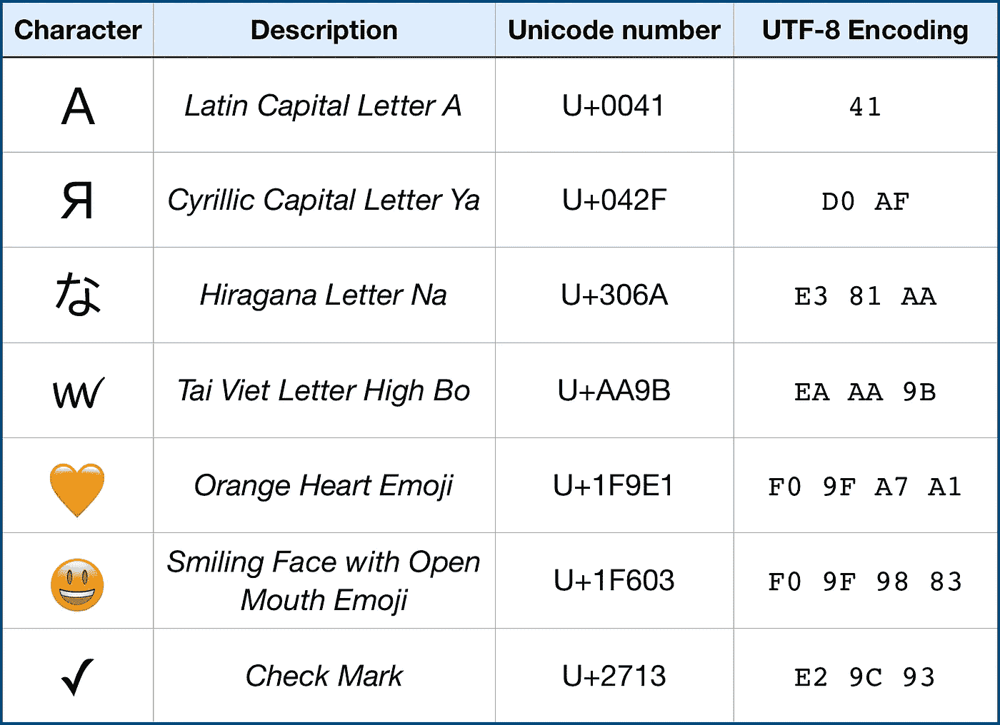
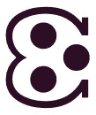
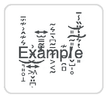

# 理解 Swift 字符串、表情符号、字符和标量

> 原文：<https://betterprogramming.pub/understanding-swift-strings-characters-and-scalars-a4b82f2d8fde>

## *使用表情符号作为一个有趣而简单的例子，了解 Swift 如何处理角色*



[iabzd](https://unsplash.com/@iabzd?utm_source=unsplash&utm_medium=referral&utm_content=creditCopyText) 在 [Unsplash](https://unsplash.com/s/photos/emoji?utm_source=unsplash&utm_medium=referral&utm_content=creditCopyText) 上拍摄的照片

字符和字形之间的关系可能有点混乱。通过使用表情符号并观察 Swift 处理它们的方式，我们将深入这个主题。假设你想检查一个字符串是否包含一个或多个表情符号，你会怎么做？

# 表情符号的一点背景

The word comes from two Japanese words: 絵 meaning *picture* (e) and 文字 meaning *character* (moji/mohdzi). The fact the word might make you think of *emoticon* or *emotion* is purely coincidental.

它们存在的时间比你想象的要长。虽然它们在 2010 年左右在全球范围内流行，但自 1997 年以来，它们就已经在日本使用了。从不到 80 个符号开始，表情符号集已经发展到包含超过 1200 个图标。

2010 年也是第一套表情符号被加入 Unicode 标准的一年。Unicode 是一种行业标准，旨在统一文本的处理和表示。它还包含了一个来自世界各地书写系统的字符索引，包括现代和古代的。这个标准还在不断发展——在撰写本文时的最新版本(12.1)包含了将近 138，000 个字符。



以下是 Unicode 标准中定义的一些字符示例

该标准不仅包括世界各地字母表中的字符，还包括不可见且不能独立使用的特殊字符。我们稍后会谈到这一点。

我强烈推荐查看一下 [Unicode 字符表](https://unicode-table.com/en/)来了解一下它的规模。只需向下滚动主页上的表格，即可发现各种组合和可能性。

# 潜入水中

由 Unicode 标准定义的每个字符都有一个十六进制标识符(unicode number ),并且字符被分类成块，例如希伯来语或阿拉伯语。

理解字符、字形和标量之间的区别很重要。Unicode 由 Unicode 数字指定的字符组成。一个字符可以在屏幕上显示，也可以不显示。此外，字符的组合可能导致一个字符出现在屏幕上。Swift 通过稍微不同的定义来区分这三个术语。这是一个相当复杂的故事，但它的要点是:

*   字符串由字符组成
*   字符由 unicode 标量组成
*   每个 Unicode 标量代表一个 Unicode 字符

回到 Unicode 字符。这里有一个例子:[咧着嘴笑的脸](https://unicode-table.com/en/1F600/)(😀)被标识为`U+1F600`并且是表情块*的一部分。*您可以通过多种方式用 Swift 字符串表示表情符号:

```
let smiley1 = “😀” 
let smiley2 = “\u{1F600}” // Hex code, also "😀"
```

> “这样我们就可以找到表情符号的 unicode 区块，并检查某个字符是否来自该区块？”

嗯，没有。

没有一个表情符号。有用于[运输和地图](https://unicode-table.com/en/blocks/transport-and-map-symbols/)、[补充符号和象形图](https://unicode-table.com/en/blocks/supplemental-symbols-and-pictographs/)的独立块，以及[杂项符号和象形图](https://unicode-table.com/en/blocks/miscellaneous-symbols-and-pictographs/)中的一大堆图标。即使我们确定了哪些区块或哪些字符列表是表情符号，它也有可能无法适应未来。该标准一直在发展和扩展。

但是如果你深入挖掘，你会发现最后一块也有奇怪的字符，例如:



[*带三个点的凹口左半圆*](https://unicode-table.com/en/1F543/)

我不确定它应该是什么(除了 Unicode 给出的文字描述)，但我的浏览器肯定不知道如何显示它:


我的浏览器如何呈现上述字符

## 将此应用于代码

在 Swift 4.2 之前，我们只能通过检查 Unicode 编码是否属于某个预定义的 Unicode 块来判断一个字符是否是表情符号。

但是 Swift 5.0 出现了，随之而来的是一个新的`[Unicode.Scalar.Properties](https://developer.apple.com/documentation/swift/unicode/scalar/properties)`类，给了我们一系列的标志来帮助我们弄清楚我们在处理什么。我们可以很容易地获取表示字符串的 Unicode 标量数组。

无聊的谈话已经够多了——这里有一个例子:

```
// Here's our emoji
let smiley = "😀"// Get an iterable of the scalars in our String
let scalars = smiley.unicodeScalars // UnicodeScalarView instance// We have one character, so we'll be getting that one
let firstScalar = scalars.first // is 128512// Note that 128512 is actually the decimal 
// value for hexadecimal 1F600 (the unicode identifier for 😀)// Get the properties
let properties = firstScalar?.properties

// Check if it's an Emoji
let isEmoji = properties?.isEmoji // = true
```

## *找到了！所以我们结束了？*

不，不如这样:

```
// Strangely enough, this will return **true**:
"3".unicodeScalars.first?.properties.isEmoji
```

这是因为标量`3` *可以*呈现为表情符号，尽管在这种特殊情况下它不是。物业`isEmoji`这样真的是误导。幸运的是，还有另一个属性:

```
// This will return true like before:
"😀".unicodeScalars.first?.properties.isEmojiPresentation// And this will return false like we expect:
"3".unicodeScalars.first?.properties.isEmojiPresentation// By the way, that 'Notched Left Semicircle with Three Dots'
// also returns false, as we cannot actually render it:
"🕃".unicodeScalars.first?.properties.isEmojiPresentation// Unfortunately, this doesn't hold true for all emoji:
"🌶".unicodeScalars.first?.properties.isEmojiPresentation *// false* "🌶".unicodeScalars.first?.properties.generalCategory == .some(.otherSymbol) *// true*
```

好多了，对吧？但是我们还没到那一步。也有字符实际上由多个字形组成。请看我们如何用`unicodeScalars.first?`
考虑下面的例子:

```
"1️⃣".unicodeScalars.first?.properties.isEmojiPresentation *// false*"♦️".unicodeScalars.first?.properties.isEmojiPresentation *// false*"👍🏻".unicodeScalars.first?.properties.isEmojiPresentation *// true*"👨‍👩‍👧‍👧".unicodeScalars.first?.properties.isEmojiPresentation *// true*
```

为了解释为什么会出现这种情况，我们来看看`unicodeScalars`属性。属性`unicodeScalars`返回一个`UnicodeScalarView`的实例。

它的`debugDescription`将只产生原始字符串，所以直接检查内容(或记录)并不能提供太多的洞察力。幸运的是，[有一个映射函数](https://developer.apple.com/documentation/swift/string/unicodescalarview/3018490-map)将返回一个常规数组，所以我们最终得到了一个包含`[Unicode](https://developer.apple.com/documentation/swift/unicode).[Scalar](https://developer.apple.com/documentation/swift/unicode/scalar)`元素的数组:

```
// This will create an UnicodeScalarView
let scalarView = "1️⃣".unicodeScalars// Map the view so we get a regular array which we can inspect
let scalars = scalarView.map { $0 }
```

结果包含三个值:

*   十进制 49(十六进制 U+0031):一个普通的旧[数字 1](https://unicode-table.com/en/0031/)
*   十进制 65039(十六进制 U+FE0F): [变化选择器-16](https://unicode-table.com/en/FE0F/)
*   十进制 8419(十六进制 U+20E3): [组合封闭键帽](https://unicode-table.com/en/20E3/)

我们之前提到过这些特殊的标量。所以这些字符的组合被用来形成表情符号，将一个普通的数字`1`变成这个符号。第二个和第三个标量修改初始标量。澄清一下，您也可以使用十六进制 unicode 标识符来手动创建这个组合:

```
"\u{0031}" // turns into: 1"\u{0031}\u{20E3}" // turns into: 1⃣"\u{0031}\u{FE0F}\u{20E3}" // turns into: 1️⃣
```

同样，其他表情符号也可以组合使用:

```
// Black Diamond Suit Emoji
"\u{2666}" // ♦// Adding 'Variation Selector-16':
"\u{2666}\u{FE0F}" // ♦️ // Thumbs up sign:
"\u{1F44D}" // 👍// Adding 'Emoji Modifier Fitzpatrick Type-4':
"\u{1F44D}\u{1F3FD}" // 👍🏽 // Man, Woman, Girl, Boy
"\u{1F468}\u{1F469}\u{1F467}\u{1F466}" // 👨👩👧👦// Adding 'Zero Width Joiner' between each
"\u{1F468}\u{200D}\u{1F469}\u{200D}\u{1F467}\u{200D}\u{1F466}" // 👨‍👩‍👧‍👦
```

是的，那是七个标量组合成一个字符。

最后，值得注意的是，并不是每个由多个标量组成的字符都是表情符号:

```
"\u{0061}" *// Letter: a*"\u{0302}" *//* Circumflex Accent*:* ̂"\u{0061}\u{0302}" *// Combines into: â*
```

**小旁注:**也许你在网上看到过看起来很乱的信息/文本(几乎就像是矩阵中的一个小故障)，看起来像这样:



这通常被称为 [Zalgo](https://zalgo.org) ，实际上只是由许多 Unicode 字符在屏幕上合并成单个字符:

```
 let lotsOfScalars = "E̵͉͈̥̝͛͊̂͗͊̈́̄͜" let scalars = lotsOfScalars.unicodeScalars.map { $0 } // Merge into a string, adding spaces to see them individually
// This will result in: E  ̵  ͛  ͊  ̂  ͗  ͊  ̈́  ̄  ͜  ͉  ͈  ̥  ̝
let scalarList = scalars.reduce("", { "\($0)   \($1)" }) 
```

# 获取正确的信息

让我们结合这些信息，向字符和字符串类添加一些助手属性。我们将:

*   检查一个字符是否正好是一个标量，将作为表情符号呈现
*   检查一个字符是否由多个标量组成，这些标量将被组合成一个表情符号

```
extension Character {
  var isSimpleEmoji: Bool {
    guard let firstScalar = unicodeScalars.first else {
      return false
    }
    return firstScalar.properties.isEmoji && firstScalar.value > 0x238C
  }var isCombinedIntoEmoji: Bool {
    unicodeScalars.count > 1 && unicodeScalars.first?.properties.isEmoji ?? false
  }var isEmoji: Bool { isSimpleEmoji || isCombinedIntoEmoji }
}
```

接下来，我们将向字符串添加一些计算属性，以访问我们的字符扩展:

```
extension String {
  var isSingleEmoji: Bool {
    return count == 1 && containsEmoji
  } var containsEmoji: Bool {
    return contains { $0.isEmoji }
  } var containsOnlyEmoji: Bool {
    return !isEmpty && !contains { !$0.isEmoji }
  } var emojiString: String {
    return emojis.map { String($0) }.reduce("", +)
  } var emojis: [Character] {
    return filter { $0.isEmoji }
  } var emojiScalars: [UnicodeScalar] {
    return filter { $0.isEmoji }.flatMap { $0.unicodeScalars }
  }
}
```

现在，检查我们的表情符号字符串变得非常简单:

```
"â".isSingleEmoji // false
"3".isSingleEmoji // false
"3️⃣".isSingleEmoji // true
"3️⃣".emojiScalars // [51, 65039, 8419]
"👌🏿".isSingleEmoji // true
"🙎🏼‍♂️".isSingleEmoji // true
"👨‍👩‍👧‍👧".isSingleEmoji // true
"👨‍👩‍👧‍👧".containsOnlyEmoji // true
"🏴󠁧󠁢󠁳󠁣󠁴󠁿".isSingleEmoji // true
"🏴󠁧󠁢󠁥󠁮󠁧󠁿".containsOnlyEmoji // true
"Hello 👨‍👩‍👧‍👧".containsOnlyEmoji // false
"Hello 👨‍👩‍👧‍👧".containsEmoji // true
"👫 Héllo 👨‍👩‍👧‍👧".emojiString // "👫👨‍👩‍👧‍👧""👫 Héllœ 👨‍👩‍👧‍👧".emojiScalars // [128107, 128104, 8205, 128105, 8205, 128103, 8205, 128103]
"👫 Héllœ 👨‍👩‍👧‍👧".emojis // ["👫", "👨‍👩‍👧‍👧"]
"👫 Héllœ 👨‍👩‍👧‍👧".emojis.count // 2"👫👨‍👩‍👧‍👧👨‍👨‍👦".isSingleEmoji // false
"👫👨‍👩‍👧‍👧👨‍👨‍👦".containsOnlyEmoji // true
```

# 总结一下

字符和标量之间有一个重要的区别:基本上，由定义标量的字符串和呈现它的系统来决定标量将产生哪些字符。

虽然 Unicode 将每个代码点定义为一个字符，但 Swift 实际上称这些*标量为*，并使用术语字符来表示标量的组合，这可能导致字符串中的单个字形。我说*可能是*，因为像控制字符(例如`[null](https://unicode-table.com/en/0000/)`和`[backspace](https://unicode-table.com/en/0008/)`)这样的东西会被算作单独的字符。

感谢阅读！