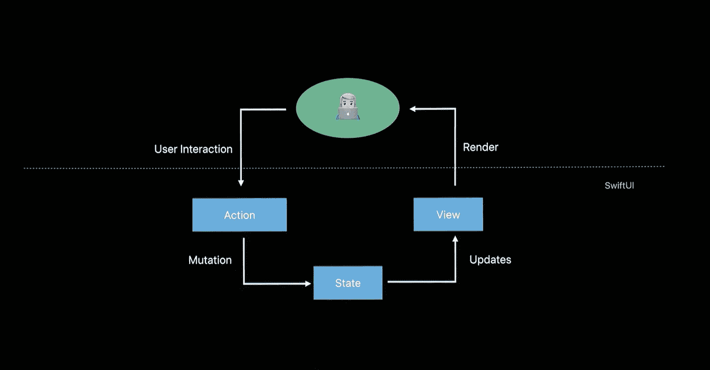

# 了解 SwiftUI 数据流

> 原文：<https://betterprogramming.pub/understanding-swiftui-data-flow-79429a49ae35>

## 一些关键协议和属性包装器的初级读本

摘自 https://developer.apple.com/videos/play/wwdc2019/226/ WWDC 2019 关于 SwiftUI 数据流的主题演讲:

我见过许多人在 SwiftUI 中构建他们的应用程序时遇到困难——因为这是一个全新的范例，而且因为它几乎没有官方文档。我想通过这篇文章来分享 SwiftUI 所公开的各种属性包装器的用例，以帮助您的应用程序中的数据流。

即使有点过时(因为 SwiftUI 已经收到了很多重构)，我也不能充分推荐 2019 年关于 SwiftUI 数据流的 WWDC 会议。正是由于这次会议，我第一次掌握了 SwiftUI 的全部功能，并启动了 [MovieSwiftUI](https://github.com/Dimillian/MovieSwiftUI) 。

 [## 通过 SwiftUI 的数据流- WWDC 2019 -视频-苹果开发者

### SwiftUI 是从头开始构建的，让您可以编写漂亮而正确的用户界面，避免不一致…

developer.apple.com](https://developer.apple.com/videos/play/wwdc2019/226/) 

你得看看苹果的 SwiftUI 数据流文档，是最新的，一点也不差。它有些缺乏具体的例子，这是我在本文中试图提供的。

 [## 状态和数据流

### 状态和绑定将视图连接到应用程序的基础数据模型。当您声明一个状态时，SwiftUI 会存储它以用于…

developer.apple.com](https://developer.apple.com/documentation/swiftui/state_and_data_flow) 

# 可观察物体

`[ObservableObject](https://developer.apple.com/documentation/combine/observableobject)`是一个协议，是[组合](https://developer.apple.com/documentation/combine)框架的一部分。要使用它，您只需将协议添加到您的模型类，然后标记`@Published`您希望 SwiftUI 在该模型中观察的任何属性。

## 什么时候用？

这是一个很好的协议，可以在您的视图模型上使用，或者如果您没有或不需要视图模型，可以直接在您的模型上使用。基本上，任何需要保存您将在视图中直接使用的属性的对象都应该用`@Published`标记/包装在`ObservableObject`中。你可以把它看作 SwiftUI 模型基类——尽管它是一个协议，而不是一个类。

# @ObservedObject

您可能已经猜到，这个属性包装器将在 convert 中与符合`ObservableObject`的 ViewModel 类一起使用。它会将您的对象包装成一个动态视图属性，允许 SwiftUI 订阅您的对象，并在您的模型中的某个 `@Published`属性发生变化时使其视图体无效。

## 什么时候用？

每当您需要将一个`ObservableObject`绑定到您的视图时使用它。换句话说，任何时候你都需要更新你的视图。

## 注意

SwiftUI 视图是值类型(因为它们是 Struct ),例如，如果视图是由父视图重新创建的，那么它不会将您的对象保留在其视图范围内。所以最好通过引用传递那些可观察的对象，并有一种容器视图，或 holder 类，它将实例化和引用那些对象。如果该视图是对该对象的唯一引用，并且因为 SwiftUI 更新了其父视图而重新创建了该视图，那么您将丢失您的`ObservedObject`的当前状态。

# @州

`[@State](https://developer.apple.com/documentation/swiftui/state)` 一个在 SwiftUI 中会经常用到的属性包装器。它创建一个持久值(在视图刷新之间持久)。如上所述，理解 SwiftUI 视图是结构并且它们是值类型是很重要的——swift ui 可以出于任何原因随时重新创建您的视图。因此，按照设计，视图中的所有属性都是不可变的，并且会在视图被重新创建时被重新创建——例如，仅仅因为父视图决定这样做。您可以将其视为本地视图状态。

因此，如果您想为这个视图创建一个本地的、持久化的值，您可以改变它(然后触发一个视图更新)，您可以使用`@State`属性包装器。额外的好处是，SwiftUI 还会订阅它，并在视图或绑定发生变化时，使视图的相关部分失效并刷新。

正如您在下面这段代码中看到的，SwiftUI 的`Tabbar`组件`TabView`接受一个绑定，您可以通过使用`$`从`@State`属性生成绑定。我们将在下一节中更多地讨论绑定。

## 什么时候用？

任何时候你需要存储和持久化一个与你的视图相关的状态。您需要将`@State`属性包装器视为需要持久化的特定于视图的本地数据。它可以是`Tabbar`的选中标签，或者是`TextField`的文本值，或者是`Image`视图的`UIImage`值。还有一个`Bool`值，用于控制`.sheet`、`.popover`或`.actionSheet`是否出现。

# @绑定

属性包装器是一种创建双向连接的方法，该连接指向由其他东西管理的值。它很可能是来自父视图的`@State`——这是使用它的最常见方式。

在上面的代码中，你可以看到我的`NotificationBadge`组件——把它想象成一个烤面包机，当用户做一些动作时，它会在屏幕底部显示几秒钟。

isShown `Bool`属性通过绑定传递。这意味着当你创建一个`NotificationBadge`视图时，你需要传递一个由`@State`控制的`Bool`。您可以使用`$`从一个状态创建一个绑定。您也可以手动创建一个绑定(稍后将详细介绍)，或者从一个`ObservableObject` `@Published`属性创建一个绑定。

您还可以改变绑定值。例如，我可以在我的`NotificationBadge`组件中使用`isShow.value = false`将其转换为 false。这将使`State`变异，因此它更新了`NotificationBadge`和父视图状态。

以下是如何使用 NotificationBadge 的示例

## 什么时候用？

上面的例子是一个很好的例子。`Binding`通常用于传递一个由父视图控制和持久化的值，当这个值改变时使你的视图失效。是`TextField`、`Toggle`、自定义组件等的好工具。通过传递一个`@State`作为绑定，您可以在复杂的视图层次结构中传播更改和创建关系，同时确保只有一个视图保持其值。

## **手动创建绑定**

你也可以自己创建一个`Binding<Value>`。Apple 为此提供了一个非常方便的 init 方法。这个特性的强大之处在于，当值被设置并从您选择的存储器中读取时，您可以触发动作和副作用。在我的例子中，我主要使用它来绑定到存储在我的`AppState` redux 存储中的一个值，并在它被设置时分派期望的动作。这是我的上下文菜单的一个例子:

如您所见，我在按钮操作中切换绑定，这将分派我的商店的操作，并将绑定值更新为所需的布尔值，这最终将更新我的视图。干净简单。

# @环境对象

 [## 环境对象

### 一种动态视图属性，使用祖先视图提供的可绑定对象来使当前视图无效…

developer.apple.com](https://developer.apple.com/documentation/swiftui/environmentobject) 

`@EnvironmentObject`是一个属性包装器，如果您向当前视图层次结构的任何父视图提供一个`.environmentObject()`就可以使用它。

你提供的对象必须符合`ObservableObject`，如果你提供了你的应用的根视图，如下面的示例代码，它将在你的应用的任何视图中可用。如果你想在应用程序的整个生命周期中拥有一个可用的对象，这是一个强大的工具。

在我使用的 Redux 模式中，我注入了整个持有`AppState`的`store`，所以我可以在任何视图中访问它。

然后，在任何视图中，您都可以使用`@EnvironmentObject` 属性包装器。您的视图订阅它，并根据您从对象中获得的数据更新它的内容。

在上面的代码中，我使用了属性包装器，所以我的视图可以访问并订阅在根视图中注入的`EnvironmentObject`。

## 什么时候用？

上面的例子就是一个很好的例子。我的存储保存了对我的应用程序至关重要的模型和数据，因此让它始终注入和可用是有意义的。我的观点将随着它的更新而更新。

这基本上是一个依赖注入系统，所以它也是一个强大的预览和调试工具。例如，我注入了一个样本存储，这样我就可以模拟数据，而无需启动网络查询。

您还可以为您的 UI 注入自定义值——可能是动态调色板。也许还有一些数据库管理器，它将在他持有的包装了`@Published`属性的对象中发布结果。

`EnvironmentObject.`有很多很多可能性，如果你熟悉 Swift 上的其他依赖对象库，你会很快看到它能打开的大门。

如果没有，这是为应用程序中使用的模型提供某种持久性的最佳位置，而不是，例如，单一变量或全局变量。

# 结论

我希望这篇文章对 SwiftUI 数据流这个大主题有所启发。虽然 UIKit 在这个主题上没有施展任何魔法，但是 SwiftUI 提供了许多工具，并且在某种程度上，它比 UIKit 更“在轨道上”。这有点难掌握，但是一旦你开始熟练使用它，你的应用程序就会像变魔术一样工作并更新它们的视图！

在我看来，它还能让开发人员花更少的时间设计他们的模型层，而花更多的时间在 UI 上。如果您正确使用这些工具，您可以删除大量杂乱的代码、手动绑定、通知、委托、闭包完成处理程序等。

感谢阅读！