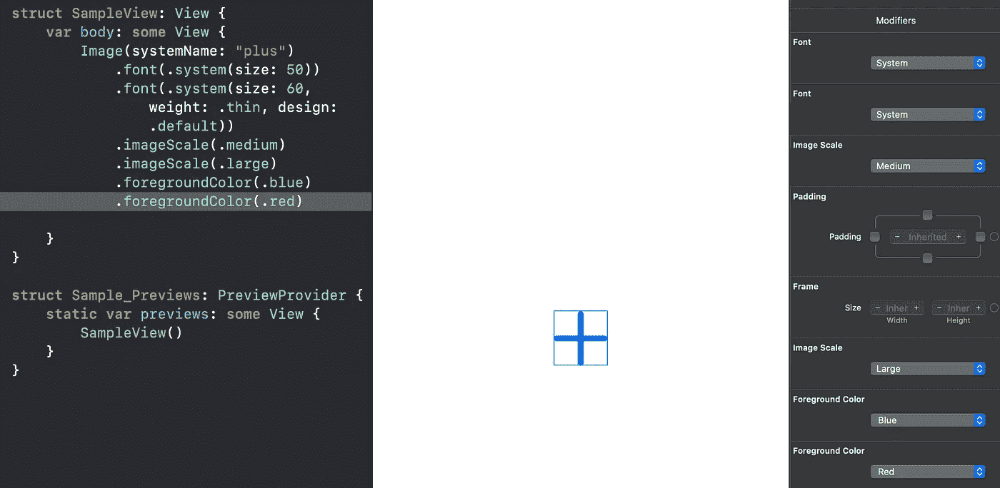
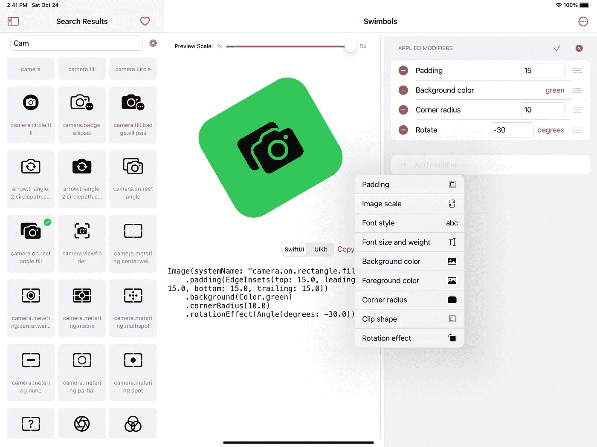

# 了解 SwiftUI 修饰符

> 原文：<https://betterprogramming.pub/understanding-swiftui-modifiers-83ebfbc3f94>

## 以及为什么修改器的顺序很重要

乔纳斯·李在 [Unsplash](https://unsplash.com?utm_source=medium&utm_medium=referral) 上的照片。

苹果开发领域正在进行一场重大的范式转变。多年来，我们习惯了 UIKit 和 AppKit 的命令式编程风格。尽管第三方用不同的风格做了很多尝试，但 UI 框架的这种命令式风格保持不变，而且大多数开发人员都喜欢它。

当苹果在 2019 年推出 SwiftUI 时，未来看起来截然不同。现在都是宣示性的了。不是每个人都从一开始就准备好了，但对于那些投身 SwiftUI 的人来说，这是一个有趣的旅程，尽管偶尔会令人沮丧。随着 SwiftUI 在 2020 年得到的[改进](https://www.hackingwithswift.com/articles/221/whats-new-in-swiftui-for-ios-14)，更多的开发人员将开始他们的声明式 UI 框架之旅。

让我们尝试探索 SwiftUI 最重要的部分之一的工作方式:修饰符**。**

一个`View`可以有任意数量的修饰符。可以将它们添加到视图中，就像链接多个函数调用一样。每个修改器返回一个`View`，后续修改器将对其进行操作。因此，在使用修饰符时，添加它们的顺序非常重要。让我们看一个例子:

从上面的代码和预览中你可以看到，`cornerRadius`被应用到内部矩形，整个视图被旋转，因为`rotationEffect`修改器是最后一个。现在让我们改变修改器的顺序:

我们现在互换了`rotationEffect`和`cornerRadius`的位置。您可以在结果视图中观察到差异。现在，内部矩形被旋转，外部矩形被圆角化。

在这两个例子中，我们不止一次应用了`background`和`padding`修改器。每一次，他们都会修改视图。现在让我们探索另一组修饰符。

你能告诉我们这些修饰语和我们上面看到的有什么不同吗？

在某些情况下，当您应用同一个修改器两次时，SwiftUI 只采用第一个修改器。上例中的`foregroundColor`修饰符清楚地说明了这一点。这种行为与普通函数(以及大多数 SwiftUI 修饰符)的行为完全相反。

我对这种行为的理解是，当一个修改器在一个视图上不能有一个以上的效果时(例如，任何视图只能有一种前景色)，应用最接近视图的那个。

我找不到任何文档来说明为什么会出现这种情况，以及哪些修饰符会有这样的行为，但是我通过使用 SwiftUI 一年多来已经有了这样的理解。

如果 Xcode 在不止一次添加这种多余的修饰符时给我们提供一个警告，那该有多好？为了实现这一点，除了现有的 Swift 和 Objective-C 编译器之外，Xcode 还需要一个 SwiftUI 编译器。

但是，当我们构建使用 SwiftUI 修饰符的应用程序时，我们肯定可以实现这些。当我第一次想到[解决我在使用 SF 符号](https://medium.com/swlh/re-imagining-sf-symbols-into-xcode-c2ebf92550d9)时遇到的问题时，我设想了一个比 SF 符号 Mac 应用程序和 Xcode 的组合工作流更好的工具。

[**Swimbols**](https://apps.apple.com/app/id1525226399?platform=ipad) 让你立即添加修改器，编辑或重新排序修改器以适应你的需要，并在应用修改器后只需点击一下就可以切换符号。所有的实时预览，你可以复制代码，当你完成了。

当不止一次添加修改器没有意义时，Swimbols 不会在列表中显示它们。你可以添加我们在文章前面讨论过的其他类型的修饰语。

轻松添加修改器并直观地重新排序。

你可以摆弄[泳镜](https://apps.apple.com/app/id1525226399?platform=ipad)并直观地重新排列修改器，看看它们如何立即影响视图。

随着 SwiftUI 的改进，很好地理解基本构建块是有好处的。我希望现在已经清楚了修饰符的顺序是如何影响视图的，以及为什么一些修饰符被多次使用是没有意义的。

编码快乐！