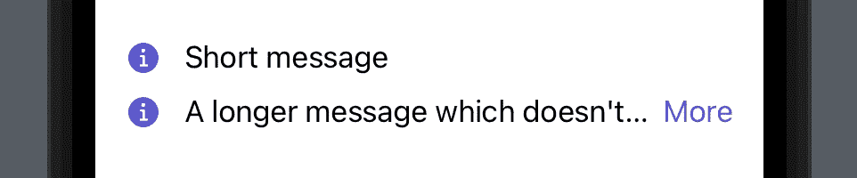

# 了解适合容器的 SwiftUI 视图

> 原文：<https://betterprogramming.pub/understanding-swiftuis-viewthatfits-container-e69d4c7e61e4>

## 学习使用 SwiftUI 的适合容器的视图构建自适应布局。

埃里克·卡里姆·科内利斯在 [Unsplash](https://unsplash.com?utm_source=medium&utm_medium=referral) 上拍摄的照片

从 iOS 16 开始，SwiftUI 提供了一个适合的新布局容器*视图，帮助我们构建适应性布局。*

容器允许我们提供多个视图，同时自动选择第一个适合可用空间的视图。

让我们直接看一个例子，看看容器如何给我们带来好处。

假设我们得到了一个想要显示在彼此下面的消息列表。如果一条消息适合一行，我们就显示它。如果不合适，我们只想显示消息的一部分和一个打开完整消息的按钮。大概是这样的:

正如我们在上面看到的，第一条消息适合可用空间，所以我们不需要按钮。第二行只显示了消息的一部分，并带有一个显示完整消息的按钮。

为了达到这个结果，`ViewThatFits`容器就派上了用场。我们只需要提供两个不同的视图，一个只包含文本，另一个包含文本和按钮。`ViewThatFits`容器会自动为我们挑选合适的。

如上例所示，我们为`ViewThatFits`容器提供了两个视图，一个文本视图和一个包含文本和按钮视图的`HStack`:

作为第一步，`ViewThatFits`容器检查文本视图是否适合其父容器。由于第一条消息是合适的，所以在显示消息时就到此为止了。

注意，通过应用`fixedSize`修饰符，我们告诉文本视图不要换行或截断。

当更长的第二条消息进来时——这不合适——`ViewThatFits`容器转到我们提供的下一个视图，HStack。`HStack`的内容被设计为总是适合的，因为文本现在允许被截断，所以容器选择那个视图，并在按钮旁边向用户显示被截断的文本。

*原载于*[*https://tanaschita.com*](https://tanaschita.com/20220627-understanding-swiftuis-viewthatfits-container)*。*