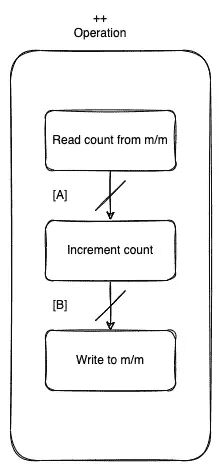
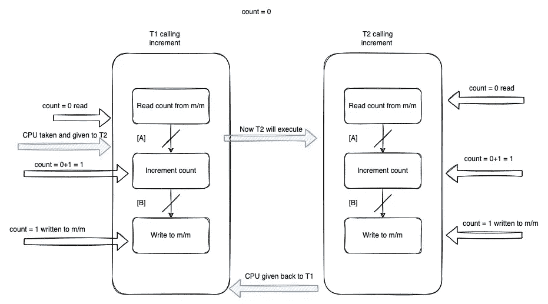
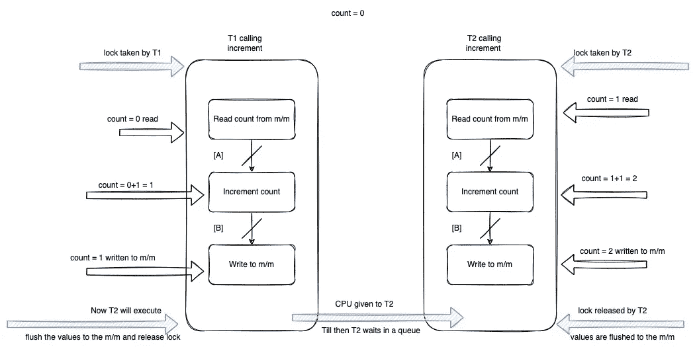

# 理解 Java 中的同步

> 原文：<https://betterprogramming.pub/understanding-synchronization-in-java-b8b84e55e974>

## 如果你想了解同步是如何工作的？它给开发商提供了什么保障？你对什么时候同步对象和什么时候同步类感到困惑吗？这篇文章是给你的。


当一个新的 Java/Kotlin 开发人员第一次遇到线程安全时，`synchronized`关键字是他们学习的第一件事。它看起来很简单，确实如此，但是在使用它之前，您需要了解它的一些注意事项。

多线程是编写快速高效软件的好方法，但是如果使用不当，它可能会成为你遇到的最大的怪物。这可能是最糟糕的噩梦，也可能是极其难以调试的错误的来源，因此在职业生涯的早期阶段获得正确的概念至关重要。本文旨在一劳永逸地奠定正确的基础。

下面的代码将向您展示如果一个线程调用`increment()`方法会发生什么？答案很简单；它会将`count`的当前值加 1。

```
public class SharedResource {

    int count = 0;

    public int get() {
        return count;
    }

    public void increment() {
        System.*out*.println("Reading, and will increment now: "+get()+ " Thread: "+Thread.*currentThread*().getName());
        ++count;
        System.*out*.println("Value after increment: " + count + " Thread: "+Thread.*currentThread*().getName());
    }

}
```

只要我们不在线程间共享这个对象，这段代码就很有效。一旦多个线程共享了`SharedResource`类的实例，并试图调用`increment()`，我们能保证这段代码将正确运行吗？

答案是否定的。

有什么问题？像`++`这样的操作本质上不是原子的(由多个步骤组成),线程在执行时会被抢占(CPU 周期被分配给系统中的另一个线程的状态)。

如果我们正在处理一个多线程应用程序，那么我们应用程序中使用这个共享对象的另一个线程将有机会执行并可能改变`count`的状态。

一个简单的增量操作是三个原子操作的组合，如下所示:



增量操作

操作系统可以在切割点[A]和[B]取走 CPU 份额(时隙)。如果发生这种情况，我们将有并发错误。在下图中，蓝色箭头表示 CPU 调度，当蓝色箭头出现时，我们将移动到不同的线程。



并发错误说明

我们在这里会看到，T1 和 T2 各调用一次增量，但`count`的值仍然是 1。这是一个非常简单的例子，但是你明白了。真实世界的用例可能有许多中间步骤，这些步骤可能会被打断，线程可能会干扰。

最简单的解决方案是什么？大家说说吧。

如果我们不允许一个线程在执行时进入代码的一个特定区域——称为**临界区**——会怎样？这能解决问题吗？不，不完全是，因为多个线程可以在同一个 CPU 的不同内核上执行，这些内核将拥有自己的 L1 缓存(离 CPU 最近，速度最快)，在那里它们可以拥有自己的变量副本。如果 T1/T2 维护它们自己的副本，则线程以独占方式运行，这可能会导致一个问题，因为写入的值不会传回到 CPU 缓存；他们可能会按照旧的价值观行事。

`Synchronize`通过提供一些保证来解决上述两个问题:

1.  **互斥** —保证一次只有一个线程访问临界区。
2.  **可见性** —写入该区域的值将对下一个进入临界区的线程可见。这意味着进入同一个同步块的下一个线程将看到离开临界区的线程所看到的世界(变量值)。
3.  **排序** **和** **发生在**之前——我们不会在本帖中讨论这个问题，因为我们限制了范围。

同步看起来像这样:



同步插图

# 了解监视器

我们知道互斥体是一种不允许多线程在它所保护的区域上运行的构造，但是 Java 的`synchronized`远不止于此——它工作在监视器之上。

Monitor 是一个构造，它允许一个线程同时拥有互斥和通信机制。在 Java 中，我们有`wait()`、`notify()`和`notifyAll()`方法来帮助线程相互通信。

当您使用如下所示的`synchronized`关键字时，每个 Java 对象都被绑定到一个监视器:

```
synchronized (this) {
    *// block of code* }
```

您将可以访问与该对象相关的监视器区域`this`。因此，如果一个线程正在这个监视器中执行代码，那么在这个对象上同步的任何其他代码都将等待。

例如，如果我们有两个在不同监视器上工作的块，在第一种情况下，该方法在最终对象上同步。代码如下:

```
private final Object mLock = new Object();
public int get() {
    synchronized (mLock) {
        *// do something* }
    return something;
}
```

在第二种情况下，它同步对象实例`this`。

```
public void increment() {
    synchronized (this) {
        *// block of code* }
    ++count;
}
```

在上面的场景中，两个线程可以并行执行这些方法。T1 可以执行`get()`，T2 可以执行`increment()`。理解这一点很重要。

我们已经学习了互斥属性，但是现在我们将看到这个简单结构的不同风格如何带来不同的行为。

# 不同风格的同步

1.  `synchronized (this)` —监视器与方法所属的对象相关联。

如果您创建了一个共享资源的对象，并与多个线程共享它，那么只有一个线程能够独占地执行与该技术同步的方法，但是为什么呢？因为所有线程共享同一个对象，并且锁定是在这个对象上完成的。

如果我们创建`n`对象并与不同的线程共享每个对象，那么所有的线程将能够执行这个方法，因为每个线程持有不同的对象，并且`this` 对于每个线程将是不同的。

如果我们想要这样的功能，无论我们创建多少个`SharedResource`对象，对方法的访问都是互斥的，该怎么办？我们继续下一个口味。

2.`synchronized (SomeClass.class)`——这是课堂上同步的。如果一个方法使用了这一点，无论 JVM 上有多少对象实例，每个实例都由不同的线程共享，但是只有一个实例能够执行这样保护的方法。

这使得同一类的不同实例之间能够互斥。我们在使用 DCL 创建单例时使用这个，对吗？

3.`public **synchronized** someMethod() { }` —与 synchronized (this)相同，但它同步整个方法，而不是一个小块。如果我们需要保护整个方法，那么我们使用这个味道。如果需要保护该方法的一小部分，它应该使用我们在第一种情况中展示的同步块。

# 性能影响

正如我们已经看到的，在`synchronized`的情况下，我们知道如果一个线程处于临界区，其他线程必须等待。因此，由于等待时间和从/向 m/m 的额外读取和写入，它稍微减慢了执行速度。

在最近的开发中，在只有一个线程的情况下，Java 团队已经大大降低了性能成本。但是万一发生争用，成本还是有的。因此，在代码中添加同步时，请始终考虑利弊。我们将在另一篇文章中讨论这方面的优化。

希望你喜欢你所读的！