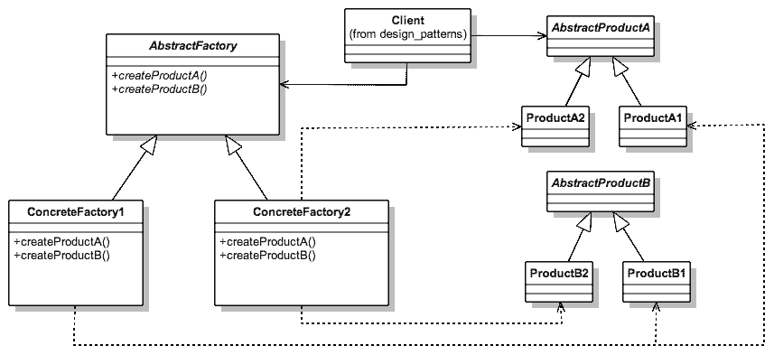
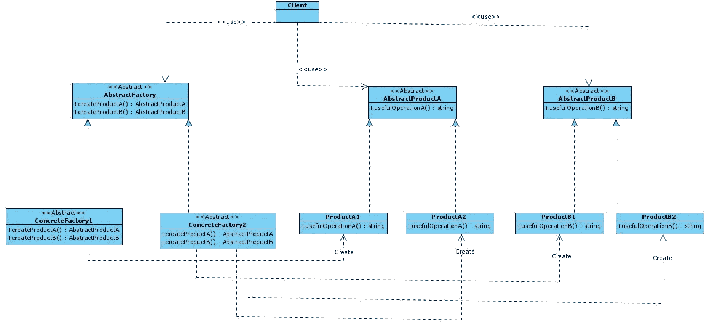
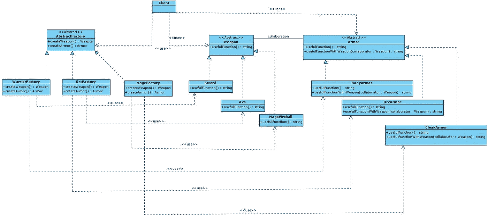

# 理解抽象工厂设计模式

> 原文：<https://betterprogramming.pub/understanding-the-abstract-method-design-patterns-bc416aaaf076>

## 创建遵循可靠原则的对象族


由 [Alexander Schimmeck](https://unsplash.com/@alschim?utm_source=medium&utm_medium=referral) 在 [Unsplash](https://unsplash.com?utm_source=medium&utm_medium=referral) 上拍摄

原著[设计模式:可重用面向对象软件的元素](https://bookshop.org/books/design-patterns-elements-of-reusable-object-oriented-software/9780201633610)中描述了 23 种经典设计模式。这些模式为软件开发中经常出现的特定问题提供了解决方案。

在这篇文章中，我将描述**抽象工厂模式**是如何工作的，以及何时应该应用它。

# 抽象工厂:基本思想

维基百科为我们提供了如下定义:

> "**抽象工厂** [**模式**](https://en.wikipedia.org/wiki/Software_design_pattern) 提供了一种封装一组单独的[工厂](https://en.wikipedia.org/wiki/Factory_object)的方法，这些工厂具有共同的主题，而无需指定它们的具体类。"— [维基百科](https://en.wikipedia.org/wiki/Abstract_factory_pattern#:~:text=The%20abstract%20factory%20pattern%20provides,without%20specifying%20their%20concrete%20classes)

另一方面，原书提供的定义如下:

> "提供一个接口，用于创建相关或依赖对象的系列，而无需指定它们的具体类."—设计模式:可重用面向对象软件的元素

在许多情况下，我们需要从可能的对象列表中创建不同类型的对象，这些对象在创建过程中与这些对象相关。自然的趋势是创建一个`factoryManager`类，允许我们基于参数获得不同类型的对象。然而，这种解决方案有两个严重的缺点，我们将在本文中描述:

*   它打破了 [*的开闭原则*](https://en.wikipedia.org/wiki/Open%E2%80%93closed_principle) ，在软件伸缩时给出的代码不干净，不容易维护。
*   `factoryManager`类被附加到您想要构建的所有类型的对象上，创建的代码被称为*意大利面条代码*。

这个问题及其解决方案已经在介绍工厂方法设计模式的章节中讨论过，当对象的创建很简单并且它们彼此不相关时，工厂方法设计模式允许解决这个问题。因此，建议您先阅读本文，以便稍后解决这个抽象工厂模式。

抽象工厂模式允许更清晰的代码，因为它避免了前面提到的问题。这个模式的 UML 图如下所示:



UML 图(图像源—设计模式:可重用面向对象软件的元素)

组成该模式的类如下:

*   `**AbstractProductA**`和`**AbstractProductB**`是同一类型但不同系列的一组产品的接口。换句话说，所有实现`AbstractProductA`类的产品都属于相同的产品类型，尽管它们将被组织到不同的系列中。这种类型的对象将在下面的具体例子中得到更好的理解。
*   `**ProductA1**`、`**ProductA2**`、`**ProductB1**`、`**ProductB**`是每种`AbstractProduct`的具体实现。
*   `**AbstractFactory**`是为每个具体工厂(`ConcreteFactory1`和`AbstractFactory`)声明一组创建方法的接口。
*   `**ConcreteFactory1**`和`**ConcreteFactory2**`为每个产品系列实现`AbstractFactory`类的创建方法。

# 抽象工厂模式:何时使用

在以下情况下使用抽象工厂模式:

*   抽象工厂解决的问题类似于工厂方法模式解决的问题，但是在需要创建的对象类型上有更大的抽象性。因此，在抽象工厂的情况下，要求与几个彼此相关的产品族一起工作，而不是在一组产品中工作。
*   客户必须使用的对象系列事先并不知道。相反，这种知识直接依赖于另一个用户与系统的交互(最终用户或系统)。
*   如果有必要扩展内部组件(创建的系列和对象的数量)，而不必耦合代码，而是具有接口和抽象，允许轻松扩展工厂和特定产品。

# 抽象工厂模式:优点和缺点

抽象工厂模式有许多优点，可以总结为以下几点:

*   由同一工厂类创建的产品之间的兼容性是有保证的。
*   **清理代码**因为由于可以在不破坏现有代码的情况下引入新产品系列，因此开闭原则得到了保证。
*   **Cleaner code** 因为遵守了单一责任原则(SRP ),因为创建具体产品的责任被转移到具体的创建者类，而不是具有此责任的客户类。

然而，与大多数设计模式一样，抽象工厂模式的主要缺点是增加了代码的复杂性和代码所需的类的数量。然而，当应用设计模式时，这个缺点是众所周知的，因为这是在代码中获得抽象的代价。

# 抽象工厂模式示例

接下来我们将举例说明应用抽象工厂模式的两个例子:

*   **抽象工厂模式的基本结构**。在这个例子中，我们将把理论上的 UML 图转换成类型脚本代码，以识别模式中涉及的每个类。
*   **在视频游戏中创造角色**。让我们想想经典的 WoW(魔兽世界),其中玩家可以根据自己选择的种族拥有一组对象。例如，我们会有种族:人类，兽人，法师，魔术师，他们会有不同的武器和盔甲(产品)，这取决于种族(物品家族)。

以下示例将展示使用 TypeScript 实现这种模式。我们选择了 TypeScript 而不是 JavaScript 来实现这个实现——后者缺少接口或抽象类，因此实现接口和抽象类的责任将落在开发人员身上。

# 例 1。抽象工厂模式的基本结构

在第一个例子中，我们将把理论上的 UML 图转换成 TypeScript 来测试这种模式的潜力。这是要实现的图表:



抽象工厂模式基本结构的类图

首先，我们将定义接口(`AbstractProductA`和`AbstractProductB`)，这些接口定义了我们想要为不同系列创建的具体产品的类型。在我们的具体例子中，为了尽可能简化对模式的理解，只为每个接口定义了一个方法:分别是`usefulFunctionA`和`usefulFunctionB`。

AbstractProductA。

AbstractProductB。

下一步是定义实现这些接口的具体产品。在我们的例子中，将为每个抽象类实现两个具体的对象。对于第一个接口(`AbstractProductA`)，实现了类`ConcreteProductA1`和`ConcreteProductA2`，而对于第二个接口(`AbstractProductB`)，实现了类`ConcreteProductB1`和`ConcreteProductB2`。

混凝土产品 1。

混凝土制品 2。

混凝土制品 B1。

混凝土制品 b

一旦定义了与产品创建相关的类的结构，我们就开始定义与负责创建这些对象的工厂的创建相关的类的结构。因此，首先定义了抽象类`AbstractFactory`，其中定义了具体工厂负责创建具体对象的方法。然而，注意这些方法从每个`AbstractProductA`和`AbstractProductB`产品中返回抽象类。

抽象工厂。

最后，有必要定义实例化具体类的具体工厂。在第一个例子中，`ConcreteFactory1`工厂将负责实例化家族 1 的具体对象(`ConcreteProductA1`和`ConcreteProductB1`)，而`ConcreteFactory2`工厂将负责实例化家族 2 的具体对象(`ConcreteProductA2`和`ConcreteProductB2`)。

混凝土工厂 1。

混凝土工厂 2。

尽管这不是模式的直接组成部分，但是有必要通过`Client` / `Context`类来查看模式的执行。在这种情况下，`ClientCode`方法不需要知道创建产品的具体工厂，但是接收一个`AbstractFactory`类的对象作为参数就足以执行`CreateProductA`和`CreateProductB`方法。

客户代码。

# 例 2。为视频游戏创建英雄装备

我们已经看到了该模式的理论示例，所以您已经理解了该模式中每个类的职责。现在我们将举例说明一个真实的例子，在这个例子中我们将识别这个设计模式的每一个类。

我们的问题包括视频游戏中不同英雄或角色的装备的表示。我们将重点介绍经典视频游戏 WoW(魔兽世界)，其中的英雄分为三个种族:人类、兽人和魔术师。这些英雄中的每一个都有不同的`armor`和`weapon`,这取决于不同的种族。因此，我们已经可以确定要制造的产品将是不同类型的盔甲和武器，产品系列是人类、兽人和巫师的产品系列。

因此，遵循与我们在前面的例子中所展示的方法相同的方法，我们将从查看 UML 图开始，它将帮助我们识别这个模式的每个部分。



类图:视频游戏

先验的，这个问题的类设计可能令人印象深刻，但是如果我们已经理解了这个模式的基本结构的例子，我们就会完美地理解这个例子。

我们将从创建每种特定的产品类型开始。也就是说，首先定义的是模拟 a `weapon`的接口。

武器。

为了简化示例，只为每个`weapon`定义了一个方法`usefulFunction`，因此，定义的具体武器为`sword`、`axe`和`mage-fireball`。

剑。

斧头。

法师火球。

以与定义`weapon`相同的方式，定义不同的`armor`。在这个具体的例子中，我们通过一个叫做`usefulFunctionWithWeapon`的方法在`armor`和`weapon`之间创建了一个协作，来说明对象可以相互关联。需要注意的最重要的事情是，`collaborator`参数是抽象类`Weapon`的，而不是使用具体的类。

盔甲。

我们这个问题需要的具体盔甲是`BodyArmor`、`OrcArmor`和`Cloak`。这些将由每个对象族根据英雄的种族来创建。

防弹衣。

兽人盔甲。

斗蓬

到目前为止，我们想要在电子游戏中创建的具体产品已经确定，但创建规则尚未建立。具体的工厂将负责根据英雄的种族制造具体的产品。要定义的第一个类是抽象类`AbstractFactory`，它定义了负责创建抽象`Weapon`和`Armor`产品的`createWeapon`和`createArmor`方法。请注意，到目前为止，所有代码都使用了抽象类。

抽象工厂。

这时候我们要实现具体的工厂`HumanFactory`、`OrcFactory`、`MageFactory`，其中的创造者方法是用具体的产品实现的，基于英雄的种族。

战争工厂。

OrcFactory。

磁性工厂。

作为创建英雄装备的例子的总结，我们将实现`Client` / `Context`类。

客户

最后，我创建了两个`npm scripts`，通过它们可以执行本文中的代码:

```
npm run example1
npm run example2
```

GitHub 回购可用[此处](https://github.com/Caballerog/blog/tree/master/abstract-factory-pattern)。

# 结论

抽象工厂是一种设计模式，它允许我们尊重开闭原则，并使用多态性将创建对象的责任委托给特定的类(具体工厂)。这允许我们有更干净和更可伸缩的代码。

这种模式解决了当需要创建不同类型的对象时出现的问题，这些对象依赖于客户机与系统的交互，而事先并不知道客户机将创建哪个对象。此外，这些对象通过对象族相关联，这种方式允许在使用不同的工厂时通过上下文或对象类型将它们分开。

这种模式的另一个优点是，系统不耦合到一组具体的类，但是客户端只与抽象类通信，当软件扩展时，允许更多的可维护代码。

最后，这种模式最重要的不是它的具体实现，而是能够认识到这种模式可以解决的问题以及何时可以应用它。具体的实现是最不重要的，因为它将根据所使用的编程语言而变化。