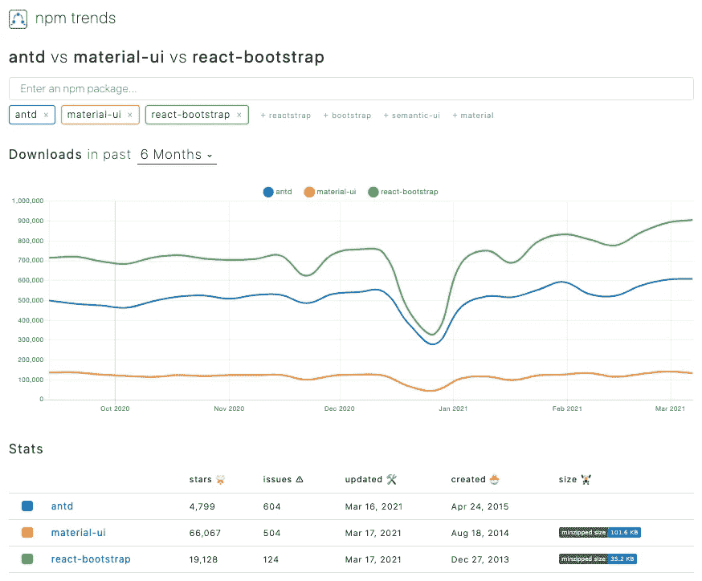
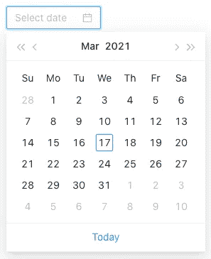
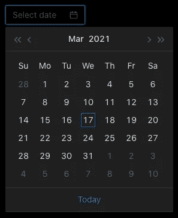
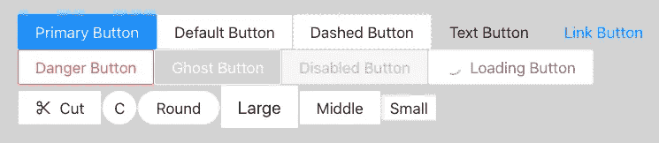
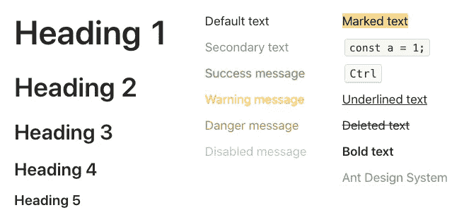
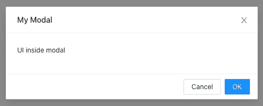
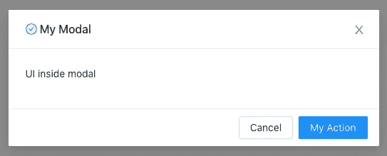
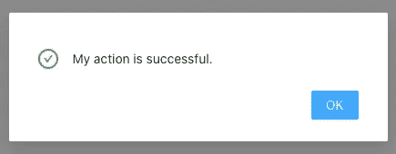
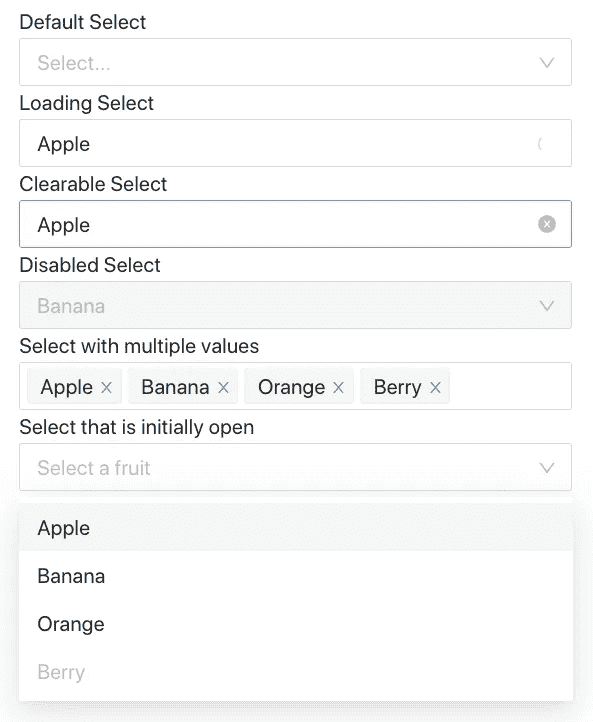
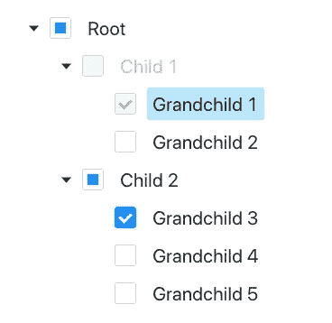

# 了解 Ant 设计系统——一个面向企业的 UI 设计

> 原文：<https://betterprogramming.pub/understanding-the-ant-design-system-a-ui-design-for-enterprises-39afdb188b06>

## 深入探究按钮、图标、版式、模式、选择、表格和树组件


[水晶钻](https://unsplash.com/@crystalsjo?utm_source=medium&utm_medium=referral)在 [Unsplash](https://unsplash.com?utm_source=medium&utm_medium=referral) 上拍照

什么是 UI 设计系统？

它是由模式、主题、风格和设计理念的 UI 标准管理的组件的集合，可以重用这些组件来构建应用程序。

[Ant 设计系统](https://github.com/ant-design/ant-design)是企业级 UI 设计语言和 React UI 库的开源代码。它附带了一组高质量的 React 组件，具有主题定制功能。它是用 i18n 构建的，并且已经被本地化为几十种语言。

自 2015 年 4 月 24 日创建以来，Ant 设计系统已在 GitHub 上获得约 5000 颗星，每周从 npm 注册表下载超过 50 万次。

下面是与 material-ui 和 react-bootstrap 相比，Ant 设计系统(antd)的 npm 趋势。



# 在 Create React 应用程序中运行 Ant 设计系统

通过在 Github 上构建一些通用组件，我完全理解了构建企业级组件库所需的努力和专业知识。

让我们看看在 Create React App 中采用蚂蚁设计系统需要付出多大的努力。

```
npx create-react-app my-app
cd my-app
```

设置`antd`:

```
npm i antd
```

`antd`成为`package.json`中`[dependencies](/package-jsons-dependencies-in-depth-a1f0637a3129)`的一部分:

将下面的代码复制到`src/App.js`中:

第 1 行导入了`DatePicker`组件。

第 2 行导入了 Ant 设计系统主题。

第 6 行呈现了`DatePicker`组件。

运行`npm start`，浏览器上显示`DatePicker`组件。



如果你想使用一个黑暗的主题，改变第 2 行来导入黑暗的主题。

```
import 'antd/dist/antd.dark.css';
```

然后我们有了黑暗主题。



这是不费力气吗？

让我们进一步了解蚂蚁设计系统。

# 纽扣

根据维基百科,[按钮](https://en.wikipedia.org/wiki/Button_%28computing%29)是一种图形控制元素，它为用户提供了一种通过点击来触发事件的方式。Ant 设计系统提供了各种按钮供使用。

将以下代码复制到`src/App.js`:

第 8 行是主按钮，表示主要动作。

第 9 行是一个带有实线边框的普通按钮。

第 10 行是带有虚线边框的虚线按钮。

第 11 行是一个文本按钮，看起来像文本。

第 12 行是一个链接按钮，看起来像一个链接。

第 14 行是危险按钮，红色。它通常用于风险操作，如删除和授权。

第 15 行是一个幽灵按钮，它有一个透明的背景以及反转的文本和边框颜色。它通常用在彩色背景上。它在白色背景下是不可见的，直到它被悬停在。

第 16 行是一个禁用按钮，表示该操作不可用。

第 17 行是一个 loading 按钮，它包括 loading 微调器来指示加载状态。

第 19 行是一个带有特定图标的按钮。在这种特殊情况下，它是剪刀，表示剪切动作。

第 20 行是一个圆形按钮。

第 21 行是一个圆角按钮。

第 22 行是一个大按钮。

第 23 行是一个中等大小的按钮，这是默认大小。

第 24 行是一个小按钮。

以下是这些按钮在浏览器中的外观(带有`lightgray`背景)。



下面的`ButtonProps`定义(第 28 行)描述了可以为按钮设置的属性(第 2-14 行和一些额外的)。

# 图标

根据维基百科的定义，图标是帮助用户浏览网站的图形符号。通常，图形符号通过其与实物的图像相似性来传达其含义。Ant 设计系统提供了大量可供使用的 SVG 图标。

将下面的代码复制到`src/App.js`中:

上面的代码使用`Space`组件(第 11 行)来设置组件间隙。间隙大小可通过`size`支柱配置，支柱为`small`、`middle`或`large`。默认值为`small`。

每个图标有三种类型:轮廓、填充和双色。

第 11 行是一个带轮廓的邮件图标。

第 12 行是一个填充的邮件图标。

第 13 行是双色图标。

第 14 行是一个带轮廓的同步图标，带有旋转的动画。

第 15 行是一个带轮廓的微笑图标，样式为`fontSize: '50px', color: 'red'`。

第 16 行是一个填充的微笑图标，样式为`fontSize: '50px', color: 'gold'`。

17 号线是双色微笑图标，造型为`fontSize: '50px'`。其颜色随道具定制:`twoToneColor="aqua"`。

第 18 行是双色心脏图标。颜色根据道具定制:`twoToneColor="green"`。

第 19 行是双色调心脏图标，旋转 90 度。颜色根据道具定制:`twoToneColor="purple"`。

第 20 行是一个双色调心脏图标，旋转 180 度。`twoToneColor="pink"`道具定制颜色。

第 21 行是双色心脏图标，旋转`-90`度。`twoToneColor="orange"`道具定制颜色。

第 22 行是双色星形图标，字体大小`16px`。

第 23 行是双色星形图标，字体大小`40px`。

第 24 行是双色星形图标，字体大小为`70px`。

以下是这些图标在浏览器中的外观。


以下`Icon`定义(第 19 行)描述了可以为图标设置的道具(第 2-3 行，第 6-11 行，第 14-16 行)。

# 排印

根据[维基百科](https://en.wikipedia.org/wiki/Typography)“排版是一种编排字体的艺术和技术，以使文字在展示时清晰、可读和吸引人。”术语“排版”是指“由印刷过程产生的字母、数字和符号的样式、排列和外观”蚂蚁设计系统让排版变得容易。

将以下代码复制到`src/App.js`:

上面的代码使用`Row`和`Col`来布局页面。该页面有一行包含三列。

每列由`Space`组件包裹，设置组件间距和布局方向。

第 11-15 行显示 1-5 级标题。

第 20 行显示默认文本。

第 21 行显示次要文本，较轻。

第 22 行显示成功文本，绿色。

第 23 行显示警告文本，为橙色。

第 24 行显示红色的危险文本。

第 25 行显示禁用的文本，为浅灰色。

第 30 行显示标记的文本。

第 31 行显示代码。

第 32 行显示一个键盘输入元素。

第 33 行显示带下划线的文本。

第 34 行显示删除的文本。

第 35 行显示粗体文本。

第 36 行显示了一个链接。

以下是字体在浏览器中的外观。



`Typography`定义了四种类型的部件。它们是`Text`、`Link`、`Title`和`Paragraph`。

# 情态的

维基百科将[模态](https://en.wikipedia.org/wiki/Modal_window) 定义为“从属于应用程序主窗口的图形控制元素”当它可见时，模态位于被禁用的主窗口的前面。通常，一个模式有一个标题，一些模式用户界面和一些按钮在页脚。单击页脚处的按钮将会调用某些操作，并且可能会关闭模式。蚂蚁设计系统提供了可供使用的模式。

将以下代码复制到`src/App.js`:

第 18–20 行定义了一个有标题的`Modal`、`OK`按钮和`Cancel`按钮。

第 19 行是`Modal`的子节点，在这里可以编码具体的 UI 代码。

`OK`和`Cancel`按钮用于处理各种动作。其中一个动作是解除模态— `setIsModalVisible(false)`。通常情况下，`Cancel`干脆把`modal`(第 14 行)解散。但是`OK`通常在解除`modal`(第 10 行)之前实现一些 OK 逻辑(第 9 行)。

这是浏览器中模式的外观。



让我们给`modal`添加一些定制。将以下代码复制到`src/App.js`:

第 21 行显示了标题和图标。

第 22 行将 OK 文本设置为`My Action`。



第 10–12 行添加了一个成功消息，这是一个静态的`modal`。点击`My Action`时，弹出成功信息。



下面的`ModalProps`定义描述了可以为模态设置的属性。

# 挑选

维基百科将[选择](https://en.wikipedia.org/wiki/Selection_(user_interface))定义为“用户操作将发生的项目列表。”Ant `Select`提供了与 [React Select](/react-select-makes-creating-selectable-menus-easy-5d9dffc7e0d9) 一样丰富的功能集。

将以下代码复制到`src/App.js`:

*   第 7-12 行创建了四个选项，`Apple`、`Banana`、`Orange`和`Berry`。
*   第 18–20 行定义了一个默认值`Select`。
*   第 22–24 行显示预选值`Apple`。它还显示了设置了`isLoading`的加载动画。
*   第 26–28 行显示预选值`Apple`。由于`allowClear`已设置，它允许我们通过点击字段右侧的“x”按钮来清除所选值。当`Select`在焦点上时,“x”按钮可见。
*   第 30–32 行显示预选值`Banana`。它是一个禁用的`Select`，并且`disabled`被置位。
*   第 34–36 行显示了带有多个值的`Select`，其中`mode`被设置为`multiple`。每个选定的值都可以单独删除，或者您可以使用字段右侧的“x”按钮删除所有选定的值。当`Select`在焦点上时,“x”按钮可见。
*   第 38–45 行打开`Select`菜单，最初`defaultOpen`被设置。我们对选项进行深度克隆。正如我们在[另一篇文章](/lodash-create-react-apps-built-in-library-for-debounce-and-throttle-with-hooks-3418087f44d8)中提到的，Create React App 内置了 Lodash。`cloneDeep`被导入(第 3 行)以完成深度克隆操作。这允许我们设置第三个索引项目(`Berry`)到`disabled`(第 40-42 行)。没有`cloneDeep`，代码抛出错误`TypeError: Cannot add property disabled, object is not extensible`。这是因为 props 是一个不可扩展的对象。克隆对象时，不可扩展的特征不会被复制。这是一种黑客行为，但它允许我们通过重用`options`来缩短代码。

下面是`Select`组件在浏览器中的样子。



下面的`SelectProps`定义描述了可以为`Select`组件设置的道具。在某种程度上，这与我们在[中描述的 React-Select 使得创建可选菜单变得容易](/react-select-makes-creating-selectable-menus-easy-5d9dffc7e0d9)。

下面的`SelectProps`定义描述了可以为`Select`组件设置的属性。

# 桌子

一个[表](https://en.wikipedia.org/wiki/Table_(information))，也被称为数据网格，被维基百科定义为“行和列的数据排列，或者可能是更复杂的结构。”Ant `Table`提供了与 [React 表](/an-introduction-to-react-table-6ebd34d8059e)一样丰富的功能。

我们在 React 表示例中重用了相同的数据源:

您可能想知道为什么列定义除了`dataIndex`之外还有属性`key`。每一行数据中还有这个属性`key`。

这个属性`key`用于为 React 列表创建`key`道具。更具体地说，它针对列标题和行的每个 JSX 元素。否则，浏览器的控制台上会出现警告:`Each child in a list should have a unique “key” prop`。

我们在`src/App.js`中创建一个使用上述数据源的表:

使用第 7 行的`Table`组件，浏览器中显示下表:


您可能会注意到，上表在右下角显示了分页信息。默认情况下，Ant 表是一个分页表。

如果您不想分页，只需将其设置为`false`。

```
<Table rowSelection={rowSelection} dataSource={data} columns={columns} pagination={false} />
```

这是蚂蚁设计系统中的`TableProps`定义。它有分页、行选择、过滤、排序、无限滚动和更多的功能。

# 树

维基百科将[树形视图](https://en.wikipedia.org/wiki/Tree_view)定义为“呈现信息分层视图的图形控制元素”。每个项目(称为分支或节点)可以有许多子项目。这通常通过列表中的缩进来可视化。如果有子项，可以展开一个项来显示子项。并且可以折叠起来隐藏子项。

Ant `Tree`提供了复杂的树功能。

将以下代码复制到`src/App.js`:

第 4–45 行定义了一个树形数据结构。有两个孩子，`child1`和`child2`。`child1`有两个孩子，`grandchild1`和`grandchild2`。`child2`有三个孩子，`grandchild3`、`grandchild4`和`grandchild5`。每个子元素都需要属性`key`，这个属性用于创建 JSX 元素。`child1`被禁用(第 12 行)，并且`grandchild1`有一个禁用的复选框(第 17 行)。

第 49–55 行定义了`Tree`组件，其中树是可检查的(第 50 行)。默认情况下，树是折叠的。

线 51 展开`grandchild1`和`grandchild3`。当一个子节点展开时，它的所有上级节点都会展开。

第 52 行选择`grandchild4`，即节点高亮显示。

第 53 行勾选`grandchild1`和`grandchild3`，即这两个节点有勾选标记。

54 线穿入`treeData`。

下面是树在浏览器中的样子。



这是蚂蚁设计系统中的`TreeProps`定义。它可以被配置成可聚焦的、可选择的、可多选的、可拖动的，并具有许多功能。

`TreeProps`(第 8 行)中的`treeData`定义了一个树形数据结构，有以下选项:

# 结论

蚂蚁设计系统是为企业产品打造的。它倡导四种设计价值观:

*   自然的
*   某些
*   有意义的
*   成长

这是一个开放源代码，免费使用。它是一种企业级 UI 设计语言和 React UI 库。

你可能想看看组件库。

感谢阅读。我希望这有所帮助。你可以在这里看到我的其他媒体出版物。