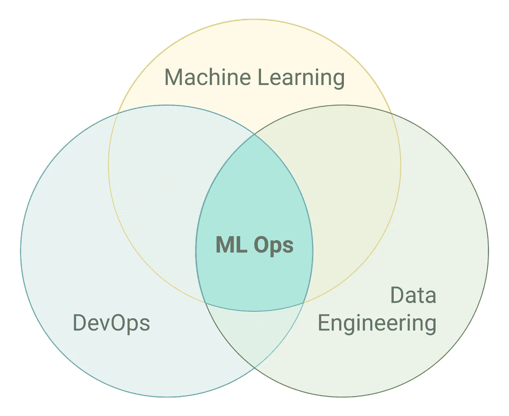
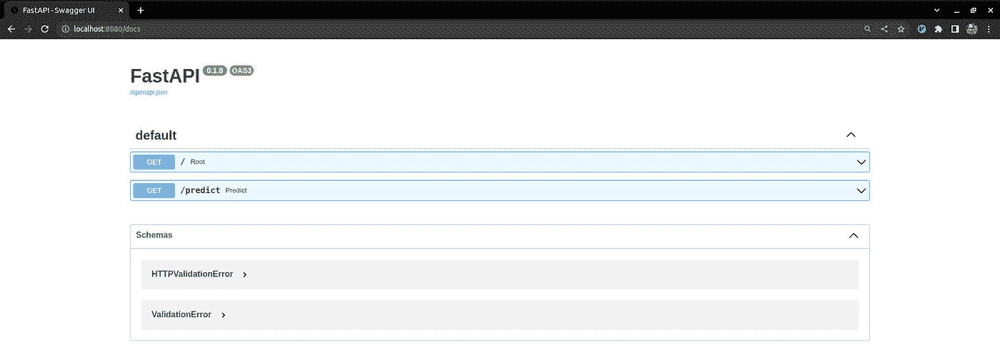

# 了解数据科学家的基本 MLOps 原则

> 原文：<https://betterprogramming.pub/understanding-the-basic-mlops-principle-for-data-scientists-256b8e5f83b1>

## 帮助您将更强大的模型投入生产的介绍性指南



图片来自维基媒体

如果你是一名数据科学家或者一名有抱负的数据科学家，你可能听说过大多数 ML 模型都无法进入生产阶段( [Venture beat 文章](https://venturebeat.com/2019/07/19/why-do-87-of-data-science-projects-never-make-it-into-production/))。这是有原因的，但人们可以认为当前的数据科学学习路径侧重于构建 ML 模型和改进指标。虽然这些事情很重要，但将您的模型投入生产是数据科学家如何影响公司的。在这里，我介绍了 MLOps 最基本的原理，这样您就可以帮助您的公司将一个更强大的模型投入生产。

# MLOps 到底是什么？

在 DevOps 在 IT 行业取得巨大成功之后，其他领域也已经将这些“操作”纳入了日常工作中。但是 MLOps 到底是什么？根据维基百科:

> “MLOps 或 ML Ops 是一套实践，旨在可靠有效地在生产中部署和维护机器学习模型。”

换句话说，在一个公司内部，MLOps 是实验、开发和编码实践的标准化，它将帮助您更快、更可靠、更简单地将 ML 模型投入生产。

它包括开发模型，将其投入生产，监控它，并在需要时触发再培训。这可能非常复杂，并不是所有的公司都解决了这个问题。但作为一名数据科学家，你可能会问自己:我该如何开始？毕竟，你是这个过程中至关重要的一部分。

# 基本原则

如前所述，可靠性是 MLOps 的核心。这意味着您在 Jupyter 或 Python 环境中本地运行的所有代码必须在生产环境中产生相同的结果。有随机种子就不难解决了。您可以在整个代码中使用相同的种子，这样就没问题了。但是当涉及到环境配置和依赖性时，事情就变得有点困难了。

再现性是这个词。如何确保您的代码可以在不同的机器上重现？

# 码头工人来救援了

Docker 是一个开源平台，它使得创建和管理孤立的系统变得更加简单明了。你可以说它有点像虚拟机，但事实并非如此。您可以使用 Docker 将您的模型转换成一个“包”为了让事情更清楚，让我们直接进入代码。作为一个指导项目，我们将使用泰坦尼克号数据集。假设您希望使用 Docker 映像将您的模型准备好投入生产。我们将致力于 REST API，它可以用于无数其他问题。
完整的代码可以在我创建的这个 [repo](https://github.com/danielKatagiri/basic-mlops) 中找到，虽然我将在这里对代码进行评论，但完整的工作代码只能在存储库中找到。一定要去看看。

# 1.项目要求

要在您的本地环境中复制这个项目，您必须安装 Python(我使用的是 python 3.8)和 Docker 引擎。如果你没有 Docker，可以查看文档看看怎么做:
[https://docs.docker.com/engine/install/](https://docs.docker.com/engine/install/)。

安装 Docker 后，为我们的项目创建一个新文件夹，并使用以下内容创建一个新的虚拟环境:

```
python3 -m venv .env
source .env/bin/activate
```

# 2.开发模型

由于这里的重点是使用 Docker 而不是建模，我们将使用一个简单的梯度推进分类器，它具有我们所拥有的数字特征。如果克隆存储库，请使用以下命令安装依赖项:

```
pip install -r requirements
```

并使用以下命令运行培训脚本:

```
python -m train_titanic
```

现在我们有一个模型工件可以在我们的 API 中使用。

# 3.创建预测器类

下一步是创建一个模块来预测给定的乘客是否会幸存。这个模块叫做`titanic_model`。它有一个主类来处理与模式相关的一切，包括以下内容:

*   加载要使用的模型和定标器
*   创建预测管道，包括根据训练中使用的缩放器和预测本身来缩放要素

```
class TitanicModel:
    def __init__(self):
        self.model = self._load_artifact(filename="titanic_classifier")

    @staticmethod
    def _load_artifact(
        filename: str,
    ) -> Union[pd.DataFrame, GradientBoostingClassifier, StandardScaler]:
       ...

    def predict(
        self, pclass: int, sex: str, age: Union[float, int], fare: Union[float, int]
    ) -> bool:
        predictions = self.model.predict([[
          pclass, encoded_sex, scaled_age, scaled_fare
        ]]).tolist()
        return bool(predictions[0])
```

# 打包代码

现在我们有了包含模型的 Python 代码，我们可以打包我们的模型了。这是再现性的第一步。在这一步之后，可以 pip 安装我们的代码，模块`titanic_model`将在 Python 控制台中可用。

为此，我们必须在项目的根目录下创建一个`setup.py`，其中包含安装代码的指令。

从`setuptools`开始，我们导入`setup`函数，并将一些信息(包括在哪里寻找 Python 代码)传递给这个函数。看起来是这样的:

```
from setuptools import find_packages, setup

setup(
   name="titanic",
   version="0.1",
   url="https://github.com/danielKatagiri/basic-mlops",
   description="Package to create a predictor for the Titanic dataset",
   packages=find_packages(exclude=["train*"]),
   install_requires=install_requires
)
```

现在，您可以通过在新的虚拟环境中安装软件包来测试一切是否正常(这样当前的环境就不会变脏)。下面是实现这一点的代码:

```
deactivate
python3 -m venv .env2
source .env2/bin/activate
python3 -m pip install .
python3 -m pip freeze | grep titanic
```

如果一切正常，您应该在输出中看到包`titanic==0.1`。现在，您可以放弃这个新创建的虚拟环境，并激活旧的虚拟环境，如下所示:

```
deativate
rm -rf .env2/
source .env/bin/activate
```

# 用 FastAPI 创建 REST API

现在我们有了一个处理预测的类，并且我们的 python 代码是 pip 可安装的，我们可以创建一个 FastAPI 应用程序，将我们的模型封装在一个`app.py`文件中。这是 REST API，这意味着我们的模型现在可以接收带有特性的 HTTP 请求，并用预测来响应它们。

`app.py`文件使用 Pydantic 创建了一个`Passenger`模型。这是 FastAPI 验证 HTTP 请求发送的输入所必需的。然后，该脚本创建一个带有预测路由的`FastAPI`实例，该实例将接收一个`GET`请求。

```
class Passenger(BaseModel):
    pclass: int
    sex: str
    age: Union[float, int]
    fare: Union[float, int]

def create_app():
    application = FastAPI()
    model = TitanicModel()

    @application.get("/predict")
    async def predict(
        pclass: int, sex: str, age: Union[float, int], fare: Union[float, int]
    ):
        return model.predict(pclass=pclass, sex=sex, age=age, fare=fare)

    return application

if __name__ == "__main__":
    app = create_app()
    uvicorn.run(app, host="0.0.0.0", port=8080)
```

现在 API 的代码已经完成，您可以通过在您的终端中运行`python app.py`来测试它。

# 创建 Docker 图像

在我们节目的最后一幕，我们将为 Docker 引擎编写一些代码来构建我们的应用程序，并将其编译为 Docker 图像。由于这可能是你第一次看“Docker”代码，我将对它进行更彻底的评论。

```
# First, we choose the base image. Theses base images can be found at
# https://hub.docker.com/. As our code is running in python, we can choose
# the python image as our base image
FROM python:3.8-slim-buster

# In the TitanicModel class, you can check the `_load_artifact` method.
# It tries to find the artifacts used by the model in a specific folder
# determined by the enviroment variable `ARTIFACTS_HOME`. So here we are
# setting this environment variable to be in /home/artifacts
ENV ARTIFACTS_HOME='/home/artifacts/'

# This folder does not exists yet, so this next command creates the path
# for us
RUN mkdir -p $ARTIFACTS_HOME

# Now we will copy our local created artifacts to this folder within our image
# In this example, we are copying from the local file system, but idealy these
# artifacts will be stored in a Model Registry (MLFlow, Google storage, 
# VertexAI, S3, ...)
COPY ./artifacts/* $ARTIFACTS_HOME

# This next line copies the files from our project into the /package folder
# and sets this new folder as working directory. It would be as if the docker
# engine running this piece of code did a `cd package` when running.
COPY . /package
WORKDIR /package

# We are now going to upgrade our pip and install the package, as we did before
# in the virtual environment. After installing, we delete this `package` folder
RUN pip3 install --upgrade pip
RUN pip install . && rm -rf /package

# Now we set our working directory to be a `app` folder and copy the `app.py`
# file into it, so that our FastAPI application is available in the image
WORKDIR /app
COPY app.py .

# Now that everythin is set up, we can call the command to run the FastAPI
# application
CMD ["python", "app.py"]
```

为了测试一切是否正常，您可以通过运行`docker build -t titanic`来构建映像。这个命令告诉 Docker 构建一个映像。`-t titanic`标记这个新图像，`.`参数告诉 Docker 在当前文件夹中构建它。

如果映像构建成功，您可以通过运行`docker run --rm -it -p 8080:8080`来运行它。现在您可以在浏览器中访问`localhost:8080/docs`来查看由 FastAPI swagger 生成的。



要使用 curl 发出请求，请运行:

```
curl -X GET “http://localhost:8080/predict?pclass=3&sex=male&age=22&fare=7.25"
```

并且它应该返回`false`。

# 最后的想法

如果您可以复制到目前为止的步骤，您就有了一个定制的 docker 映像，它封装了您的 REST API 和一个在幕后工作的 ML 模型。现在，负责部署您的模型的团队将只需要担心创建一个虚拟机或一个 K8s 部署，在其中运行您的映像(以及其他一些东西，但不封装您的模型)。

您可以为其他类型的问题复制这些原则，例如批量预测。

感谢您的阅读，如果您对此有任何想法，请告诉我。