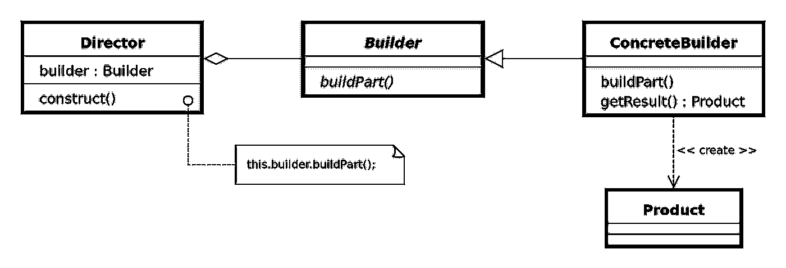
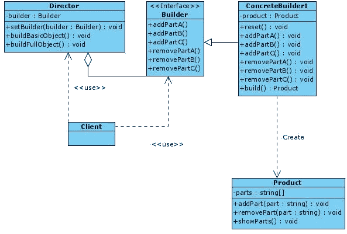
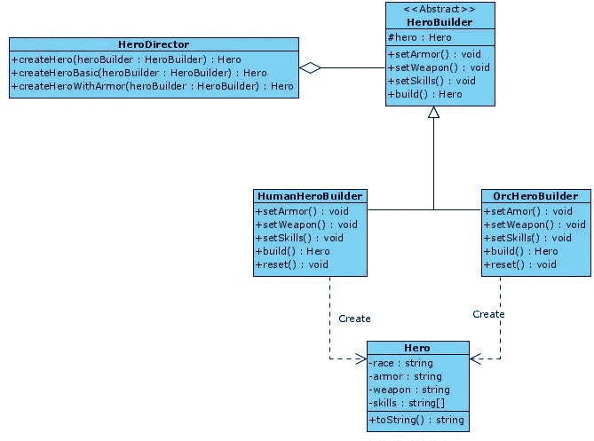
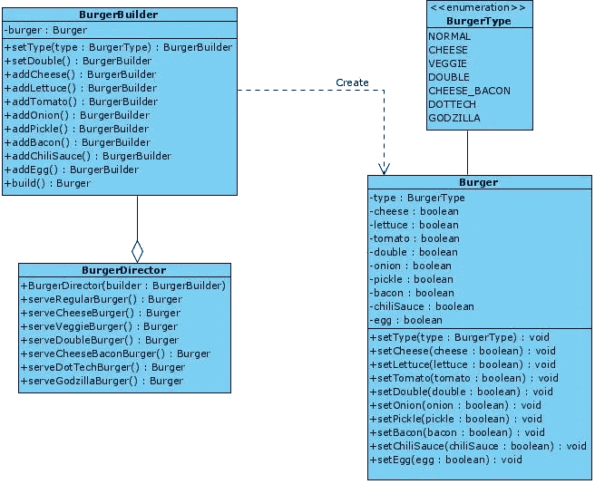

# 理解生成器设计模式

> 原文：<https://betterprogramming.pub/understanding-the-builder-design-pattern-f4f56fa18c9>

## 灵活构建复杂对象


瑞安·斯通在 [Unsplash](https://unsplash.com?utm_source=medium&utm_medium=referral) 拍摄的照片

[*设计模式:可复用面向对象软件的要素*](https://www.amazon.com/Design-Patterns-Elements-Reusable-Object-Oriented/dp/0201633612/ref=sr_1_2?dchild=1&keywords=Design+Patterns%3A+Elements+of+Reusable+Object-Oriented+Software&qid=1608215228&sr=8-2) *一书中描述了 23 种经典的设计模式。*这些模式为软件开发中经常重复出现的特定问题提供解决方案。

在本文中，我将描述**构建器模式**是如何工作的，以及何时应该应用它。

# 构建器模式:基本思想

> **构建器模式**是[设计模式](https://en.wikipedia.org/wiki/Software_design_pattern)，旨在为[面向对象编程](https://en.wikipedia.org/wiki/Object-oriented_programming)中的各种对象创建问题提供灵活的解决方案。构建器设计模式的目的是[将复杂对象的构建从其表示中分离出来。](https://en.wikipedia.org/wiki/Separation_of_concerns)
> 
> — [维基百科](https://en.wikipedia.org/wiki/Builder_pattern)
> 
> 将复杂对象的构造与其表示分离，以便同一构造过程可以创建不同的表示
> 
> —设计模式:可重用面向对象软件的元素

在许多情况下，一个类的构造函数有一个很长的参数列表，这些参数没有语义值，或者没有被该类的所有实例使用。这导致构造函数有一个很长的参数列表，或者迫使它们用不同的参数定义许多构造函数，从而导致类中构造函数方法的激增。

下面的代码显示了一个经典的问题，即存在一个带有必须初始化的参数列表的构造函数，即使所讨论的对象在其某些属性中不需要值。

```
new User('carlos', 'Caballero', 26, true, true, false, null, null);
```

构建器模式允许我们编写更清晰的代码，因为它避免了上面提出的问题。这个模式的 UML 图如下所示:



来自 D `esign Patterns: Elements of Reusable Object-Oriented Software.`的 UML 图

构成这种模式的类有:

*   `Product`:施工过程的具体结果。也就是说，它们将是我们应用程序的模型。
*   `Builder` **:** 混凝土建造者的通用接口。
*   `ConcreteBuilder` **:** 建设性过程的不同实现。这些类将负责阐明每个对象构造过程的业务逻辑的差异。
*   `Director` **:** 定义了执行构建步骤的顺序。其目的是特定配置的可重用性。在这种模式的一些实现中，可以省略`Director`,尽管强烈推荐使用它，因为它将客户端从具体的构造步骤中抽象出来。
*   `Client`:使用模式的类。有两种可能性:

1.  客户端使用`ConcreteBuilder`，一个接一个地执行构建步骤。
2.  客户端使用`Director`来实现每个构造过程，并作为`Client`和`ConcreteBuilder`类之间的中介。

# 构建器模式:何时使用

构建器模式解决的问题很容易识别。应该使用这种模式:

1.  当需要使用一个长参数列表的构造函数或者有一个长的不同参数的构造函数列表时。
2.  当需要构建同一对象的不同表示时。也就是说，当需要具有不同特性的同一类的对象时。

# 构建器模式:优点和缺点

构建器模式有许多*优势*，可以总结为以下几点:

*   可以逐步创建对象。
*   创建一个物体*可以被推迟*直到所有必要的信息都可用。在执行`Builder` 类的`build`方法之前，不会获得对象。
*   干净的代码:应用单一责任原则(SRP ),因为对象的复杂构造与该对象的业务逻辑相隔离。

然而，构建器模式的主要缺点是增加了代码的复杂性和所需类的数量。这是应用设计模式时一个众所周知的缺点——在代码中获得抽象必须付出的代价。

接下来，我们将向您展示构建器模式的三个应用示例:

*   构建器模式的基本结构。在这个例子中，我们将把理论上的 UML 图转换成 TypeScript 代码，以便识别模式中涉及的每个类。
*   视频游戏中角色的创作。让我们想想经典的 WoW ( *魔兽世界*)场景，玩家可以在两个种族之间进行选择:人类和兽人。
*   在销售点(POS)创造产品(汉堡)。

以下示例将展示使用 TypeScript 实现这种模式。我们选择了 TypeScript 而不是 JavaScript 来实现这个实现——后者缺少接口或抽象类，因此实现接口和抽象类的责任将落在开发人员身上。

# 示例 1:构建器模式的基本结构

在第一个例子中，我们将把理论上的 UML 图转换成 TypeScript 来测试这种模式的潜力。这是要实现的图表:



生成器模式基本结构的类图。

首先，我们定义问题的模型(`Product`)。在这个类中，我们将有一个简单的字符串列表。为此，我们定义了经典的`addPart`、`removePart`和`showParts`方法来管理这个属性。

但是，请注意，对象的构造函数不接收初始参数列表(在 TypeScript 中不需要定义它)，但是模型属性将通过方法进行修改。

产品类别。

下一步是创建定义具体构建器的构建器接口。在生成器中，定义了添加和移除每个部件的操作(`A`、`B`和`C`)。

构建器界面。

concrete builder 类有一个我们想要构建的类的私有对象(`Product`)。将对其属性进行必要的修改，以根据每种情况构建对象。

请注意，构造函数方法所做的是初始化产品，有一个`build`方法负责返回已经在`ConcreteBuilder1`类中配置的对象，并重置内部对象以便能够构建另一个对象。在调用`build`方法之前，`ConcreteBuilder1`类配置一个具体的对象。

ConcreteBuilder1 类。

一旦我们有了通过`ConcreteBuilder1`类构建对象的具体操作，下一步就是定义执行不同构造的具体步骤。`Director`类负责定义使用`Builder`对象指定构造步骤的方法。

因此，`Director`类从`Builder`类接收一个对象作为参数(在本例中是`ConcreteBuilder1`)，并且定义了几个构造:

*   `BasicObject` →它只包含 a 部分。
*   `FullObject` →由 A、B、c 三部分组成。

最后，有必要定义利用该模式的`Client`或`Context`类。这个客户端非常干净，因为您只定义了想要使用的`Builder`对象，对象的创建是通过`Director`调用的。

# 示例 2:创建视频游戏英雄

现在您已经看到了经典的理论示例，因此您理解了模式中每个类的职责。现在，这里有另一个例子，我们用一个特定的问题来识别每一个类。

我们的问题是电子游戏中不同英雄或角色的表现。我们将关注经典的 WoW ( *魔兽世界*)游戏，游戏中的英雄分为两个种族:人类和兽人。每个英雄都可以有`armor`、`weapon`或者不同的`skills`，这取决于英雄是人类还是兽人。

在没有应用构建器模式的情况下，它会导致在`Hero`类中定义一个带有一长串参数(`race`、`armor`、`skills`等)的构造器，这又会导致在构造器中定义逻辑来决定盔甲是人类还是兽人。因此，对于这个最初的解决方案，问题是耦合的，因为业务逻辑的任何变化都意味着必须重写相当多的代码，几乎没有任何重用的可能性。

所以，我们要做的第一件事就是停下来，想想构建器模式是如何帮助我们解决这个问题的。因此，我们专注于展示解决这个问题的 UML 图，并开始实现它。



Builder 模式应用于视频游戏的英雄创建问题。

在本例中，我们遵循与上例相同的顺序，从我们想要灵活构建的模型或对象开始。

`Hero`类定义了`race`、`armor`、`weapon`和`skills`属性。所有这些属性都可以是对象，但是为了使这个例子简单，我们把它们作为字符串。

`HeroBuilder`接口为特定的构建器定义了方法。让我们观察一下`Hero`对象是如何用`setArmor`、`setWeapon`和`setSkills`一点一点地配置的。最后，我们有完成对象配置并提取`Hero`对象的`build`方法。

一旦构建器被定义(作为抽象类或接口)，我们必须构建我们的问题所需要的两个特定的构建器:`HumanHeroBuilder`和`OrcHeroBuilder`。在演示代码中，我们根据每个构建器使用了不同的字符串。需要注意的是，每个构建器的 build 方法都返回已构建的对象(`Hero`)并重置对象的状态，因此它可以构建另一个对象。

模式的最后一个元素是`Hero-Director`类，它允许您存储代码中重复出现的配置。在我们的例子中，我们创建了三个`Hero`创建设置。例如，`createHero`方法构建一个完整的英雄——也就是说，它分配盔甲、能力和武器。我们也用`createHeroBasic`的方法创造一个没有任何装备的英雄。最后，为了说明另一个配置，定义了`createHeroWithArmor`方法，该方法返回一个只分配了盔甲的英雄。

最后，我们展示了一个控制台客户端，它利用了我们在整个示例中构建的两个构建器。在这个例子中，我们创建了两个构建者，`HumanHeroBuilder`和`OrcHeroBuilder`，以及导演类，`HeroDirector`。作为演示，让我们使用两个构建器和控制器来创建三个`HeroDirector`类预先配置的英雄配置:

# 示例 3:汉堡的制作(销售点)

在下面的例子中，我们将为一家汉堡店创建一个 POS。与前面的例子相比，本例中的主要变化是，对要创建的对象的每个修改操作都将返回构建器本身，而不是不返回任何值。这样，由构建器本身执行的不同操作可以被链接起来，因为每个操作都返回`Builder`对象。

遵循前面例子中给出的相同方法，我们从查看 UML 图开始，以识别该模式的每个部分。



应用于销售点的生成器模式。

在这种情况下，我们想要构建的对象将是对应于`Burger`类的对象，其中有一个要在每个汉堡中配置的配料列表。`Burger`类将有对应于它的每个属性的访问器方法。

这是与该类相关联的代码:

汉堡班。

在这个例子中，已经包含了`BurgerType`枚举类型，它允许定义应用程序中存在的不同类型的汉堡。

在`BurgerBuilder`类中，每个方法在被配置的对象上执行修改。返回的构建器能够将不同的操作链接在一起。当然，`build`方法还是会返回`Burger`类对象。

`BurgerDirector`类负责配置`BurgerBuilder`类中定义的操作。在这里，您可以看到不同类型的汉堡是如何使用链式方法进行配置的，这使得代码更容易阅读。重要的是要记住，在执行`build`方法之前，相同的汉堡是被配置的。

最后，我们展示使用该模式的客户机。在这种情况下，选择一个随机数来定义汉堡的类型，并调用控制器来为我们提供该汉堡。

使用汉堡餐厅 POS 的客户端类。

最后，我创建了三个`npm`脚本，通过它们可以执行本文中的代码:

```
npm run example1
npm run example2
npm run example3
```

[GitHub 回购](https://github.com/Caballerog/blog/tree/master/builder-pattern)

# 结论

Builder 是一种设计模式，它允许您避免使用带有一长串参数的构造函数，这些参数并非都是必需的。它允许您以更灵活的方式构建某个对象的实例，因为它只允许您配置那些绝对必要的属性。

代码要干净得多，因为构造函数中没有不被使用的参数——只使用创建对象所需的那些参数。此外，由于有一个用于构建器的`Director`类，对象创建配置被重用，因此在客户机上没有与`Builder`类的直接交互。

最后，这个模式最重要的不是它的具体实现，而是能够认识到这个模式可以解决的问题，以及何时可以应用它。具体的实现是最不重要的，因为这将取决于所使用的编程语言。

# 资源

*   [GitHub 回购](https://github.com/Caballerog/blog/tree/master/builder-pattern)