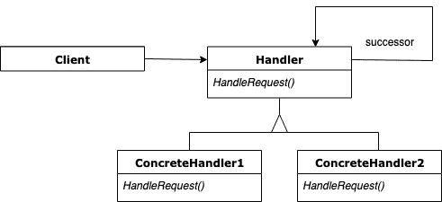
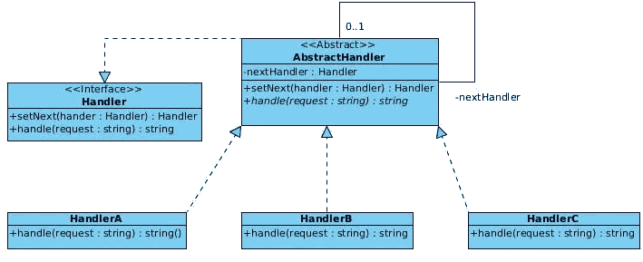
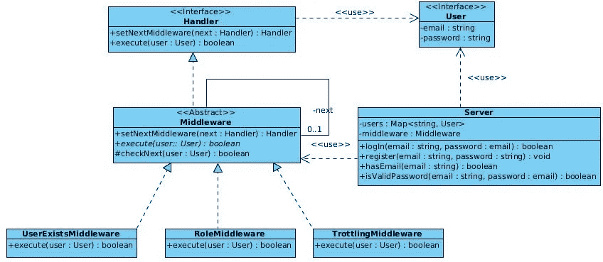
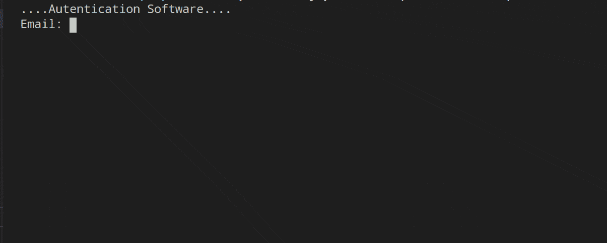
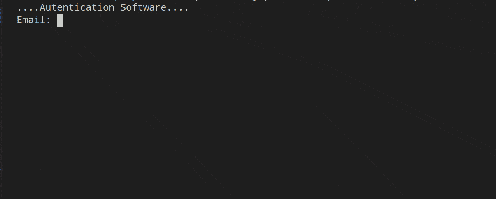

# 理解责任链设计模式

> 原文：<https://betterprogramming.pub/understanding-the-chain-of-responsibility-design-pattern-2f44cdff61e5>

## 引擎盖下的中间件


祖尔莫里·萨维德拉在 [Unsplash](https://unsplash.com/s/photos/chain?utm_source=unsplash&utm_medium=referral&utm_content=creditCopyText) 上的照片

原著 [*设计模式:可复用面向对象软件的元素*](https://www.amazon.com/Design-Patterns-Elements-Reusable-Object-Oriented/dp/0201633612) 中描述了 23 种经典设计模式。这些模式为软件开发中经常出现的特定问题提供了解决方案。

在这篇文章中，我将描述*责任链*模式是如何工作的，以及何时应该应用。

# 链条的责任:基本理念

维基百科为我们提供了如下定义:

> **责任链模式**是一个[设计模式](https://en.wikipedia.org/wiki/Design_pattern_(computer_science))，由一个[命令对象源](https://en.wikipedia.org/wiki/Command_pattern)和一系列**处理对象**组成。每个处理对象包含定义它可以处理的命令对象类型的逻辑；其余的被传递给链中的下一个处理对象。还存在一种将新的处理对象添加到该链末端的机制。”— [维基百科](https://en.wikipedia.org/wiki/Observer_pattern)

另一方面，原书提供的定义如下:

> "通过给多个对象一个处理请求的机会，避免将请求的发送方耦合到其接收方。链接接收对象，并沿链传递请求，直到有对象处理它。

在许多情况下，我们有一组可以应用于一个对象(请求)的处理程序(操作)，但是我们不知道，*先验*，哪个处理程序应该应用于所述对象，也不知道一个或多个处理程序是否应该应用于请求。责任链模式允许我们实现更高效、耦合更少的代码，因为它避免了前面提到的问题。在代码可维护性方面，它还有其他优势。下面是这个模式的 UML 模式:



UML 图来自《设计模式:可重用面向对象软件的元素》一书。

这些是组成这种模式的类:

*   `Handler`是处理请求的接口。尽管是可选的，大多数实现也指定后续链接。
*   `ConcreteHandler`是负责处理请求的具体实现。此外，它还可以访问其继任者。这些类的行为非常简单:如果它能处理请求，它就会处理，否则，它会将责任委托给下一个处理程序。
*   `Client`负责启动请求处理程序的序列(`ConcreteHandler`)。

# 链条的责任:何时使用

*   当有一个以上的对象可以处理一个请求，并且事先不知道处理程序时。此外，我们需要自动选择处理程序。
*   可以动态指定能够处理请求的对象集。
*   一个请求由一个或多个对象处理，而没有明确指定接收者。

# 责任链模式:优势与劣势

责任链模式有许多优点，总结如下:

*   代码更容易维护，因为对象和处理请求的另一个对象之间的耦合更少。对象(发送者)只需要知道请求将由处理程序处理。也就是说，双方(接收者和发送者)对彼此都没有明确的了解。此外，链中的对象不需要知道链的结构。
*   干净的代码。*开闭原则* (OCP)是有保证的，因为新的处理程序可以在不破坏链中现有代码的情况下引入。
*   更干净的代码。*单一责任原则(SRP)* 得到了遵守，因为每个处理程序的责任都被转移到了它的`handle`方法，而不是在客户端代码中包含业务逻辑。

这种模式的一个众所周知的缺点是*收据不能保证*。这是因为请求没有明确的接收者。因此，请求可能会在没有得到处理的情况下从链的末端脱落。

最后，责任链模式的主要缺点——像大多数设计模式一样——是增加了代码的复杂性和代码所需的类的数量。也就是说，在应用设计模式时，这个缺点是众所周知的——这是在代码中获得抽象的代价。

# 连锁例子的责任

接下来，我们要用两个例子来说明责任链模式:

*   链式责任的基本结构。在这个例子中，我们将把理论上的 UML 图转换成类型脚本代码，以识别模式中涉及的每个类。
*   基于中间件的认证系统。开发了三个中间件，允许验证用户的存在、基于密码的身份验证以及用户的角色。

以下示例将展示使用 TypeScript 实现这种模式。我们选择了 TypeScript 而不是 JavaScript 来实现这个实现。后者缺少接口或抽象类，因此实现接口和抽象类的责任将落在开发人员身上。

# 例 1:责任链模式的基本结构

在第一个例子中，我们将把理论上的 UML 图转换成 TypeScript 来测试这种模式的潜力。这是要实现的图表:



UML 图来自《设计模式:可重用面向对象软件的元素》一书。

首先，我们要定义我们问题的接口(`Handler`)。这个接口定义了两个方法`next`和`handle`。第一种方法负责将每个处理程序与下一个连接起来。而第二种方法负责执行每个处理程序的特定操作。

处理者

下一个要定义的类是`AbstractHandler`。这个类实现接口，根据定义，它是抽象的——因为可以有在具体类中实现的方法。通常，抽象方法是处理请求的方法(`handler`)。然而，在我们的具体示例中，我们以这样的方式实现了这个函数，即检查是否有后续的处理程序，将处理请求的责任传递给它，如果没有更多的处理程序，我们就在责任链中停止。

另一个有趣的地方是看看如何存在一个自反关系，允许定义`nextHandler`属性，这是链中的下一个处理程序。最后，这个类为`nextHandler`属性定义了赋值访问器方法。

抽象处理器

下一步是定义每个具体的处理程序，它将从抽象类扩展，但是将有`handle`方法的具体实现。具体来说，我们可以看到，在基本示例中，我们所做的是检查每个处理程序，看它们收到的请求是否对应于它们知道如何管理的请求，如果不对应，我们通过在`AbstractHandler`类中实现的方法将责任派生到责任链的下一个处理程序。

HandlerA、HandlerB 和 HandlerC

最后，我们必须定义利用这种模式的客户机代码。在这种情况下，我们将声明三个处理者(`HandlerA`、`HandlerB`和`HandlerC`)，并按照以下顺序分配以下责任链的顺序:A → B → C

稍后，我们将通过辅助函数`ClientCode`为每个处理程序模拟三个请求。

在第一种情况下，您可以看到这三个选项是如何管理的，以及负责它们的经理是谁。

在第二种情况下，我们将从责任链中省略`HandlerA`，并再次重复这三个请求。结果将是`HandlerB`和`HandlerC`都不能处理对应于`OptionA`的请求。

客户

# 示例 2:使用责任链的中间件

在本例中，我们将使用责任链模式来模拟一个身份验证和授权系统，该系统使用一组中间件对请求进行检查。

正如我们在前面的例子中所做的那样，让我们从看一下 UML 图开始，它将帮助我们识别组成这个模式的每个部分。



责任链模式

请注意，我们的类图包含了一些额外的类。这些给出了我们问题的背景，但是责任链模式可以很容易地在一组类中识别出来。

在我们解决问题的实现之前，让我们定义一组常量，这些常量将赋予我们这些值的语义值。这三个常量相当简单:首先，我们有两个假用户(`USERS`)，其次，每分钟最大认证请求数(`REQUEST_PER_MINUTE`)，最后，每分钟请求数超过时的等待时间(毫秒)(`WAIT_TIME`)。

我们通过使用与模式基本结构中相同的两种方法定义`Handler`接口，再次开始定义模式。换句话说，`Handler`接口由`setNextMiddleware`和`execute`方法组成，第一个方法负责链接每个中间件，第二个方法负责处理请求。

在我们的例子中，我们必须处理的请求是由一个`User`组成的。

处理者

作为用户的对象必须满足由一个`email`和一个`password`组成的`User`接口。本教程的目标是理解责任链模式，所以这一部分将会很简单——但是足够完整以解决认证和授权问题。

用户

继续这个模式，下一个元素是抽象类`Middleware`的开发，它实现了`Handler`接口。在这个实现中，有`setNextMiddleware`方法，它允许链接下面的中间件，还有`execute`方法，它是`abstract`，在每个特定的中间件中实现。最后，我们有`checkNext`方法，它检查我们是否到达了中间件链的末端，当所有的检查都通过时，它就响应`true`。如果有下一个中间件，那么将执行下一个中间件检查。

中间件

我们需要为身份验证和授权系统构建的第一个中间件是验证用户是否存在。

在我们的例子中，我们模拟了一个假服务器，其中有两个注册用户(与我们之前在常量中定义的用户相同)。这个服务器，我们将在后面看到，为我们提供了一个带有`hasEmail`和`isValidPassword`方法的 API。`execute`方法将接收请求(a `User`)，我们将进行检查以确保用户存在于服务器上。首先，它检查电子邮件是否存在于服务器上；如果是，则检查用户名和密码。如果检查通过，则执行`checkNext`方法，包括向下一个中间件发出请求。

用户存在中间件

下面的中间件可以让我们控制每分钟的请求数量。

这就是你可以看到开闭原则(OCP)的地方——在不破坏现有代码的情况下，合并新的中间件和检查是非常容易的。您还可以看到单一责任原则(SRP ),因为每个中间件只有一个责任。

在这个中间件中，我们接收每分钟的最大请求数作为参数。此外，这个中间件有一些私有属性，允许您控制请求之间经过的时间，以及一分钟内尝试的次数。

如果您查看 execute 方法的逻辑，它非常简单——但是您可以再次检查检查是如何存在的。这是停止责任链的原因，因为它由这个处理程序解决。

如果检查通过，这个中间件，像前一个一样，将继续把请求传递给下一个中间件。

节流中间件

最后，下面的中间件负责检查用户是否是管理员，显然，这应该通过对知识库的真正检查来完成。然而，为了说明每个中间件可以有不同的参数，已经执行了一个基本的检查。

如果是管理员，责任链就结束了。否则，它将继续。这是为了当一个新的中间件被开发时，它可以在链中被管理。在我们的例子中，这里我们结束了责任链，因为我们没有实现任何更多的中间件。

角色中间件

出于教育目的，我们构建了一个`Server`类，它将用户存储在一个`Map<String, User>`上，并拥有一个中间件，它是责任链的开始。

`register`、`hasEmail`和`isValidPassword`方法专注于使用在服务器上注册的用户来执行这些操作。

`logIn`方法接收用户的请求。责任链从第 13 行开始，中间件的执行将用户作为请求发送出去。

计算机网络服务器

最后，代码中显示了使用我们的中间件系统的客户机。已经创建了一个服务器并注册了两个用户帐户(显然这将是我们真正的后端，不应该在这里完成)。

随后，按照以下顺序使用以下中间件指出责任链:

UserExists -> Trottling ->角色

最后，我们创建了一个请求电子邮件和密码的循环。

客户

在这篇文章的结尾，我们将看到代码的工作情况，为此我录制了一些 gif。

首先，我们可以看到运行中的`UserExists`和`Throttling`中间件。我已经输入了几次错误的电子邮件和密码，第一个中间件(`Throttling`)将把前两次的责任留给`UserExists`中间件，它拒绝验证用户/密码。从第三次输入凭证开始，`Throttling`中间件将负责管理请求。



演示:UserExistsMiddleware 和 ThrottlingMiddleware

角色中间件是在输入对应于管理员角色的凭证时管理请求的中间件。



演示:角色中间件

最后，我创建了两个`npm scripts`，通过它们可以执行本文中的代码:

```
npm run example1
npm run example2
```

完整代码见本 [GitHub repo](https://github.com/Caballerog/blog/tree/master/chain-of-responsibility-pattern) 。

# 结论

责任链是一种设计模式，它允许您遵守开闭原则，因为可以在不破坏现有代码的情况下创建新的`Handler`。此外，这允许您遵守单一责任原则(SRP ),因为每个`handler`只有一个责任需要解决。这种模式的另一个非常有趣的地方是，没有必要事先知道，*，*哪个`handler`应该解决请求，这允许您在运行时做出决定。

这种模式最重要的不是它的具体实现，而是识别这种模式可以解决的问题以及何时应用这种模式的能力。具体的实现并不重要，因为这取决于所使用的编程语言。