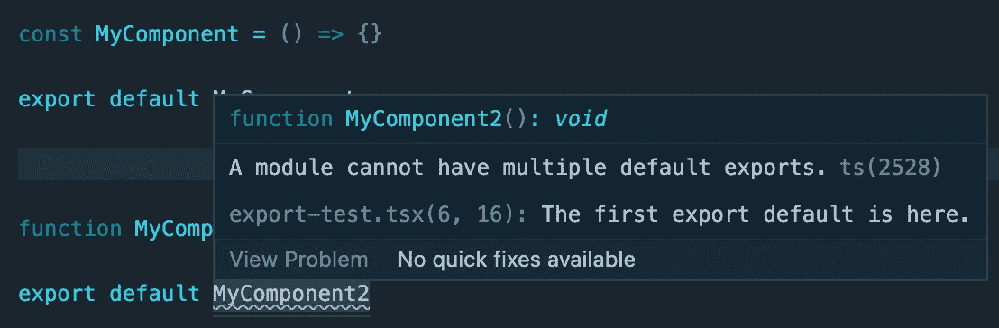

# 了解 React 中命名导出和默认导出的区别

> 原文：<https://betterprogramming.pub/understanding-the-difference-between-named-and-default-exports-in-react-2d253ca9fc22>

## 导出与导出默认值—哪个更适合您？


如果您是 React 新手，并且一直想知道为什么有些组件导出时带有`default`标签，而有些却没有，那么本文将为您分析其中的差异。

```
export function MyComponent() {}vsexport default MyComponent
```

没有`default`标签的导出称为导出。

带有`default`标签的出口是默认出口。

使用其中一个会对代码可读性、文件结构和组件组织产生影响。

命名和默认导出不是以反应为中心的想法。它们是 es6 特性。然而，本文将讨论它们在 React 生态系统中的影响。

# 指定出口

顾名思义，命名导出使用函数或类的名称作为它们的标识符。

当您想要汇入具名元件时，您可以使用与其汇出时相同的名称。名称必须放在大括号内。

## 选择加入别名

如果文件中有冲突，可以使用别名重命名导出。这仅限于执行导入的文件。

## 每个文件多个导出

命名导出允许在一个文件中进行多次导出。

您可以在导入中包含您喜欢的任何模块。

## 使用

我发现，当您有一个或多个将被多次导入的组件时，最好使用命名导出。比如自定义 UI 组件库，或者助手功能模块。真实世界的例子是 Material-UI 或 Lodash。

命名导出允许您将许多相关的组件或模块合并到一个导入语句中。

## 打字优势

您可以使用 Typescript 将命名导出合并到一个 index.ts 文件中。

在模块解析期间，如果 Typescript 看到 index.ts 文件，它将尝试解析所有已定义的导入。

假设您有一个 components 文件夹，其中包含许多带有命名导出的文件。

```
ui-components /
  buttons.tsx
  inputs.tsx
```

有了这个设置，您的导入会像这样

如果想简化导入，可以在`ui-components`目录中添加一个 index.ts 文件

```
ui-components /
  buttons.tsx
  inputs.tsx
  index.ts
```

在 index.ts 中，导出目录中每个文件的所有内容。

现在，您可以将所有的进口货物整合到一个单独的行中

# 默认导出

默认导出是通过在导出中包含一个`default`标签来创建的。通常，您会看到默认导出发生在文件的底部，但是也可以在声明组件时定义它们。

当导入默认导出时，不要使用花括号。

## 默认别名

当您导入默认导出时，您可以给它取任何您想要的名称。

## 单一出口

模块只能有一个默认导出。



## 使用

当导出的组件只被导入一次，或者如果一个文件只导出一样东西，我更喜欢使用默认导出。路由器组件就是一个很好的例子。

# 结合

您可以将默认导出和命名导出合并到一个文件中。

导入也是一样，命名导出在花括号里，默认是明文。

React 是一个很好的库的例子，它可以导出默认的和命名的组件。

# 结论

在命名或默认导出之间进行选择不会影响或破坏您的应用程序。然而，知道其中的区别是有好处的，因为它加深了您的理解，并有助于实现更好的整体架构和代码可读性。