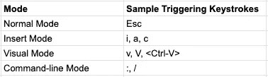
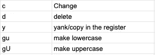
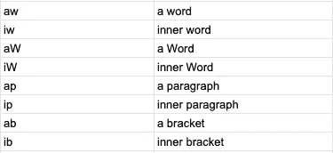
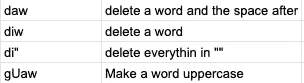
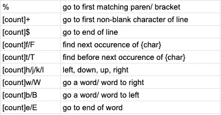
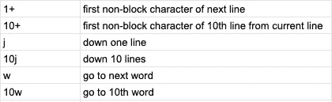
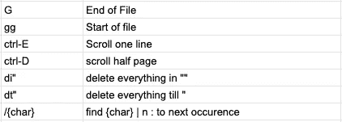

# 了解 vim 的效率

> 原文：<https://betterprogramming.pub/understanding-the-efficiency-of-vim-d6a5ab8feb2d>

## 为什么每个人都在谈论 vim？学习 vim 的基础知识，最终开始使用它


格伦·卡斯滕斯-彼得斯在 [Unsplash](https://unsplash.com?utm_source=medium&utm_medium=referral) 上的照片

# vim 亮点

*   无处不在——随每个 [NIX](https://nixplatform.io/) 平台一起提供。
*   高度可定制—可根据您的需求定制。
*   快如闪电。
*   效率惊人。

# 基础

在我们开始学习 [vim](https://www.vim.org/) 如何工作之前，我只想提一下一些命令，以便刚接触 vim 的人可以使用它。

```
# Open a file in vim
**vim textfile.text**# Come out of vim
**[Esc]:q** # quit without saving
**[Esc]:wq** # save and quit
**[Esc]:q!** # discard changes and quit# Navigation
**h** => left
**j** => down
**k** => up
**l** => right# Copy
**[Esc]v[h|j|k|l]y** # h,j,k,l to highlight a block# Cut
**[Esc]v[h|j|k|l]d** # h,j,k,l to highlight a block# Paste
**[Esc]p**
```

# 为什么是 vim

vim 与其他编辑器的区别是什么？是模态编辑器让它变得如此高效。不像任何其他编辑器，只有一种模式，即插入模式，你不断地输入和流式文本到缓冲区。

现在，对于写作来说这很好，但是，作为程序员，我们最关心的不是持续的文本流，而是编辑和导航。我认为最好的解释是:

你可以把程序员想象成画家和油漆工，他们不会把时间花在连续地画一笔上，他们会准备画布，混合颜色，然后画一笔一笔的。

Vim 通过不同的模式实现这一点。下面是开始使用 vim 的四种模式。



4 种不同的模式

## 1.自然振荡

在这里，我们与文本进行交互，并告诉它该做什么。当我们启动 vim 时，这是默认模式。

大多数人习惯于只输入，但在这种模式下，我们不将文本插入缓冲区，我们做其他类型的活动，如导航。我们可以通过按`Esc`进入该模式。这是 vim 中的默认模式。

## 2.插入模式

您可以使用`i: insert`、`a: append`、`c: change`进入该模式。这是大多数人习惯的模式。因此，请记住，如果您打开 vim 并想要键入一些内容，请使用上面提到的按键切换到插入模式。

## 3.视觉模式

这就像正常模式，除了它的工作与突出显示的文本块。人们面临的另一个问题是复制和剪切文本，你可以在这种模式下完成。你可以使用`V, v, <Ctrl-V>`从正常模式到达这里。

## 4.命令行模式

这是你查找文本、退出 vim、浏览文件等等的地方。

# 运算符、文本对象和运动

要使用 vim，您必须考虑操作符*，文本对象和动作*，然后您将释放 vim 的真正力量。

## 1.经营者

这些是维姆语的动词。它们指定了要在文本对象或动作上执行的动作，其中大多数都很容易记住。



示例运算符

## 2.文本对象

这些是你屏幕上真实的可视文本。



示例文本对象

还是那句话，非常简单好记:`aw: a word`。现在，我们可以将这些与操作符结合起来，以查看一些强大的操作。以下是我最喜欢的几个:



一些运算符与文本对象相结合。

记住你必须在正常模式下使用这些热键。

## 3.提议

动作都是关于在你打开的文件中有效的导航。以下是一些最有用的动作:



常见的基本动作

让我解释一下这是如何工作的，假设你按下`+`，这将把你带到下一行的第一个非空白字符，但是如果你按下`10+`，它将把你带到从当前位置开始的第 10 行的第一个非空白字符。

我再给你举几个例子，把事情说清楚。



示例动作

# 把所有的放在一起

[计数][操作符][文本对象/动作]

这是使用所有 vim 命令的模板。你的想象力是你的极限。这里是您可以查看的[命令列表](https://www.fprintf.net/vimCheatSheet.html)。

以下是我最常用的命令列表:



我最常用的命令

# 结论

本指南只是 vim 世界的开始，但是本指南提供了对 vim 工作原理的基本理解，这足以让您对 vim 感到兴奋。

# 资源

*   [YouTube](https://www.youtube.com/watch?v=E-ZbrtoSuzw&t=876s)