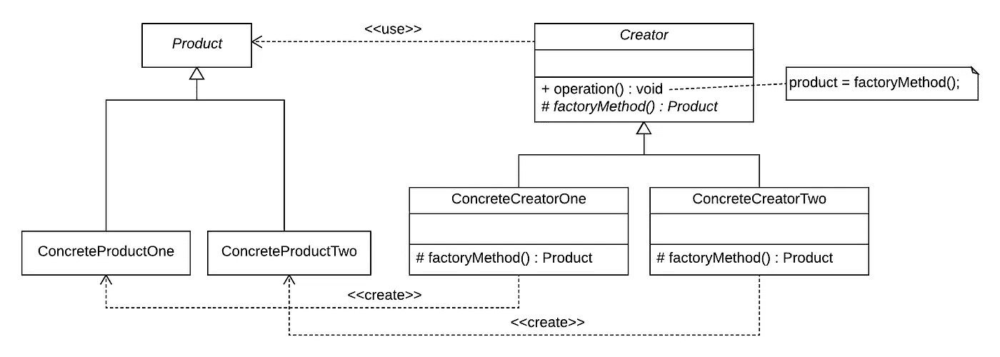
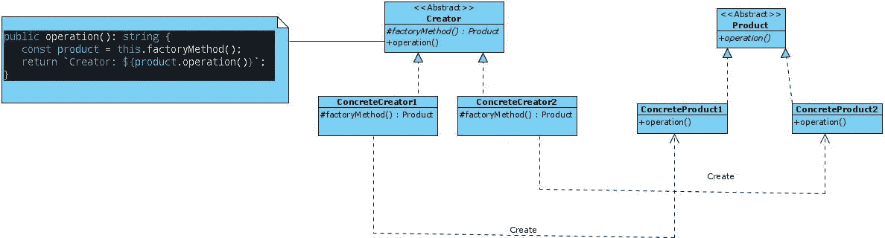
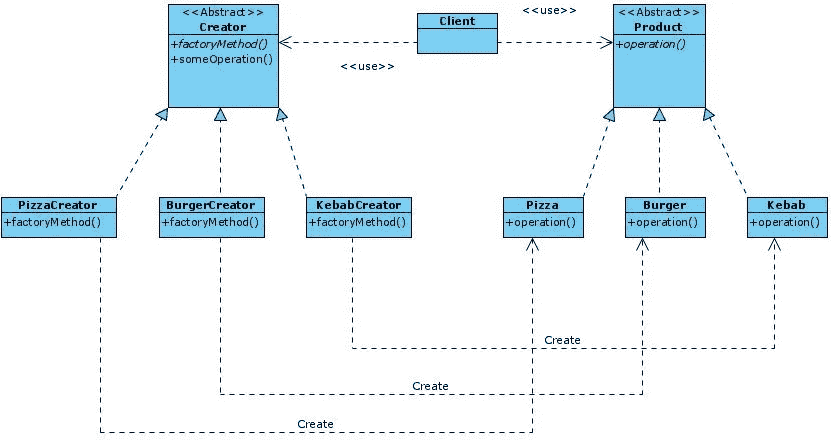

# 理解工厂方法设计模式

> 原文：<https://betterprogramming.pub/understanding-the-factory-method-design-pattern-f5ec631c99d8>

## 分离遵循开闭原则的构建代码(OCP)


由[克里斯多夫·伯恩斯](https://unsplash.com/@christopher__burns?utm_source=unsplash&utm_medium=referral&utm_content=creditCopyText)在 [Unsplash](https://unsplash.com/s/photos/factory?utm_source=unsplash&utm_medium=referral&utm_content=creditCopyText) 上拍摄的照片

在《[设计模式:可重用面向对象软件的元素](https://www.amazon.com/Design-Patterns-Elements-Reusable-Object-Oriented/dp/0201633612/ref=sr_1_2?dchild=1&keywords=Design+Patterns%3A+Elements+of+Reusable+Object-Oriented+Software&qid=1608215228&sr=8-2) *》一书中描述了 23 种经典的设计模式这些模式为软件开发中经常重复出现的特定问题提供了解决方案。*

在本文中，我将描述工厂方法模式是如何工作的，以及何时应该应用它。

# 工厂方法:基本思想

> “*工厂方法模式*是一个[创建模式](https://en.wikipedia.org/wiki/Software_design_pattern)，它使用工厂方法来处理创建对象的问题，而不必指定将要创建的对象的确切类。这是通过调用工厂方法(在接口中指定并由子类实现，或者在基类中实现并可选地由派生类重写)来创建对象，而不是通过调用构造函数来实现的
> 
> — [维基百科](https://en.wikipedia.org/wiki/Factory_method_pattern)
> 
> "定义一个创建对象的接口，但让子类决定实例化哪个类。工厂方法让类将实例化推迟到子类。
> 
> ——Erich Gamma、Richard Helm、Ralph Johnson 和 John Vlissides，“设计模式:可重用面向对象软件的元素”

在许多情况下，我们需要从可能的对象列表中创建不同类型的对象，而这些对象是事先不知道的。自然的趋势是创建一个`factoryManager`类，允许我们基于参数获得不同类型的对象。然而，这种解决方案有两个严重的缺点，我们将在本文中描述:

1.它打破了开放-封闭原则，导致代码不干净，当软件扩展时不容易维护。

2.`factoryManager`类被附加到您想要构建的所有类型的对象上，创建被称为*意大利面条代码*的代码。

下面的代码显示了一个经典问题，其中有一个`create`方法，该方法基于作为参数传递的参数返回一个类型的对象:

```
function create(type) {
  switch(type){
    case '0': return new Object1();
    case '1': return new Object2();
    case '2': return new Object3();
    default: return new Object4();
  }
}
```

工厂方法模式允许更清晰的代码，因为它避免了上面提到的问题。这个模式的 UML 图如下所示:



“设计模式:可重用面向对象软件的元素”一书中的 UML 图

*   **Creator** 是一个抽象类，声明了`factoryMethod`，负责生成一个`Product`对象。这个类不执行对象的具体实现。相反，这个责任被委托给了`ConcreteCreator1`和`ConcreteCreator2`。
*   **混凝土创建器 1** 和**混凝土创建器 2** 用混凝土对象创建逻辑覆盖`factoryMethod`。

构成此模式的类如下:

*   `Product`是所有可创建对象的公共接口。
*   `ConcreteProductOne`和`ConcreteProductTwo`是`Product`接口的实现。
*   `**Creator**`是一个抽象类，其中声明了`factoryMethod`方法，它将负责生成一个`Product`类型的对象。该对象的具体实现不由该类执行，但是责任被委托给了`ConcreteCreator1`和`ConcreteCreator2`类。
*   `ConcreteCreator1`和`ConcreteCreator2`通过创建具体对象覆盖`factoryMethod`。

澄清由于这种模式的名称而经常被误解的几点是很重要的:

1.该模式不实现负责创建特定对象的工厂方法。相反，责任被委托给实现抽象类的子类。

2.该模式是[模板方法模式](https://medium.com/better-programming/design-patterns-template-method-5400dde7bb72)的一个特例，它将算法中变量的责任委托给具体的类。在工厂方法模式的情况下，创建对象的责任被委托给实现接口的类。

3.`factoryMethod`方法不必每次都创建新的实例，但可以从内存缓存、本地存储等返回这些对象。重要的是这个方法必须返回一个实现`Product`接口的对象。

# 工厂方法模式:何时使用

1.  模式工厂方法解决的问题很容易识别:客户必须使用的对象事先并不知道，但是这种知识直接依赖于另一个用户与系统的交互(最终用户或系统)。需要这种模式的传统例子是当用户从选项列表中选择一个对象类型时。
2.  如果需要扩展内部组件(创建的对象的数量)，而不需要附加代码，而是有一个必须实现的接口，并且只能通过创建一个与要包含的新对象及其特定创建者相关的类来扩展。

# 工厂方法模式:优点和缺点

工厂方法模式有许多优点，可以总结为以下几点:

*   代码更易于维护，因为它减少了客户端类和它们的依赖项之间的耦合。
*   干净的代码，因为开闭原则得到了保证，因为可以引入新的具体类`Product`，而不必破坏现有的代码。
*   更干净的代码，因为单责任原则(SRP)得到了尊重，因为创建具体的`Product`的责任被转移到具体的创建者类，而不是拥有这一责任的客户端类。

然而，工厂方法模式的主要缺点是增加了代码的复杂性和所需类的数量。这是应用设计模式时一个众所周知的缺点——在代码中获得抽象必须付出的代价。

# 工厂方法模式示例

接下来我们将举例说明工厂方法模式应用的两个例子:

1.  工厂方法模式的基本结构:在这个例子中，我们将把理论上的 UML 图翻译成 TypeScript 代码，以便识别模式中涉及的每个类。
2.  快餐店的一个服务点(POS ),其中工厂方法模式将被错误地应用，从而导致被称为*简单工厂*的软件模式(不是通过设计),其中 OCP 不被遵守。然而，当不需要多余的抽象时，这种编程技术非常有用。虽然，当你想扩大项目规模时，要付出的代价是很高的。
3.  应用工厂方法模式解决前面的问题。

以下示例将展示使用 TypeScript 实现这种模式。我们选择了 TypeScript 而不是 JavaScript 来实现这个实现——后者缺少接口或抽象类，因此实现接口和抽象类的责任将落在开发人员身上。

## 示例 1:工厂方法模式的基本结构

在第一个例子中，我们将把理论上的 UML 图转换成 TypeScript 来测试这种模式的潜力。这是要实现的图表:



工厂方法模式基本结构的类图

首先，我们要定义我们问题的接口(`Product`)。因为它是一个接口，所以定义了所有特定产品(`ConcreteProduct1`和`ConcreteProduct2`)中必须实现的所有方法。因此，我们问题中的`Product`接口相当简单，如下所示:

产品. ts

我们希望在问题中构建的对象必须实现之前定义的接口。因此，创建了具体的类`ConcreteProduct1`和`ConcreteProduct2`，它们满足了`Product`接口并实现了`operation`方法。

混凝土制品 1.ts

混凝土制品 2.ts

下一步是定义抽象类`Creator`，其中必须定义一个抽象类`factoryMethod`，它将被委托给具体类来创建具体对象的实例。真正重要的是它必须返回一个`Product`类的对象。

另一方面，已经定义了使用`factoryMethod`抽象方法的操作方法。执行的`factoryMethod`方法将是定义它的具体类的方法。

Creator.ts

负责创建具体对象的类被称为`ConcreteCreator`。每个`ConcreteCreator`类都实现了`factoryMethod`方法，其中`ConcreteProduct1`或`ConcreteProducto2`类的新对象是根据已经使用的`Creator`类创建的。

混凝土制品 1.ts

混凝土制品 2.ts

最后，我们将看到类`Client`或`Context`如何选择哪些对象是在没有先验知识的情况下创建的，以及这种模式如何保持 OCP。

客户

## 示例 2:餐馆的 POS(简单工厂)

在这个例子中，将开发一个不满足工厂方法模式的解决方案，但是使用一个负责构建任何对象的`FactoryManager`类。这个解决方案打破了 OCP——除了在创建对象时使用意大利面条式的代码。有趣的是，同一个例子被重构为下面这个使用工厂方法模式的例子。

这里提出的解决方案不是一种设计模式，而是一种在行业中广泛使用的解决方案。事实上，它被称为*简单工厂*并且随着应用程序的扩展存在严重的问题。

要构建的应用程序是一个简单的应用程序，允许您创建不同类型的对象:`Pizza`、`Burger`或`Kebab`。

这些对象的创建事先并不知道，而是依赖于用户交互。`ProductManager`类负责通过`createProduct`方法构建某个类的对象。

下面是第一个提议的 UML 图。事先已经观察到该解决方案的两个问题:

1.  `ProductManager`类与系统的高度耦合。
2.  `ProductManager`类的`createProduct`方法中的意大利面条式代码，它是用一个`switch-case`构建的，当你想扩展到其他类型的产品时，这个`switch-case`会打破 OCP。


简单工厂

与其他示例一样，我们将逐步展示实现该解决方案的代码。`Product`接口与工厂方法模式提出的解决方案中使用的接口完全相同。

产品. ts

下一步包括您想要在这个问题中创建的每个特定对象的实现:`Burger`、`Kebab`和`Pizza`。

汉堡. ts

烤肉串

披萨. ts

最后，我们实现了`ProductManager`类，它负责根据类型参数创建每个对象类型。使用了一个`enum`类型，它允许我们在使用`switch-case`语句时避免使用字符串。

产品经理. ts

最后，有必要显示使用了`productManager`类的`Client`或`Context`类。显然，从`Client`类中，没有观察到该类下有违反干净代码原则的强耦合代码。

index.ts

## 示例 3:餐馆 POS(工厂方法)

在这个例子中，我们将处理例 2 中提出的问题(餐馆的 POS ),并使用工厂方法模式提出解决方案。这个解决方案的目标是避免在`productManager`类中产生的混乱代码，并尊重 OCP。

因此，遵循与我们在前面的例子中介绍的方法相同的方法，我们将从查看 UML 图开始，它将帮助我们识别这个模式的每个部分。



工厂方法

在这种情况下，我们想要构建的对象将是那些对应于`Pizza`、`Burger`和`Kebab`类的对象。这些类实现了`Product`接口。这部分代码与上一个示例中的代码完全相同。但是，让我们回顾一下代码，记住它:

产品. ts

汉堡. ts

烤肉串

披萨. ts

在 UML 图的另一边，我们可以找到`creator`类。让我们从回顾`Creator`类开始，它负责定义`factoryMethod`方法，该方法必须返回实现`Product`接口的对象。此外，我们将有`someOperation`方法，它利用了在每个具体的 creator 类中开发的`factoryMethod`抽象方法。

Creator.ts

我们仍然需要定义每一个特定的`BurgerCreator`、`KebabCreator`和`PizzaCreator` creator 类，它们将创建每一个特定的对象(注意:记住，没有必要总是创建一个对象——如果我们有一个从中检索缓存实例的数据结构，也将实现该模式)。

BurgerCreator.ts

KebabCreator.ts

PizzaCreator.ts

我们需要完成的最后一步是应用我们开发的模式，使用来自`Client`或`Context`类的模式。值得注意的是，`Client`函数不需要任何关于`Creator`或要创建的对象类型的知识，这允许它将责任完全委托给特定的类。

index.ts

最后，我创建了三个`npm scripts`，通过它们可以执行本文中的代码:

```
npm run example1
npm run example2
npm run example3
```

GitHub 回购可用[此处](https://github.com/Caballerog/blog/tree/master/factory-method-pattern)。

# 结论

工厂方法是一种设计模式，它尊重 OCP，并使用多态性将创建对象的责任委托给特定的类。这允许我们有一个更干净和更可伸缩的代码。它主要解决当需要创建依赖于客户机与系统的交互的不同类型的对象时，以及当事先不知道客户机将创建哪个对象时出现的问题。

最后，这种模式最重要的不是它的具体实现，而是能够认识到这种模式可以解决的问题以及何时可以应用它。具体的实现是最不重要的，因为这将取决于所使用的编程语言。