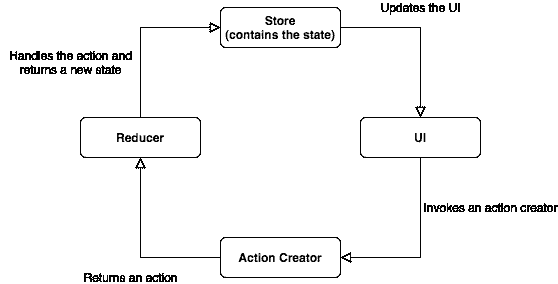

# 了解 React + Redux 应用程序的流程

> 原文：<https://betterprogramming.pub/understanding-the-flow-of-a-react-redux-application-4dc8c8da08c7>

## 关于组件、动作创建者、缩减者、存储、状态等等的推理

[阿德里安·匡威](https://unsplash.com/@lurm?utm_source=unsplash&utm_medium=referral&utm_content=creditCopyText)在 [Unsplash](https://unsplash.com/s/photos/flow?utm_source=unsplash&utm_medium=referral&utm_content=creditCopyText) 拍摄的照片

[React](https://reactjs.org/) 是目前最流行的构建用户界面的 JavaScript 库， [Redux](https://redux.js.org/) (与 [React Redux](https://react-redux.js.org/) 配合使用)是 React 应用最广泛使用的状态管理库。

如果你是一名使用 React 的前端工程师，理解这样的应用程序中的数据流是至关重要的。

让我们一起走过它！

# React + Redux 应用程序的核心部分

组成 React + Redux 应用程序的几个重要概念是理解这些概念所必需的:

## Redux 商店

*Redux store* 是保存应用程序状态的对象。存储是数据的真实来源，应用程序中通过`connect`方法连接到它的任何组件都可以使用它。

## 成分

组件是组成 UI 的构建块。组件可以小到一个按钮或一个头像，也可以大到一个容器或一个页面(甚至是包含整个应用程序的顶级组件)。

连接到商店的组件能够读取应用程序的全局状态，还能触发动作创建器，我们将在接下来讨论。

## 动作创建者

动作创建者是返回一个名为`action`的普通对象的函数。动作创建器通常在用户与 UI 交互时(例如，当单击按钮时)或在组件生命周期的特定时刻(例如，当组件挂载时)被调用。

默认情况下，动作创建器是同步的，但是您也可以使用 Redux 中间件，如 [Redux Thunk](https://github.com/reduxjs/redux-thunk) 或 [Redux Saga](https://redux-saga.js.org/) 来处理异步动作创建器。现在我们只关注同步代码。

## 行动

如上所述，动作是简单的对象。动作有一个`type`属性，它只是一个标识动作的字符串常量。

动作也可以包含任何其他数据，因此您可以包含一个`payload`属性或一个`userId`属性或任何您喜欢的属性。

## 还原剂

Reducers 是纯粹的函数，它接受先前的状态和动作，然后返回状态的更新副本。

# React + Redux 应用程序的流程

现在你已经知道了 React + Redux 应用程序的重要部分，一个图表有助于可视化 React + Redux 应用程序的流程。

React+Redux 应用流程

注意，这里的流动是单向的:它只向一个方向流动。这对于思考你的应用程序是如何工作的，以及当你需要做一些故障排除来追踪一个讨厌的 bug 时，非常有帮助。

# 示例工作流程

让我们看看典型的工作流是什么样子的。

假设您有一个非常简单的计数器应用程序。页面上有一个按钮，您可以单击它来增加计数器，计数器的当前值也会显示在页面上。

工作流程如下所示:

1.  计数器值保存在*存储器*中。
2.  按钮*组件*连接到*存储*以便当用户点击按钮时，`onClick`处理器可以触发*动作创建器*，这是一个简单的函数，我们将命名为`incrementCounter`。
3.  这个`incrementCounter` *动作创建者*然后返回一个*动作*，是一个看起来像`{ type: INCREMENT_COUNTER }`的普通对象。
4.  然后*减速器*处理该动作。reducer 知道，当它接收到类型为`INCREMENT_COUNTER`的动作时，它需要将状态中的`counter`属性的值加 1。
5.  然后更新*存储器*中的状态，并且计数器的值从`0`变为`1`。
6.  UI 中的计数器显示连接到*存储*，因此当状态改变时，UI 会更新以反映这些改变。因此，用户现在可以在屏幕上看到值`1`。

如果用户再次点击按钮，整个过程将会重复，将计数器值增加到`2`。

# 演示代码

在这个 [GitHub repo](https://github.com/thawkin3/redux-example) 中可以找到一个简单的 React + Redux app 的例子。你也可以在这里查看[现场演示](http://tylerhawkins.info/redux-example/build/)。

感谢阅读！