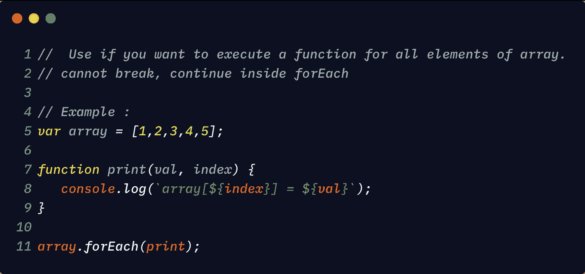

# 了解 JavaScript 中数组的 forEach 方法

> 原文：<https://betterprogramming.pub/understanding-the-foreach-method-for-arrays-in-javascript-48810fccf257>

## 改进您的迭代


照片由[米卡·鲍梅斯特](https://unsplash.com/@mbaumi?utm_source=unsplash&utm_medium=referral&utm_content=creditCopyText)在 [Unsplash](https://unsplash.com/s/photos/syntax?utm_source=unsplash&utm_medium=referral&utm_content=creditCopyText) 上拍摄

# 什么是 forEach？

方法对数组的所有元素执行回调函数。



JavaScript 中的 forEach 方法

# 句法

```
array.forEach(callbackFunction, **[, thisArg]**);// thisArg is optionalarguments for callbackFunctioncallbackFunction(currentValue, index ,array) { //index, array is optional}
```

`forEach`方法不返回任何东西。

让我们从一个循环开始，然后把它转换成一个`forEach`循环

```
var array = [1,2,3,4,5];function print(val, index) { console.log(`array[${index}\] = ${val}`);}for(let index =0, len = array.length; index < len; index++ ) { let val = array[index];
       print(index, val);}
```

现在，让我们使用一个`forEach`循环来做同样的操作。

```
var array = [1,2,3,4,5];function print(val, index) { console.log(`array[${index}] = ${val}`);}array.forEach(print);**// output**
array[0] = 1
array[1] = 2
array[2] = 3
array[3] = 4
array[4] = 5
```

我们不能在`forEach`里面使用`break`或者`continue`。如果你想在中间`break`或`continue`循环，你可以使用:

*   for 循环
*   `every`
*   `some`

## forEach 循环不会对空值执行

示例 1:

```
var arr = new Array(3);arr; // [empty × 3]arr.forEach( val  => console.log(val) ); // it prints nothing
```

示例 2:

```
var arr = [1,,,,];arr.forEach( val  => console.log(val) ); //output : 1
// it prints 1 then forEach loop will be terminated
```

示例 3:

```
var arr = [1**,,**null, undefined, NaN]arr.forEach( val  => console.log(val) );output:
**1
null
undefined
NaN**
```

## 如果数组在迭代过程中被修改，其他元素可能会被跳过

```
var array = [1,2,3,4,5];array.forEach((value, index, sourceArray) => {

    sourceArray.push(10);
    console.log(value);})**output : 
1,2,3,4,5****array : [1,2,3,4,5,10,10,10,10,10]**
```

在上面的例子中，我们在每次迭代中添加了一个元素。但是 for-each 循环将只对元素执行，并且在`forEach`操作开始时在数组中可用。

## 在 forEach 期间删除数组元素

如果在`forEach`循环中删除了数组中未被访问的元素，那么这些元素将被跳过。

```
var array = [1,2,3,4,5];array.forEach((value, index, sourceArray) => {

    sourceArray.pop();
    console.log(value);});**output:** 1, 2, 3array:[1,2]
```

在上面的例子中，我们删除了每次迭代的最后一个元素。被删除的元素不会被打印。只跳过未访问的元素。这就是为什么`3`在输出中被打印，但在源数组中被删除。

# 不要删除或添加元素

我们不应该使用`forEach`来修改`forEach`回调函数中的元素。它违反了`forEach`模式。

记住`forEach`用于对数组的所有元素执行`function`。

# 使用“this”参数

我们还可以在执行`forEach`循环时指定自定义的`this`值。

例 1(没有通过`this)`:

```
var array = [1];function log(val, index) {
    console.log(this); // window object
}array.forEach(log);In the above code this --> window
```

示例 2:

```
var customThis = {val : 10};var array = [1];function log(val, index) {
    console.log(this.val); // 10 
}array.forEach(log, customThis);
```

# 参考

*   [Mozilla 开发者网络](https://developer.mozilla.org/en-US/docs/Web/JavaScript/Reference/Global_Objects/Array/forEach)