# 使用符号理解 JavaScript 和 Typescript 中的迭代器模式。迭代程序

> 原文：<https://betterprogramming.pub/understanding-the-iterator-pattern-in-javascript-typescript-using-symbol-iterator-ab400d46b14a>

## for…of 的引擎盖下是什么？

亚历山大·安德鲁斯在 [Unsplash](https://unsplash.com/s/photos/medium?utm_source=unsplash&utm_medium=referral&utm_content=creditCopyText) 上拍摄的照片

这种模式具有不可思议的潜力，可以将我们的数据结构从算法中分离出来。

它在各种编程语言中被广泛实现。比如 Java 有 **Iterable 接口**。

在一些语言中，有高级控制结构允许你迭代对象，而不需要创建**迭代器模式**(因为它们默认提供)。然而，修改这种内部模式以使用该语言的全部潜力，而不需要像 Java 那样冗长，可能是有用的。

您需要了解迭代器模式。如果你不知道，至少读一下我写的这篇文章，因为解释这篇文章的例子来自上一篇文章。

ES6 引入了一种与 JavaScript 数据结构交互的新方式:迭代。迭代器模式有两个核心概念:

1.  Iterable 是一种数据结构，它提供了一种向公众公开其数据的方式。在 JavaScript 中，实现基于一个键为`Symbol.iterator`的方法。真的，`Symbol.iterator`是迭代器的工厂。
2.  **迭代器**是一个包含指向迭代中下一个元素的指针的结构。

因此，iterable 必须是一个带有函数迭代器的对象，函数迭代器的键是`Symbol.iterator`。

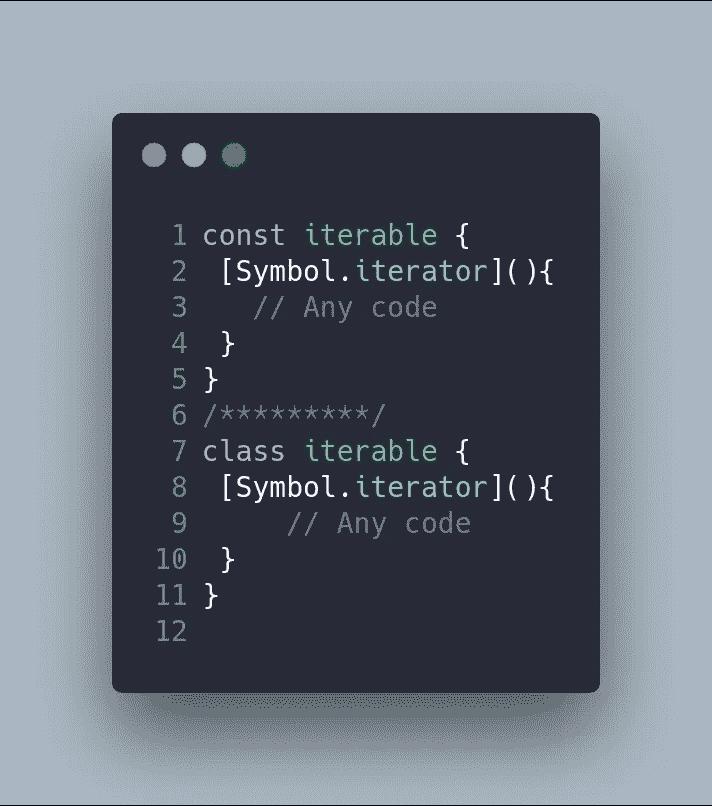

此外，迭代器必须是带有名为 next 的函数的对象，该函数返回带有键的对象:

*   `value`:迭代中的当前项。
*   `done` : `true`如果迭代结束，则`false`否则。

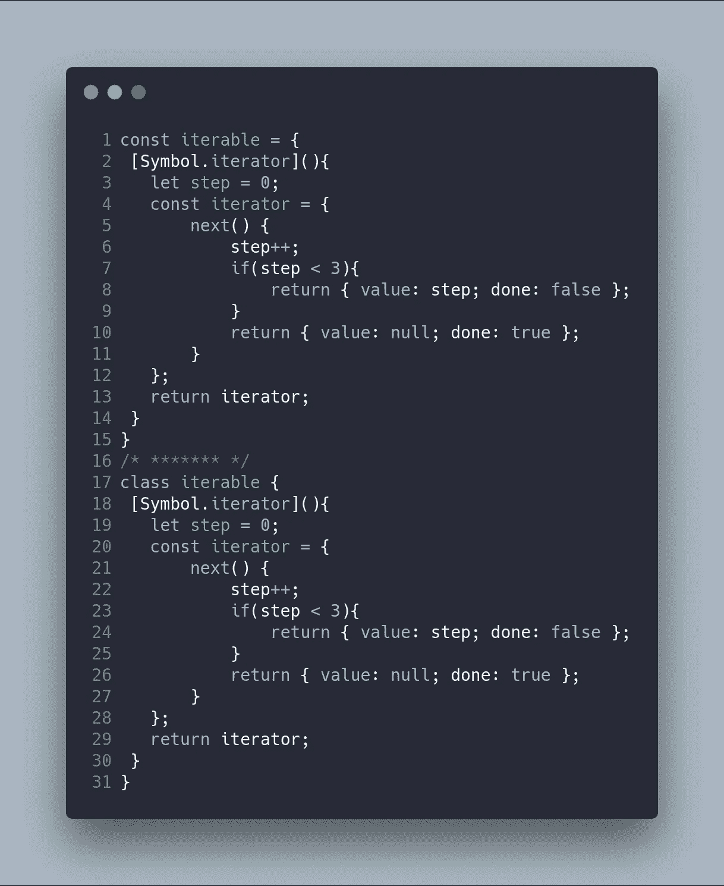

所以，前面的代码定义了一个 iterable 和一个 iterator，用法如下:

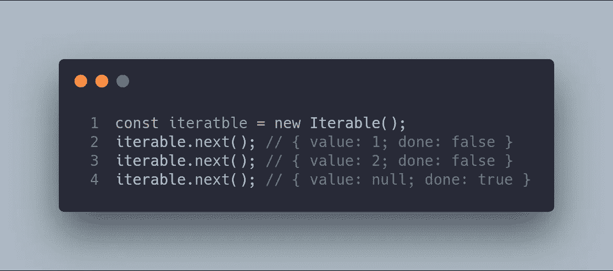

当你使用一个`for-of`循环时，语言使用了一个 iterable，并创建了它的迭代器。它继续调用`next()`，直到`done`为真。

JavaScript 中有一个列表可以直接使用这些概念:

*   数组内每个元素的`Arrays`和`TypedArrays`。
*   `Strings`统领各个人物。
*   `Sets`越过他们的元素。
*   `Maps`超过它的键值对。

以下是 JavaScript 中使用 iterables 的一些其他结构:

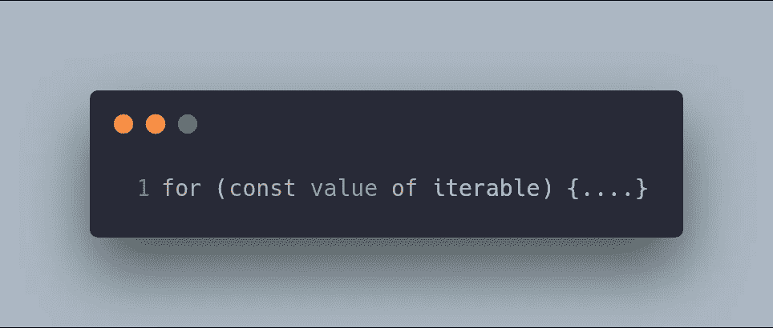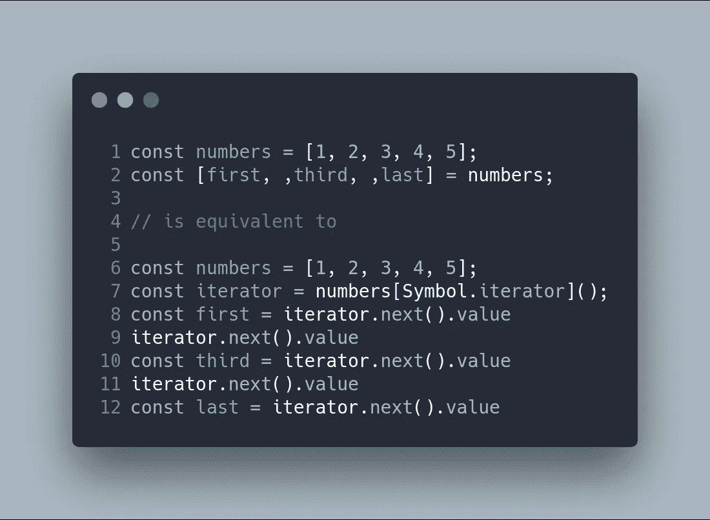

# 第一个例子:单词集合

现在让我们看看如何使用 JavaScript/TypeScript 符号实现这种模式。在这种情况下，我创建了一个问题，其中有一个名为`WordsCollection`的类，它定义了一个单词列表(`items`)及其一组 get 和 add 方法(`getItems`和`addItem`)。该类由使用控制结构的`client`使用，如`for`或`forEach`。UML 图显示了这个带有经典迭代器模式的场景:

现在，这个 UML 图保持了与定制迭代器的兼容性，并实现了本地迭代器。

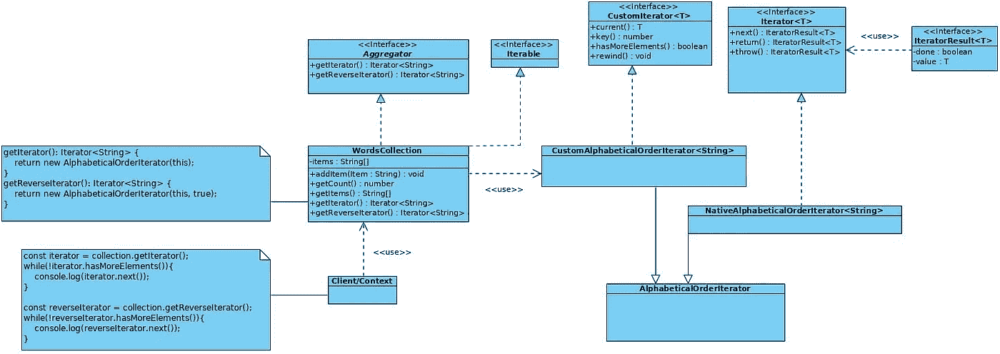

首先，让我们从无需实例化任何类就能本机使用迭代器的客户机开始。它将直接从 for-of 循环开始执行迭代。

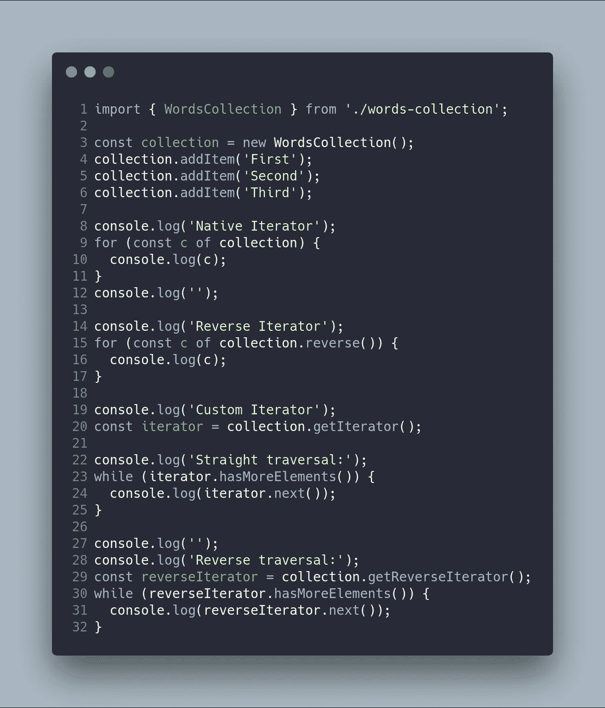

请注意，语言清理器上迭代器的本机使用，因为它与编程语言的控制结构集成在一起。

这是相关的`WordsCollection`代码:

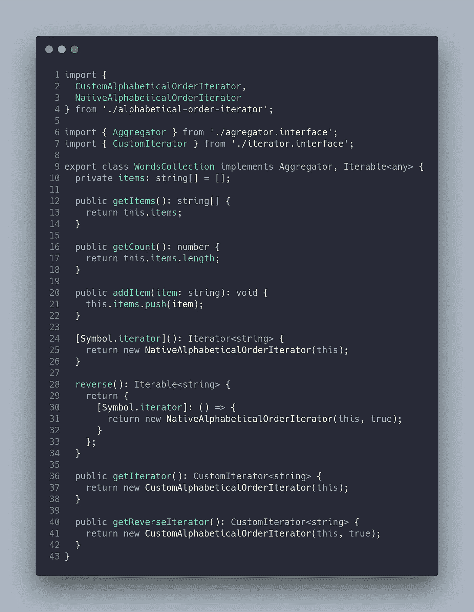

首先要观察的是，我们需要实现两个接口:

*   **聚合器**用于自定义可迭代，定义对象可迭代的必要方法。这里我们必须实现迭代器的构造方法。
*   **迭代器**由语言原生使用，是定义函数`[Symbol.iterator]: ()`的迭代器。

本机迭代器的关键是本机迭代器的工厂函数——而不是直接实现它，它是在一个新的类中提取的，保持代码像以前的解决方案一样干净(`NativeAlphabeticalOrderIterator`)。

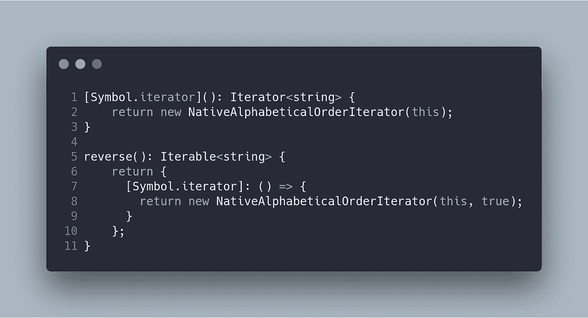

最后，本地迭代器和定制迭代器都从实现其余方法的抽象迭代器扩展了它们的`next()`方法。迭代器中的`next()`方法之间的主要区别是返回值。这是因为在本机迭代器中必须满足`Iterator`接口，它返回一个`IteratorResult`，而`CustomIterator`直接返回值。

这些代码甚至可以被重构，与其他设计模式一起使用，比如[模板方法](https://carloscaballero.io/design-patterns-template-method/)或[策略](https://carloscaballero.io/stategy-pattern-in-javascript-typescript/)。然而，我不希望添加这些模式使这个例子变得复杂。

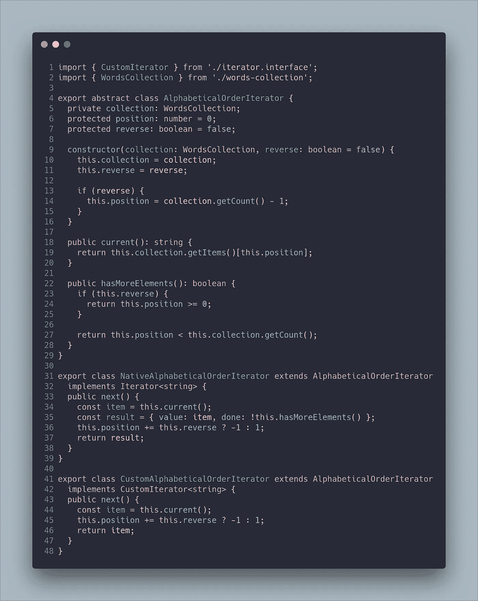

客户端从`WordsCollection class` ( *单一责任*)的内部结构中分离出来，你可以扩展软件实现新的迭代器(*打开/关闭*)。

在应用了`Iterator`模式之后，我创建了两个 npm 脚本来运行这里显示的代码示例。

`npm run example1-problem`
`npm run example1-iterator-solution-1`

# 示例:中型与开发型

想象一下，我们必须创建一个软件，允许我们向社交网络中的联系人发送电子邮件，并考虑到我们将区分发送的邮件类型。在我们的人脉网络中，我们有两类联系人:朋友和同事。发送的电子邮件有多正式取决于联系人。

一开始我们有来自两个著名社交网络的联系人:Dev.to 和 Medium。每个社交网络的数据结构的实现是不同的，因为在 Dev.to 中使用一个`array`来维护联系人，而在 Medium 中使用一个`Map`。

您可以在下面的 gif 中找到使用我们整个结构的客户端(我已经给出了一个小的 CLI 示例)。

在下面的 UML 图中，您可以看到针对这个问题提出的使用`CustomIterator`的解决方案:

下面是与包含本机迭代器的解决方案相关的图表。我们继续保持与定制迭代器的兼容性:

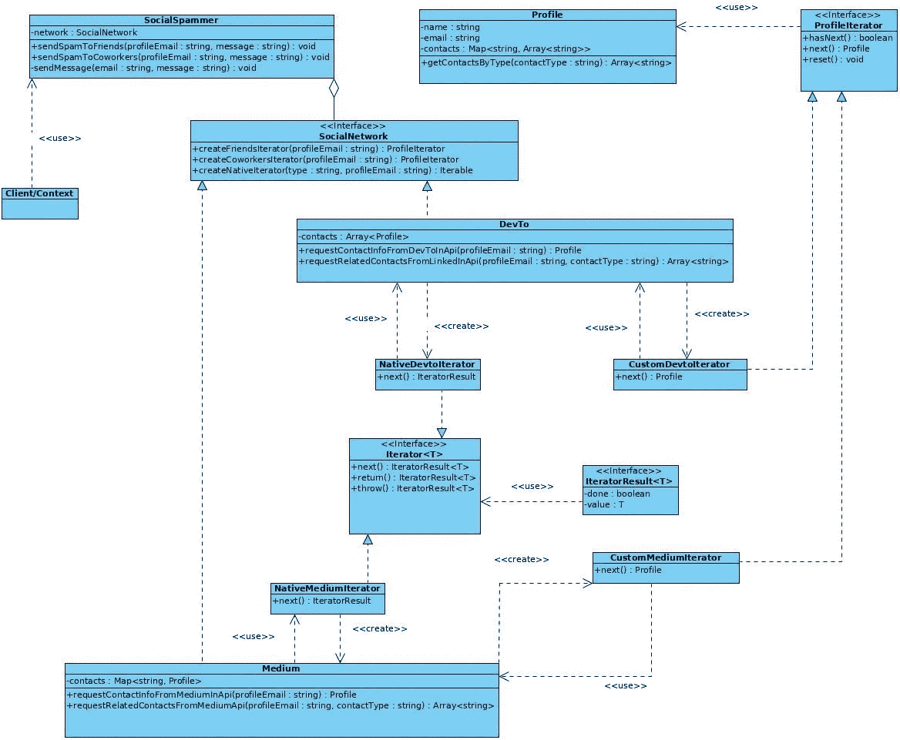

开发解耦软件的主要优势在于，当我们的软件增长时，它不会受到变化的影响。事实上，我们应用程序的客户端仍然是同一段代码，因为它是基于接口并使用依赖注入构建的。

`sendSpamToFriends`和`sendSpamToCoworkers`方法使用迭代器，无论是自定义的还是本地的。

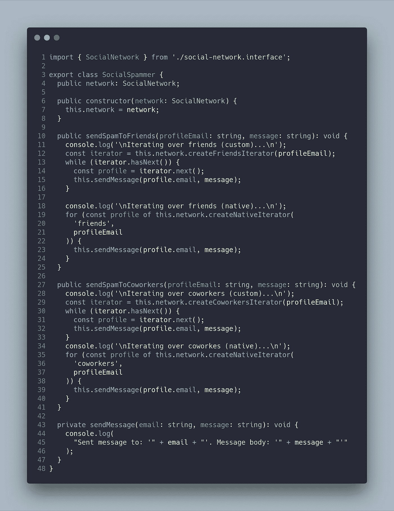

在这个方法中，我们使用自定义和本地迭代器。原生迭代器的创建被委托给迭代器工厂，以区分朋友或同事。

社交网络(dev.to 或 medium)必须通过`Iterable <Profile>`类型的对象创建本地迭代器来满足`SocialNetwork`接口。这是与社交网络相关的代码:

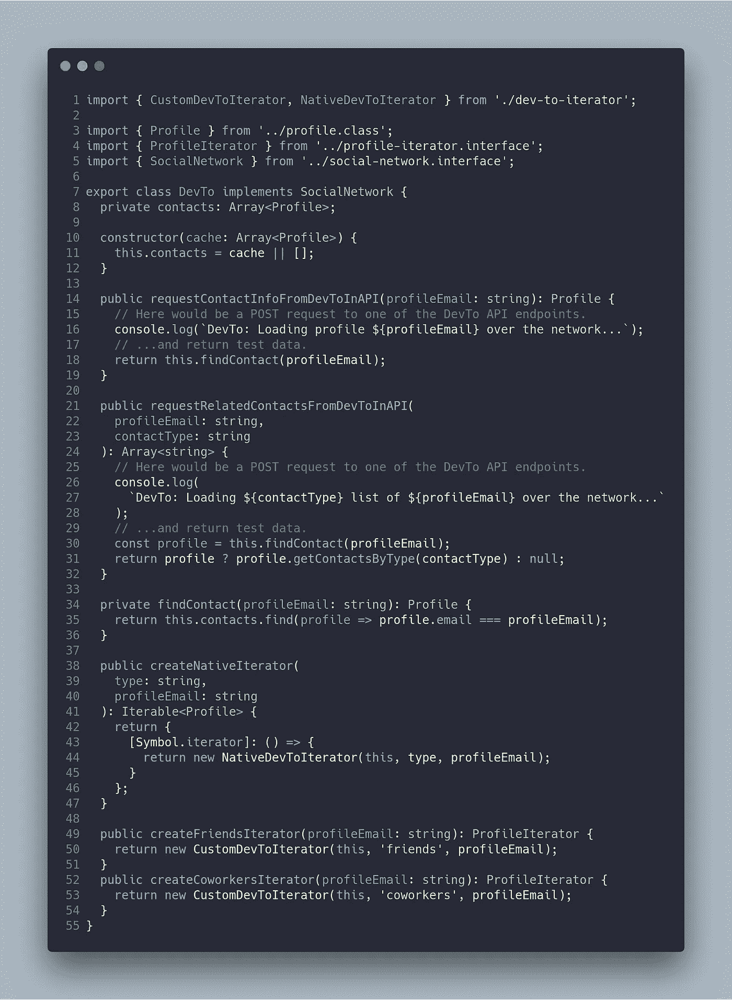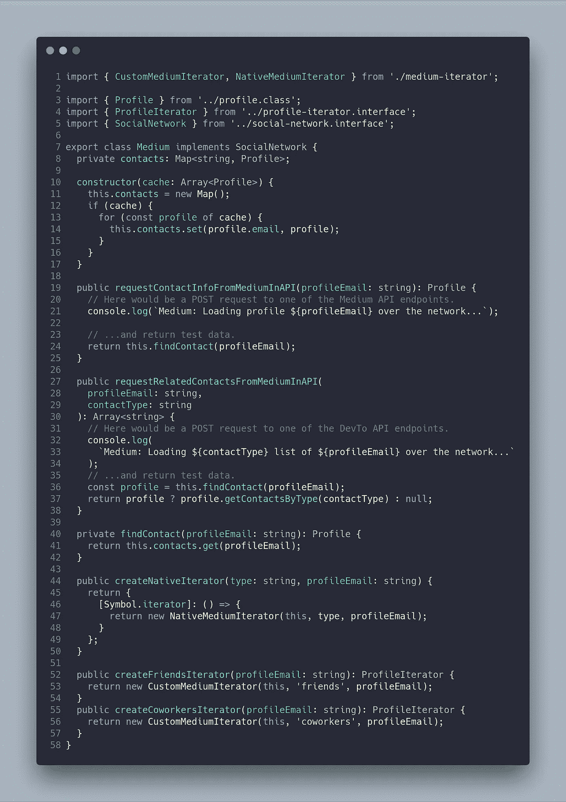

每个社交网络(dev.to 或 medium)都必须通过使用`Iterable type <Profile>`的对象创建本地迭代器来满足`SocialNetwork`接口。

下面是与迭代器相关的代码。两个迭代器(自定义迭代器和本地迭代器)都是从父迭代器扩展而来的，在父迭代器中实现了共同的方法。虽然在我们的例子中，`Iterator`接口有几个方法，但是我们只需要实现`next()`方法。

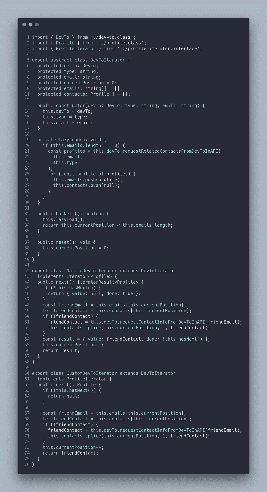

与 Medium 关联的迭代器对应于与 dev.to 相同的接口:

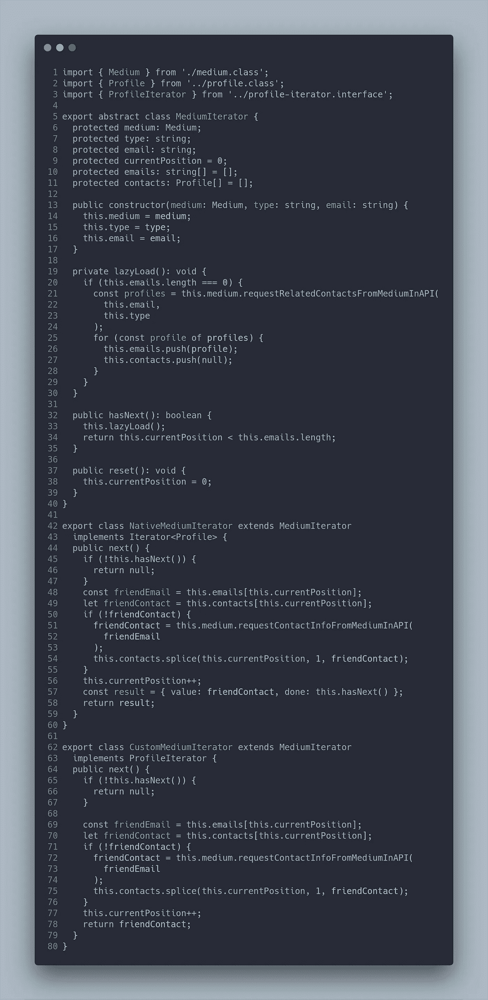

在应用了`Iterator`模式和 CLI 界面之后，我创建了一个 npm 脚本来运行这里显示的例子。

`npm run example2-iterator-solution1`

# 结论

迭代器模式可以帮助您避免项目中的耦合代码。当集合中有多种算法和数据结构时，迭代器模式非常适合。您的代码将会更加整洁，因为您应用了两个著名的原则:**单一责任**和**打开/关闭**。

有时我们对了解我们正在开发的编程语言感兴趣。我们想要检查**迭代器模式**是否是固有实现的，就像在 JavaScript(贯穿本文)、Python 或 PHP 等语言中一样。

最重要的事情不是实现我所展示的模式，而是能够识别这个特定模式可以解决的问题，以及何时可以或不可以实现所述模式。这一点至关重要，因为实现会因您使用的编程语言而异。