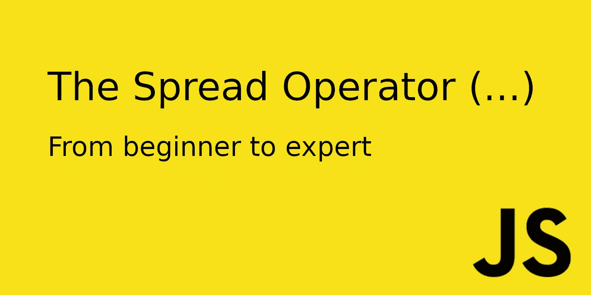

# 了解 JavaScript 扩展运算符—高级用途

> 原文：<https://betterprogramming.pub/understanding-the-javascript-spread-operator-from-beginner-to-expert-part-2-1ec1808d015e>

# 介绍

扩展运算符`…`、**、**最早是在 ES6 中引入的。它很快成为最受欢迎的功能之一。以至于尽管它只在数组上工作，有人提议将其功能扩展到对象。这个特性最终在 ES9 中引入。

本教程分为两个部分，旨在向您展示为什么应该使用 spread 运算符，它是如何工作的，并从最基本到最高级深入探究它的用法。

如果你还没有阅读本教程的第一部分，我鼓励你这样做！

以下是本教程内容的摘要:

# 第一部分

1.  为什么应该使用扩展运算符。
2.  克隆数组/对象。
3.  将类似数组的结构转换为数组。
4.  作为参数的扩展运算符。
5.  将元素添加到数组/对象。
6.  合并数组/对象。

# 第二部分

1.  析构嵌套元素。
2.  添加条件属性。
3.  短路。
4.  其余参数`…`。
5.  默认析构值。
6.  默认属性。

# 克隆包含嵌套元素的数组/对象

在本文的第一部分中，我们学习了引用数据类型、意外变量突变，以及如何通过使用 spread 操作符不可变地克隆数组/对象*来解决这个问题。*

然而，当涉及嵌套引用数据类型时，这种方法有一个小问题。扩展运算符仅执行*浅层克隆。*

这是什么意思？例如，如果我们试图克隆一个包含数组的对象，克隆对象内部的数组将包含一个对存储原始数组的内存地址的引用…

这意味着，虽然我们的对象是不可变的，但其中的*数组不是。*这里有一个例子来说明这一点:

嵌套对象变异

如你所见，我们的`squirtleClone`已经被永久克隆了。当我们将原`pokemon` 对象的`name`属性更改为`Charmander`时，我们的`squirtleClone`不受影响，它的`name` 属性*没有发生突变*。

然而，当我们给原来的`pokemon`对象的`abilities`属性添加一个新的能力时……我们的`squirtleClone`的能力会受到这个变化的影响。因为`abilities`属性是一个引用数据类型，所以它不会被永久克隆。欢迎来到 JavaScript 的现实世界。

解决此问题的方法之一是使用 spread 运算符克隆嵌套属性，如下例所示:

使用扩展运算符克隆嵌套对象特性

很明显，这不是解决我们问题的理想方法。我们需要对每个引用类型属性使用 spread 操作符，这就是为什么这种方法只对小对象有效。

那么，最优解是什么呢？深度克隆*。*

由于关于深度克隆有很多要说的，所以我不会讲太多细节。我只想说，深度克隆的正确方法要么是使用外部库(例如， [Lodash](https://lodash.com) )，要么是自己编写一个函数来完成它。

# 添加条件属性

有时候，我们需要给一个对象添加属性，但是我们不知道这些属性是否存在。这没什么大问题，我们总是可以用一个`if`语句来检查该属性是否存在:

然而，有一种更简单的方法可以达到同样的结果，那就是使用带有`&&`操作符的短路条件。简要说明:

## 短路

当我们用`&&`对一个表达式求值时，如果第一个操作数是`false`，JavaScript 就会短路，忽略第二个操作数。

让我们来看看下面的代码:

用&&运算符短路

如果`starterPokemon.length > 0`为假(数组为空)，语句就会短路，我们的`choosePokemon`函数永远不会执行。这就是为什么前面的代码等同于使用传统的 if 语句。

回到我们最初的问题，我们可以利用逻辑操作符`AND`向对象添加条件属性。方法如下:

使用扩展运算符有条件地添加属性

这是怎么回事？请允许我解释。

我们已经知道，通过使用`&&`操作符，只有当第一个操作数为真时，语句的第二部分才会被执行。

因此，只有`abilities` 变量为真(如果变量存在)，才会执行语句的后半部分。这后半部分是做什么的？

它创建一个包含`abilities`变量的对象，然后用 spread 操作符对其进行析构，放在语句的前面，这样就把已经存在的`abilities` 变量不变地添加到我们的`fullPokemon`对象中。

在我们介绍最终的高级扩展用途——为对象添加默认属性之前，我们必须先深入了解两个新概念:默认析构值和`rest`参数。

一旦我们熟悉了这些技术，我们就能够将它们结合起来为对象添加默认属性。

# 默认析构值

如果我们试图析构一个不存在的数组元素或对象属性，我们会得到一个未定义的变量。如何才能避免未定义的值？通过使用*默认值*。这是如何工作的？

在实际的析构语句中，我们可以给析构的变量赋予默认值。这里有一个例子:

分配默认值

如您所见，通过在析构语句中向`type` 变量添加默认值`Water`，我们避免了在`pokemon`对象没有`type`属性的情况下出现未定义的变量。

# Rest 参数(…)

你可能会惊讶地听到，传播运营商是*超载*。这意味着它有不止一个功能。它的第二个功能是充当 rest 参数。

> 函数的最后一个参数可以以`*...*`为前缀，这将导致所有剩余的(用户提供的)参数被放置在一个“标准”javascript 数组中。只有最后一个参数可以是 rest 参数。— [**MDN 文档**](https://developer.mozilla.org/en-US/docs/Web/JavaScript/Reference/Functions/rest_parameters)

简单地说，rest 操作符获取所有剩余的元素 *(* 这就是它被命名为 rest 的原因，因为在**中剩余的元素)并将它们放入一个数组中。这里有一个例子:**

**Rest 参数示例**

**如你所见，我们可以向`printPokemon`函数传递任意多的能力。我们在类型参数(其余的参数)之后引入的每一个值都将被收集到一个数组中，然后我们用`join`函数将它转换成一个字符串，并打印出来。**

> *****注意*** *:记住其余参数必须是* ***最后一个参数*** *，否则会出错。***

**在析构的时候也可以使用 rest 参数，这是我们感兴趣的部分。它允许我们获得一个对象的剩余属性，并存储它们。**

**下面是一个在析构赋值中使用的 rest 参数的例子:**

**用 rest 参数进行析构**

**如上所示，我们可以使用 rest 参数来析构`pokemon`对象中剩余的属性。和前面的例子一样，在`id` 属性之后，我们的`pokemon`对象可以有任意多的属性，它们都将被 rest 参数收集。**

**现在我们知道了 rest 参数是如何工作的，以及如何在析构赋值中应用它，让我们回到处理默认属性。**

# **添加默认属性**

**有时，我们有大量相似但不完全相同的对象。它们中的一些缺乏其他物体所具有的特性。然而，我们需要所有的对象都有相同的属性。如何才能实现这一点？**

**通过设置默认属性。这些是带有默认值的属性，如果我们的对象还没有这个属性的话，它们将被添加到我们的对象中。**

**通过将 rest 参数与默认值和 spread 操作符结合使用，我们可以向对象添加默认属性。这听起来可能有点令人生畏，但实际上很简单。这里有一个如何做到这一点的例子:**

**添加默认属性**

**前面的代码片段是怎么回事？让我们来分解一下:**

**如你所见，当我们析构`abilities` 属性时，我们添加了一个默认值`[]`。正如我们已经知道的，只有当 abilities 变量不存在于`pokemon`对象中时，默认值才会被赋给它。**

**在同一行中，我们利用 awesome rest 参数将`pokemon`对象的其余属性(名称和类型)收集到一个名为`rest`的变量中。**

**在第 7 行，我们将 rest 变量(如您所见，它是一个包含`name`和`type`属性的对象)扩展到一个对象文字中，以生成一个新的对象。**

**我们还添加了`abilities`变量，在本例中，它是一个空数组，因为这是我们在前一行中指定的默认值。**

**在我们最初的`pokemon`对象已经有了一个`abilities`属性的情况下，先前的代码不会修改它，它将保持它的初始值。**

**这就是我们如何给一个对象添加默认属性。让我们将前面的代码放入一个函数中，并将其应用于一个大型对象集合:**

**正如你所看到的，数组中所有的`pokemon`现在都有一个`abilities`属性。**

**在`charmander`和`bulbasur`的例子中，它们有一个空数组，因为这是我们指定的默认值。然而，`squirtle`对象保持了它原来的能力数组。**

**当然，还有其他方法可以给对象添加默认属性，主要是通过使用 if 语句。**

**然而，我想展示一种有趣的新方法，通过使用默认值、rest 参数和 spread 操作符的组合。然后，您可以选择最适合您的方法。**

# **结论**

**这是*理解 JavaScript Spread 操作符—从初学者到专家* 教程的第二部分，也是最后一部分。下面是第一部分的链接[。](https://medium.com/better-programming/understanding-the-javascript-spread-operator-from-beginner-to-expert-8f1c110c64db)**

**在本教程的第二部分中，我们学习了 spread 运算符的一些更高级的用法，包括析构嵌套元素、添加条件属性和添加默认属性。**

**我们还学习了三个有趣的 JS 概念:短路、默认析构值和 rest 参数。**

**我真诚地希望这篇文章对你有用，谢谢你的阅读。**