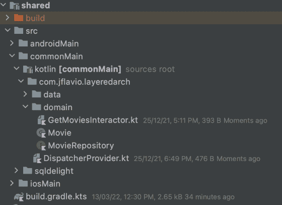

# 用 KMM 理解分层架构，第 3 部分—领域层

> 原文：<https://betterprogramming.pub/understanding-the-layered-architecture-with-kmm-part-3-the-domain-layer-3df5e1fa3e6a>

## 第 3 部分，共 5 部分

KMM 项目的理念是能够尽可能多地重用代码。业务逻辑不会因平台而异，它总是相同的，所以我们的域层(将是纯 Kotlin)在项目的共享模块中是有意义的。

这一层可以被任何平台重用，无论是 web、移动还是终端。这是我们定义仓库和用例或交互器的契约或接口的地方。对于当前的例子，我们只有一个交互器:`GetMoviesInteractor`，顾名思义，它将处理获取电影并依赖于`MovieRepository`库，后者将是我们的`domain`包中的一个接口。

```
class GetMoviesInteractorImpl(private val repo: MovieRepository) {
    override suspend fun execute(): List {
        return repo.getMovies()
    }
}
```

可以想象，域内的所有类和函数都不依赖于任何外部平台框架(无论是 iOS、Android 等)。它只取决于它自己和它的定义。我们的`GetMoviesInteractor`在其构造函数中期望任何实现`MovieRepository`接口的对象，并返回属于同一层的对象。

您可能想知道，拥有一个除了调用简单的存储库功能什么都不做的用例有什么意义呢？乍一看可能没有多大意义(而且在很多情况下，尤其是在小 app 中，确实没有)，但是使用*交互器*可以简化业务逻辑的构建和维护。

让我们假设，我们的`Movie`模型有一个类型为`MovieDirector`(另一个类)的`directorDetail`属性。电影存储库不一定有导演信息，可能有必要向另一个存储库查询该信息。

```
class GetMoviesInteractorImpl(
    private val moviesRepo: MovieRepository,
    private val directorsRepo: MovieDirectorRepository,
    private val productionCompanyRepository: ProductionCompanyRepository
) {
    override suspend fun execute(): List {
        val movies = moviesRepo.getAll()
        val moviesDetail = movies.map { movie ->
            MovieDetail(
                movie = movie,
                director = directorsRepo.getDirectorDetailById(movie.directorId),
                productionCompany = productionCompanyRepository.getCompanyDetailById(movie.productionCompanyId)
            ) 
        }
        return moviesDetail
    }
}
```

最后，我们的`shared`模块(我们应用程序的所有共享核心都在这里)的结构如下:

*   `– androidMain`:这里我们添加了一个*数据库驱动工厂*，这是一个 Android 的 SqlDelight 实现。
*   `–iosMain`:同上，这里我们实现了 iOS 的 SqlDelight 数据库的实例。
*   `– commonMain`:这里是*多平台魔法*。在里面，我们将为我们的`domain`和`data`层划分。在域包中是我们的*交互器*、`Movie`模型和存储库接口。在图中，您可以看到一个`DispatcherProvider.kt`,它定义了 Kotlin 协程的调度程序，用于数据层中存储库或数据源的实现。



值得澄清的是，在`androidMain`和`iosMain`包中，您会找到那些平台的 Kotlin 代码，比如 SQLight 数据库管理器。业务/领域层的代码可以在`commonMain`中找到，因为它是最可重用和独立的。

我们将在下一篇文章中看到数据层的结构。同时，应该清楚的是，域层(我们已经在域包中的`shared/commonMain`模块中实现了)是将被两个平台和数据层重用的层，因此它的实现被排除在`androidMain`和`iosMain`之外。

另一个重要的细节:不要忘记在我们的`shared`模块中添加 Kotlin 协程依赖。

```
// shared/build.gradle.kts
   sourceSets {
        val coroutineVersion = "1.6.0-native-mt"
        val commonMain by getting {
            dependencies {
                implementation("org.jetbrains.kotlinx:kotlinx-coroutines-core:$coroutineVersion") {
                    version { strictly(coroutineVersion) }
                }
            }
        } ... }
```

您可以在 GitHub 上关注项目的进展:

[](https://github.com/jflavio11/LayeredKMM) [## GitHub-jflavio 11/LayeredKotlinMultiplatform:展示分层的示例 KMM 应用程序…

### 这个项目是由一系列的职位，你可以在我的博客 https://jflavio.com 领域和数据层…

github.com](https://github.com/jflavio11/LayeredKMM) 

# 此帖子系列的拆分

这是我们讨论领域层的第二篇文章。下面，我们将讨论数据层。本指南分为以下帖子:

1.  [简介](https://medium.com/better-programming/understanding-layered-architecture-in-a-kotlin-multiplatform-project-part-1-a7488f478978)
2.  [设计解决方案](https://jflavio11.medium.com/understanding-layered-architecture-in-kmm-part-2-designing-the-solution-957e2b1fb536)
3.  [创建领域层](https://jflavio11.medium.com/understanding-the-layered-architecture-with-kmm-part-3-the-domain-layer-3df5e1fa3e6a)(本帖)
4.  [创建图层数据](https://jflavio11.medium.com/understanding-layered-architecture-in-kmm-part-4-the-data-layer-6fc0e153fffb)
5.  实现表示层