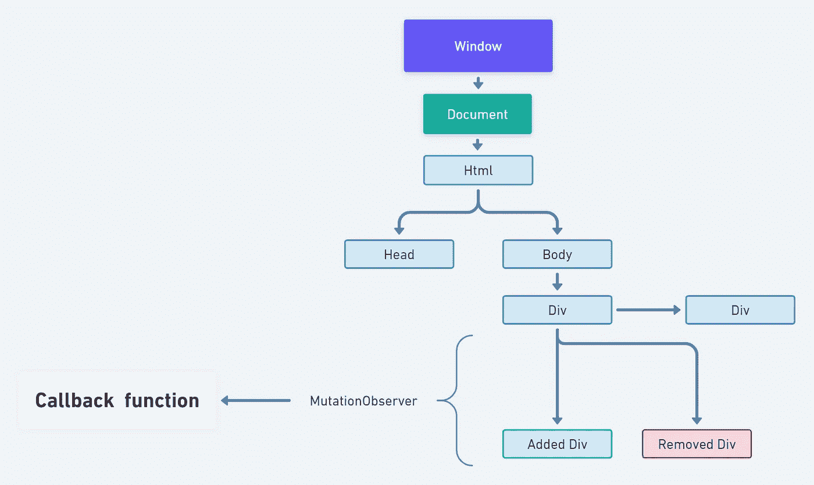

# 了解变异观察器 API

> 原文：<https://betterprogramming.pub/understanding-the-mutationobserver-api-f9ac9f93d1a2>

## 这个浏览器 API 给了我们一些你应该使用的很酷的特性。这可能看起来很可怕，但我向你保证这不是！

DOM 和变异观测器

正如我在这里描述的，在 API 的工作方式上`MutationObserver`很像`IntersectionObserver`。除了名称相似之外，这两个 API 的输出非常不同。大多数大型浏览器都支持`MutationObserver`，因此你可以开始利用它的功能。

*那么这是怎么回事呢？*

DOM 的变化！

虽然这听起来很简单，但它也非常强大。有了这个特性，您可以检测特定的元素是否被插入、删除，或者元素的属性是否发生了变化。

如果不使用这个 API，相对简单的任务会有很多边缘情况，并且性能可能会根据您的实现而有所不同。使用标准浏览器 API 可以确保开箱即用的性能和稳定性。

# 一些使用案例

*   如果一些元素是异步插入的，您希望运行一些代码
*   您希望在单页应用程序中检测到“页面变化”
*   比方说，你不能控制从第三方库中插入的 HTML 元素
*   您有一个在站点上实现的第三方库，并且您想知道站点何时在页面上插入某个元素

最后一个例子是我接触 API 的方式。

# 如何使用它

同样，IntersectionObserver API 使用起来有点古怪，我们可以很容易地创建一个小的包装器，在我看来，它使使用起来更加流畅。本机实现需要三个参数:

1.  HTML 元素(可以是整个正文)
2.  决定某些细节的配置对象([见此处](https://developer.mozilla.org/en-US/docs/Web/API/MutationObserver/observe))
3.  一个回调函数，只要 API 注册了一个符合您的配置参数(1 和 2)的更改，就会执行该函数

变异观测器包装

我将默认配置和元素，以便在上面的包装器中进行检查。这个配置的作用是观察整个文档体的变化。`subtree: true`将确保我们查看嵌套的插入或删除。

如果您已经知道您想在其中寻找变化的子元素，那么给出一个比`document.body`更具体的选择器会更有效。
为了简单起见，上面的包装器只需要一个回调函数，只要任何元素发生变化，这个函数就会被触发。

变异观察器回调函数

这可能看起来有点嵌套和可怕，但现在不要介意。
上面将检查添加到 DOM 中的所有节点。如果节点有一个`id=’color-node’`，它将等待 200ms，并将背景更改为橙色。

## 一个例子

现在，假设我们是一个第三方库的制作者，该库在将具有特定 id 的 div 元素插入站点后，将它们更改为特定的颜色。现在，我们无法控制网站是如何实现的。它可能是一个 SPA 或者一个 WordPress 站点。

网站可能会使用自己的 JavaScript 或其他库来插入元素。

为了简单起见，让我们假设站点定期插入一个特定的节点。现在我们的虚拟库将改变插入节点的背景颜色。

一个简单的实现，在插入元素时改变颜色

在上面的例子中，我模拟站点以 500 毫秒的间隔插入 9 个 div 元素。在现实生活中，这不太可能发生。但这就是`MutationObserver`的妙处。每当插入、删除或更改元素时，它都会触发回调函数。

注意:与`IntersectionObserver`一样，当您不再希望订阅 DOM 中的变化时，使用`disconnect`方法很重要。

## SPA URL 更改

在另一个小用例中，我们使用`MutationObserver`来检测单页面应用程序中的页面变化。现在，由于他们不做真正的浏览器页面更改，而是使用内部路由，我们的脚本将不会像在“普通”网站上那样被加载和执行。

使用`MutationObserver`，我们可以在 DOM 中寻找变化(SPA 路由器的变化),并对照先前的检查`location.href`,以确定 SPA 是否改变了它的视图。在这之后，我们应该重新运行我们的核心代码逻辑。一个简单的例子如下:

检测 SPA URL 中的更改

# 最终注释

作为一个维护在许多站点上实现的库的人，使用`MutationObserver`有助于我们有一个统一的 API 来处理 DOM 中的异步插入或删除。

在我们的例子中，每当站点插入特定的 div 元素时，我们都需要做出反应。

如果一个新的 div 元素满足一组标准，我们将把我们的“产品”插入到该 div 元素中。

现在，因为`MutationObserver`在所有插入时触发我们的回调，所以不管客户端是无限滚动来不断添加元素，还是通过单击按钮来添加元素，都没有关系。

再加上`IntersectionObserver` API，处理某些 DOM 的事情超级简单，不需要实现很多定制代码。

这两种 API 都已经有一段时间了，但我觉得采用率仍然很低。

这可能是因为旧的堆栈溢出答案或它们可怕的名字。

感谢阅读！敬请关注更多内容。