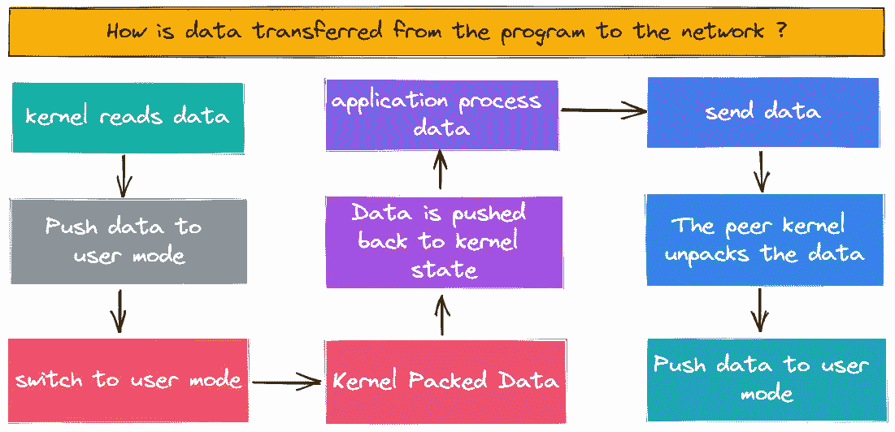
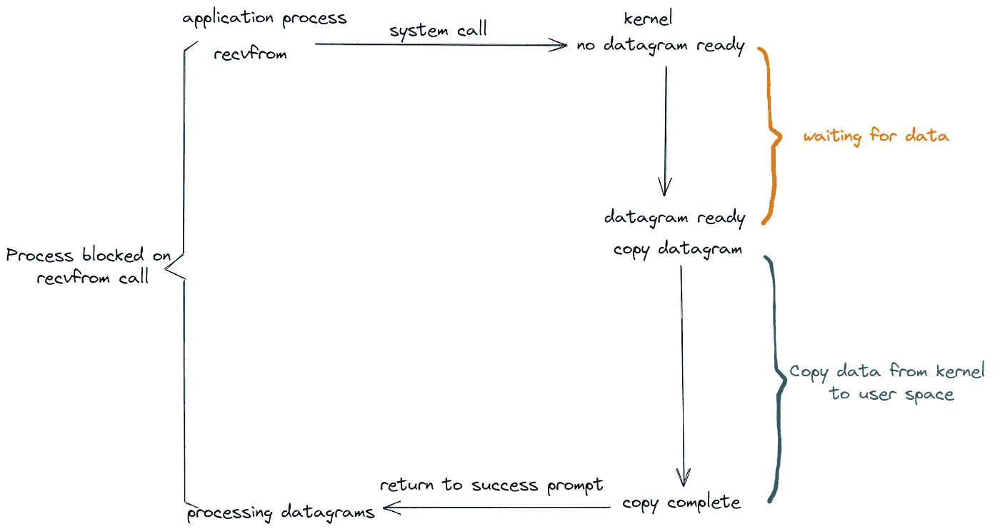
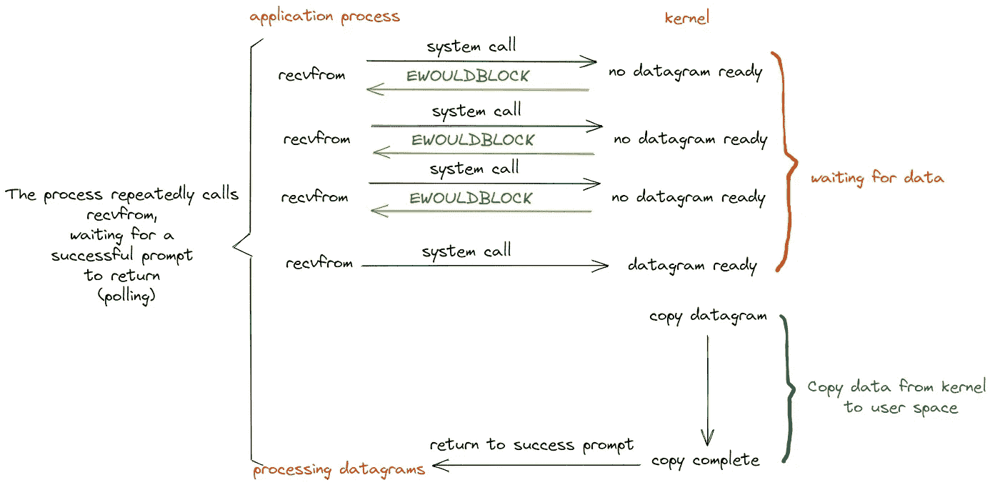
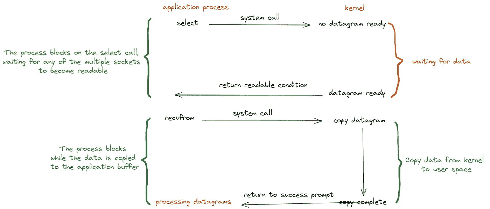
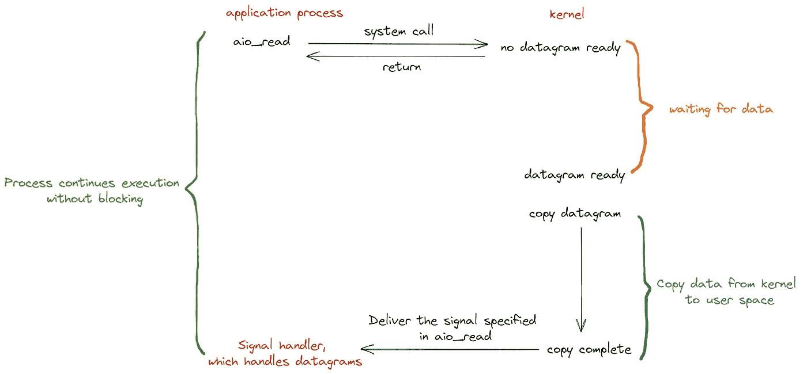
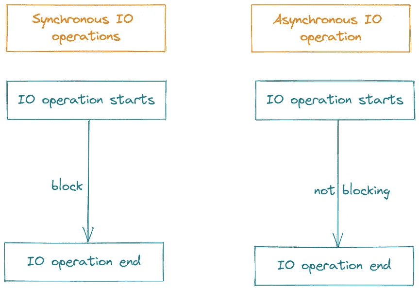
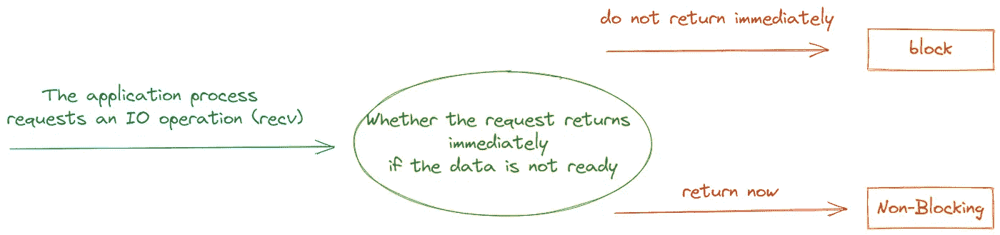

# 了解网络 IO 模型

> 原文：<https://betterprogramming.pub/understanding-the-network-io-model-e89b169eb128>

## 网络 IO 常见知识点

由[乔安娜·科辛斯卡](https://unsplash.com/@joannakosinska?utm_source=medium&utm_medium=referral)在 [Unsplash](https://unsplash.com?utm_source=medium&utm_medium=referral) 上拍摄的照片

在网络编程中，经常提到阻塞、非阻塞、同步和异步。

我结合了网上的各种学习资料进行总结，辨析，加深理解。

我今天与你分享这些。

# **数据流**

网络 IO 操作的实际过程涉及到内核和调用这个 IO 操作的进程。

以`read`为例，具体操作`read`分为以下两部分:

(1)内核等待数据被读取。

(2)将内核读取的数据复制到进程中。

详细流程如下图所示:

# 网络 Io 模型的详细分析

常见的 IO 模型包括阻塞、非阻塞、IO 多路复用和异步。这四个概念用一个生动的例子来说明。

我和女朋友周末去购物了。中午我们饿了，要去吃饭。

由于是周末，人很多，吃饭需要排队。我和我的女朋友有以下选择:

## ***计划一***

我和女朋友点了饭后，不知道什么时候能做好，只好坐在餐厅里等着做好，吃完就走。

我女朋友想和我一起去逛街，但是我不知道饭什么时候能做好，所以我只能在餐馆里等着，而不是去逛街。

吃完了才能去逛街，等着做饭浪费时间。这是典型的阻塞。

网络中的 IO 阻塞如下图所示:

## ***计划二***

我的女朋友不愿意白等。她想去购物，但她担心饭什么时候能做好。

于是我们逛了一会儿，回来问服务员饭好了没有。我们来来回回走了很多次，但我们仍然没有吃到饭，我们很累。

这是非阻塞的，需要不断的查询来查看它是否准备好了。

网络 IO 非阻塞如下图所示:

## ***计划三***

和第二种解决方案类似，餐厅安装了电子屏显示订单状态，我和女朋友可以去逛一会儿，回来的时候不用问服务员，看着电子屏就可以了。

这样，大家的饭菜好不好，可以通过看电子屏幕直接显示出来。这是典型的 IO 复用，比如`select`、`poll`、`epoll`。

网络 IO 的具体型号如下图所示:

## ***计划四***

女朋友不想逛街，餐厅太吵，我们就回家好好休息了。

而是点了外卖，打了个电话订餐，然后我和女朋友就可以在家好好休息了。饭菜做好后，送货员会给我们送来食物。

这是典型的异步模式。你只需要打个电话，然后你就可以做自己的事情了，饭就送来了。

Linux 提供了 AIO 库函数来实现异步，但很少使用。

有很多开源的异步 IO 库，比如`libevent`、`libev`、`libuv`。

异步流程如下图所示:

# **同步和异步**

事实上，同步和异步是为了应用程序和内核之间的交互。

在同步过程中，该过程触发 IO 操作，并等待或轮询以查看 IO 操作是否完成。

在异步进程中，进程触发 IO 操作后，直接返回，做自己的事。IO 被交给内核进行处理。完成后，内核通知进程 IO 已经完成。

同步和异步如下图所示:

# **阻塞和非阻塞**

简单的理解就是，如果你需要做一件事，你可以马上得到回报响应。如果不能马上得到回报，需要等待，就会被屏蔽，否则可以理解为不屏蔽。

详细差异如下图所示:

*感谢您阅读本文。*

*敬请期待更多。*