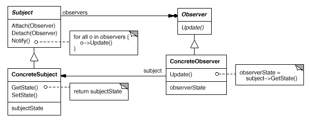
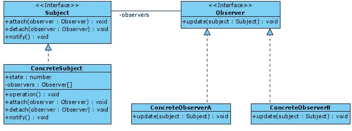
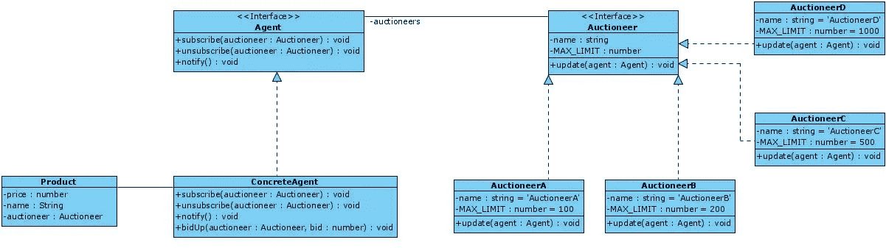

# 理解观察者设计模式

> 原文：<https://betterprogramming.pub/understanding-the-observer-design-pattern-f621b1d0b6c9>

## 对象之间的通知，无需轮询或等待


在 [Unsplash](https://unsplash.com?utm_source=medium&utm_medium=referral) 上由 [Victor Xok](https://unsplash.com/@xokvictor?utm_source=medium&utm_medium=referral) 拍摄的照片。

原著 [*设计模式:可复用面向对象软件的元素*](https://www.amazon.com/Design-Patterns-Elements-Reusable-Object-Oriented/dp/0201633612) 中描述了 23 种经典设计模式。这些模式为软件开发中经常出现的特定问题提供了解决方案。

在这篇文章中，我将描述观察者模式是如何工作的，以及何时应该应用它。

# 观察者:基本想法

维基百科为我们提供了如下定义:

> “观察者模式是一种[软件设计模式](https://en.wikipedia.org/wiki/Design_pattern_(computer_science))，其中一个名为 subject 的[对象](https://en.wikipedia.org/wiki/Object_(computer_science)#Objects_in_object-oriented_programming)维护一个名为 observer 的依赖者列表，并自动通知它们任何状态变化，通常是通过调用它们的[方法](https://en.wikipedia.org/wiki/Method_(computer_science))。”— [维基百科](https://en.wikipedia.org/wiki/Observer_pattern)

另一方面，原书提供的定义如下:

> 定义对象之间的一对多依赖关系，以便当一个对象更改状态时，它的所有依赖对象都会得到通知并自动更新

在许多情况下，我们需要与系统对象通信，而不需要在代码或通信机制级别耦合它们。如果我们有一组需要知道另一个对象(可观察的)状态的对象(观察者)，有不同的技术来实现它们之间的通信。最受欢迎的技术是:

1.  忙碌等待—流程重复验证某个条件。在我们的例子中，它是一个观察者不断地检查可观察对象的状态是否已经改变。在某些情况下，这种策略可能是一种有效的解决方案，但对于我们的场景来说，它不是一种合适的解决方案，因为它意味着有几个进程(观察者)在不执行任何操作的情况下消耗资源，从而导致现有观察者数量的指数级性能下降。
2.  轮询—在这种情况下，查询操作在两次操作之间的一个小时间窗口内执行。这是实现进程间同步的一种尝试。然而，我们可以再次体会到系统性能的下降。此外，根据每个查询之间的时间设置，信息可能会延迟，以至于可能是无效的，从而导致资源浪费。

下面的代码展示了这些技术的实现。

*   忙着等待:

```
while(!condition){
   // Query
   if(isQueryValid) condition = true;
}
```

*   轮询:

虽然这不是本文的目标，但是理解这种设计模式的两种替代技术是一个好主意。因此，简而言之，主动等待和轮询技术之间的区别在于，前者始终执行查询操作，而后者有时不执行查询操作。

*   忙着等待:

```
while(resourceIsNotReady()){
  //Do nothing
}
```

*   轮询:

```
while(resourceIsNotReady()){
     Sleep(1000); // 1000 or anytime
 }
```

观察者模式允许我们实现更高效、耦合性更低的代码，因为它避免了前面提到的问题。在代码可维护性方面，它还有其他优势。下面是这个模式的 UML 模式:



UML 图来自《设计模式:可重用面向对象软件的元素》一书。

这些是组成这种模式的类:

*   `Subject`是每个被观察类实现的接口。这个接口包含了`attach`和`detach`方法，允许我们在类中添加和移除观察者。它还包含一个`notify`方法，负责通知所有观察者被观察对象发生了变化。此外，所有的`subjects`都存储观察它们的对象的引用(`observers`)。
*   `Observer`是所有`ConcreteObservers`实现的接口。在这个接口中，定义了`update`方法，该方法包含每个观察者在收到来自`Subject`的变更通知时要执行的业务逻辑。
*   `ConcreteSubject`是`Subject`类的具体实现。
    该类定义了`SubjectState`应用程序的状态，当发生变化时必须通知该状态。由于这个原因，访问器方法(`getState`和`setState`)通常被实现，因为它们操纵状态。这个类还负责在状态改变时向它的所有观察者发送通知。
*   是为每个具体的观察者建模的类。在这个类中，实现了属于`Observer`接口的`update`方法。它负责始终保持其状态，后者负责保持其状态与其正在观察的`subject`对象一致。

如今，有一个名为 [Reactive Extensions 或 react vex](https://en.wikipedia.org/wiki/ReactiveX)的库家族使得这种设计模式流行起来。反应式扩展利用了两种设计模式:

1.  观察者
2.  [迭代器](https://medium.com/better-programming/understanding-the-iterator-pattern-in-javascript-typescript-using-symbol-iterator-ab400d46b14a)。

他们还有一组使用函数式编程的操作人员。以下是一些最受欢迎的反应式延伸:

*   Java: [RxJava](https://github.com/ReactiveX/RxJava)
*   JavaScript: [RxJS](https://github.com/ReactiveX/rxjs)
*   c#:[Rx.NET](https://github.com/Reactive-Extensions/Rx.NET)
*   C#(Unity): [UniRx](https://github.com/neuecc/UniRx)

在这些实现中，类和方法的命名有所不同。以下名称是最常用的名称:

1.  `Subscriber`对应`Observer`类。

2.`ConcreteSubscribers`对应`ConcreteObservers`类。

3.`Subject`类保持不变。`attach`和`detach`方法被重命名为`subscribe`和`unsubscribe`。

4.`ConcreteSubjects`类是具体的实现，如`BehaviorSubject`、`ReplaySubject`或`AsyncSubject`。

# 观察者模式:沟通策略

在观察者模式中`Subjects`(可观察对象)和`Observers`(观察者)之间有两种通信策略:

*   拉取——在这个模型中，`subject`向`observer`发送最少的信息，它们负责查询以获得更多的细节。这个模型关注的是`Subject`忽略了`observer`这一事实。
*   推送——在这个模型中，`subject`向`observer`发送变更产生的最大量的信息，不管他们是否想要。在这个模型中，`Subject`深入了解每个`observers`的需求。

尽管由于`Subject`必须了解`observer`的事实，似乎*先验地*认为`push`通信技术不太容易重用，但情况并非总是如此。另一方面，基于`pull`的通信技术可能效率低下，因为`observer`必须在没有`Subject`帮助的情况下计算出发生了什么变化。

# 观察者模式:何时使用

1.  系统对象之间存在一对多的依赖关系，因此当对象改变状态时，需要自动通知所有依赖对象。
2.  您不希望使用[忙等待](https://en.wikipedia.org/wiki/Busy_waiting)和[轮询](https://en.wikipedia.org/wiki/Polling_(computer_science))来更新观察者。
3.  解耦`Subject`对象(可观察对象)和`Observers`(观察对象)之间的依赖关系，允许您遵守*开闭原则*。

# 观察者模式:优点和缺点

观察者模式有许多优点，可以总结为以下几点:

*   代码更易于维护，因为它在可观察的类和它们的依赖项(观察者)之间耦合更少。
*   干净的代码。开闭原则得到保证，因为新的观测器(订户)可以在不破坏可观测对象中的现有代码的情况下被引入(反之亦然)。
*   更干净的代码。遵守*单一责任原则(SRP)* ,因为每个观察者的责任被转移到其`update`方法，而不是在`Observable`对象中拥有该业务逻辑。

注意:对象之间的关系可以在运行时建立，而不是在编译时。

然而，观察者模式的主要缺点——像大多数设计模式一样——是增加了代码的复杂性和代码所需的类的数量。也就是说，在应用设计模式时，这个缺点是众所周知的，因为这是在代码中获得抽象的代价。

# 观察者模式示例

接下来，我们将举例说明观察者模式的两个例子:

1.  观察者模式的基本结构。在这个例子中，我们将把理论上的 UML 图转换成类型脚本代码，以识别模式中涉及的每个类。
2.  一个拍卖系统，其中有一个对象(`subject`)发出一个`product`的`price`中产生的变化(`push`技术)，该变化被拍卖给所有对获得那个`product`感兴趣的观察者(`observer`)。每次`product`拍卖的`price`因为某个`observador`提高了出价而提高时，都会通知给所有的观察者。

以下示例将展示使用 TypeScript 实现这种模式。我们选择了 TypeScript 而不是 JavaScript 来实现这个实现。后者缺少接口或抽象类，因此实现接口和抽象类的责任将落在开发人员身上。

# 示例 1:观察者模式的基本结构

在第一个例子中，我们将把理论上的 UML 图转换成 TypeScript 来测试这种模式的潜力。这是要实现的图表:



UML 图来自《设计模式:可重用面向对象软件的元素》一书。

首先，我们要定义我们问题的接口(`Subject`)。作为一个接口，所有必须在所有特定的`Subject`中实现的方法都被定义。在我们这里，只有一个:`ConcreteSubject`。`Subject`接口定义了符合该模式所需的三种方法:`attach`、`detach`和`notify`。`attach`和`detach`方法接收`observer`作为将在`Subject`数据结构中添加或删除的参数。

科目

在我们的问题中，我们需要多少就有多少。由于这个问题是观察者模式的基本方案，我们只需要一个`ConcreteSubject`。在第一个问题中，观察到的状态是类型为`number`的`state`属性。另一方面，所有的`observers`都存储在一个名为`observer`的数组中。`attach`和`detach`方法检查`observer`之前是否在数据结构中，以将其添加或移除。最后，`notify`方法负责调用所有正在观察`Subject`的`observers`方法。

`ConcreteSubject`类的对象执行一些与每个问题的特定业务逻辑相关的任务。在这个例子中，有一个名为`operation`的方法负责修改`state`并调用`notify`方法。

具体主体

这个设计模式的另一部分是`observer`。因此，让我们从定义`Observer`接口开始，该接口只需要定义负责在每次通知`observer`发生变化时执行的`update`方法。

观察者

每个实现这个接口的类必须在`update`方法中包含它的业务逻辑。在本例中，定义了两个`ConcreteObservers`。他们将根据`Subject`的`state`执行动作。下面的代码展示了两种不同类型的观察者的两个具体实现:`ConcreteObserverA`和`ConcreteObserverB`。

混凝土观测仪

混凝土观察员 b

最后，我们定义利用这种模式的`Client`或`Context`类。在以下代码中，实现了模拟使用`Subject`和`Observer`的必要类:

# 示例 2:使用观察者的拍卖

在这个例子中，我们将使用 Observer 模式来模拟一个拍卖行，其中一组拍卖人(`Auctioneer`)对不同的产品(`product`)进行投标。拍卖由代理人指导(`Agent`)。我们所有的拍卖人都需要在其中一人每次提高出价时得到通知，以便他们可以决定是继续出价还是退出。

就像我们在前面的例子中所做的一样，让我们先来看看 UML 图，它将帮助我们识别这个模式所包含的每个部分。



观察者模式

被拍卖的`product`是`Subject`的州，所有的`observers`都在等待通知。因此，`product`类由三个属性组成:`price`、`name`和`auctionner`(被分配产品的拍卖人)。

产品

`Agent`接口定义了管理`Auctioneers`组的方法，并通知他们拍卖产品的出价已经改变。在这种情况下，`attach`和`detach`方法被重命名为`subscribe`和`unsubscribe`。

代理人

`Agent`接口的具体实现由`ConcreteAgent`类完成。除了之前描述的三个方法(其行为与之前示例中呈现的行为非常相似)之外，还实现了`bidUp`方法。在对拍卖人的出价进行一些检查后，它将该出价指定为有效，并将这一更改通知所有拍卖人。

在这个问题中，在`AuctioneerA`、`AuctioneerB`、`AuctioneerC`和`AuctioneerD`类中定义了四种不同类型的`Auctioneer`。所有这些拍卖程序都实现了`Auctioneer`接口，该接口定义了`name`、`MAX_LIMIT`和`update`方法。`MAX_LIMIT`属性定义了每种`Auctioneer`可以出价的最大金额。

定义了不同类型的`Auctioneer`来说明在`update`方法中接收到`Agent`的通知时，每一个都有不同的行为。尽管如此，在这个例子中所修改的只是继续出价的概率和他们提高出价的金额。

混凝土拍卖公司

混凝土拍卖商 b

混凝土拍卖公司

混凝土拍卖商 d

最后，让我们展示一下利用观察者模式的`Client`类。在这个例子中，用一个`Agent`和四个`Auctioneers`声明了一个拍卖行。两个不同的产品(`diamond`和`gem`)正在被拍卖。在第一次拍卖中，所有四个拍卖人都参与。在第二次拍卖中，`D`级拍卖师退出，剩下三人参与。

客户

最后，我创建了两个`npm scripts`，通过它们可以执行本文中的代码:

```
npm run example1
npm run example2
```

完整代码见本 [GitHub repo](https://github.com/Caballerog/blog/tree/master/observer-pattern) 。

# 结论

Observer 是一种设计模式，它允许你遵守开闭原则，因为新的`Subject`和`Observer`可以在不破坏现有代码的情况下创建。此外，它允许系统的两个参与者之间的通信，而不需要他们知道彼此。最后，在诸如繁忙等待和轮询等更基本的技术中出现的性能下降被克服。

这种模式最重要的不是它的具体实现，而是能够认识到这种模式可以解决的问题以及何时可以应用它。具体的实现并不重要，因为它会根据所使用的编程语言而有所不同。