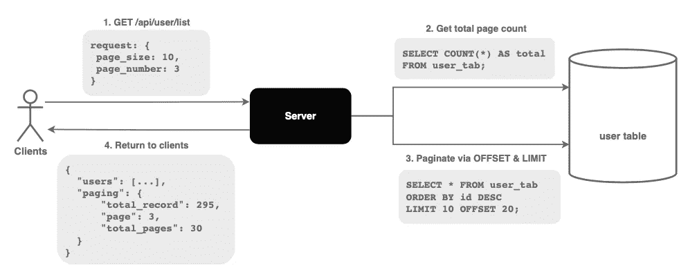
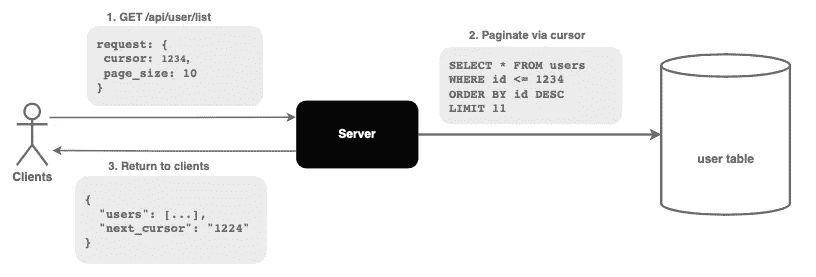
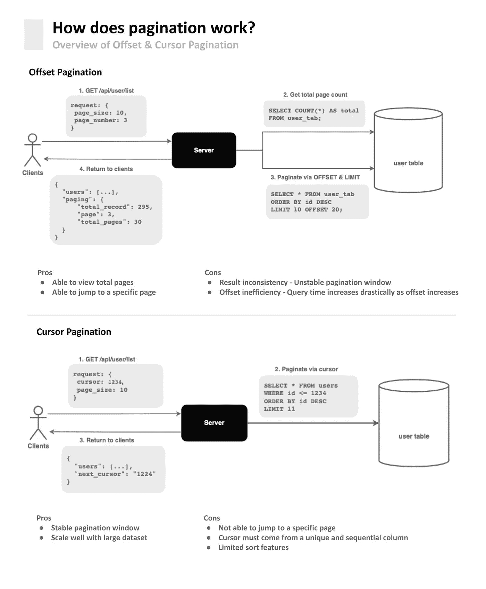

# 了解偏移量和光标分页

> 原文：<https://betterprogramming.pub/understanding-the-offset-and-cursor-pagination-8ddc54d10d98>

## 快速浏览分页算法


照片由[龟背竹](https://www.pexels.com/@gabby-k/)在[像素](https://www.pexels.com/photo/woman-holding-book-with-blank-pages-6373293/)上拍摄

随着数据量的增加，分页成为软件开发中不可或缺的一部分。

分页不是在一个请求中返回一大块数据，而是将数据分成小批返回给客户端。

游标和偏移量分页是两种最常用的算法，它们各有利弊。

让我们深入了解他们今天是如何工作的。

# 偏移分页

偏移分页利用 SQL 中的`OFFSET`和`LIMIT`命令对数据进行分页。

## 履行



在 SQL 中使用 OFFSET & LIMIT 命令分页

说我们正在实现一个 API 来获取用户信息列表。

```
API: GET /api/user/list

request: {
 page_size: 10,
 page_number: 3
}
```

在每个请求中，客户端传递一个`page_size`(偏移量)和一个`page_number`(限制)。

*   页面大小表示要返回的数据数量。
*   页码表示当前请求的页面。

```
SELECT COUNT(*) AS total FROM user_tab;
```

服务器首先从用户表中查询记录总数。

*   这允许客户掌握总页数。

```
SELECT * FROM user_tab
ORDER BY id DESC
LIMIT 10 OFFSET 20;
```

服务器利用 offset 和 limit 命令从表中检索 10 条记录。

*   由于给定的`page_number`是 3，偏移量= 10 * 2 = 20。

```
response: {
    "users": [...],
    "paging": {
        "total_record": 295,
        "page": 3,
        "total_pages": 30
    }
}
```

服务器将寻呼信息返回给客户机，允许它们跟踪当前和可用的页面。

## 赞成的意见

*   它允许客户端查看总页数。
*   它允许客户端通过传递页码跳转到特定页面。

## 骗局

**结果不一致**

*   如果删除了前一页中的一项，数据将向前移动，导致一些结果被跳过。
*   如果添加了前一页中的项目，数据将向后移动，导致一些结果重复。

**抵消低效率—无法很好地适应大型数据集**

*   在丢弃不需要的记录并返回剩余的记录之前，数据库查找(offset + limit)数量的记录。
*   因此，随着偏移量的增加，查询时间会急剧增加。

# 光标分页

光标分页利用一个指向特定数据库记录的**指针**。

## 履行



客户端提供一个指向唯一数据库记录的光标

```
API: GET /api/user/list

request: {
 cursor: 12345,
 page_size: 10
}
```

在每个请求中，客户端传递一个`cursor`和一个`page_size`

*   游标引用数据库中特定的唯一值。
*   如果没有给定游标，服务器从第一条记录获取数据。

```
SELECT * FROM users
WHERE id <= %cursor
ORDER BY id DESC
LIMIT %<limit + 1>
```

服务器获取(`limit + 1`)ID 小于光标值的记录。

请注意，该限制等于给定的页面大小加 1。

*   如果返回的记录数小于`LIMIT`，这意味着我们在最后一页。
*   额外的记录不会返回给客户端。额外记录的`ID`作为`next_cursor`传递回客户端。

```
response: {
    "users": [...],
    "next_cursor": "12335",  # the user id of the extra result
}
```

## 赞成的意见

**稳定分页窗口**

*   因为我们是从一个稳定的参考点获取，所以记录的添加或删除不会影响分页窗口。

**利用大型数据集进行良好扩展**

*   该游标是唯一的，并且有索引。
*   数据库直接跳转到记录，而不遍历不需要的数据。因此，使它更有效率。

## 骗局

*   光标分页不允许客户端跳转到特定页面。
*   游标必须来自唯一且连续的列(例如时间戳)。否则，一些数据将被跳过。
*   有限的排序功能。如果要求基于非唯一列(例如名字)进行排序，那么使用游标分页来实现将是一个挑战。串联多个列以获得唯一的键导致[更慢的时间复杂度](https://medium.com/swlh/how-to-implement-cursor-pagination-like-a-pro-513140b65f32)。

# 编码光标

编码光标建议返回一个**编码的 base64 字符串**，而不管底层的分页解决方案。

当使用偏移分页时，我们将`page_number`和`total_page`编码成 base64 字符串，并将其作为光标返回给客户端。

```
response: {
    // "page=3|offset=20|total_pages=30"
    next_cursor: "dcjadfaXMDdQTQ"
}
```

类似地，我们可以在将游标返回给客户端之前，将游标分页中的游标编码成 base64 字符串。

```
response: {
    // "next_cursor:1234"
    next_cursor: "dcjadfaXMDdQTQ"
}
```

客户端总是可以传递一个`cursor`和一个`page_size`，而不需要知道底层的实现。

```
request: {
    cursor: "dcjadfaXMDdQTQ",
    page_size: 10
}
```

这允许服务器实现不同的底层分页解决方案，同时为 API 消费者提供一致的接口。

# 摘要



分页是软件开发中一个不可避免但又棘手的话题。

虽然没有一个放之四海而皆准的解决方案，但是了解利弊可以让我们在设计下一个 API 时做出更好的权衡。

我希望这能对你有所帮助，下次再见！

如果你对这样的文章感兴趣，今天就和我一起报名 Medium 吧！

[](https://medium.com/@nganjason007/membership) [## 通过我的推荐链接加入 Medium—Jason Ngan

### 阅读 Jason Ngan(以及媒体上成千上万的其他作家)的每一个故事。您的会员费直接支持…

medium.com](https://medium.com/@nganjason007/membership)