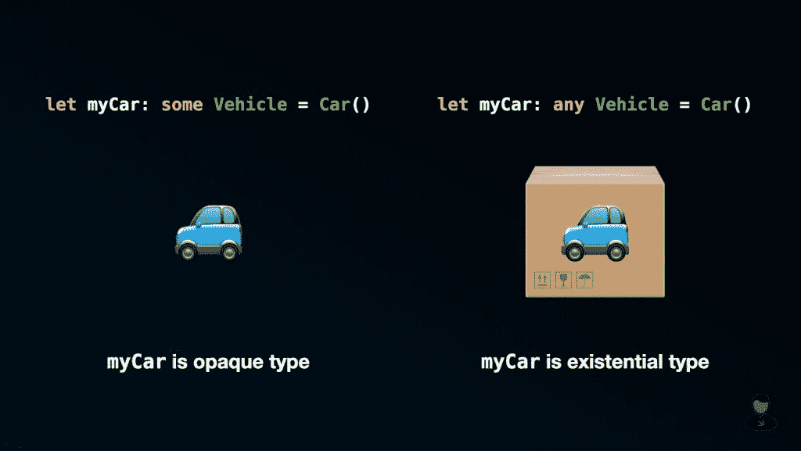
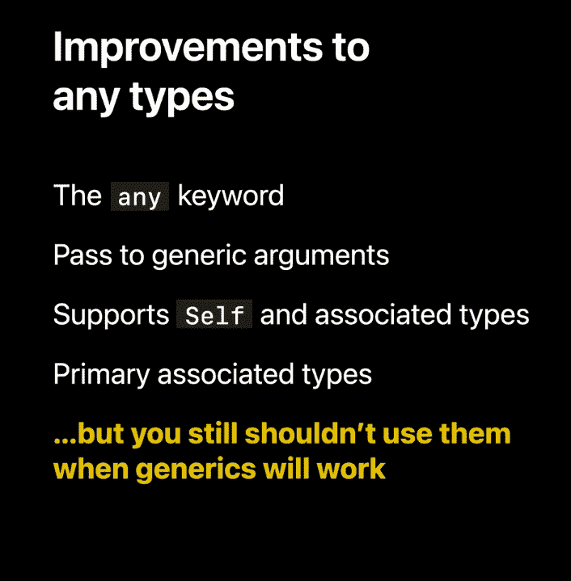

# 理解 Swift 5.7 中的“一些”和“任何”关键字

> 原文：<https://betterprogramming.pub/understanding-the-some-and-any-keywords-in-swift-5-7-19d2cb52eae2>

## 不再困惑！


`some`和`any`关键字在 Swift 中并不新鲜。在 Swift 5.1 中引入了`some`关键字，而在 Swift 5.6 中引入了`any`关键字。在 Swift 5.7 中，苹果对这两个关键词进行了另一项重大改进。我们现在可以在函数的参数位置使用这两个关键字了！

这一改进不仅使通用函数看起来更加简洁，而且还揭示了一些令人兴奋的在 Swift 中编写通用代码的新方法。剧透警告—我们现在可以告别以下错误消息了:

```
protocol can only be used as a generic constraint because it has Self or associated type requirements
```

想了解更多？请继续阅读！

# 重要的事情先来

在进入细节之前，让我们定义一下我们将在本文中使用的协议。

之后，我们将定义一个符合`Vehicle`协议的`Car`和`Bus`结构，它们中的每一个都需要不同种类的燃料。代码如下:

注意`fillGasTank(with:)`函数的`Car`和`Bus`的参数数据类型不一样，`Car`需要`Gasoline`而`Bus`需要`Diesel`。这就是为什么我们需要在我们的`Vehicle`协议中定义一个名为`FuelType`的关联类型。

既然这样，我们就直接进入细节，好吗？

# 理解“一些”关键词

在 Swift 5.1 中引入了`some`关键字。它与一个协议一起使用，创建一个不透明的类型，表示符合特定协议的东西。当用在函数的参数位置时，意味着函数接受某种符合特定协议的具体类型。

在这个阶段，你可能会想，我们不是已经能够做到这一点了吗？

事实上，你是对的。在函数的参数位置使用`some`关键字与在函数签名处使用尖括号或尾随`where`子句完全相同。

当我们在一个变量上使用`some`关键字时，我们是在告诉编译器我们正在处理一个特定的具体类型，因此不透明类型的底层类型对于变量的范围必须是固定的。

需要注意的一点是，编译器也禁止将同一具体类型的新实例赋给变量。

记住这一点，我们在数组中使用它时必须遵循相同的规则。

这同样适用于函数的底层返回类型。

`some`关键词到此为止。让我们来看看`any`关键字，看看它们之间有什么不同。

# 理解“任何”关键词

在 Swift 5.6 中引入了`any`关键字。它的引入是为了创造一种存在类型。在 Swift 5.6 中，当创建一个存在类型时，`any`关键字不是强制性的，但是在 Swift 5.7 中，如果你没有这样做，你会得到一个编译错误。

正如苹果工程师解释的那样，存在型就像一个盒子，里面装着符合特定协议的东西。



比较 some 和 any 关键字

如上图所示，不透明类型和存在类型的主要区别是“盒子”“盒子”使我们能够在其中存储任何具体类型，只要底层类型符合指定的协议，从而允许我们做一些不透明类型不允许我们做的事情。

最好的部分是，在 Swift 5.7 中，我们现在可以使用`any`关键字来定义相关类型的协议！这意味着使用带有关联类型的协议创建异构数组不再是一种限制！

多酷啊。😃

这一改进不仅消除了“协议只能作为一般约束使用，因为它有自身或关联类型要求”的错误，而且还使在具有关联类型的协议上实现动态调度变得更加简单！但那将是另一天的一篇文章。

# “任何”关键字限制

尽管看起来不错，但是使用`any`关键字创建的存在类型仍然有其自身的局限性。一个主要的限制是我们不能使用`==`操作符来比较存在类型的两个实例。

如果你仔细想想，这实际上有点道理。如前所述，存在类型可以在其“盒子”中存储任何具体类型。对于编译器来说，存在类型只是一个“盒子”，它不知道盒子里面是什么。因此，当编译器不能保证“盒子”的内容具有相同的底层具体类型时，它不可能进行比较。

您应该知道的另一个限制是，存在类型不如不透明类型(使用`some`关键字创建)有效。 [Donny Wals](https://twitter.com/DonnyWals) 有一篇很棒的[文章](https://www.donnywals.com/what-is-the-any-keyword-in-swift/)详细讨论了这一点，我强烈推荐你去看看。

因此，即使苹果在`any`关键字上做了很多改进，如果不透明类型可以完成工作，仍然建议使用`some`关键字。



来源:[Swift 的新功能](https://developer.apple.com/videos/play/wwdc2022-110354/?time=1726)

# 包扎

Swift 5.7 中对`any`和`some`关键字的改进绝对是受欢迎的。一方面，它极大地改进了我们通用代码的语法和可读性。另一方面，它为我们以更有效的方式编写泛型代码开辟了新的途径。

我希望这篇文章能让你更好地了解`any`和`some`关键词。请随时在 Twitter 上关注我，这样你就不会错过我即将发表的任何文章。

感谢阅读。

# 相关的 WWDC 会议

*   [Swift 的新功能](https://developer.apple.com/videos/play/wwdc2022-110354/?time=1726)
*   [拥抱 Swift 仿制药](https://developer.apple.com/videos/play/wwdc2022/110352/)
*   [设计 Swift 中的协议接口](https://developer.apple.com/videos/play/wwdc2022/110353)