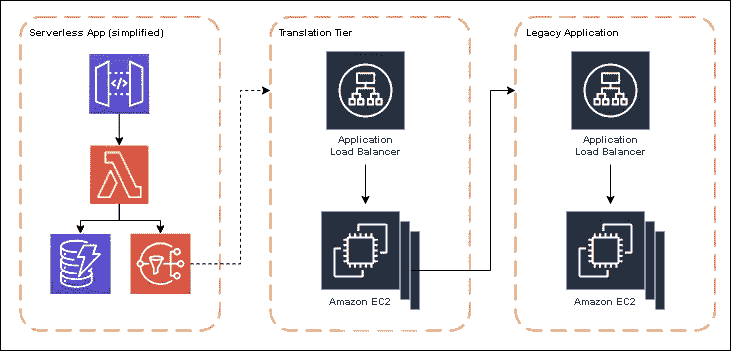
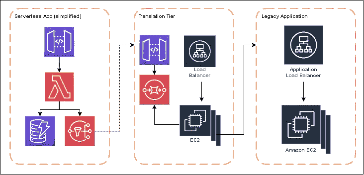

# 了解无服务器和容器应用程序的总拥有成本

> 原文：<https://betterprogramming.pub/understanding-total-cost-of-ownership-of-serverless-and-container-applications-5bce571f6f5d>

## 在生产中构建和维护一个应用程序的成本比你每月的 AWS 账单要高得多

图片来自 Freepik 上的 jcomp

上周我发表了一篇文章，讨论了无服务器比集装箱更贵时的 T2。在那篇文章中，我对 Lambda、EC2 和 App Runner 进行了简单的比较，以显示相对的计算成本。

我在那篇文章中也提到了一些事情，我意识到可能需要澄清一下。我对我的发现进行了限定，指出即使我们发现了一个临界点，即无服务器比资源调配更昂贵，*总拥有成本(TCO)仍然较低*。

总拥有成本对许多阅读这篇文章的人来说可能不是一个新概念，但如果是的话，我想讨论一下这个问题，并谈谈我们比较无服务器和有服务器应用程序时的细节。

当我们谈论公司在生产中成功运行应用程序的成本时，我们必须考虑的不仅仅是我们每月的 AWS 账单。该应用程序的所有操作都会影响成本。

总拥有成本的构成因素:

*   **基础架构** —计算、调配的组件、存储
*   **初期开发** —从构思到生产的时间
*   **维护** —打补丁、操作系统更新、错误修复等…

这不是一个详尽的列表，但它确实代表了生产应用的三个主要成本来源。

# 基础设施成本

也被称为*运行成本*，这是我上周的帖子所关注的。以这种方式比较无服务器应用和传统云应用有点像比较苹果和橘子，但最终结果是你的每月账单。

无服务器基础架构成本基于您的使用情况，而传统工作负载基于调配的资源。根据每月的请求数量、平均请求/响应大小以及峰值与持续加载时间，这些都是高度可变的成本。

基础设施成本按月计费，并将在您的应用程序生命周期内重复发生。当你对应用程序进行增强时，成本可能会上升或下降，但你总会有一些基础设施账单。

# 开发成本

这些是前期*建造成本*费用，开始变得越来越难以量化。为了确定开发成本，你需要考虑到这个项目会有多少开发人员，每个人会得到多少报酬，以及[需要多长时间](/the-beginners-guide-to-software-estimation-414c243e76f4)。

我肯定不是每个人都会同意，但总的来说，无服务器开发比传统开发快。

为什么？

首先，基础设施扩展是不可能的。在[级规模](/building-serverless-applications-that-scale-the-perfect-amount-ca6f75ae94a5)的计划之外，无服务器为您处理它。与之相对应的是，设计一个可以弹性地上下扩展的系统，而不会过度调配，以最大限度地降低失去的机会成本，或者调配不足，让您的客户不满意。除了构建软件本身之外，确定如何处理生产流量还需要仔细的时间和规划。

如果您想象一名全职员工每年为公司花费 10 万美元，再加上每个开发人员额外几周的开发时间，这种情况会很快增加。如果无服务器团队由 6 名工程师组成，从最初的构建中节省了 6 周的开发时间，那么构建成本将相差 7 万美元。

# 维修费用

在初始开发完成并且您的应用程序投入生产后(祝贺您！)，您进入维护周期或*支持成本*阶段。

这是一项持续的人事费用，用于支付保持应用程序平稳运行所需的时间。验证您的应用程序是否适当扩展，监控仪表板和死信队列，以及新功能的添加都属于此阶段。

在这个阶段，一些组织将责任分配给不同的团队。开发团队构建新的特性和工具，而[现场可靠性工程(SRE)团队](https://en.wikipedia.org/wiki/Site_reliability_engineering)负责管理任务，如监控仪表板和响应事件。

然而，人事费就是人事费。该公司仍在支付工程师在持续维护和监控方面的时间，所以这是一项必须计入总体拥有成本的成本。

无服务器应用具有死信队列监控功能，当使用率[接近服务限制](/solutions-architect-tips-how-to-design-around-serverless-service-limits-15e12b5c4235)时会发出警报。但是由于[无服务器](https://docs.aws.amazon.com/whitepapers/latest/security-overview-aws-lambda/the-shared-responsibility-model.html)的共享责任模式，云供应商承担服务器软件、网络基础设施、硬件维护等工作，所以你不必这么做。

相比之下，在传统工作负载中，操作系统更新和修补、网络配置以及虚拟机管理等服务器软件都要由您来承担。您不仅要为自己提供的资源付费，还要为它们的维护工作付费。

维护成本还包括生产率损失。当工程师忙于配置服务器群或解决虚拟机上的问题时，他们没有机会构建新功能或进行创新。从长远来看，这会影响公司，因为它会推迟开发时间表。

# 现实世界的例子

我做了几年完全无服务器的应用程序。这个应用程序有一个集成需求，要与负载平衡的 EC2 实例群上托管的一个遗留软件进行通信。

为了促进通信，我们构建了一个中间层，它将通过 webhooks 响应事件，进行一些数据转换，然后调用遗留系统 API。

这个中间层运行在一个独立的 EC2 实例群上，产生了如下所示的架构。

*有意简化建筑图*

随着上线日期的临近，我们运行了第一组[负载测试](/the-5-step-checklist-for-serverless-load-testing-346f4a60841d)，并很快发现无服务器应用程序的规模很快超过了我们的中间层。集成 webhooks 的大量传入事件使系统不堪重负，并阻止了下游集成的运行。

因此，我们重新分组，花了大量时间规划和预测流量负载和峰值，并调整了集成层的大小。我们还在它前面放置了一个 API 网关和 SQS 队列作为缓冲机制。然后，EC2 实例将查询队列，并以自己的速度弹出项目。

*负载测试后修改架构*

在另一个负载测试之后，看起来我们已经调整了环境的规模，并准备好投入使用了。万岁！

我们上线的那天，系统中大约有 50，000 个用户。该无服务器应用程序规模适中，可以毫无问题地处理激增的流量。集成层也能够处理流量，但是开始构建少量积压的工作。有工作要做的 SQS 队列开始让项目排队的时间越来越长。

因此，我们的 SRE 团队做出了回应，对车队中的 EC2 实例进行了横向和纵向扩展。作为回报，积压工作减少了，事情继续按照我们的预期运行。

在接下来的几个月里，一个令人大开眼界的模式开始出现。

我们构建的无服务器应用程序就像一台运转良好的机器。在软件中发现了一些缺陷，但是基础设施没有问题。它在高峰时段增加，在非高峰时段减少。总的来说，负责该应用程序的开发团队能够在几乎没有中断的情况下继续增强应用程序。

然而，集成层和遗留应用程序是一个不同的故事。我们有一个由 7 名工程师组成的团队夜以继日地监控这些应用。为了稳定环境，他们在最初的几个星期里不断地监控 CPU 使用、内存分配和错误队列。我们的应用程序的突发性会导致激增，这将淹没我们的 EC2 实例车队的初始配置。

在最初的几个月里，除了损害控制，这两个应用程序什么也没做。更新补丁、重启服务器、重新配置负载平衡器和监控服务器统计数据的工作太多了，以至于无法做其他任何事情。

这与无服务器应用形成了鲜明对比。

# 摘要

在我的例子中，无服务器应用的运行、构建和维护成本更低，但情况并非总是如此。有时，您的无服务器基础设施成本会更高，但您需要考虑投入多少人力时间来运行“更便宜”的解决方案。

生产力损失、创新速度减慢和精力耗尽都是 TCO 的无形方面，会对组织产生巨大影响。无服务器开发使工程师能够更快地行动，不用担心应用程序的规模(在一定程度上)，并为公司节省大量资金。

无服务器不是灵丹妙药，在生产中处理云原生应用程序确实需要组织的成熟度。不仅仅是你的开发人员，你的支持团队的技能提升对你使用这项技术的成功也是至关重要的。

当被问及“大规模”无服务器成本时，请确保不仅谈论基础架构成本，还要谈论公司的额外成本，如构建成本和支持成本。所有这些因素推动了成功(和利润率！)你的申请。

编码快乐！