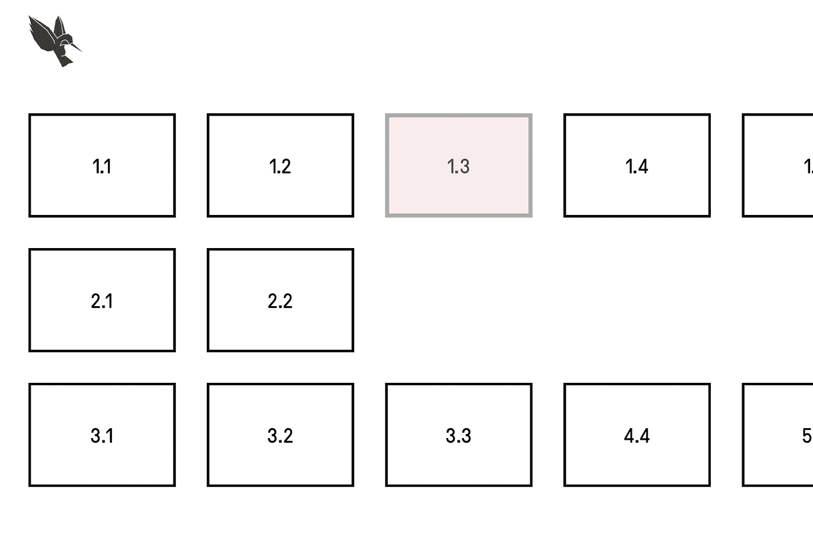
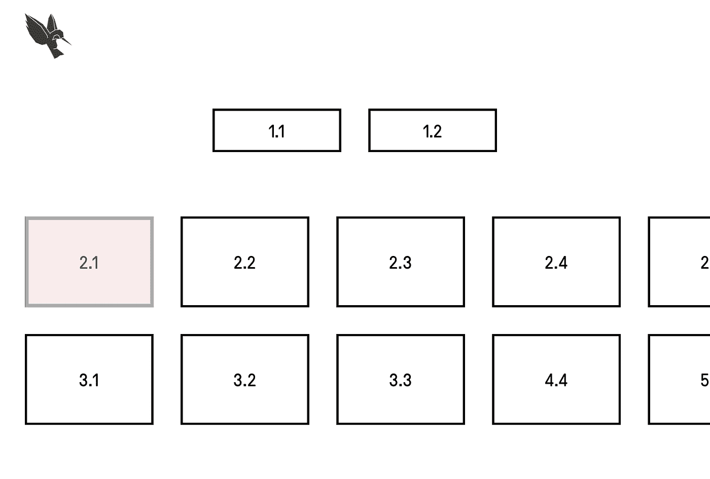
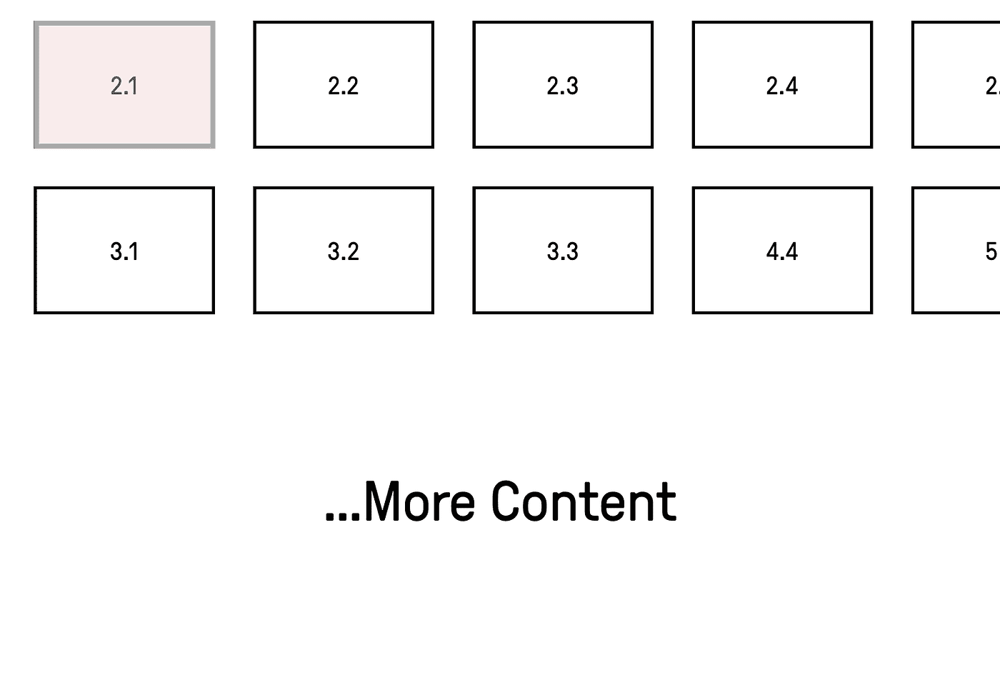
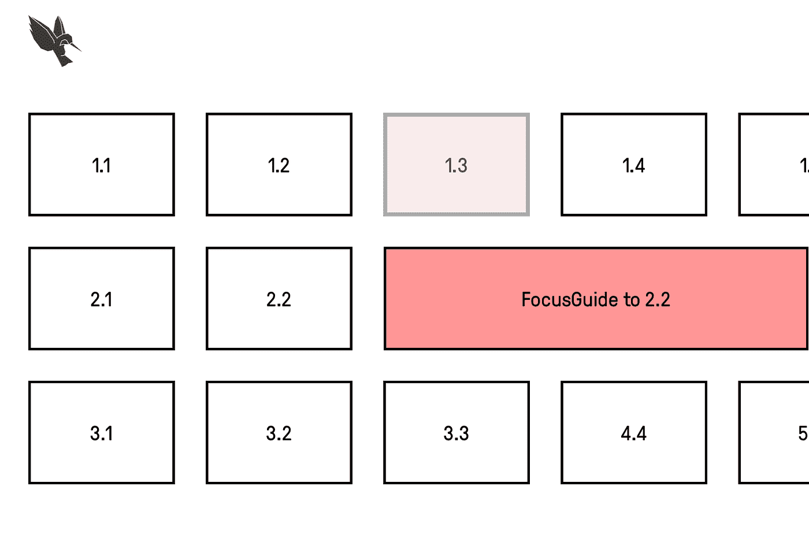

# 使用 React Native 了解 TvOS 焦点指南

> 原文：<https://betterprogramming.pub/understanding-tvos-focus-guides-with-react-native-22a366850825>

## 学会关注你的组件，即使它们彼此不一致


保罗·斯科鲁普斯卡斯在 [Unsplash](https://unsplash.com?utm_source=medium&utm_medium=referral) 上的照片

起初，在 React 本机 tvOS 应用程序中设置空间导航似乎相当简单。React 原生文档指出，我们简单地使用可触摸混合(`TouchableOpacity`、`TouchableHighlight`和`TouchableWithoutFeedback`)来使屏幕上的组件可聚焦。当您的组件在高度、大小和位置上沿着一个轴对齐时，这非常有用，但是当项目没有对齐时会发生什么呢？

考虑下面的例子:



当前选定的项目 1.3 将完全跳过第二行，并在按下时转到项目 3.3，因为中间没有可聚焦的项目。对于某些应用程序来说，跳过一行是可以接受的，因为仍然可以通过按“左”然后“下”来导航到第二行，但是跳过这一行还是感觉怪怪的。

更糟糕的是，在下面的屏幕布局中可以找到一个用户旅程中断的例子:



项目 1.1 和 1.2 沿 x 轴居中，不会填满屏幕的整个宽度。因此，当选择 2.1 时，我们无法导航到第一行的按钮。当内容滚动时，这个问题变得更加严重。



现在，当在项目 2.2 上时，用户不能向上按来导航到前面的行，并且他们非常不清楚这是为什么。如果第 2 行只有一个可聚焦的元素，用户将无法导航到顶部的按钮。

# 输入:UIFocusGuide

苹果将`FocusGuides`或`UIFocusGuide`描述为代表一个不可见的、可聚焦的区域，可以将焦点移动重定向到其他视图。换句话说，它们是看不见的盒子，你把它们放在空白的地方，告诉焦点引擎该做什么。

通过创建一个不可见的元素，并告诉它将焦点移动到哪里，我们可以创建一些看起来更像下图的东西。



聚焦导轨填充第二行上未被任何牌占据的空间，并被设置为将焦点调整到该行上的最后一张牌。每当我们沿着第三列或更远的方向上下移动并选择第二行时，焦点将自动分配给标记为 2.2 的组件。

# 我们如何在 React Native 中实现这一点？

虽然文档很少，但 react-native-tvos 支持开箱即用的焦点指南——它们可以在您现有的 react native tvOS 项目中实现，而无需编写任何额外的本机代码。

焦点向导在 react-native-tvos 中导出为`TVFocusGuideView`，并带两个重要道具`style`和`destinations`。`style`对于控制焦点引导线的边界是必不可少的，例如，如果你想引导线填充行，你需要给它一个合适的`width`或`flexGrow`值。

属性是一个引用 DOM 中节点的数组。尽管此属性是一个数组，但只应设置数组中的第一项。数组中的项目指的是您希望 focus 引擎在 focus guide 中定位时选择的位置。

> 你不需要 AndroidTV 的焦点指南，我们在本文中讨论的预期逻辑已经在 AndroidTV 中可用。您可以保留代码，因为 react-native-tvos 造成的危害很小。

# 在应用程序中实现这一点

> 建议用你自己的组件包装主要的 RN 组件，这样你可以改变非 TVOS 平台的行为。

```
import React from 'react';
import { StyleProp, TVFocusGuideView, ViewStyle } from 'react-native';

import { Platform } from '~util/device';

interface IProps {
 destinations: () => void;
 style?: StyleProp<ViewStyle>;
}

/**
* TVFocusGuideView. Used for manually controlling the focus when focusable items do not align.
* Only supported on TVOS.
*/
const FocusGuide: React.FC<IProps> = ({ destinations, style = {}, children }) => {
 if (!Platform.isTVOS) {
   return <>{children}</>;
 }

 return (
   <TVFocusGuideView destinations={destinations} style={style}>
     {children}
   </TVFocusGuideView>
 );
};

export { FocusGuide };
```

我们遇到的一个问题是，只有当`destinations`属性更新时，焦点向导才会收到属性更改，即使用常规的 React Ref 来避免重新渲染和传递，因为`destinations`属性将意味着焦点向导不起作用。为了处理这个问题，我们可以创建一个钩子来创建对 DOM 节点的引用，我们将把它作为`destinations` prop 传递。

```
import { useCallback, useState } from 'react';

type ElementNode = any;

type FocusGuideDestinationRef = {
 // Pass this as the focusRef of a focusable component.
 ref: (node: ElementNode) => void;
 // Pass this to the destinations prop of TVFocusGuideView.
 destinations: ElementNode[];
};

/**
* Creates a reference to a dom node for a FocusGuide destinations array. Triggers a rerender when the reference is assigned
* for the first time, which is necessary for passing the reference to the FocusGuide component.
*/
const useFocusGuideDestinationRef = (): FocusGuideDestinationRef => {
 const [destination, setDestination] = useState(null);
 const ref = useCallback((node: ElementNode) => {
   if (node !== null) {
     setDestination(node);
   }
 }, []);

 const destinations = destination ? [destination] : [];

 return {
   destinations,
   ref,
 };
};

export { useFocusGuideDestinationRef };
export type { FocusGuideDestinationRef }
```

要使用钩子，将返回的`ref`作为 ref 属性传递给一个可触摸的组件，这将设置`destinations`变量来包含对 DOM 的引用。返回的`destinations`可以传递给我们的`FocusGuide`组件。

从这里，您可以决定`FocusGuide`组件如何工作；通过将按钮作为子组件放置在组件中，它可以成为按钮的容器。或者您可以通过`style`支柱设置高度和宽度，并将其用作没有子组件的自关闭组件。

只需记住将 ref 传递给你的`Touchable*`组件，将 destinations 传递给你的`FocusGuide`。

下面是一个简单的例子，当你把所有这些放在一起看起来是什么样子:

```
import React from 'react';
import { View, Text, StyleSheet, TouchableOpacity } from 'react-native';

import { useFocusGuideDestinationRef } from '~src/hooks/useFocusGuideDestinationRef';

import { FocusGuide } from './FocusGuide';

const styles = StyleSheet.create({
 guide: {
   width: '100%',
   height: 200,
 },
 button: {
   width: 200,
   height: 200,
 },
});

const RowWithFocusGuide: React.FC = () => {
 const { ref, destinations } = useFocusGuideDestinationRef();

 return (
   <View>
     <FocusGuide destinations={destinations} style={styles.guide}>
       <TouchableOpacity ref={ref} style={styles.button}>
         <Text>Test Button</Text>
       </TouchableOpacity>

       <TouchableOpacity style={styles.button}>
         <Text>Test Button 2</Text>
       </TouchableOpacity>
     </FocusGuide>
   </View>
 );
};

export { RowWithFocusGuide };
```

在您的生产就绪代码中，您可能会将这个解决方案与一个虚拟化列表的变体(可能是一个`FlatList`)一起使用。为此，请记住，在选择容器时，只将 ref 传递给您想要关注的特定卡片。您可以根据卡的索引在您的`renderItem`函数中完成此操作。

如果你有兴趣了解更多关于 Econify 如何解决电视开发领域的问题，请通过 [LinkedIn](https://www.linkedin.com/in/aaronwilliamsbhx/) 联系我。