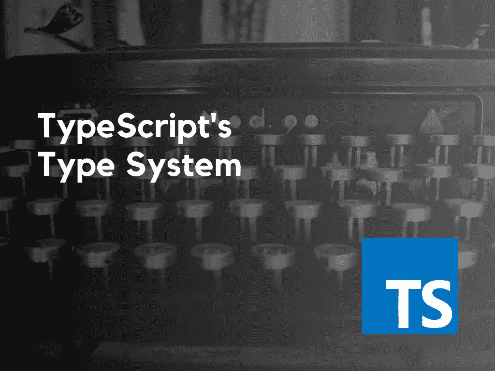
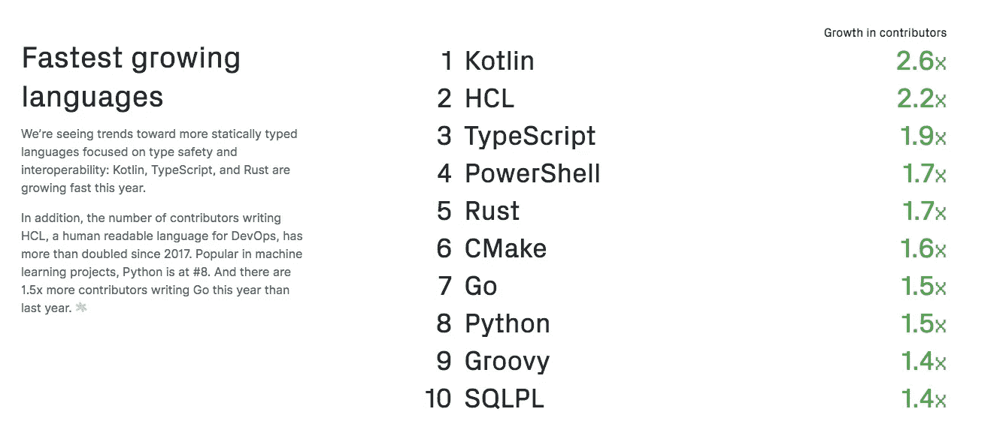
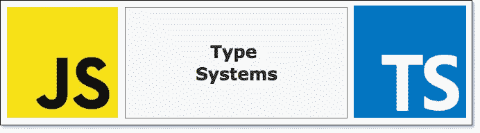

# 了解 TypeScript 的类型系统

> 原文：<https://betterprogramming.pub/understanding-typescripts-type-system-a3cdec8e95ae>

## TypeScript 正在崛起——它的类型系统是一个重要原因



当我想到 TypeScript 的采用的[上升轨迹时，我看到越来越多的团队和开发者选择健壮性而不是灵活性。后者是像 JavaScript 这样的动态类型语言给你的，而](https://github.blog/2018-11-15-state-of-the-octoverse-top-programming-languages/) [TypeScript](https://www.typescriptlang.org/) 允许你在代码中利用静态[类型检查](https://www.sitepoint.com/typing-versus-dynamic-typing/)。

TypeScript 在用户中最受欢迎的一个属性是它的可靠性和不容易出错的代码，这两者都是它的类型系统的结果。



[Github Octoverse 2018](https://octoverse.github.com/projects)

如果您使用过 TypeScript，您可能已经知道它是 JavaScript 的超集。这仅仅意味着它包含了整个 JavaScript 语言以及有用的附加特性。因此，您从 JavaScript 获得的所有标准控制结构，如数据类型、控制流、操作符和子程序，在 TypeScript 中都是可用的。简而言之，所有 JavaScript 在风格和行为上都是有效的 TypeScript，TypeScript 在某种程度上可以被视为一种扩展，旨在使大型 JavaScript 应用程序的开发更加容易。它为 JavaScript 开发提供了静态类型化的体验。

两者最大的区别之一是它们的类型系统。JavaScript 显然有类型。但是，它的变量类型可以在每次赋值时改变。以数字开始的变量可以以字符串、对象、数组或函数结束。这可能会很成问题，尤其是在大型应用程序中。

这就引出了这篇文章的主要目的，即探索 TypeScript 的类型系统。

# **理论类型**

类型系统起源于伯特兰·罗素开发的[类型理论](https://www.britannica.com/topic/theory-of-types-logic)。在逻辑中，类型理论本质上是一个系统，其中每个术语都被赋予一个类型，并且基于类型来限制操作。听起来很熟悉，不是吗？

**类型理论**

```
x: nat
doubleUp: nat -> nat
```

**打字稿**

```
var x: number;
doubleUp: (number) => number;
```

如上所示，TypeScript 和 type theory 有相似的类型注释，不同之处在于 type theory 使用了一个`nat`类型(自然数)。

# **JavaScript vs TypeScript:类型系统比较**



那么什么是类型系统呢？类型系统是为系统中的每个变量、表达式、类、函数、对象或模块分配类型的一组规则。检查这些规则是为了暴露程序中的错误，可以在编译时(静态类型检查)或运行时(动态类型检查)执行。

## **JavaScript 类型系统**

JavaScript 是动态类型的，因此变量没有关联的类型。如上所述，您可以将一种类型的值赋给一个变量，然后将不同类型的值赋给同一个变量。

这样做的问题是，不兼容类型的操作会在我们的软件中产生不可预测的结果。JavaScript 的类型系统的好处是它的灵活性，这也可能导致其他问题，正如我已经说过的。

```
// Assignment of different types
let date = '10/10/1991'; 
date = 10101991;
```

## **打字系统**

TypeScript 的系统提供指定和推断类型，以及将类型设置为可选。可选设置允许您选择何时强制类型以及何时允许动态类型。要退出类型检查，可以使用`any`关键字。

TypeScript 是静态类型的，因此所有检查都在编译时执行。编译器检查所有变量和表达式的类型，并在将代码转换为有效的 JavaScript 时删除所有类型信息。

```
// Assignment of different types
let date = '10/10/1991'; 
date = 10101991; // **Results in a TypeScript compiler error**
```

# **TypeScript 的结构类型系统**

一个类型系统或者是*结构的*或者是*名义的*，在某些情况下，它可能在一个类型系统中混合了两者(即[流](https://flow.org/))。

TypeScript 是结构化类型的，不像大多数类 C 语言那样有一个主格类型系统。

在*结构*类型系统中，如果两种类型具有相同的结构，则认为它们是相同的。所以不需要明确的修饰。如果值的结构与所需类型的结构匹配，则该值是可接受的。

```
class Foo { method(input: string) { */* ... */* } }
class Bar { method(input: string) { */* ... */* } }

let foo: Foo = new Bar(); *// Works!*
```

上面的例子是可行的，因为即使 Foo 和 Bar 有不同的名字，它们有完全相同的结构。如果这种形状/结构发生变化，将会导致错误。

```
class Foo { method(input: string) { */* ... */* } }
class Bar { method(input: number) { */* ... */* } }

let foo: Foo = new Bar(); *// Error!*
```

在*标称*或*主格*类型系统中，如果两个类型具有相同的名称，则认为它们是相同的。它依赖显式注释来确定类型。

```
class Foo { method(input: string) { */* ... */* } }
class Bar { method(input: string) { */* ... */* } }

let foo: Foo = new Bar(); *// Error!*
```

上述示例会导致错误，因为它们具有不同的类型。

名义类型系统旨在防止意外的类型等价，这意味着仅仅因为某些东西具有相同的属性并不意味着它是有效的。另一方面，TypeScript 在结构上是有类型的，偶然的类型等价是可能的。在名义类型系统中，可以使用命名类型来确保传递正确的参数。

结构类型补充了 TypeScript 中的类型推理。由于这些特性，您可以将大部分工作留给编译器和语言服务，而不必在整个程序中显式地添加类型信息和类继承。

# **类型擦除**

想知道运行`tsc`命令时幕后会发生什么吗？您显然熟悉 TypeScript 将编译和生成普通 JavaScript 代码的部分，但是新生成的代码在以下方面有所不同:

*代码转换* —代码转换将 JavaScript 中不可用的语言特性转换成可用且有效的表示。例如，如果您的目标是 ECMAScript 5，其中的类不可用，那么所有的类都将被转换成 JavaScript 函数，这些函数使用 ECMAScript 5 中的原型继承创建适当的表示。

*类型删除* —类型删除是指所有类型注释被移除或“删除”的过程，顾名思义，因为 JavaScript 不理解它们。静态类型检查在开发和编译时需要类型注释和接口，但在运行时不检查类型。

## **打字稿代码**

```
class OrderedArray<T> {
    private items: T[] = [];
    constructor(private comparer?: (a: T, b: T) => number) {
    }
    add(item: T): void {
        this.items.push(item);
        this.items.sort(this.comparer);
}
    getItem(index: number) : T {
        if (this.items.length > index) {
            return this.items[index];
        }
        return null;
    }
}
var orderedArray: OrderedArray<number> = new OrderedArray<number>();
orderedArray.add(5);
orderedArray.add(1);
orderedArray.add(3);
var firstItem: number = orderedArray.getItem(0);
alert(firstItem); // 1
```

## **编译好的 JavaScript 代码**

```
var OrderedArray = (function () {
    function OrderedArray(comparer) {
        this.comparer = comparer;
        this.items = [];
    }
    OrderedArray.prototype.add = function (item) {
        this.items.push(item);
        this.items.sort(this.comparer);
};OrderedArray.prototype.getItem = function (index) {
        if (this.items.length > index) {
            return this.items[index];
        }
        return null;
    };
    return OrderedArray;
})();
var orderedArray = new OrderedArray();
orderedArray.add(5);
orderedArray.add(1);
orderedArray.add(3);
var firstItem = orderedArray.getItem(0);
alert(firstItem); // 1
```

# **类型推断**

你可能已经猜到了这个过程需要什么，因为这个名字泄露了它。有一点可以肯定，它与**类型擦除**中发生的事情无关。好吧，那是什么？这是在没有显式类型注释的情况下，在编译时确定类型的过程。

**话虽如此…**

主要的收获是理解 TypeScript 的类型系统是结构化的。结构化类型化可以使一些设计变得非常复杂，但是这并不妨碍您使用任何您可能希望从名义上类型化的系统中转移的模式。

此外，结构化类型允许您排除显式类型注释。因此，类型将被推断出来。最后，当编译 TypeScript 程序时，将根据显式和隐式类型检查类型，在编译时可以检测到任何错误。

如果你喜欢这篇文章，请在这里给我买杯咖啡[☕️😃。](https://www.buymeacoffee.com/lukemwila)

*参考文献&延伸阅读:*

[](https://www.apress.com/gp/book/9781430267904) [## Pro TypeScript -应用规模的 JavaScript 开发| Steve Fenton | Apress

### JavaScript 无处不在，无论是作为一门纯语言还是在 Angular、jQuery 和 Knockout 等流行的库中，但是用户…

www.apress.com](https://www.apress.com/gp/book/9781430267904) [](https://flow.org/en/docs/lang/nominal-structural/) [## 标称和结构类型|流量

### 名义类型和结构类型的区别

flow.org](https://flow.org/en/docs/lang/nominal-structural/)  [## 类型系统:结构与名义类型解释

### 请不要在 Reddit 或黑客新闻上链接这篇文章。

medium.com](https://medium.com/@thejameskyle/type-systems-structural-vs-nominal-typing-explained-56511dd969f4) [](https://2018.stateofjs.com/javascript-flavors/typescript/) [## JavaScript 2018 的状态:JavaScript 风味-类型脚本

### 发现今年最流行的 JavaScript 技术。

2018.stateofjs.com](https://2018.stateofjs.com/javascript-flavors/typescript/)