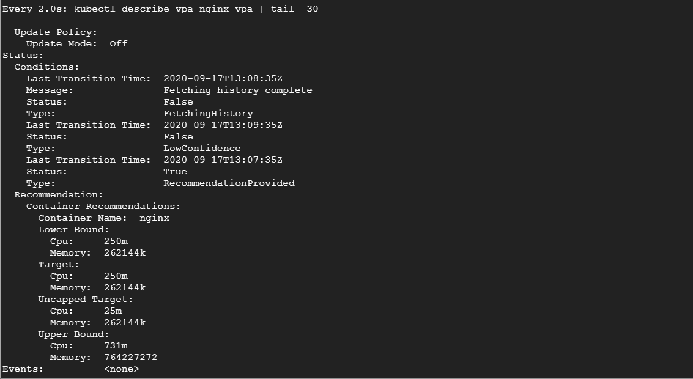
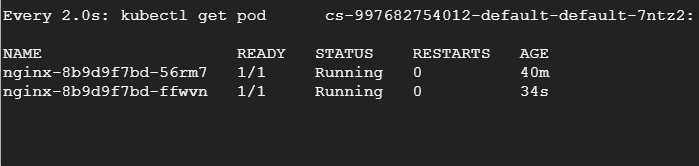

# 了解 Kubernetes 中的垂直 Pod 自动缩放

> 原文：<https://betterprogramming.pub/understanding-vertical-pod-autoscaling-in-kubernetes-6d53e6d96ef3>

## 以及为什么不应该在自动模式下使用它


道格拉斯·桑切斯在 [Unsplash](https://unsplash.com/s/photos/future?utm_source=unsplash&utm_medium=referral&utm_content=creditCopyText) 上的照片

垂直 Pod 自动伸缩是 Kubernetes 的一个很酷的特性，但没有被充分利用——这是有原因的。Kubernetes 是为水平扩展而构建的，至少在最初，垂直扩展 pod 似乎不是一个好主意。相反，如果您想处理额外的负载，创建 Pod 的副本更有意义。

然而，这需要大量的资源优化，如果您没有通过提供适当的资源请求和限制配置来适当地调整您的 Pod，您可能会过于频繁地驱逐您的 Pod，或者浪费许多有用的资源。如果您分配给 Pod 的请求资源太少，您的 Pod 可能没有足够的资源来启动，如果您分配太多，它将最终浪费可能对其他 Pod 有用的有用资源。

使用 Kubernetes 的想法是在最少的基础设施中打包尽可能多的容器(显然这也需要您保留一个缓冲区来处理节点故障，但是您明白这一点)。开发人员和系统管理员努力寻找资源请求和限制的最佳值。通过基准测试或通过对生产利用率和流量的一般观察，对它们进行调优需要大量的监控和对二者利用率的了解。

当交通不稳定和资源利用不理想时，事情开始变得复杂。随着微服务架构中容器的增长，理解资源利用模式变得越来越具有挑战性，因为系统管理员更加关注稳定性，最终使用的资源请求远远超过实际需要。

Kubernetes 提出了一个解决方案，用垂直 Pod 自动缩放器来解决这个问题。让我们了解它的作用以及何时应该使用它，然后我们看一个小例子来看看它的实际应用。

# 垂直 Pod 自动缩放器的工作原理

垂直窗格自动缩放使用两个主要组件来实现自动缩放。算法是这样的:

*   VPA 推荐器检查历史资源利用率和当前使用模式，并推荐理想的资源请求值。
*   如果您已经将更新模式定义为自动，VPA 自动调整器将收回正在运行的 Pod，并基于新的资源请求值创建一个新的 Pod。
*   VPA 自动调节器还将按照最初定义的限值(如果有)的比率来调整限值。然而，它并没有建议限制应该是什么。

没有资源限制的含义——自动调整器会一直增加它。但是，如果您想防止内存泄漏，可以在 VPA 规范中设置最大资源值。

# VPA 舱单

让我们看看下面的 VPA 清单示例:

像任何清单一样，它有一个`apiVersion`、`kind`、`metadata`和`spec`部分。

在 spec 部分中，我们看到一个`targetRef`部分，它指定了这个 VPA 应用到的对象。`updatePolicy`部分定义了这个 VPA 是推荐还是基于`updateMode`属性推荐和自动缩放。如果`updateMode`属性被设置为`Auto`，它会垂直自动缩放窗格，如果`Off`，它只会推荐理想的资源请求值。

`resourcePolicy`部分允许我们用`minAllowed`和`maxAllowed`资源值为每个容器指定`containerPolicies`。这对于避免内存泄漏极其重要。您还可以在 pod 内的特定容器上关闭资源推荐和自动缩放，通常在 Istio sidecars 或`InitContainers`中可以看到。

哇——这可真难。在下一节中，让我们了解一些限制。

# 限制

垂直 Pod 自动缩放有局限性。

## 您不能将它与水平窗格自动缩放一起使用。

由于垂直单元自动扩展会自动修改请求和限制，因此您不能将其与水平单元自动扩展一起使用，因为 HPA 依赖于 CPU 和内存利用率来水平扩展单元。一个例外是，当您使用依靠自定义和外部指标来扩展单元的 HPA 时。

## 它需要至少两个健康的 pod 副本才能工作

这首先违背了它的目的，也是它没有被广泛使用的原因。当 VPA 销毁一个 pod 并重新创建它以垂直自动扩展它时，它需要至少两个健康的 pod 副本来确保没有服务中断。这给单实例有状态应用程序带来了不必要的设计复杂性，您将不得不考虑复制设计。对于无状态应用程序，使用水平窗格自动缩放比 VPA 更好。

## 默认情况下，最小内存分配是 250 兆字节

无论您指定什么，VPA 分配的最小内存都是 250 兆字节。尽管这个缺省值可以在全局级别上修改，但是它对于消耗较少内存的应用程序来说是不切实际的。

## 它不能与单个 pod 一起使用

VPA 只处理部署、状态集、守护集、复制集等。您不能将其用于没有所有者的独立 Pod。这不是一个显著的限制，因为我们大多数人都不使用独立的 Pod，但它值得一提。

# 在推荐模式下使用 VPA

到目前为止，在生产中使用 VPA 的最佳方式是在推荐模式下使用它。这对理解什么是最佳资源请求值以及它们如何随时间变化非常有帮助。

设置好之后，您可以通过 Kubernetes 操作器或使用 kubectl 来收集这些指标，并将其发送到 Prometheus 和 Grafana 或 ELK stack 等监控和可视化工具，以获得有价值的见解。

然后，您可以根据建议使用这些数据来调整 pod 的大小，方法是在一天中的安静时段进行适当的停机，这样就不会影响您的用户和业务。这也可以成为你持续改进策略的一部分。

我不建议在生产中以自动模式运行 VPA，因为它相对较新，仍在积极开发中。你最不希望的事情就是服务中断，因为 VPA 太频繁地驱逐你的吊舱。除非你确切地知道你在做什么，否则马上在生产中使用它是没有意义的。

也就是说，您总是可以在您的开发环境中试验这一点，并观察它在负载增加时的表现。通过运行负载测试，您可以很容易地找到 Pod 可以消耗的最大资源量，我们将在下一节中看到这一点。

# 亲自动手

在这个练习中，我将使用启用了 VPA 的 GKE。GKE 只在地区集团上支持 VPA。

请确保您已通过准入控制器(如果使用自我管理的设置)或通过云提供商上的设置(如果使用受管集群)在集群中启用了 VPA。

让我们开始吧。

首先，让我们创建一个 NGINX 部署，默认请求是 250 兆内存和 100 兆 CPU。

我们现在需要将这个部署公开为一个`LoadBalancer`服务。

```
kubectl expose deployment nginx --type=LoadBalancer --port 80
```

让我们等待云提供商启动负载平衡器，然后获取负载平衡器 IP。

```
$ kubectl get svc nginx
NAME    TYPE           CLUSTER-IP   EXTERNAL-IP      PORT(S)        AGE
nginx   LoadBalancer   10.4.1.4     34.121.204.234   80:30750/TCP   46s
```

现在，让我们用`updateMode: "Off"`创建一个垂直 Pod 自动缩放器。这不会纵向扩展部署，而只是提供建议。

现在，让我们运行一些负载测试，看看我们从负载中得到了什么建议。我将在这个测试中使用`hey`工具:

```
hey -z 300s -c 1000 [http://34.121.204.234](http://34.121.204.234)
```

使用 1000 个并行线程触发请求 300 秒——这对服务来说是一个很大的打击。

运行以下程序，获取描述 VPA 的建议:

```
kubectl describe vpa nginx-vpa
```

如果我们观察 VPA 一段时间，我们会发现它会逐渐建议增加资源请求:



如果你看一下推荐部分，你会看到几个推荐。

*   目标:这是 VPA 驱逐当前 pod 并创建另一个 pod 时将使用的真实值。如果您正在收集这些指标，您应该始终跟踪目标值。
*   下限:这反映了触发调整大小的下限。如果你的吊舱利用率低于这个，VPA 将驱逐它，并按比例缩小。
*   上限:这表示要触发的下一个调整大小的上限。如果你的豆荚利用率超过这些值，VPA 将驱逐它，并扩大规模。
*   无上限目标:如果您没有提供 VPA 的最小或最大边界，这表示目标利用率。

现在，让我们将它付诸实践，看看如果将`updateMode`设置为`Auto`会发生什么。让我们运行下面的:

然后让我们重新运行负载测试。在另一个终端，我们将连续观看吊舱，看它们被驱逐和重建。



# 结论

垂直 Pod 自动伸缩是 Kubernetes 中一个相对较新的自动伸缩概念，最适合于有状态工作负载或了解资源利用概况和建议。在目前的情况下，不建议在生产中以自动更新模式使用，但其推荐模式有利于获得见解。

感谢阅读！我希望你喜欢这篇文章。