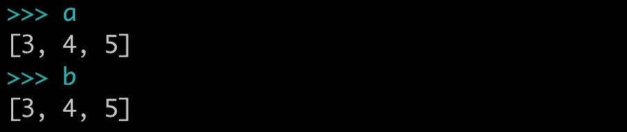
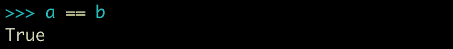
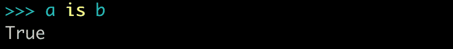
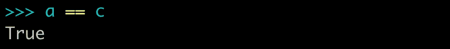
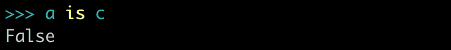

# 理解 Python 中的“==”与“is”

> 原文：<https://betterprogramming.pub/understanding-vs-is-in-python-2f8f7ae1dd23>

## 解释何时使用哪个

威尔·弗朗西斯在 [Unsplash](https://unsplash.com/s/photos/difference?utm_source=unsplash&utm_medium=referral&utm_content=creditCopyText) 拍摄的照片

当我们在 Python 中解决一些问题时，我们都遇到过必须比较两个对象的情况。为此，我们很多人都使用过`==`或`is`操作符。

但是，似乎我们很多人都不知道在什么情况下使用哪一个。

# 分析差异

在这篇文章中，我将分析它们之间的基本区别。

为此，我们将从双胞胎猫的一些类比开始。所以，假设你有两只非常相似的双胞胎猫。它们有着同样的炭灰色皮毛和同样锐利的绿色眼睛。光靠看，我们分不清哪个是哪个。

现在，来看看 Python 中的`==` vs `is`操作符。

`==`操作员通过检查**是否相等**来进行比较。如果这两只猫是两个 Python 对象，那么如果使用`==`操作符比较它们，它将返回“两只猫相等”作为答案。

`is`操作员通过检查**标识**进行比较。如果我们用`is`来比较它们，我们会得到“两只猫不一样”的答案。

为了真正理解这一点，我们将编写一些代码。

首先，我们将创建一个名为`a`的列表，其中包含元素`[3, 4, 5]`和另一个指向列表`a`的列表`b`。

让我们检查这两个列表。我们可以看到这些看起来指向相同的列表。

因为两个列表对象看起来一样，所以当我们使用`==`操作符比较它们是否相等时，我们将得到预期的结果
。

然而，这并没有告诉我们`a`和`b`是否实际上指向了
同一个对象。当然，我们知道它们是，因为我们之前给它们赋值了，但是假设我们不知道——我们怎么可能知道呢？

答案是用`is`运算符比较这两个变量。这个
确认了两个变量实际上都指向一个列表对象。

现在，让我们使用包含列表`a`元素的`list()`创建另一个列表`c`。

如果我们查看列表`c`，它看起来类似于由`a`和`b`指向的列表。

现在，我们将使用`==`和`is`操作符来比较`a`和`c`。

这里，`==`运算符给出了`True`，因为两者内容相同。

Python 告诉我们`c`和`a`指向两个不同的对象，尽管它们的内容可能是相同的。

所以，为了重述，让我们试着将`is`和
`==`的区别分解成两个简短的定义。

1.  如果两个变量指向
    相同(相同)的对象，则`is`表达式的计算结果为`True`。
2.  如果变量
    引用的对象相等(具有相同的内容),则`==`表达式计算为`True`。

所以，我认为这篇文章会消除你对`==`和`is`的疑虑。